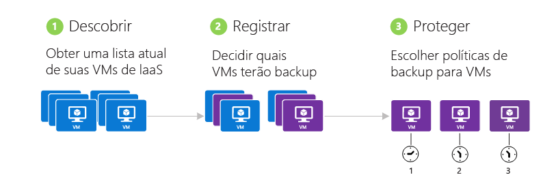
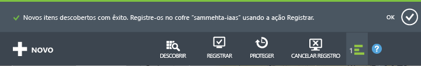
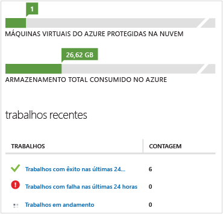

<properties
	pageTitle="Backup de máquina virtual do Azure - Backup"
	description="Saiba como fazer backup de uma máquina virtual do Azure após o registro"
	services="backup"
	documentationCenter=""
	authors="aashishr"
	manager="shreeshd"
	editor=""/>

<tags
	ms.service="backup"
	ms.workload="storage-backup-recovery"
	ms.tgt_pltfrm="na"
	ms.devlang="na"
	ms.topic="hero-article"
	ms.date="07/06/2015"
	ms.author="aashishr"/>

# Fazer backup de máquinas virtuais do Azure
Este artigo é o guia essencial para o backup de máquinas virtuais do Azure. Antes de prosseguir, verifique se todos os [pré-requisitos](backup-azure-vms-introduction.md#prerequisites) foram atendidos.

Fazer o backup de máquinas virtuais do Azure envolve três etapas principais:

## 1\. Descobrir máquinas virtuais do Azure
O processo de descoberta consulta o Azure quanto à lista de máquinas virtuais na assinatura, juntamente com informações adicionais, como o nome do Serviço de Nuvem e a Região.

> [AZURE.NOTE]O processo de descoberta sempre deve ser executado como a primeira etapa. Isso é para garantir que quaisquer novas máquinas virtuais adicionadas à assinatura sejam identificadas.

### Para disparar o processo de descoberta

1. Navegue até o cofre de backup, que pode ser encontrado em **Serviços de Recuperação** no Portal do Azure, então clique na guia **Itens Registrados**.

2. Escolha o tipo de carga de trabalho no menu suspenso como **Máquina Virtual do Azure** e clique no botão **Selecionar**. 

3. Clique no botão **DESCOBERTA** na parte inferior da página. 

4. O processo de descoberta pode ser executado por alguns minutos, enquanto as máquinas virtuais estão sendo tabuladas. É exibida uma notificação do sistema na parte inferior da tela enquanto o processo de descoberta está em execução. 

5. Quando o processo de detecção for concluído, uma notificação do sistema será exibida. 

##  2\. Registre as máquinas virtuais do Azure
Antes que uma máquina virtual possa ser protegida, ela precisa ser registrada com o serviço de Backup do Azure. O processo de registro tem dois objetivos principais:

1. Para conectar a extensão de backup ao agente de VM na máquina virtual

2. Para associar a máquina virtual ao serviço de Backup do Azure

Normalmente, o registro é uma atividade realizada uma única vez. O serviço de Backup do Azure manipula perfeitamente a atualização e aplicação de patches da extensão de backup sem a necessidade de nenhuma intervenção complicada pelo usuário. Isso libera o usuário da "sobrecarga de gerenciamento do agente" que é geralmente associada a produtos de backup.

### Para registrar as máquinas virtuais

1. Navegue até o cofre de backup, encontrado em **Serviços de Recuperação** no Portal do Azure e clique na guia **Itens Registrados**

2. Escolha o tipo de carga de trabalho no menu suspenso como **Máquina Virtual do Azure** e clique no botão Selecionar. 

3. Clique no botão **REGISTRAR** na parte inferior da página. 

4. No pop-up **Registrar Itens**, escolha as máquinas virtuais que você deseja registrar. Se houver duas ou mais máquinas virtuais com o mesmo nome, use o serviço de nuvem para distinguir entre elas.

    A operação **registrar** pode ser feita em grande escala, o que significa que várias máquinas virtuais podem ser selecionadas ao mesmo tempo para serem registradas. Isso reduz consideravelmente o esforço feito uma única vez na preparação da máquina virtual para backup.

    >[AZURE.NOTE]Somente as máquinas virtuais que não estão registradas e estão na mesma região que o Cofre de backup serão exibidas.

5. Um trabalho é criado para cada máquina virtual que deve ser registrada. A notificação do sistema mostra o status dessa atividade. Clique em **Exibir Trabalho** para ir para a página **Trabalhos**. 

6. A máquina virtual também aparece na lista de itens registrados e o status da operação de registro é exibido 

7. Quando a operação é concluída, o status no portal é alterado para refletir o estado registrado. 

## 3\. Proteção: Fazer backup de máquinas virtuais do Azure
Essa etapa envolve configurar uma política de backup e de retenção para a máquina virtual. Para proteger uma máquina virtual, execute as seguintes etapas:

### Para fazer backup de máquinas virtuais do Azure
1. Navegue até o cofre de backup, que pode ser encontrado em **Serviços de Recuperação** no Portal do Azure, então clique na guia **Itens Registrados**.
2. Escolha o tipo de carga de trabalho no menu suspenso como **Máquina Virtual do Azure** e clique no botão **Selecionar**. 

3. Clique no botão **PROTEGER** na parte inferior da página.

4. Isso abrirá um assistente para **Proteger Itens**, no qual as máquinas virtuais a serem protegidas podem ser selecionadas. Se houver duas ou mais máquinas virtuais com o mesmo nome, use o serviço de nuvem para distinguir entre elas.

    A operação **Proteger** pode ser feita em grande escala, o que significa que várias máquinas virtuais podem ser selecionadas ao mesmo tempo para serem registradas. Isso reduz consideravelmente o esforço feito para proteger a máquina virtual.

    >[AZURE.NOTE]Somente as máquinas virtuais que foram registradas corretamente com o serviço de backup do Azure e estão na mesma região que o Cofre de backup são exibidas aqui.

5. Na segunda tela do assistente **Proteger Itens**, escolha uma política de backup e retenção para fazer backup das máquinas virtuais selecionadas. Escolha entre um conjunto existente de políticas ou defina um novo.

    >[AZURE.NOTE]Para visualizar, há suporte para retenção por até 30 dias e para backup no máximo uma vez por dia.

    Em cada cofre de backup, você pode ter várias políticas de backup. As políticas refletem os detalhes sobre como o backup deve ser agendado e mantido. Por exemplo, uma política de backup pode ser de backup diário às 22h, enquanto outra política de backup pode ser de backup semanal às 6h. Múltiplas políticas de backup permitem flexibilidade ao programar backups para sua infraestrutura de máquina virtual.

    Cada política de backup pode ter várias máquinas virtuais que estão associadas à política. A máquina virtual pode estar associada a apenas uma política em qualquer determinado ponto no tempo.

6. Um trabalho é criado para cada máquina virtual para configurar a política de proteção e associar as máquinas virtuais a essa política. Clique na guia **Trabalhos** e escolha o filtro correto para exibir a lista de trabalhos do tipo **Configurar Proteção**. 

7. Depois de concluído, as máquinas virtuais são protegidas com uma política e precisam esperar até que o tempo de backup agendado para o backup inicial seja concluído. A máquina virtual será exibida na guia **itens protegidos** e terá um Status de Proteção de *Protegido* (pendente do backup inicial).
    >[AZURE.NOTE]Atualmente, começar o backup inicial imediatamente após a configuração de proteção não está disponível como uma opção.

8. No horário agendado, o serviço de Backup do Azure cria um trabalho de backup para cada máquina virtual da qual é necessário fazer backup. Clique na guia **Trabalhos** para exibir a lista de trabalhos de **Backup**. Como parte da operação de backup, o serviço de Backup do Azure emite um comando para a extensão de backup em cada máquina virtual para limpar todas as gravações e tirar um instantâneo consistente. 

9. Uma vez concluído, o Status de Proteção da máquina virtual na guia **Itens Protegidos** será exibido como *Protegido*. 

## Exibindo detalhes e status do backup
Depois de protegido, a contagem de máquina virtual também aumenta no resumo da página **Painel**. Além disso, a página Painel mostra o número de trabalhos das últimas 24h que tiveram êxito, falha e que ainda estão em andamento. Clicar em qualquer categoria vai detalhar tal categoria na página **Trabalhos**. 

## Solucionar erros
Você pode solucionar os erros encontrados enquanto usa o Backup do Azure com as informações listadas na tabela a seguir.

| Operação de backup | Detalhes do erro | Solução alternativa |
| -------- | -------- | -------|
| Descoberta | Falha ao detectar novos itens - Backup do Microsoft Azure encontrado e erro interno. Aguarde alguns minutos e repita a operação. | Repita o processo de descoberta após 15 minutos.
| Descoberta | Falha ao descobrir novos itens – outra operação de descoberta já está em andamento. Aguarde até que a operação de descoberta atual seja concluída. | Nenhum |
| Registrar | A função VM do Azure não está em um estado que permite instalar a extensão – verifique se a VM está no estado Em Execução. A extensão Serviços de Recuperação do Azure requer que a VM esteja Em Execução. | Inicie a máquina virtual e quando ele estiver no estado Em Execução, então repita a operação de registro.|
| Registrar | O número de discos de dados anexados à máquina virtual excedeu o limite com suporte. Retire alguns discos de dados dos anexos nesta máquina virtual e repita a operação. O backup do Azure dá suporte a até cinco discos de dados anexados a uma máquina virtual do Azure para backup | Nenhum |
| Registrar | O Backup do Microsoft Azure encontrou um erro interno. Aguarde alguns minutos e tente a operação novamente. Se o problema persistir, contate o Suporte da Microsoft. | Você pode obter esse erro devido a uma das seguintes configurações sem suporte: <ol><li>LRS Premium <li>múltiplas NIC <li>balanceador de carga </ol> |
| Registrar | Certificado do agente de convidado VM não encontrado | Siga estas instruções para resolver o erro: <ol><li>Baixar a versão mais recente do agente de VM [aqui](http://go.microsoft.com/fwlink/?LinkID=394789&clcid=0x409). Verifique se a versão do agente baixado é 2.6.1198.718 ou mais recente. <li>Instale o agente de VM na máquina virtual.</ol> [Saiba](#validating-vm-agent-installation) como verificar a versão do Agente de VM. |
| Registrar | Falha no registro com o tempo limite da operação Instalar agente | Verifique se a versão do sistema operacional da máquina virtual tem suporte. |
| Registrar | A execução do comando falhou - há outra operação em andamento neste item. Aguarde até que a operação anterior seja concluída | Nenhum |
| Backup | A cópia de VHDs do Cofre de backup atingiu o tempo limite - tente a operação novamente dentro de alguns minutos. Se o problema persistir, contate o Suporte da Microsoft. | Isso ocorre quando há muitos dados a serem copiados. Verifique se você tem menos de seis discos de dados. |
| Backup | A subtarefa VM Instantânea atingiu o seu tempo limite - tente a operação novamente dentro de alguns minutos. Se o problema persistir, contate o Suporte da Microsoft | Esse erro é gerado se há um problema com o agente de VM ou se o acesso à rede para a infraestrutura do Azure está bloqueado de alguma forma. <ul><li>Saiba mais sobre a [Depuração de problemas do agente de VM](#Troubleshooting-vm-agent-related-issues) <li>Saiba mais sobre a [Depuração de problemas de rede](#troubleshooting-networking-issues) </ul> |
| Backup | Falha no backup com um erro interno - tente novamente a operação dentro de alguns minutos. Se o problema persistir, contate o Suporte da Microsoft | Você pode obter esse erro por duas razões: <ol><li> há muitos dados a serem copiados. Verifique se você tem menos de seis discos. <li>A máquina virtual original foi excluída e, portanto, o backup não pode ser feito. Para manter os dados de backup de uma VM excluída, mas parar os erros de backup, desproteja a VM e escolha a opção para manter os dados. Isso interromperá o agendamento de backup e também as mensagens de erro recorrentes. |
| Backup | Falha ao instalar a extensão dos Serviços de Recuperação do Azure no item selecionado - o agente de VM é um pré-requisito para a extensão de Serviços de Recuperação do Azure. Instale o agente de VM do Azure e reinicie a operação de registro | <ol> <li>Verifique se o agente de VM foi instalado corretamente. <li>Certifique-se de que o sinalizador de configuração da VM esteja definido corretamente.</ol> [Leia mais](#validating-vm-agent-installation) sobre a instalação do agente de VM e como validar a instalação do agente de VM. |
| Backup | A execução do comando falhou - outra operação está em andamento neste item. Aguarde até que a operação anterior seja concluída e tente novamente | Está em execução um backup existente ou um trabalho de restauração para a máquina virtual e não é possível iniciar um novo trabalho enquanto o trabalho existente estiver sendo executado.   Se você quiser a opção de cancelar um trabalho em andamento, adicione seu voto ao [Fórum de comentários do Azure](http://feedback.azure.com/forums/258995-azure-backup-and-scdpm/suggestions/7941501-add-feature-to-allow-cancellation-of-backup-restor). |

### Solução de problemas relacionados ao agente de VM

#### Configurando o agente de VM
Normalmente, o agente de VM já está presente em máquinas virtuais que são criadas na Galeria do Azure. No entanto, as máquinas virtuais que são migradas de datacenters locais não teriam o Agente de VM instalado. Para essas VMs, o Agente de VM precisa ser instalado explicitamente. Leia mais sobre [Instalando o Agente de VM em uma VM existente](http://blogs.msdn.com/b/mast/archive/2014/04/08/install-the-vm-agent-on-an-existing-azure-vm.aspx).

Para VMs do Windows:

- Baixe e instale o [agente MSI](http://go.microsoft.com/fwlink/?LinkID=394789&clcid=0x409). Você precisará de privilégios de Administrador para concluir a instalação.
- [Atualizar a propriedade de VM](http://blogs.msdn.com/b/mast/archive/2014/04/08/install-the-vm-agent-on-an-existing-azure-vm.aspx) para indicar que o agente está instalado.

#### Atualizar o Agente de VM
Atualizar o agente de VM é tão simples quanto reinstalar os [Binários do Agente de VM](http://go.microsoft.com/fwlink/?LinkID=394789&clcid=0x409). No entanto, você precisa garantir que nenhuma operação de backup esteja em execução enquanto o Agente de VM estiver sendo atualizado.

#### Validando a instalação do Agente de VM
Como verificar a versão do Agente de VM em VMs do Windows:

1. Faça logon na máquina virtual do Azure e navegue até a pasta *C:\\WindowsAzure\\Packages*. Você deve encontrar o arquivo WaAppAgent.exe presente.
2. Clique com o botão direito do mouse no arquivo, acesse **Propriedades** e, em seguida, selecione a guia **Detalhes**. O campo Versão do produto deve ser 2.6.1198.718 ou mais recente

### Solucionando problemas de rede
Como todas as extensões, a extensão de Backup precisa acessar a Internet pública para trabalhar. A falta de acesso à Internet pública pode se manifestar de inúmeras formas:

- A instalação da extensão pode falhar
- As operações de backup (como snapshot de disco) podem falhar
- A exibição do status da operação de backup pode falhar

A necessidade de resolução de endereços de Internet pública foi articulada [aqui](http://blogs.msdn.com/b/mast/archive/2014/06/18/azure-vm-provisioning-stuck-on-quot-installing-extensions-on-virtual-machine-quot.aspx). Você precisará verificar as configurações de DNS para o VNET e certificar-se de que os URIs do Azure possam ser resolvidos.

Após a resolução de nomes ser feita corretamente, o acesso às IPs Azure também deve ser fornecido. Para desbloquear o acesso à infraestrutura do Azure, siga estas etapas:

1. Obter a lista de [IPs do datacenter do Azure](https://msdn.microsoft.com/library/azure/dn175718.aspx) a colocar na lista branca.
2. Desbloquear o IPs usando o commandlet [New-NetRoute](https://technet.microsoft.com/library/hh826148.aspx). Executar este commandlet na VM do Azure em uma janela do PowerShell com privilégios elevados (Executar como administrador).

## Consistência de pontos de recuperação
Ao lidar com dados de backup, os clientes se preocupam com o comportamento da VM após ela ser restaurada. Perguntas típicas feitas pelos clientes são:

- A máquina virtual será inicializada corretamente?
- Os dados estarão disponíveis no disco (ou) há alguma perda de dados?
- O aplicativo poderá ler os dados (ou) os dados estão corrompidos?
- Os dados farão sentido para o aplicativo (ou) os dados são internamente consistentes quando lidos pelo aplicativo?

A tabela a seguir explica os tipos de consistência que são encontrados durante a restauração e backup de VM do Azure:

| Consistência | Baseada em VSS | Explicação e detalhes |
|-------------|-----------|---------|
| Consistência de aplicativo | Sim | Este é o lugar ideal para estar quanto a cargas de trabalho da Microsoft, pois ele garante:<ol><li> que a VM *inicialize*, <li>que não haja *corrupção dos dados*, <li>que não ocorra *perda de dados* e que<li> os dados sejam consistentes com o aplicativo que os utiliza, engajando o aplicativo no momento do backup - usando o VSS.</ol> O VSS (Serviço de Instantâneo de Volume) garante que os dados sejam gravados corretamente para o armazenamento. A maioria das cargas de trabalho Microsoft têm gravadores VSS que executam ações específicas de carga de trabalho relacionadas a consistência dos dados. Por exemplo, o Microsoft SQL Server tem um gravador VSS que garante que as gravações no arquivo de log de transações e no banco de dados sejam realizadas corretamente.   Para backup da VM do Azure, obter um ponto de recuperação consistente no aplicativo significa que a extensão de backup foi capaz de invocar o fluxo de trabalho do VSS e ser concluída *corretamente* antes que o instantâneo da VM fosse tirado. Naturalmente, isso significa que os gravadores VSS de todos os aplicativos na VM do Azure também são chamados.  Aprenda as [noções básicas do VSS](http://blogs.technet.com/b/josebda/archive/2007/10/10/the-basics-of-the-volume-shadow-copy-service-vss.aspx) e aprofunde-se nos detalhes de [como ele funciona](https://technet.microsoft.com/library/cc785914%28v=ws.10%29.aspx). |
| Consistência do sistema de arquivos | Sim - para computadores executando Windows | Há dois cenários em que o ponto de recuperação pode ser consistente com o sistema de arquivos:<ul><li>Backup de VMs do Linux no Azure, já que o Linux não tem uma plataforma equivalente ao VSS.<li>Falha do VSS durante o backup de máquinas virtuais do Windows no Azure.</li></ul> Em ambos estes casos, o melhor que você pode fazer é garantir que: <ol><li> a VM *inicialize*, <li>não haja *nenhum dano* e <li>não haja *perda de dados*.</ol> Os aplicativos precisam implementar seu próprio mecanismo de "correção" nos dados restaurados.|
| Consistência de falhas | Não | Essa situação é equivalente a um computador tendo uma "falha" (por meio de uma reinicialização forçada ou flexível). Isso geralmente acontece quando a máquina virtual do Azure está desligada no momento do backup. Para backup da máquina virtual do Azure, obter um ponto de recuperação consistente quanto a falhas significa que o Backup do Azure não dá nenhuma garantia de consistência dos dados no meio de armazenamento - seja da perspectiva do sistema operacional ou da perspectiva do aplicativo. Apenas os dados que já existem no disco no momento do backup são capturados e copiados em backup.    Embora não haja nenhuma garantia, na maioria dos casos o sistema operacional será inicializado. Normalmente, isso é seguido por um procedimento de verificação de disco, como chkdsk, para corrigir qualquer erro de corrupção. Quaisquer dados na memória ou gravações que não tenham sido totalmente liberadas para o disco serão perdidas. O aplicativo geralmente segue com seu próprio mecanismo de verificação, caso seja necessário realizar reversão de dados. Para backup de máquina virtual do Azure, obter um ponto de recuperação consistente quanto a falhas significa que o Backup do Azure não dá nenhuma garantia de consistência dos dados no armazenamento - seja da perspectiva do sistema operacional ou da perspectiva do aplicativo. Isso geralmente acontece quando a VM do Azure é desligada no momento do backup.  Por exemplo, se o log de transações tiver entradas que não estão presentes no banco de dados, o software de banco de dados fará em seguida uma reversão até que os dados sejam consistentes. Ao lidar com dados distribuídos em vários discos virtuais (como volumes estendidos), um ponto de recuperação consistente quanto a falhas não garante a exatidão dos dados.|

## Próximas etapas
Para saber mais sobre a introdução ao Backup do Azure, consulte:

- [Restaurar máquinas virtuais](backup-azure-restore-vms.md)
- [Gerenciar máquinas virtuais](backup-azure-manage-vms)

<!---HONumber=July15_HO3-->