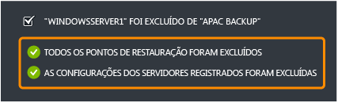

<properties 
	pageTitle="Configurar os Serviços de Backup do Azure para fazer backup rápido e fácil do Windows Server" 
	description="Use este tutorial para aprender a usar o serviço de backup na oferta de nuvem do Microsoft Azure para fazer o backup do Windows Server na nuvem." 
	services="backup" 
	documentationCenter="" 
	authors="markgalioto" 
	manager="jwhit" 
	editor="tysonn"/>

<tags 
	ms.service="backup" 
	ms.workload="storage-backup-recovery" 
	ms.tgt_pltfrm="na" 
	ms.devlang="na" 
	ms.topic="article" 
	ms.date="06/03/2015" 
	ms.author="markgal"/>

#Configurar o Backup do Azure para fazer backup rápido e fácil do Windows Server

Para concluir este tutorial, você precisa de uma conta do Azure. Este tutorial o levará através da ativação do recurso de Backup do Azure.
>[AZURE.NOTE]Anteriormente, você precisaria criar ou adquirir um certificado X.509 v3, a fim de registrar seu servidor de backup. Os certificados ainda não suportados, mas agora para facilitar o registro do cofre do Azure a um servidor, você pode gerar uma credencial de cofre direto da página de Início Rápido. Se você não tiver uma conta, poderá criar uma conta de avaliação gratuita em apenas alguns minutos. Para obter detalhes, consulte [Avaliação gratuita do Azure](https://azure.microsoft.com/pricing/free-trial/).

Para fazer o backup de arquivos e dados do seu Windows Server para Azure, você deve criar um cofre de backup na região geográfica em que deseja armazenar os dados. Este tutorial o orientará:

- na criação do cofre que você usará para armazenar os backups
- o download de uma credencial do cofre
- a instalação de um agente de backup
- uma visão geral das tarefas de gerenciamento de backup disponíveis por meio do portal de gerenciamento

##Criar um cofre de backup

1. Entre no [Portal de Gerenciamento](https://manage.windowsazure.com).
2. Clique em **Novo** -> **Serviços de Dados** -> **Serviços de Recuperação** -> **Cofre de Backup** > **Criação Rápida**.
3. Em **Nome**, digite um nome amigável para identificar o cofre de backup.
4. Em **Região**, selecione a região geográfica para o cofre de backup.

    

5. Clique em **Criar cofre**.

    Pode levar algum tempo para que o cofre de backup seja criado. Para verificar o status, você pode monitorar as notificações na parte inferior do portal. Depois de o cofre de backup ter sido criado, uma mensagem informará que o cofre foi criado com êxito e ele será listado nos recursos de Serviços de Recuperação como **Ativo**.

    

6. Se você tem várias assinaturas associadas com sua conta organizacional, escolha a conta correta para associar ao cofre de backup.

##Baixar uma credencial do cofre

As credenciais do sofre substituem os certificados como forma de registrar o seu serviço do Azure com o seu servidor. Você ainda pode usar certificados, no entanto, as credenciais de cofre são fáceis de usar pois você usa o portal do Azure para gerar e baixar as credenciais de cofre.

1. Entre no [Portal de Gerenciamento](https://manage.windowsazure.com).
2. Clique em **Serviços de Recuperação**, em seguida, selecione o cofre de backup que você quer registrar com um servidor. A página de Início Rápido para esse cofre de backup aparece.
3. Na página de **Início Rápido**, clique em **Baixar as credenciais de cofre** para solicitar que o portal gere e baixe as credenciais de cofre que você usará para registrar o seu servidor com o cofre de backup.

    O portal gerará uma credencial de cofre usando uma combinação do nome do cofre e a data atual.

4. Clique em **Salvar** para baixar as credenciais do cofre para a pasta de donwloads da conta local, ou selecione **Salvar Como** a partir do menu **Salvar**, para especificar um local para as credenciais do cofre. Você não pode editar as credenciais do cofre, então não existe razão para clicar em Abrir. Uma vez que as credenciais foram baixadas, você será solicitado a Abrir a pasta. Clique em **x** para fechar este menu.

##Baixar e instalar um agente de backup

1. No [Portal de gerenciamento](https://manage.windowsazure.com).
2. Clique em **Serviços de Recuperação**, em seguida, clique no cofre de backup para exibir a página de Início Rápido.
3. Na página de Início Rápido, selecione o tipo de agente que você quer baixar. Você pode escolher **Baixar o Agente de Backup do Azure**, **Windows Server e System Center Data Protection Manager**, ou **Windows Server Essentials**. Para obter mais informações, consulte:

	* [Instalar o Azure Backup Agent para Windows Server 2012 e System Center 2012 SP1 - Data Protection Manager](http://technet.microsoft.com/library/hh831761.aspx#BKMK_installagent)
	* [Instalar o Azure Backup Agent para o Windows Server 2012 Essentials](http://technet.microsoft.com/library/jj884318.aspx)

Depois que o agente está instalado, você pode usar a interface de gerenciamento local apropriada (como o snap-in Microsoft Management Console, o System Center Data Protection Manager Console ou o painel do Windows Server Essentials) para configurar a política de backup para o servidor.

##Gerenciar servidores e cofres de backup

1. Entre no [Portal de Gerenciamento](https://manage.windowsazure.com).
2. Clique em **Serviços de Recuperação**, em seguida, clique no nome do cofre de backup para exibir a página de Início Rápido.
3. Clique em **Painel** para ver a visão geral do uso para o servidor. Na parte inferior do Painel, você pode executar as seguintes tarefas:

    - **Gerenciar certificados**. Se um certificado foi usado para registrar o servidor, então use isso para atualizar o certificado. Se estiver usando as credenciais do cofre, não use **Gerenciar certificados**.
    - **Excluir**. Exclui o cofre de backup atual. Se não estiver sendo usado um cofre de backup, você poderá excluir para liberar mais espaço de armazenamento. **Excluir** é ativado somente depois que todos os servidores registrados foram excluídos do cofre.
    - **Credenciais do cofre**. Use este item de menu de Visão rápida para configurar suas credenciais de cofre.

4. Clique em **Itens Protegidos** para ver os itens que foram colocados em backup dos servidores. Esta lista é somente para fins informativos.

    

5. Clique em **Servidores** para exibir os nomes dos servidores que devem ser registrados neste cofre. A partir daqui, você pode executar as seguintes tarefas:

    - **Permitir novo registro**. Quando esta opção estiver selecionada para um servidor, você pode usar o Assistente de Registro no agente para registrar o servidor com o cofre de backup uma segunda vez. Talvez você precise registrar novamente devido a um erro no certificado ou se um servidor tiver que ser refeito. O novo registro é permitido somente uma vez por nome do servidor.
    - **Excluir**. Exclui um servidor do cofre de backup. Todos os dados armazenados associados ao servidor serão excluídos imediatamente.

        

##Próximas etapas

- Para saber mais sobre o Backup do Azure, consulte [Visão geral do backup do Azure](http://go.microsoft.com/fwlink/p/?LinkId=222425). 
- Visite o [Fórum de backup do Azure](http://go.microsoft.com/fwlink/p/?LinkId=290933).

 

<!---HONumber=62-->