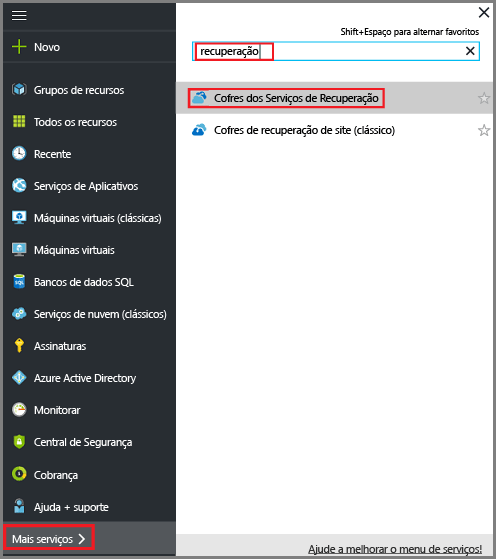
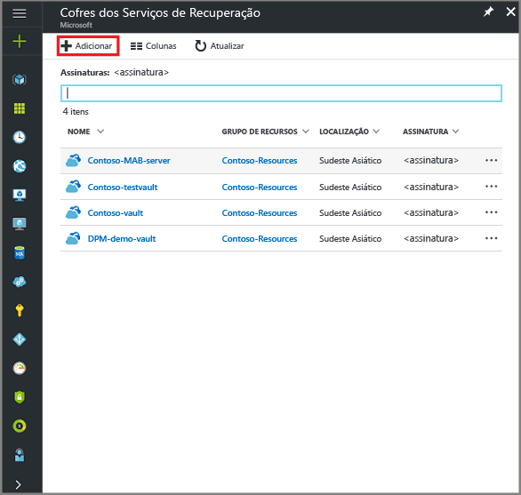
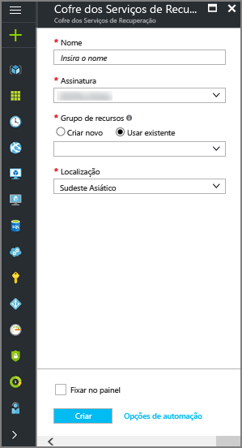
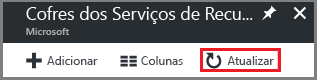
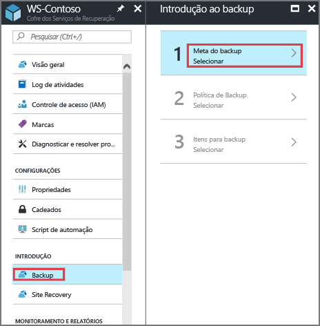
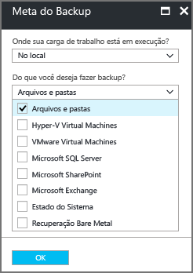
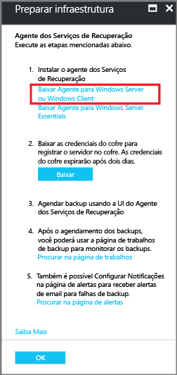
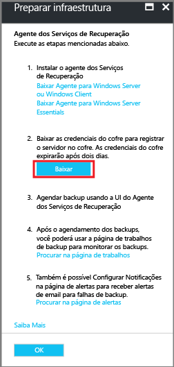

# Fazer backup de máquinas do Windows com o agente de MARS de Backup do Azure

Este artigo explica como fazer backup de máquinas do Windows usando o [Backup do Azure](backup-overview.md) serviço e o agente do Microsoft Azure Recovery Services (MARS), também conhecido como o agente de Backup do Azure.

Neste artigo, você aprenderá a:

> [!div class="checklist"]
> * Verifique os pré-requisitos e crie um cofre dos serviços de recuperação.
> * Baixar e configurar o Agente MARS
> * Crie uma política de backup e agendamento.
> * Execute um ad-hoc, fazer backup.

## Sobre o agente MARS

O agente do MARS é usado pelo Backup do Azure para fazer backup do estado do sistema, pastas e arquivos de máquinas locais e VMs do Azure para um cofre de serviços de recuperação de backup no Azure. Você pode executar o agente da seguinte maneira:

- Execute o agente diretamente em computadores do Windows local para que eles podem fazer backup diretamente em um cofre de serviços de recuperação de backup no Azure.
- Execute VMs do Azure de agente que executa o Windows (lado a lado com a extensão de backup de VM do Azure) para fazer backup de arquivos e pastas específicos na VM.
- Execute o agente em um MABS (Servidor de Backup do Microsoft Azure) ou em um servidor do System Center DPM (Data Protection Manager). Nesse cenário, computadores e cargas de trabalho de backup para MABS/DPM e, em seguida, o MABS/DPM faz o backup em um cofre no Azure usando o agente do MARS.
O que você poderá fazer backup dependerá do local em que o agente estiver instalado.

> [!NOTE]
> É o principal método para fazer backup de VMs do Azure usando uma extensão de Backup do Azure na VM. Isso faz backup de toda a VM. Você talvez queira instalar e usar o agente do MARS junto com a extensão, se você quiser fazer backup de arquivos e pastas específicos na VM. [Saiba mais](backup-architecture.md#architecture-direct-backup-of-azure-vms).

## Antes de começar

- [Saiba como](backup-architecture.md#architecture-direct-backup-of-on-premises-windows-server-machines-or-azure-vm-files-or-folders) Backup do Azure faz backup de máquinas do Windows com o agente do MARS.
- [Saiba mais sobre](backup-architecture.md#architecture-back-up-to-dpmmabs) a arquitetura de backup executando o agente de MARS em um servidor MABS ou DPM secundário.
- [Revisão](backup-support-matrix-mars-agent.md) que tem suporte e o que pode ser feito com o agente do MARS.
- Verifique se o acesso à internet nos computadores que você deseja fazer backup.
- Para fazer backup de um servidor ou cliente no Azure, você precisará de uma conta do Azure. Se não tiver uma, você poderá criar uma [conta gratuita](https://azure.microsoft.com/free/) em apenas alguns minutos.

### Verifique o acesso à Internet

Se seu computador tem acesso limitado à internet, certifique-se de que as configurações de firewall no computador ou proxy permitem estes URLs e o endereço IP:

**URLs**

- www\.msftncsi.com
- *.Microsoft.com
- *.WindowsAzure.com
- *.microsoftonline.com
- *.windows.net

**Endereço IP**

- 20.190.128.0/18
- 40.126.0.0/18

## Criar um cofre dos Serviços de Recuperação

Um cofre dos serviços de recuperação armazena todos os backups e pontos de recuperação criados ao longo do tempo e contém a política de backup aplicada ao backup de máquinas. Crie um cofre da seguinte maneira:

1. Entre no [Portal do Azure](https://portal.azure.com/) usando sua assinatura do Azure.
2. Na pesquisa, digite **serviços de recuperação** e clique em **cofres dos serviços de recuperação**.

    

3. Sobre o **cofres dos serviços de recuperação** menu, clique em **+ adicionar**.

    

4. Em **Nome**, insira um nome amigável para identificar o cofre.

   - O nome deve ser exclusivo para a assinatura do Azure.
   - Ele pode conter caracteres de 2 a 50.
   - Ele deve começar com uma letra e pode conter apenas letras, números e hifens.

5. Selecione a assinatura do Azure, grupo de recursos e região geográfica em que o cofre deve ser criado. Dados de backup são enviados para o cofre. Em seguida, clique em **Criar**.

    

   - Pode levar algum tempo para que o cofre seja criado.
   - Monitore as notificações de status na área superior direita do portal. Se após alguns minutos, você não vir o cofre, clique em **Refresh**.

     

### Definir redundância de armazenamento

O Backup do Azure controla automaticamente o armazenamento para o cofre. Você precisa especificar como esse armazenamento é replicado.

1. Na folha **Cofres dos Serviços de Recuperação**, clique no novo cofre. Sob o **as configurações** seção, clique em **propriedades**.
2. Na **propriedades**, em **configuração de Backup**, clique em **atualização**.

3. Selecione o tipo de replicação de armazenamento e, em seguida, clique em **salvar**.

      

- Recomendamos que se você estiver usando o Azure como um ponto de extremidade do armazenamento de backup principal, continue a usar o padrão **georredundante** configuração.
- Se você não usar o Azure como um ponto de extremidade de armazenamento de backup principal, escolha **Localmente redundante**, que reduz os custos de armazenamento do Azure.
- Saiba mais sobre [geográfica](../storage/common/storage-redundancy-grs.md) e [local](../storage/common/storage-redundancy-lrs.md) redundância.

## Baixe o agente de MARS

Baixe o agente MARS para instalação em computadores que você deseja fazer backup.

- Se você já tiver instalado o agente em computadores, verifique se que você estiver executando a versão mais recente.
- A versão mais recente está disponível no portal ou usando um [download direto](https://aka.ms/azurebackup_agent)

1. No cofre, sob **guia de Introdução**, clique em **Backup**.

    

2. Na **onde sua carga de trabalho é executada?**, selecione **local**. Você deve selecionar essa opção, mesmo se você quiser instalar o agente de MARS em uma VM do Azure.
3. Na **o que fazer você deseja fazer backup?**, selecione **arquivos e pastas** e/ou **estado do sistema**. Há várias outras opções disponíveis, mas eles só têm suporte se você estiver executando um servidor de backup secundário. Clique em **preparar a infraestrutura**.

      

4. No **preparar infraestrutura**, em **agente dos Recovery Services instalar**, baixe o agente de MARS.

    

5. Clique em **Salvar** no menu pop-up de download. Por padrão, o arquivo **MARSagentinstaller.exe** será salvo em sua pasta Downloads.

6. Agora, verifique **já download ou usando o agente de serviços de recuperação mais recente**e, em seguida, baixe as credenciais do cofre.

    

7. Clique em **Salvar**. O arquivo é baixado para a pasta de Download. Você não pode abrir o arquivo de credenciais do cofre.

## Instalar e registrar o agente

1. Execute o **MARSagentinstaller.exe** arquivo nos computadores que você deseja fazer backup.
2. No Assistente de instalação do agente MARS > **configurações de instalação**, especifique onde você deseja instalar o agente e um local a ser usado para o cache. Em seguida, clique em **Próximo**.
   - O Backup do Azure usa o cache para armazenar os instantâneos de dados antes de enviá-los para o Azure.
   - O local do cache deve ter espaço livre igual a pelo menos 5% do tamanho dos dados que você pode fazer backup.

     

2. Na **configuração de Proxy**, especifique como o agente em execução no computador do Windows se conectará à internet. Em seguida, clique em **Próximo**.

   - Se você estiver usando um personalizado proxy especificar as configurações de proxy e as credenciais se necessário.
   - Lembre-se de que o agente precisa acessar [essas URLs](#verify-internet-access).

     

3. Na **instalação** revisar a verificação de pré-requisitos e, em seguida, clique em **instalar**.
4. Depois que o agente está instalado, clique em **prosseguir com o registro**.
5. No **Assistente para registrar servidor** > **identificação do cofre**, navegue e selecione o arquivo de credenciais que você baixou. Em seguida, clique em **Próximo**.

    

6. Na **configuração de criptografia**, especifique uma frase secreta que será usada para criptografar e descriptografar backups para a máquina.

    - Salve a senha de criptografia em um local seguro.
    - Se você perder ou esquecer a senha, a Microsoft não poderá ajudar a recuperar os dados de backup. Salve o arquivo em um local seguro. Você precisará dele para restaurar um backup.

7. Clique em **concluir**. Agora, o agente está instalado e seu computador está registrado no cofre. Você está pronto para configurar e agendar o backup.

## Criar uma política de backup

A política de backup Especifica quando tirar instantâneos dos dados para criar pontos de recuperação e por quanto tempo manter os pontos de recuperação.

- Você configurar uma política de backup usando o agente do MARS.
- O Backup do Azure não automaticamente considera horário de verão (DST). Isso poderia causar alguma discrepância entre o tempo real e o horário de backup agendado.

Crie uma política da seguinte maneira:

1. Em cada computador, abra o agente do MARS. Você pode localizá-lo pesquisando no seu computador por **Backup do Microsoft Azure**.
2. Na **ações**, clique em **agendar Backup**.

    

3. No Assistente de agendamento de Backup > **guia de Introdução**, clique em **próxima**.
4. Na **selecionar itens para Backup**, clique em **adicionar itens**.
5. Na **selecionar itens**, selecione o que você deseja fazer backup. Em seguida, clique em **OK**.
6. Na **selecionar itens para Backup** , clique em **próxima**.
7. Na **especificar agendamento de Backup** , especifique quando você deseja fazer backups diários ou semanais. Em seguida, clique em **Próximo**.

    - Um ponto de recuperação é criado quando é feito um backup.
    - O número de pontos de recuperação criados em seu ambiente depende do seu agendamento de backup.

1. Você pode agendar backups diários, até três vezes por dia. Por exemplo, a captura de tela mostra dois backups diários, uma à meia-noite e um às 18h.

    

9. Você também pode executar backups semanais. Por exemplo, a captura de tela mostra os backups feitos cada alternativo domingo & quartas-feiras às 9H30 e à 1h.

    

8. Sobre o **Selecionar política de retenção** , especifique como você pode armazenar cópias históricas de seus dados. Em seguida, clique em **Próximo**.

   - Configurações de retenção especificam quais pontos de recuperação devem ser armazenados e por quanto tempo deve ser armazenados para.
   - Por exemplo, quando você define uma configuração de retenção diária, você indica que no momento especificado para a retenção diária, o último ponto de recuperação será mantido para o número de dias especificado. Ou, como outro exemplo, você poderia especificar uma política de retenção mensal para indicar que o ponto de recuperação criado no dia 30 de cada mês deve ser armazenado por 12 meses.
   - Retenção do ponto de recuperação diários e semanais geralmente coincide com o agendamento de backup. Isso significa que, quando o backup é disparado de acordo com a agenda, o ponto de recuperação criado pelo backup é armazenado pela duração indicada em diária ou semanalmente com a política de retenção.
   - Por exemplo, na seguinte captura de tela:
     - Backups diários em meia-noite e às 18H são mantidos por sete dias.
     - Backups feitos em os sábados à meia-noite e às 18H são mantidos por 4 semanas.
     - Sábado na última semana do mês em meia-noite e às 18H os backups são mantidos por 12 meses. -Backups feitos em um sábado na última semana de março são mantidos por 10 anos.

   

11. Na **Escolher tipo de Backup inicial** especificar como tirar inicial backup, pela rede ou offline. Em seguida, clique em **Próximo**.

10. Na **confirmação**, revise as informações e, em seguida, clique em **concluir**.
11. Depois que o assistente terminar de criar o agendamento de backup, clique em **Fechar**.

### Executar o backup inicial offline

Você pode executar um inicial fazer backup automaticamente pela rede ou offline. A propagação offline de um backup inicial é útil se você tiver grandes quantidades de dados que exigem muita largura de banda de rede para transferir. Você pode fazer uma transferência offline da seguinte maneira:

1. Você pode escrever os dados de backup para um local de preparo.
2. Você pode usar a ferramenta AzureOfflineBackupDiskPrep para copiar os dados do local de preparo para um ou mais discos SATA.
3. A ferramenta cria um trabalho de importação do Azure. [Saiba mais](https://docs.microsoft.com/azure/storage/common/storage-import-export-service) sobre exportação e importação do Azure.
4. Você pode enviar os discos SATA um datacenter do Azure.
5. No datacenter, os dados do disco são copiados para uma conta de armazenamento do Azure.
6. O Backup do Azure copia os dados da conta de armazenamento para o cofre e backups incrementais são agendados.

[Saiba mais](backup-azure-backup-import-export.md) sobre propagação offline.

### Habilitar a limitação de rede

Você pode controlar como a largura de banda da rede é usada pelo agente de MARS, permitindo a limitação de rede. A limitação é útil se você precisar fazer backup de dados durante o horário de trabalho, mas deseja controlar a largura de banda é usada para o backup e a atividade de restauração.

- Rede de Backup do Azure usa a limitação [qualidade de serviço (QoS)](https://docs.microsoft.com/windows-server/networking/technologies/qos/qos-policy-top) no sistema operacional local.
- Limitação para o backup de rede está disponível no Windows Server 2008 R2 em diante e o Windows 7 em diante. Sistemas operacionais deve estar executando os service packs mais recentes.

Habilite a limitação de rede da seguinte maneira:

1. No agente de MARS, clique em **alterar as propriedades de**.
2. Sobre o **limitação** guia, seleção **habilitar limitação para operações de backup de uso de largura de banda de internet**.

    
3. Especifique a largura de banda permitida durante o trabalho e fora do horário de trabalho. Os valores de largura de banda começam em 512 Kbps e ir até 1.023 MBps. Em seguida, clique em **OK**.

## Executar um backup ad hoc

1. No agente de MARS, clique em **fazer backup agora**. Isso inicia a replicação inicial pela rede.

    

2. Na **confirmação**, examine as configurações e clique em **fazer backup de**.
3. Clique em **Fechar** para fechar o assistente. Se você fizer isso antes do backup for concluído, o assistente continuará a executar em segundo plano.

Depois que o backup inicial for concluído, o status **Trabalho concluído** aparecerá no Console de backup.

## Próximas etapas

[Saiba como](backup-azure-restore-windows-server.md) restaurar os arquivos.
