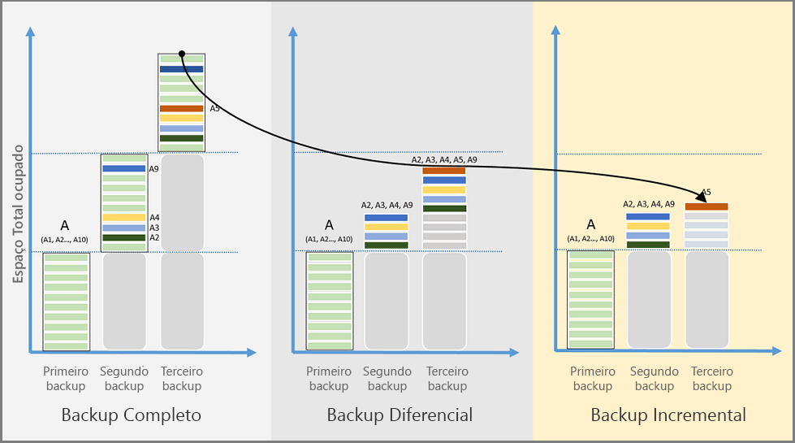

# Visão geral dos recursos do Backup do Azure
O Backup do Azure é o serviço baseado no Azure que você pode usar para fazer backup (ou proteger) e restaurar os dados na nuvem da Microsoft. Ele substitui a solução de backup local ou externa existente por uma solução confiável, segura e econômica baseada em nuvem. O Backup do Azure oferece vários componentes que você pode baixar e implantar em um computador, servidor, ou na nuvem. O componente ou o agente que você implanta depende daquilo que deseja proteger. Todos os componentes do Backup do Azure (independentemente de você estar protegendo dados localmente ou na nuvem) podem ser usados para fazer backup de dados em um cofre do Backup no Azure. Confira a [Tabela de componentes do Backup do Azure](backup-introduction-to-azure-backup.md#which-azure-backup-components-should-i-use) (mais adiante neste artigo) para obter informações sobre qual componente usar para proteger dados, aplicativos ou cargas de trabalho específicos.

[Assista a uma visão geral em vídeo do Backup do Azure](https://azure.microsoft.com/documentation/videos/what-is-azure-backup/)

## Por que usar o Backup do Azure?
As soluções tradicionais de backup evoluíram para tratar a nuvem como um ponto de extremidade ou um destino de armazenamento estático, semelhante a um disco ou fita. Embora essa abordagem seja simples, é limitada e não aproveita plenamente uma plataforma de nuvem subjacente, o que resulta em uma solução cara e ineficiente. Outras soluções são caras porque você acaba pagando pelo tipo errado de armazenamento, ou por um armazenamento desnecessário. Outras soluções geralmente são ineficientes porque não oferecem o tipo ou a quantidade de armazenamento de que você precisa, ou as tarefas administrativas exigem muito tempo. O Backup do Azure, por sua vez, oferece estes benefícios principais:

**Gerenciamento automático de armazenamento** - ambientes híbridos geralmente exigem armazenamento heterogêneo, alguns locais e alguns na nuvem. Com o Backup do Azure, não há nenhum custo para o uso de dispositivos de armazenamento local. O Backup do Azure aloca e gerencia automaticamente o armazenamento de backup, com um modelo de pagamento conforme o uso. Pagamento conforme o uso significa que você paga apenas pelo armazenamento que consumir. Para obter mais informações, confira [Preços do Azure](https://azure.microsoft.com/pricing/details/backup).

**Dimensionamento ilimitado** - o Backup do Azure usa o poder subjacente e a escala ilimitada de nuvem do Azure para proporcionar alta disponibilidade, sem manutenção ou sobrecarga de monitoramento. Você pode configurar alertas para fornecer informações sobre eventos, mas não precisa se preocupar com a alta disponibilidade de seus dados na nuvem.

**Várias opções de armazenamento** -um aspecto de alta disponibilidade é a replicação de armazenamento. O Backup do Azure oferece dois tipos de replicação: [armazenamento com redundância local](../storage/storage-redundancy.md#locally-redundant-storage) e [armazenamento com redundância geográfica](../storage/storage-redundancy.md#geo-redundant-storage). Escolha a opção de armazenamento de backup com base na necessidade:

* O Armazenamento com redundância local (LRS) replica seus dados três vezes (ele cria três cópias de seus dados) em um datacenter emparelhado na mesma região. O LRS é uma opção de baixo custo para proteger seus dados contra falhas de hardware local.

* O GRS (armazenamento com redundância geográfica) replica seus dados para uma região secundária (a centenas de quilômetros da região primária dos dados de origem). O GRS é mais caro do que o LRS, mas fornece um nível mais alto de durabilidade para seus dados, mesmo se houver uma interrupção regional.

**Transferência de dados ilimitada** - o Backup do Azure não limita a quantidade de dados de entrada ou saída que você transfere. O Backup do Azure também não cobra pelos dados que são transferidos. No entanto, se você usar o serviço de Importação/Exportação do Azure para importar grandes quantidades de dados, haverá um custo associado aos dados de entrada. Para obter mais informações sobre esse custo, confira o [Fluxo de trabalho de backup offline no Backup do Azure](backup-azure-backup-import-export.md). Os dados de saída são aqueles transferidos de um cofre de Backup durante uma operação de restauração.

**Criptografia de dados** - permite a transmissão segura e o armazenamento dos seus dados na nuvem pública. A senha de criptografia é armazenada localmente e nunca é transmitida nem armazenada no Azure. Se for necessário restaurar os dados, somente você tem a senha de criptografia ou chave.

**Backup consistente com o aplicativo** - independentemente de você estar fazendo backup de um servidor de arquivos, máquina virtual ou banco de dados SQL, precisa saber que um ponto de recuperação tem todos os dados necessários para restaurar a cópia de backup. O Backup do Azure fornece backups consistentes com aplicativos, garantindo que correções adicionais não sejam necessárias para restaurar os dados. Restaurar dados consistentes com aplicativos reduz o tempo de restauração, permitindo que você rapidamente retorne ao estado de execução.

**Retenção de longo prazo** – Em vez de alternar as cópias de backup de disco para fita e levá-la para um local externo, você pode usar o Azure para retenção de curto e longo prazo. O Azure não limita o período de tempo que os dados são mantidos em um Backup ou em um cofre de Serviços de Recuperação. Você pode manter dados em um cofre para como desejar. O Backup do Azure tem um limite de pontos de recuperação 9999 por instância protegidos. Consulte o [Backup e retenção](backup-introduction-to-azure-backup.md#backup-and-retention) neste artigo para obter uma explicação de como esse limite pode afetar suas necessidades de backup.  

## Quais componentes do Backup do Azure devo usar?
Se não tiver certeza de qual componente do Backup do Azure atende às suas necessidades, confira a tabela a seguir para obter informações sobre o que você pode proteger com cada componente. O portal do Azure fornece um assistente, que é embutido no portal, para orientá-lo a escolher qual componente baixar e implantar. O assistente, que é parte da criação de cofre dos Serviços de Recuperação, o conduz pelas etapas para selecionar uma meta de backup e escolher os dados ou o aplicativo a serem protegidos.

| Componente | Benefícios | limites | O que é protegido? | Onde os backups são armazenados? |
| --- | --- | --- | --- | --- |
| Agente de Backup do Azure (MARS) |<li>Fazer backup de arquivos e pastas no sistema operacional Windows físico ou virtual (as máquinas virtuais podem ser locais ou estar no Azure)<li>Nenhum servidor de backup separado necessário. |<li>Fazer backup 3 vezes por dia <li>Não reconhece aplicativos; arquivo, pasta e restauração em nível de volume somente, <li>  Não há suporte para Linux. |<li>Arquivos, <li>Pastas |Criar cofre de backup do Azure |
| System Center DPM |<li>Instantâneos com reconhecimento de aplicativo (VSS)<li>Total flexibilidade sobre quando fazer backups<li>Granularidade da recuperação (tudo)<li>Pode usar o cofre do Backup do Azure<li>Suporte para Linux no Hyper-V e VMs VMware <li>Backup e restauração das VMs VMware usando o DPM 2012 R2 |Não é possível fazer o backup da carga de trabalho do Oracle.|<li>Arquivos, <li>Pastas,<li> Volumes, <li>VMs,<li> Aplicativos,<li> Cargas de trabalho |<li>Cofre do Backup do Azure,<li> Disco conectado localmente,<li>  Fita (somente local) |
| Servidor de Backup do Azure |<li>Instantâneos com reconhecimento de aplicativo (VSS)<li>Total flexibilidade sobre quando fazer backups<li>Granularidade da recuperação (tudo)<li>Pode usar o cofre do Backup do Azure<li>Suporte para Linux no Hyper-V e VMs VMware<li>Fazer backup e restaurar VMs VMware <li>Não exige uma licença do System Center |<li>Não é possível fazer o backup da carga de trabalho do Oracle.<li>Sempre requer assinatura do Azure ao vivo<li>Não há suporte para backup em fita |<li>Arquivos, <li>Pastas,<li> Volumes, <li>VMs,<li> Aplicativos,<li> Cargas de trabalho |<li>Cofre do Backup do Azure,<li> Disco conectado localmente |
| Backup de VM IaaS do Azure |<li>Backups nativos para Windows/Linux<li>Sem necessidade de instalação de agente específico<li>Backup em nível de malha sem a necessidade de uma infraestrutura de backup |<li>Fazer backup de máquinas virtuais uma vez por dia <li>Restaurar máquinas virtuais somente no nível do disco<li>Não pode fazer backup no local |<li>VMs, <li>Todos os discos (usando o PowerShell) |
Criar cofre de backup do Azure
 |

## Quais são os cenários de implantação para cada componente?
| Componente | Pode ser implantado no Azure? | Pode ser implantado localmente? | Armazenamento de destino com suporte |
| --- | --- | --- | --- |
| Agente de Backup do Azure (MARS) |
**Sim**
 
O agente do Backup do Azure pode ser implantado em qualquer VM com Windows Server em execução no Azure.
 |
**Sim**
 
O agente do Backup pode ser implantado em qualquer VM com Windows Server ou máquina física.
 |
Criar cofre de backup do Azure
 |
| System Center DPM |
**Sim**

Saiba mais sobre [como proteger as cargas de trabalho no Azure usando o System Center DPM](backup-azure-dpm-introduction.md).
 |
**Sim**
 
Saiba mais sobre [como proteger as cargas de trabalho e as VMs em seu datacenter](https://technet.microsoft.com/en-us/system-center-docs/dpm/data-protection-manager).
 |
Disco conectado localmente,
 
Cofre do Backup do Azure,
 
fita (somente local)
 |
| Servidor de Backup do Azure |
**Sim**

Saiba mais sobre [como proteger as cargas de trabalho no Azure usando o Servidor de Backup do Azure](backup-azure-microsoft-azure-backup.md).
 |
**Sim**
 
Saiba mais sobre [como proteger as cargas de trabalho no Azure usando o Servidor de Backup do Azure](backup-azure-microsoft-azure-backup.md).
 |
Disco conectado localmente,
 
Criar cofre de backup do Azure
 |
| Backup de VM IaaS do Azure |
**Sim**

Parte da malha do Azure

Especializado para [backup de máquinas virtuais IaaS (infraestrutura do Azure como serviço)](backup-azure-vms-introduction.md).
 |
**Não**
 
Use o System Center DPM para fazer backup de máquinas virtuais em seu datacenter.
 |
Criar cofre de backup do Azure
 |

## Quais aplicativos e cargas de trabalho podem passar por backup?
A tabela a seguir fornece uma matriz de dados e cargas de trabalho que podem ser protegidos usando o Backup do Azure. A coluna de solução do Backup do Azure tem links para a documentação de implantação da solução. Cada componente do Backup do Azure pode ser implantado em um ambiente de modelo de implantação Clássico (implantação do Service Manager) ou do Gerenciador de Recursos.

[!INCLUDE [learn-about-deployment-models](../../includes/learn-about-deployment-models-include.md)]

| Dados ou carga de trabalho | Ambiente de origem | Solução de Backup do Azure |
| --- | --- | --- |
| Arquivos e pastas |Windows Server |
[Agente do Backup do Azure](backup-configure-vault.md),
 
[System Center DPM](backup-azure-dpm-introduction.md) (+ o agente do Backup do Azure),
 
[Servidor de Backup do Azure](backup-azure-microsoft-azure-backup.md) (inclui o agente do Backup do Azure)
 |
| Arquivos e pastas |Computador com Windows |
[Agente do Backup do Azure](backup-configure-vault.md),
 
[System Center DPM](backup-azure-dpm-introduction.md) (+ o agente do Backup do Azure),
 
[Servidor de Backup do Azure](backup-azure-microsoft-azure-backup.md) (inclui o agente do Backup do Azure)
 |
| Máquina virtual do Hyper-V (Windows) |Windows Server |
[System Center DPM](backup-azure-backup-sql.md) (+ o agente do Backup do Azure),
 
[Servidor de Backup do Azure](backup-azure-microsoft-azure-backup.md) (inclui o agente do Backup do Azure)
 |
| Máquina virtual do Hyper-V (Linux) |Windows Server |
[System Center DPM](backup-azure-backup-sql.md) (+ o agente do Backup do Azure),
 
[Servidor de Backup do Azure](backup-azure-microsoft-azure-backup.md) (inclui o agente do Backup do Azure)
 |
| Microsoft SQL Server |Windows Server |
[System Center DPM](backup-azure-backup-sql.md) (+ o agente do Backup do Azure),
 
[Servidor de Backup do Azure](backup-azure-microsoft-azure-backup.md) (inclui o agente do Backup do Azure)
 |
| Microsoft SharePoint |Windows Server |
[System Center DPM](backup-azure-backup-sql.md) (+ o agente do Backup do Azure),
 
[Servidor de Backup do Azure](backup-azure-microsoft-azure-backup.md) (inclui o agente do Backup do Azure)
 |
| Microsoft Exchange |Windows Server |
[System Center DPM](backup-azure-backup-sql.md) (+ o agente do Backup do Azure),
 
[Servidor de Backup do Azure](backup-azure-microsoft-azure-backup.md) (inclui o agente do Backup do Azure)
 |
| VMs IaaS do Azure (Windows) |em execução no Azure |[Backup do Azure (extensão VM)](backup-azure-vms-introduction.md) |
| VMs IaaS do Azure (Linux) |em execução no Azure |[Backup do Azure (extensão VM)](backup-azure-vms-introduction.md) |

## Suporte para Linux
A tabela a seguir mostra os componentes do Backup do Azure com suporte para Linux.  

| Componente | Suporte para Linux (endossado pelo Azure) |
| --- | --- |
| Agente de Backup do Azure (MARS) |Não (somente agente baseado no Windows) |
| System Center DPM |Backup consistente de arquivos das VMs Convidadas Linux no Hyper-V e VMWare  (não disponível para a VM do Azure)  Restauração da VM do Hyper-V e VMs Convidadas Linux do VMWare |
| Servidor de Backup do Azure |Backup consistente de arquivos das VMs Convidadas Linux no Hyper-V e VMWare  (não disponível para a VM do Azure)  Restauração da VM do Hyper-V e VMs Convidadas Linux do VMWare |
| Backup de VM IaaS do Azure |Backup consistente de aplicativos usando uma [estrutura pré e pós-script](https://docs.microsoft.com/azure/backup/backup-azure-linux-app-consistent)  [Recuperação granular de arquivos](backup-azure-restore-files-from-vm.md)  [Restaurar todos os discos da VM](https://docs.microsoft.com/azure/backup/backup-azure-arm-restore-vms#restore-backed-up-disks)  [Restauração da VM](https://docs.microsoft.com/azure/backup/backup-azure-arm-restore-vms#create-a-new-vm-from-restore-point) |

## Usando máquinas virtuais de Armazenamento Premium com o Backup do Azure
O Backup do Azure protege VMs de Armazenamento Premium. O Armazenamento Premium do Azure é um armazenamento baseado em SSD (unidade de estado sólido) desenvolvida para dar suporte a cargas de trabalho com E/S intenso. O Armazenamento Premium é uma opção interessante para cargas de trabalho de máquina virtual (VM). Para saber mais sobre o Armazenamento Premium, confira o artigo [Armazenamento Premium: armazenamento de alto desempenho para cargas de trabalho de máquina virtual do Azure](../storage/storage-premium-storage.md).

### Backup de VMs de Armazenamento Premium
Durante o backup de VMs do Armazenamento Premium, o serviço de Backup cria um local de preparo temporário, chamado "AzureBackup-", na conta do Armazenamento Premium. O local de preparo é igual ao tamanho do instantâneo de ponto de recuperação. Verifique se há espaço livre na conta de armazenamento para acomodar o local de preparo temporário. Para obter mais informações, confira o artigo [Limitações do Armazenamento Premium](../storage/storage-premium-storage.md#scalability-and-performance-targets). Quando o trabalho de backup for concluído, o local de preparo será excluído. O preço do armazenamento usada para o local de preparo é consistente com todos os [preços de armazenamento Premium](../storage/storage-premium-storage.md#pricing-and-billing).

> [!NOTE]
> Não modifique nem edite o local de preparo.
>
>

### Restaurar VMs de Armazenamento Premium
As VMs de Armazenamento Premium podem ser restauradas para o Armazenamento Premium ou normal. A restauração de um ponto de recuperação de VM de Armazenamento Premium para o Armazenamento Premium é o processo típico de restauração. No entanto, pode ser econômico para restaurar um ponto de recuperação de VM de Armazenamento Premium para o armazenamento padrão. Esse tipo de restauração poderá ser usado se você precisar de um subconjunto de arquivos da VM.

## Uso de VMs de disco gerenciado no Backup do Azure
O Backup do Azure protege VMs de disco gerenciado. Os discos gerenciados liberam você do gerenciamento de contas de armazenamento de máquinas virtuais e simplificam muito o provisionamento de VM.

### Fazer backup de VMs de disco gerenciado
O backup de VMs em discos gerenciados não é diferente de fazer backup de VMs do Resource Manager. No Portal do Azure é possível configurar o trabalho de backup diretamente na exibição da Máquina Virtual ou na exibição do cofre de Serviços de Recuperação. Você pode fazer backup de VMs em discos gerenciados por meio de coleções de RestorePoint criadas com base em discos gerenciados. O Backup do Azure também oferece suporte ao backup de VMs de disco gerenciado criptografadas usando o ADE (Azure Disk Encryption).

### Restaurar máquinas virtuais de disco gerenciado
O Backup do Azure permite que você restaure uma VM completa com discos gerenciados ou restaure discos gerenciados para uma conta de armazenamento do Resource Manager. O Azure gerencia os discos gerenciados durante o processo de restauração. Você (o cliente) gerencia a conta de armazenamento criada como parte do processo de restauração. Para restaurar VMs criptografadas gerenciadas, as chaves e os segredos da VM já devem existir no cofre da chave antes da restauração.

## Quais são os recursos de cada componente do Backup?
As seções a seguir fornecem as tabelas que resumem a disponibilidade ou o suporte de vários recursos em cada componente do Backup do Azure. Confira as informações de cada tabela a seguir para obter suporte adicional ou detalhes.

### Armazenamento
| Recurso | Agente de Backup do Azure | System Center DPM | Servidor de Backup do Azure | Backup de VM IaaS do Azure |
| --- | --- | --- | --- | --- |
| Criar cofre de backup do Azure |![Sim][green] |![Sim][green] |![Sim][green] |![Sim][green] |
| Armazenamento em disco | |![Sim][green] |![Sim][green] | |
| Armazenamento em fita | |![Sim][green] | | |
| Compactação  (no cofre do Backup) |![Sim][green] |![Sim][green] |![Sim][green] | |
| Backup incremental |![Sim][green] |![Sim][green] |![Sim][green] |![Sim][green] |
| Eliminação de duplicação de disco | |![Parcialmente][yellow] |![Parcialmente][yellow] | |

O cofre de Backup é o destino de armazenamento preferencial em todos os componentes. O System Center DPM e o Servidor de Backup do Azure também oferecem a opção de ter uma cópia do disco local. No entanto, somente o System Center DPM fornece a opção de gravar dados em um dispositivo de armazenamento em fita.

#### Compactação
Os backups são compactados para reduzir o espaço de armazenamento necessário. O único componente que não usa a compactação é a extensão de VM. A extensão de VM copia todos os dados de backup da sua conta de armazenamento para o cofre do Backup na mesma região. Nenhuma compactação é usada durante a transferência dos dados. Transferir os dados sem compactação infla um pouco o armazenamento usado. No entanto, o armazenamento de dados sem compactação possibilita uma restauração mais rápida, caso você precise desse ponto de recuperação.

#### Eliminação de duplicação de disco
Você poderá tirar proveito da eliminação de duplicação quando implantar o System Center DPM ou Servidor de Backup do Azure [em uma máquina virtual Hyper-V](http://blogs.technet.com/b/dpm/archive/2015/01/06/deduplication-of-dpm-storage-reduce-dpm-storage-consumption.aspx). O Windows Server faz a eliminação de duplicação de dados (em nível do host) em VHDs (discos rígidos virtuais) conectados como armazenamento de backup às máquinas virtuais.

> [!NOTE]
> A eliminação de duplicação não está disponível no Azure para nenhum dos componentes do Backup. Quando o System Center DPM e o Servidor de Backup são implantados no Azure, os discos de armazenamento conectados à VM não podem ser submetidos à eliminação de duplicação.
>
>

### Backup incremental explicado
Cada componente do Backup do Azure dá suporte ao backup incremental, independentemente do armazenamento de destino (disco, fita, cofre de backup). O backup incremental garante que os backups sejam eficientes em termos de tempo e armazenamento, transferindo somente as alterações feitas desde o último backup.

#### Comparando o backup Completo, Diferencial e Incremental

O consumo de armazenamento, o RTO (objetivo do tempo de recuperação) e o consumo de rede variam para cada tipo de método de backup. Para manter o TCO (custo total de propriedade) de backup baixo, você precisa entender como escolher a melhor solução de backup. A imagem a seguir compara o Backup Completo, o Backup Diferencial e o Backup Incremental. Na imagem, a fonte de dados A é composta de 10 blocos de armazenamento, A1 até A10, dos quais é feito um backup mensal. Os blocos A2, A3, A4 e A9 alteram-se no primeiro mês e o bloco A5 altera-se no próximo mês.

Com o **Backup Completo**, cada cópia de backup contém toda a fonte de dados. O backup completo consome uma grande quantidade de largura de banda e armazenamento de rede a cada vez que uma cópia de backup é transferida.

O **Backup Diferencial** armazena somente os blocos que foram alterados desde o backup completo inicial, resultando em uma quantidade menor de consumo de armazenamento e de rede. Os backups diferenciais não mantém cópias redundantes dos dados inalterados. No entanto, como os blocos de dados que permanecem inalterados entre os backups subsequentes são transferidos e armazenados, os backups diferenciais são ineficientes. No segundo mês é feito o backup dos blocos que foram alterados A2, A3, A4 e A9. No terceiro mês, é feito novamente o backup desses mesmos blocos, junto com o bloco A5 que foi alterado. O backup dos blocos alterados continua a ser feito até que o próximo backup completo aconteça.

O **Backup Incremental** alcança alta eficiência de armazenamento e de rede armazenando somente os blocos de dados que foram alterados desde o backup anterior. Com o backup incremental, não é necessário fazer backups completos regulares. No exemplo, depois que o backup completo é feito no primeiro mês, os blocos alterados A2, A3, A4 e A9 são marcados como alterados e transferidos para o segundo mês. No terceiro mês, somente o bloco alterado A5 é marcado e transferido. A movimentação de menor quantidade de dados economiza recursos de armazenamento e de rede, o que reduz o TCO.   

### Segurança
| Recurso | Agente de Backup do Azure | System Center DPM | Servidor de Backup do Azure | Backup de VM IaaS do Azure |
| --- | --- | --- | --- | --- |
| Segurança de rede  (para o Azure) |![Sim][green] |![Sim][green] |![Sim][green] |![Parcialmente][yellow] |
| Segurança de dados  (no Azure) |![Sim][green] |![Sim][green] |![Sim][green] |![Parcialmente][yellow] |

#### Segurança de rede
Todo tráfego de backup de seus servidores para o cofre do Backup é criptografado, usando a criptografia AES (Advanced Encryption Standard) 256. Os dados de backup são enviados por um link HTTPS seguro. Os dados de backup também são armazenados no cofre de backup na forma criptografada. Somente você, o cliente do Azure, possui a senha para desbloquear esses dados. A Microsoft não pode descriptografar os dados de backup em momento algum.

> [!WARNING]
> Depois de estabelecer o cofre do Backup, só você tem acesso à chave de criptografia. A Microsoft nunca mantém uma cópia da sua chave de criptografia e não tem acesso a ela. Se a chave for perdida, a Microsoft não poderá recuperar os dados de backup.
>
>

#### Segurança de dados
Fazer backup de VMs do Azure requer a configuração da criptografia *na* máquina virtual. Use o BitLocker em máquinas virtuais do Windows e **dm-crypt** em máquinas virtuais Linux. O Backup do Azure não criptografa automaticamente dados de backup provenientes desse caminho.

### Rede
| Recurso | Agente de Backup do Azure | System Center DPM | Servidor de Backup do Azure | Backup de VM IaaS do Azure |
| --- | --- | --- | --- | --- |
| Compactação de rede  (para **servidor de backup**) | |![Sim][green] |![Sim][green] | |
| Compactação de rede  (para **cofre do backup**) |![Sim][green] |![Sim][green] |![Sim][green] | |
| Protocolo de rede  (para **servidor de backup**) | |TCP |TCP | |
| Protocolo de rede  (para **cofre do backup**) |HTTPS |HTTPS |HTTPS |HTTPS |

A extensão da VM (na VM IaaS) lê os dados diretamente da conta de armazenamento do Azure por meio da rede de armazenamento; portanto, não é necessário compactar esse tráfego.

Se você estiver fazendo backup de dados em um Servidor de Backup do Azure ou no System Center DPM, compacte os dados que vão do servidor primário para o servidor de backup. Compactar os dados antes de fazer o backup deles no DPM ou no Servidor de Backup do Azure economiza largura de banda.

#### Limitação de rede
O agente do Backup do Azure fornece limitação de rede, o que permite controlar como a largura de banda é usada durante a transferência de dados. A limitação pode ser útil se você precisa fazer backup de dados durante o horário de expediente, mas não quer que o processo de backup interfira no outro tráfego de Internet. A limitação da transferência de dados aplica-se a atividades de backup e restauração.

## Backup e retenção

O Backup do Azure tem um limite de 9999 pontos de recuperação, também conhecido como cópias de backup ou instantâneos, por *instância protegida*. Uma instância protegida é um computador, servidor (físico ou virtual) ou carga de trabalho configurado para fazer backup de dados no Azure. Para obter mais informações, confira a seção [O que é uma instância protegida](backup-introduction-to-azure-backup.md#what-is-a-protected-instance). Uma instância está protegida depois que uma cópia de backup de dados foi salva. A cópia de backup de dados é a proteção. Se a fonte de dados foi perdida ou corrompida, a cópia de backup pode restaurar os dados de origem. A tabela a seguir mostra a frequência de backup máxima para cada componente. A configuração da política de backup determina a rapidez com a qual você pode consumir os pontos de recuperação. Por exemplo, se você criar um ponto de recuperação por dia, poderá depois retê-los por 27 anos antes de executá-los. Se você usar um ponto de recuperação por mês, poderá depois retê-los por 833 anos antes de executá-los. O serviço de Backup não define um limite de tempo de validade em um ponto de recuperação.

|  | Agente de Backup do Azure | System Center DPM | Servidor de Backup do Azure | Backup de VM IaaS do Azure |
| --- | --- | --- | --- | --- |
| Frequência de backup  (para cofre do Backup) |Três backups por dia |Dois backups por dia |Dois backups por dia |Um backup por dia |
| Frequência de backup  (para o disco) |Não aplicável |<li>A cada 15 minutos para o SQL Server <li>A cada hora para outras cargas de trabalho |<li>A cada 15 minutos para o SQL Server <li>A cada hora para outras cargas de trabalho
 |Não aplicável |
| Opções de retenção |Diária, semanal, mensal, anual |Diária, semanal, mensal, anual |Diária, semanal, mensal, anual |Diária, semanal, mensal, anual |
| Pontos de recuperação máximos por instância protegida |9999|9999|9999|9999|
| Período de retenção máximo |Depende da frequência de backup |Depende da frequência de backup |Depende da frequência de backup |Depende da frequência de backup |
| Pontos de recuperação no disco local |Não aplicável |<li>64 para Servidores de Arquivos,<li>448 para Servidores de Aplicativos |<li>64 para Servidores de Arquivos,<li>448 para Servidores de Aplicativos |Não aplicável |
| Pontos de recuperação em fita |Não aplicável |Ilimitado |Não aplicável |Não aplicável |

## O que é uma instância protegida
Uma instância protegida é uma referência genérica para um computador Windows, um servidor (físico ou virtual) ou banco de dados SQL que tenha sido configurado para fazer backup do Azure. Uma instância está protegida quando você configura uma política de backup para o computador, servidor ou banco de dados e criar uma cópia de backup dos dados. Cópias subsequentes dos dados de backup para essa instância protegido (que são chamados de pontos de recuperação), aumentam a quantidade de armazenamento consumido. Você pode criar pontos de recuperação até 9999 para uma instância protegida. Se você excluir um ponto de recuperação de armazenamento, não conta com o total de pontos de recuperação de 9999.
Alguns exemplos comuns de instâncias protegidas são máquinas virtuais, servidores de aplicativos, bancos de dados e computadores pessoais com o sistema operacional Windows. Por exemplo:

* Uma máquina virtual executando a malha de hipervisor Hyper-V ou Azure IaaS. Os sistemas operacionais de convidados para a máquina virtual podem ser Windows Server ou Linux.
* Um servidor de aplicativos: o servidor de aplicativos pode ser uma máquina física ou virtual executando o Windows Server e cargas de trabalho com dados em que é preciso ser feito backup. Cargas de trabalho comuns são: Microsoft SQL Server, Microsoft Exchange Server, Microsoft SharePoint Server e a função de Servidor de Arquivos do Windows Server. Para fazer o backup dessas cargas de trabalho você precisa do System Center Data Protection Manager (DPM) ou do servidor de Backup do Azure.
* Um computador, uma estação de trabalho ou um laptop executando o sistema operacional Windows.

## O que é o arquivo de credencial do cofre?
O arquivo de credenciais do cofre é um certificado gerado pelo portal para cada cofre do Backup. O portal, em seguida, carrega a chave pública no ACS (Serviço de Controle de Acesso). A chave privada é fornecida a você ao baixar as credenciais. Use-a para registrar os computadores que você deseja proteger. A chave privada é o que permite que você autentique os servidores ou computadores para enviar dados de backup para um determinado cofre do Backup.

Você só pode usar a credencial do cofre para registrar os servidores ou computadores. No entanto, tenha cuidado com as credenciais do cofre, caso elas sejam perdidas ou obtidas por outros, poderão ser usadas para registrar outros computadores no mesmo cofre. Como os dados de backup são criptografados usando uma senha que pertence apenas a você, os dados de backup existentes não podem ser comprometidos. As credenciais do cofre expiram após 48 horas. Embora você possa baixar credenciais do cofre do Backup sempre que desejar, somente as últimas credenciais podem ser usadas para registro.

## Qual a diferença entre o Backup do Azure e o Azure Site Recovery?
O Backup do Azure e o Azure Site Recovery são relacionados, pois ambos são serviços de backup de dados e podem restaurar esses dados. No entanto, esses serviços têm propostas de valor diferentes.

O Backup do Azure protege os dados no local e na nuvem. O Azure Site Recovery coordena a replicação, o failover e o failback de servidores físicos e máquinas virtuais. Ambos os serviços são importantes, pois a solução de recuperação de desastre precisa manter os dados seguros e recuperáveis (Backup) *e* manter as cargas de trabalho disponíveis (Recuperação de Site) quando ocorrem falhas.

Os conceitos a seguir podem ajudá-lo a tomar decisões importantes sobre backup e recuperação de desastre.

| Conceito | Detalhes | Backup | DR (Recuperação de desastre) |
| --- | --- | --- | --- |
| RPO (Objetivo de Ponto de Recuperação) |A quantidade de perda de dados aceitável se uma recuperação precisar ser feita. |Há uma grande variação do RPO aceitável entre as soluções de backup. Os backups de máquina virtual geralmente têm um RPO de um dia, enquanto os backups de banco de dados têm RPOs de até 15 minutos. |Soluções de recuperação de desastre têm RPOs baixos. A cópia de DR pode ter um atraso de alguns segundos ou minutos. |
| RTO (Objetivo de Tempo de Recuperação) |O tempo necessário para concluir uma recuperação ou restauração. |Devido ao RPO maior, a quantidade de dados que uma solução de backup precisa processar normalmente é muito maior, o que leva a RTOs mais longos. Por exemplo, a restauração de dados de fitas pode demorar dias, dependendo do tempo necessário para transportar a fita de um local externo. |As soluções de recuperação de desastre têm RTOs menores, pois estão mais sincronizadas com a origem. Uma quantidade menor de alterações precisa ser processada. |
| Retenção |Por quanto tempo os dados precisam ser armazenados |Para cenários que exigem recuperação operacional (dados corrompidos, exclusão acidental de arquivos, falhas no sistema operacional), os dados de backup normalmente são retidos por 30 dias ou menos. De um ponto de vista de conformidade, talvez os dados tenham de ser armazenados por meses ou até por anos. Nesses casos, os dados de backup são ideais para arquivamento. |A recuperação de desastre precisa apenas de dados de recuperação operacional, o que normalmente leva algumas horas ou até um dia. Devido à captura de dados refinada usada em soluções de DR, não recomendamos o uso de dados de DR para a retenção de longo prazo. |

## Próximas etapas
Use um dos seguintes tutoriais para obter instruções detalhadas, passo a passo, para proteger dados no Windows Server ou proteger uma máquina virtual (VM) no Azure:

* [Fazer backup de arquivos e pastas](backup-try-azure-backup-in-10-mins.md)
* [Fazer backup de máquinas virtuais do Azure](backup-azure-vms-first-look-arm.md)

Para obter detalhes sobre como proteger outras cargas de trabalho, experimente um dos seguintes artigos:

* [Fazer backup do seu servidor Windows](backup-configure-vault.md)
* [Fazer backup de cargas de trabalho do aplicativo](backup-azure-microsoft-azure-backup.md)
* [Backup de VM IaaS do Azure](backup-azure-vms-prepare.md)

[green]: ./media/backup-introduction-to-azure-backup/green.png
[yellow]: ./media/backup-introduction-to-azure-backup/yellow.png
[red]: ./media/backup-introduction-to-azure-backup/red.png

