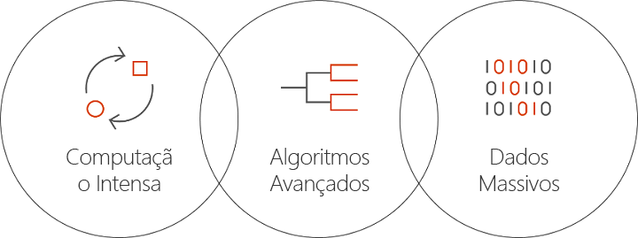

# O que é a IA do Lote no Azure?
A IA do Lote é um serviço gerenciado que permite que os pesquisadores de IA e cientistas de dados treinem IA e outros modelos de aprendizado de máquina em clusters de máquinas virtuais do Azure, incluindo VMs com suporte de GPU. Descreva os requisitos do seu trabalho, onde encontrar as entradas e armazenar as saídas, e a IA do Lote cuida do resto.  
 
## Por que a IA do Lote? 
O desenvolvimento de algoritmos avançados de IA é um processo iterativo e de computação intensa. Os cientistas de dados e pesquisadores IA estão trabalhando com conjuntos de dados cada vez maiores. Eles estão desenvolvendo modelos com mais camadas e fazendo isso com mais experimentação no design de rede no ajuste de hiperparâmetros. Fazer isso com eficiência requer várias CPUs ou GPUs por modelo, execução de experiências em paralelo e armazenamento compartilhado para dados de treinamento, logs e saídas de modelo.   
 

Os cientistas de dados e pesquisadores de IA são especialistas nos campos deles, mas gerenciar infraestrutura em grande escala pode ser um obstáculo. O desenvolvimento de IA em grande escala requer muitas tarefas de infraestrutura: provisionar clusters de VMs, instalar software e contêineres, enfileirar trabalhos, priorizar e agendar trabalhos, lidar com falhas, distribuir dados, compartilhar resultados, dimensionar recursos para gerenciar custos e fazer a integração com ferramentas e fluxos de trabalho. A IA do Lote lida com essas tarefas. 
 
## O que é a IA do Lote? 

A IA do Lote oferece gerenciamento de recursos e agendamento de trabalhos especializados para treinamento e teste de IA. As principais funcionalidades incluem: 

* Trabalhos de lote de execução demorada, experimentação iterativa e treinamento interativo 
* Expansão automática ou manual de clusters de VM usando GPUs ou CPUs 
* Configuração de comunicação SSH entre VMs e para acesso remoto 
* Suporte para estruturas de aprendizado profundo ou aprendizado de máquina, com configuração otimizada para kits de ferramentas populares, como o [CNTK](https://github.com/Microsoft/CNTK) (Microsoft Cognitive Toolkit), o [TensorFlow](https://www.tensorflow.org/) e o [Chainer](https://chainer.org/) 
* Fila de trabalho baseado em prioridades para compartilhar clusters e tirar proveito de VMs de baixa prioridade e instâncias reservadas  
* Opções de armazenamento flexíveis, incluindo Arquivos do Azure e servidor NFS gerenciado 
* Montagem de compartilhamentos de arquivos remotos na VM e contêiner opcional 
* Fornecimento de status do trabalho e reinicialização em caso de falhas de VM 
* Acesso a logs de saída, stdout, stderr e modelos, incluindo o streaming do Armazenamento do Azure 
* [CLI](/cli/azure) (interface de linha de comando), SDKs para [Python](https://github.com/Azure/azure-sdk-for-python), [C#](https://www.nuget.org/packages/Microsoft.Azure.Management.BatchAI/1.0.0-preview)e Java, monitoramento no Portal do Azure e integração com as ferramentas de IA da Microsoft 

O SDK da IA do Lote dá suporte à codificação de scripts ou aplicativos para gerenciar pipelines de treinamento e fazer a integração com ferramentas. Atualmente, o SDK fornece APIs REST, Python, C# e Java.  
 

A IA do Lote usa o Azure Resource Manager em operações no plano de controle (criar, listar, obter, excluir). O Azure Active Directory é usado para autenticação e controle de acesso baseado em função.  
 
## Como usar a IA do Lote 

Para usar a IA do Lote, defina e gerencie *clusters* e *trabalhos*. 

 
**Clusters** descrevem seus requisitos de computação: 
* Região do Azure em que você deseja executar 
* A família e o tamanho da VM a ser usada; por exemplo, uma VM NC24, que contém 4 GPUs NVIDIA K80 
* O número de VMs ou o número mínimo e máximo para dimensionamento automático 
* A imagem de VM; por exemplo, o Ubuntu 16.04 LTS ou a [Microsoft Deep Learning Virtual Machine](https://azuremarketplace.microsoft.com/marketplace/apps/microsoft-ads.dsvm-deep-learning)
* Volumes de compartilhamento de arquivos remotos a serem montados; por exemplo, dos Arquivos do Azure ou um servidor NFS gerenciado pela IA do Lote 
* Nome de usuário e chave SSH ou senha a ser configurada nas máquinas virtuais para habilitar o logon interativo para depuração  
 

**Trabalhos** descrevem: 
* O cluster e região a serem usados 
* Quantas VMs para o trabalho 
* Diretórios de entrada e saída a serem passados para o trabalho ao iniciar. Isso geralmente usa o sistema de arquivos compartilhados montado durante a instalação do cluster 
* Um contêiner opcional para executar o script de instalação ou o software 
* Configuração de estrutura de IA específica ou a linha de comando e os parâmetros para iniciar o trabalho 
 

Introdução ao uso da IA do Lote com a [CLI do Azure](/cli/azure) e arquivos de configuração para clusters e trabalhos. Use essa abordagem para criar seu cluster rapidamente quando necessário e executar trabalhos para fazer experiências com o design de rede ou os hiperparâmetros.  
 

A IA do Lote facilita o trabalho em paralelo com várias GPUs. Quando os trabalhos têm que ser dimensionados entre várias GPUs, a IA do Lote configura uma conectividade de rede segura entre as VMs. Quando o InfiniBand é usado, a IA do Lote configura os drivers e inicia MPI entre os nós de um trabalho.  

## Gerenciamento de dados
A IA do Lote oferece opções flexíveis para seus scripts de treinamento, dados e saídas:
  
* Use **disco local** para testes iniciais e conjuntos de dados menores. Para esse cenário, talvez seja ideal se conectar à máquina virtual via SSH para editar scripts e ler logs. 

* Use os **Arquivos do Azure** para compartilhar dados de treinamento entre vários trabalhos e armazenar logs de saída e modelos em um único lugar 

* Configure um **servidor NFS** para dar suporte a uma escala maior de dados e VMs para treinamento. A IA do Lote pode configurar um servidor NFS para você como um tipo de cluster especial com discos copiados no Armazenamento do Azure. 
 
* Um **sistema de arquivos paralelo** fornece escalabilidade adicional para dados e treinamentos paralelos. Embora a IA do Lote não gerencie sistemas de arquivos paralelos, há modelos de implantação de exemplo disponíveis para Lustre, Gluster e BeeGFS.  

## Próximas etapas

* Comece a criar seu primeiro trabalho de treinamento da IA do Lote usando a [CLI do Azure](quickstart-cli.md) ou [Python](quickstart-python.md).
* Confira as [receitas de treinamento](https://github.com/Azure/BatchAI) de exemplo para estruturas diferentes.

