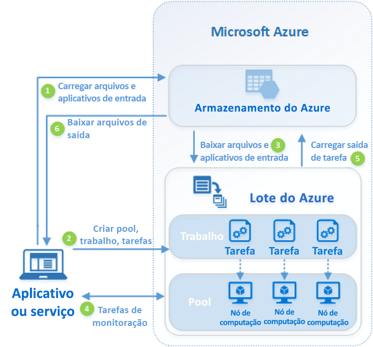

# O que é o Lote do Azure?

Use o Lote do Azure para executar trabalhos em lote de HPC (computação de alto desempenho) e paralelos em larga escala com eficiência no Azure. O Lote do Azure cria e gerencia um pool de nós de computação (máquinas virtuais), instala os aplicativos que você deseja executar e agenda trabalhos para execução nos nós. Não há nenhum software de cluster ou agendador de trabalho para instalar, gerenciar ou dimensionar. Em vez disso, você usa [ferramentas e APIs do Lote](batch-apis-tools.md), scripts de linha de comando ou o portal do Azure para configurar, gerenciar e monitorar seus trabalhos. 

Os desenvolvedores podem de usar o Lote como um serviço de plataforma para criar aplicativos de cliente ou aplicativos SaaS onde a execução em larga escala for necessária. Por exemplo, crie um serviço do Lote para executar uma simulação de risco Monte Carlo de uma empresa de serviços financeiros, ou um serviço para processar muitas imagens.

Não há custos adicionais para usar o Lote. Você paga apenas pelos recursos subjacentes consumidos, como máquinas virtuais, armazenamento e rede.

Para obter uma comparação entre o Lote e outras opções de solução HPC no Azure, confira [Soluções do HPC, Lote e Big Compute](../virtual-machines/linux/high-performance-computing.md).

## Executar cargas de trabalho paralelas
O Lote funciona bem com cargas de trabalho intrinsecamente paralelas (também conhecidas como "excessivamente paralelas"). Cargas de trabalho intrinsecamente paralelas são aquelas em que os aplicativos podem ser executados independentemente, e cada instância conclui parte do trabalho. Quando os aplicativos estão em execução, eles podem acessar alguns dados comuns, mas não se comunicam com outras instâncias do aplicativo. Cargas de trabalho podem, portanto, ser executadas em grande escala, determinada pela quantidade de recursos de computação disponíveis para executar aplicativos simultaneamente.

Alguns exemplos de cargas de trabalho intrinsecamente paralelas que você pode colocar no Lote:

* Modelagem de riscos financeiros usando simulações Monte Carlo
* Renderização de imagem 3D e VFX
* Processamento e análise de imagem
* Transcodificação de mídia
* Análise de sequência genética
* OCR (reconhecimento óptico de caracteres)
* Ingestão de dados, processamento e operações de ETL
* Execução de teste de software

Você também pode usar o Lote para [executar cargas de trabalho firmemente acopladas](batch-mpi.md); essas são cargas de trabalho em que os aplicativos que você executa precisam se comunicar entre si, ou seja, não são executadas independentemente. Aplicativos firmemente acoplados normalmente usam a API MPI (Message Passing Interface). Você pode executar suas cargas de trabalho firmemente acopladas no Lote usando [MPI Microsoft](https://msdn.microsoft.com/library/bb524831(v=vs.85).aspx) ou MPI Intel. Melhore o desempenho de aplicativos com tamanhos de VM [HPC](../virtual-machines/linux/sizes-hpc.md) e [otimizado para GPU](../virtual-machines/linux/sizes-gpu.md) especializados.

Alguns exemplos de cargas de trabalho firmemente acopladas:
* Análise de elemento finito
* Dinâmica de fluidos
* Treinamento de AI de vários nós

Muitos trabalhos firmemente acoplados podem ser executados em paralelo usando o Lote. Por exemplo, execute várias simulações de um líquido fluindo por um cano com larguras de canos diferentes.

## Recursos adicionais do Lote

Recursos de nível superior e específicos para a carga de trabalho estão disponíveis para o Lote do Azure:
* O Lote dá suporte a [cargas de trabalho de renderização](batch-rendering-service.md) em larga escala com ferramentas de renderização, incluindo Autodesk Maya, 3ds Max, Arnold e V-Ray. 
* Os usuários de R podem instalar o [pacote R doAzureParallel](https://github.com/Azure/doAzureParallel) e expandir facilmente a execução de algoritmos de R em pools do Lote.

Você também pode executar trabalhos do Lote como parte de um fluxo de trabalho do Azure maior para transformar dados, gerenciados por ferramentas como o [Azure Data Factory](../data-factory/v1/data-factory-data-processing-using-batch.md).

## Como ele funciona
Um cenário comum para o Lote envolve expandir trabalho intrinsecamente paralelo, como a renderização de imagens para cenas 3D, em um pool de nós de computação. Esse pool de nós de computação pode ser seu "farm de renderização" que oferece dezenas, centenas ou até milhares de núcleos para o trabalho de renderização.

O diagrama a seguir mostra etapas em um fluxo de trabalho do Lote comum, com um aplicativo cliente ou serviço hospedado usando o Lote para executar uma carga de trabalho paralela.

|Etapa  |DESCRIÇÃO  |
|---------|---------|
|1.  Carregar os **arquivos de entrada** e o **aplicativo** para processar esses arquivos em sua conta do Armazenamento do Azure.     |Os arquivos de entrada podem ser quaisquer dados que o aplicativo processe, como dados de modelagem financeira ou arquivos de vídeo a serem transcodificados. Os arquivos do aplicativo podem incluir scripts ou aplicativos que processam os dados, como um transcodificador de mídia.|
|2.  Criar um **pool** de nós de computação do Lote na sua conta do Lote, um **trabalho** para executar a carga de trabalho no pool e **tarefas** no trabalho.     | Os nós do pool são as VMs que executam suas tarefas. Especifique propriedades, como o número e o tamanho de nós de uma imagem de VM Windows ou Linux, e um aplicativo para instalar quando os nós ingressarem no pool. Gerencie o custo e o tamanho do pool usando [VMs de baixa prioridade](batch-low-pri-vms.md) ou [dimensionando automaticamente](batch-automatic-scaling.md) o número de nós de acordo com as alterações de carga de trabalho.   Quando você adiciona tarefas a um trabalho, o serviço de Lote agenda automaticamente as tarefas para execução em nós de computação no pool. Cada tarefa usa o aplicativo que você carregou para processar os arquivos de entrada. |
|3.  Baixar **arquivos de entrada** e **aplicativos** para o Lote     |Antes de cada tarefa ser executada, ela pode baixar os dados de entrada que deve processar para o nó de computação atribuído. Se o aplicativo já não estiver instalado em nós de pool, ele pode ser baixado aqui. Quando os downloads do Armazenamento do Azure forem concluídos, a tarefa será executada no nó atribuído.|
|4.  Monitorar a **execução da tarefa**     |À medida que as tarefas são executadas, consulte o Lote para monitorar o andamento do trabalho e suas tarefas. O aplicativo cliente ou serviço se comunica com o serviço de Lote por HTTPS. Como você pode monitorar milhares de tarefas em execução em milhares de nós de computação, não se esqueça de [consultar o serviço do Lote com eficiência](batch-efficient-list-queries.md).|
|5.  Carregar a **saída da tarefa**     |À medida que as tarefas são concluídas,elas podem carregar seus dados de resultados para o Armazenamento do Azure. Você também pode recuperar arquivos diretamente do sistema de arquivos em um nó de computação.|
|6.  Baixar os **arquivos de saída**     |Quando o monitoramento detecta que as tarefas em seu trabalho foram concluídas, o aplicativo cliente ou serviço pode baixar os dados de saída para processamento adicional.|

Lembre-se de que essa é apenas uma maneira de usar o Lote, e este cenário descreve apenas alguns de seus recursos disponíveis. Por exemplo, você pode executar [várias tarefas em paralelo](batch-parallel-node-tasks.md) em cada nó de computação. Ou usar [tarefas de preparação e conclusão do trabalho](batch-job-prep-release.md) para preparar os nós para os trabalhos e limpá-los posteriormente. 

Confira a [Visão geral do recurso do Lote para desenvolvedores](batch-api-basics.md) para obter informações mais detalhadas sobre os recursos do serviço Lote, como pools, nós, trabalhos e tarefas, e os muitos recursos da API que você pode usar ao criar o aplicativo do Lote. 

## Próximas etapas

Introdução ao Lote do Azure com um desses guias de início rápido:
* [Executar o primeiro trabalho do Lote com a CLI do Azure](quick-create-cli.md)
* [Executar o primeiro trabalho do Lote com o portal do Azure](quick-create-portal.md)
* [Executar o primeiro trabalho do Lote usando a API do .NET](quick-run-dotnet.md)
* [Executar o primeiro trabalho do Lote usando a API do Python](quick-run-python.md)

