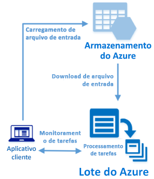

# <a name="quickstart-run-your-first-batch-job-with-the-python-api"></a>Início rápido: Executar o primeiro trabalho do Lote com a API do Python

Este guia de início rápido executa um trabalho do Lote do Azure de um aplicativo criado na API do Python do Lote do Azure. O aplicativo carrega vários arquivos de dados de entrada no armazenamento do Azure e, em seguida, cria um *pool* de nós de computação (máquinas virtuais) do Lote. Em seguida, ele cria um exemplo de *trabalho* que executa *tarefas* para processar cada arquivo de entrada no pool usando um comando básico. Depois de concluir este guia de início rápido, você entenderá os conceitos principais do serviço Lote e estará pronto para experimentar o Lote com cargas de trabalho mais realistas em maior escala.
 


[!INCLUDE [quickstarts-free-trial-note.md](../../includes/quickstarts-free-trial-note.md)]

## <a name="prerequisites"></a>pré-requisitos

* [Python versão 2.7 ou 3.3 ou posterior](https://www.python.org/downloads/)

* Gerenciador de pacotes de [pip](https://pip.pypa.io/en/stable/installing/)

* Uma conta do Lote do Azure e uma conta de Armazenamento do Azure para fins gerais vinculada. Para criar essas contas, consulte os guias de início rápido do Lote usando o [Portal do Azure](quick-create-portal.md) ou a [CLI do Azure](quick-create-cli.md). 

## <a name="sign-in-to-azure"></a>Entrar no Azure

Entre no portal do Azure em [https://portal.azure.com](https://portal.azure.com).

[!INCLUDE [batch-common-credentials](../../includes/batch-common-credentials.md)]

## <a name="download-the-sample"></a>Baixar o exemplo

[Baixe ou clone o aplicativo de exemplo](https://github.com/Azure-Samples/batch-python-quickstart) do GitHub. Para clonar o repositório do aplicativo de exemplo com um cliente Git, use o seguinte comando:

```
git clone https://github.com/Azure-Samples/batch-python-quickstart.git
```

Navegue até o diretório que contém o script Python `python_quickstart_client.py`.

Em seu ambiente de desenvolvimento do Python, instale os pacotes necessários usando `pip`.

```bash
pip install -r requirements.txt
```

Abra o arquivo `python_quickstart_client.py`. Atualize as cadeias de credenciais da conta de armazenamento e do Lote com os valores obtidos para suas contas. Por exemplo: 


```Python
_BATCH_ACCOUNT_NAME = 'mybatchaccount'
_BATCH_ACCOUNT_KEY = 'xxxxxxxxxxxxxxxxE+yXrRvJAqT9BlXwwo1CwF+SwAYOxxxxxxxxxxxxxxxx43pXi/gdiATkvbpLRl3x14pcEQ=='
_BATCH_ACCOUNT_URL = 'https://mybatchaccount.mybatchregion.batch.azure.com'
_STORAGE_ACCOUNT_NAME = 'mystorageaccount'
_STORAGE_ACCOUNT_KEY = 'xxxxxxxxxxxxxxxxy4/xxxxxxxxxxxxxxxxfwpbIC5aAWA8wDu+AFXZB827Mt9lybZB1nUcQbQiUrkPtilK5BQ=='
```

## <a name="run-the-app"></a>Execute o aplicativo

Para ver o fluxo de trabalho do Lote em ação, execute o script:

```
python python_quickstart_client.py
```

Depois de executar o script, examine o código para saber o que cada parte do aplicativo faz. 

Quando você executa o aplicativo de exemplo, a saída do console fica mais ou menos assim. Durante a execução, você tem uma pausa em `Monitoring all tasks for 'Completed' state, timeout in 00:30:00...` enquanto os nós de computação do pool são iniciados. As tarefas são enfileiradas para execução assim que o primeiro nó de computação estiver em execução. Vá para sua conta do Lote no [Portal do Azure](https://portal.azure.com) para monitorar o pool, os nós de computação, os trabalhos e as tarefas em sua conta do Lote.

```
Sample start: 12/4/2017 4:02:54 PM

Container [input] created.
Uploading file taskdata0.txt to container [input]...
Uploading file taskdata1.txt to container [input]...
Uploading file taskdata2.txt to container [input]...
Creating pool [PythonQuickstartPool]...
Creating job [PythonQuickstartJob]...
Adding 3 tasks to job [PythonQuickstartJob]...
Monitoring all tasks for 'Completed' state, timeout in 00:30:00...
```

Após a conclusão das tarefas, você verá uma saída semelhante à seguinte para cada tarefa:

```
Printing task output...
Task: Task0
Node: tvm-2850684224_3-20171205t000401z
Standard out:
Batch processing began with mainframe computers and punch cards. Today it still plays a central role in business, engineering, science, and other pursuits that require running lots of automated tasks....
...
```

O tempo de execução típico é de aproximadamente 3 minutos ao executar o aplicativo em sua configuração padrão. A instalação inicial do pool leva mais tempo.

## <a name="review-the-code"></a>Examine o código

O aplicativo Python neste guia de início rápido faz o seguinte:

* Carrega três arquivos de texto pequenos em um contêiner de blob em sua conta de Armazenamento do Azure. Esses arquivos são entradas para o processamento de tarefas do Lote.
* Cria um pool de dois nós de computação executando o Ubuntu 16.04 LTS.
* Cria um trabalho e três tarefas a serem executadas em nós. Cada tarefa processa um dos arquivos de entrada usando uma linha de comando do Shell Bash.
* Exibe os arquivos retornados pelas tarefas.

Confira o arquivo `python_quickstart_client.py` e as seções a seguir para obter mais detalhes. 

### <a name="preliminaries"></a>Etapas preliminares

Para interagir com uma conta de armazenamento, o aplicativo usa o pacote [azure-storage-blob](https://pypi.python.org/pypi/azure-storage-blob) para criar um objeto [BlockBlobService](/python/api/azure.storage.blob.blockblobservice.blockblobservice).

```python
blob_client = azureblob.BlockBlobService(
    account_name=_STORAGE_ACCOUNT_NAME,
    account_key=_STORAGE_ACCOUNT_KEY)
```

O aplicativo usa a referência `blob_client` para criar um contêiner na conta de armazenamento e carregar os arquivos de dados no contêiner. Os arquivos no armazenamento são definidos como objetos [ResourceFile](/python/api/azure.batch.models.resourcefile) do Lote que ele pode baixar mais tarde para os nós de computação.

```python
input_file_paths = [os.path.realpath('./data/taskdata0.txt'),
                    os.path.realpath('./data/taskdata1.txt'),
                    os.path.realpath('./data/taskdata2.txt')]
input_files = [
    upload_file_to_container(blob_client, input_container_name, file_path)
    for file_path in input_file_paths]
```

O aplicativo cria um objeto [BatchServiceClient](/python/api/azure.batch.batchserviceclient) para criar e gerenciar pools, trabalhos e tarefas no serviço de Lote. O cliente do Lote no exemplo usa a autenticação de chave compartilhada. O Lote também dá suporte à autenticação do Azure Active Directory.

```python
credentials = batchauth.SharedKeyCredentials(_BATCH_ACCOUNT_NAME,
    BATCH_ACCOUNT_KEY)

batch_client = batch.BatchServiceClient(
    credentials,
    base_url=_BATCH_ACCOUNT_URL)
```


### <a name="create-a-pool-of-compute-nodes"></a>Criar um pool de nós de computação

Para criar um pool do Lote, o aplicativo usa a classe [PoolAddParameter](/python/api/azure.batch.models.pooladdparameter) para definir o número de nós, o tamanho da VM e uma configuração de pool. Aqui, um objeto [VirtualMachineConfiguration](/python/api/azure.batch.models.virtualmachineconfiguration) especifica uma [ImageReference](/python/api/azure.batch.models.imagereference) para uma imagem do Ubuntu Server 16.04 LTS publicada no Azure Marketplace. O Lote dá suporte a uma ampla gama de imagens do Linux e do Windows Server no Azure Marketplace, bem como imagens de VM personalizadas.

O número de nós (`_POOL_NODE_COUNT`) e o tamanho da VM (`_POOL_VM_SIZE`) são constantes definidas. O exemplo cria por padrão um pool com dois nós de tamanho *Standard_A1_v2*. O tamanho sugerido oferece um bom equilíbrio entre desempenho e custo para este exemplo rápido.

O método [pool.add](/python/api/azure.batch.operations.pooloperations#azure_batch_operations_PoolOperations_add) envia o pool para o serviço do Lote.

```python
new_pool = batch.models.PoolAddParameter(
    id=pool_id,
    virtual_machine_configuration=batchmodels.VirtualMachineConfiguration(
        image_reference=batchmodels.ImageReference(
            publisher="Canonical",
            offer="UbuntuServer",
            sku="16.04.0-LTS",
            version="latest"
            ),
        node_agent_sku_id="batch.node.ubuntu 16.04"),
    vm_size=_POOL_VM_SIZE,
    target_dedicated_nodes=_POOL_NODE_COUNT
)
batch_service_client.pool.add(new_pool)
```

### <a name="create-a-batch-job"></a>Criar um trabalho do Lote

Um trabalho do Lote é um agrupamento lógico de uma ou mais tarefas. Um trabalho inclui configurações comuns às tarefas, como prioridade e o pool onde elas devem ser executadas. O aplicativo usa a classe [JobAddParameter](/python/api/azure.batch.models.jobaddparameter) para criar um trabalho em seu pool. O método [job.add](/python/api/azure.batch.operations.joboperations#azure_batch_operations_JobOperations_add) envia o pool ao serviço do Lote. Inicialmente, o trabalho não tem nenhuma tarefa.

```python
job = batch.models.JobAddParameter(
    job_id,
    batch.models.PoolInformation(pool_id=pool_id))
batch_service_client.job.add(job)
```

### <a name="create-tasks"></a>Criar tarefas

O aplicativo cria uma lista de objetos de tarefa usando a classe [TaskAddParameter](/python/api/azure.batch.models.taskaddparameter). Cada tarefa processa um objeto `resource_files` de entrada usando um parâmetro `command_line`. No exemplo, a linha de comando executa o comando do shell Bash `cat` para exibir o arquivo de texto. Esse comando é um exemplo simples para fins de demonstração. Quando você usa o Lote, a linha de comando é onde você especifica seu aplicativo ou script. O Lote fornece várias maneiras para implantar aplicativos e scripts em nós de computação.

Depois, o aplicativo adiciona tarefas ao trabalho com o método [task.add_collection](/python/api/azure.batch.operations.taskoperations#azure_batch_operations_TaskOperations_add_collection), que as enfileira para execução em nós de computação. 

```python
tasks = list()

for idx, input_file in enumerate(input_files): 
    command = "/bin/bash -c \"cat {}\"".format(input_file.file_path)
    tasks.append(batch.models.TaskAddParameter(
        id='Task{}'.format(idx),
        command_line=command,
        resource_files=[input_file]
    )
)
batch_service_client.task.add_collection(job_id, tasks)
```

### <a name="view-task-output"></a>Exibir saída da tarefa

O aplicativo monitora o estado da tarefa para certificar-se de foi concluída. Depois, o aplicativo exibe o arquivo `stdout.txt` gerado por cada tarefa concluída. Quando a tarefa é executada com êxito, a saída do comando de tarefa é gravada em `stdout.txt`:

```python
tasks = batch_service_client.task.list(job_id)

for task in tasks:
    
    node_id = batch_service_client.task.get(job_id, task.id).node_info.node_id
    print("Task: {}".format(task.id))
    print("Node: {}".format(node_id))

    stream = batch_service_client.file.get_from_task(job_id, task.id, _STANDARD_OUT_FILE_NAME)

    file_text = _read_stream_as_string(
        stream,
        encoding)
    print("Standard output:")
    print(file_text)
```

## <a name="clean-up-resources"></a>Limpar recursos

O aplicativo exclui automaticamente o contêiner de armazenamento que cria e oferece a opção para excluir o pool e o trabalho do Lote. Você é cobrado pelo pool enquanto os nós estão em execução, mesmo se não há trabalhos agendados. Quando você não precisa mais do pool, exclua-o. Quando você excluir o pool, todas as saídas de tarefa nos nós são excluídas. 

Quando não forem mais necessário, exclua o grupo de recursos, a conta do Lote e a conta de armazenamento. Para fazer isso no Portal do Azure, selecione o grupo de recursos para a conta do Lote e clique em **Excluir grupo de recursos**.

## <a name="next-steps"></a>Próximas etapas

Neste guia de início rápido, você executou um pequeno aplicativo compilado com a API de Python do Lote para criar um pool do Lote e um trabalho do Lote. O trabalho executou os exemplos de tarefas e baixou a saída criada nos nós. Agora que você conhece os conceitos principais do serviço Lote, está pronto para experimentar o Lote com cargas de trabalho mais realistas em maior escala. Para saber mais sobre o Lote do Azure e percorrer uma carga de trabalho paralela com um aplicativo real, continue com o tutorial de Python do Lote.

> [!div class="nextstepaction"]
> [Processar uma carga de trabalho paralela com o Python](tutorial-parallel-python.md)
