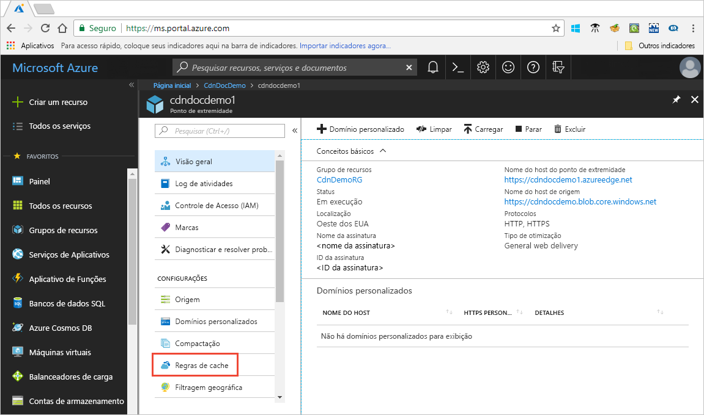

# Controlar o comportamento de cache da CDN do Azure com regras de cache

> [!NOTE] 
> As regras de cache estão disponíveis apenas para perfis de **CDN Standard do Azure do Verizon** e **CDN Standard do Azure da Akamai**. Para perfis de **CDN Premium do Azure do Verizon**, é necessário usar o [mecanismo de regras da CDN do Azure](cdn-rules-engine.md) no portal **Gerenciar** para uma funcionalidade semelhante.
 
A CDN (Rede de Distribuição de Conteúdo do Microsoft Azure) oferece duas maneiras de controlar como seus arquivos são armazenados em cache: 

- Regras de cache: Este artigo descreve como você pode usar regras de cache da rede de distribuição de conteúdo (CDN) para definir ou modificar o comportamento de expiração de cache padrão globalmente e com condições personalizadas, como uma extensão de arquivo e caminho de URL. CDN do Azure fornece dois tipos de regras de cache:

   - Regras de cache globais: Você pode definir uma regra de cache global para cada ponto de extremidade em seu perfil, o que afeta todas as solicitações para o ponto de extremidade. A regra de cache global substitui todos os cabeçalhos de diretiva de cache HTTP, se configurado.

   - Regras de cache personalizadas: Você pode definir as regras de cache personalizadas um ou mais para cada ponto de extremidade em seu perfil. As regras de cache personalizadas combinam caminhos específicos e extensões de arquivo, são processadas em ordem e substituem a regra de cache global, se definido. 

- Cache de cadeia de caracteres de consulta: Você pode ajustar como a CDN do Azure trata o cache para solicitações com cadeias de caracteres de consulta. Para obter mais informações, consulte [Controlar o comportamento do cache da CDN do Azure com cadeias de caracteres de consulta](cdn-query-string.md). Se o arquivo não for armazenável em cache, a configuração de cache da cadeia de caracteres de consulta não terá efeito, com base em regras de cache e comportamentos padrão da CDN.

Para obter informações sobre o comportamento de cache padrão e os cabeçalhos de diretivas de cache, consulte [Como funciona o cache](cdn-how-caching-works.md). 

## Acessando regras de cache da CDN do Azure

1. Abra o Portal do Azure, selecione um perfil da CDN e selecione um ponto de extremidade.

2. No painel esquerdo em Configurações, selecione **Regras de cache**.

   

   A página **Regras de cache** é exibida.

   

## Configurações de comportamento do cache
Para regras de cache globais e personalizadas, é possível especificar as seguintes configurações de **Comportamento do cache**:

- **Ignorar cache**: Não armazenar em cache e ignora os cabeçalhos de diretiva de cache fornecidos pela origem.

- **Substituir**: Ignorar a duração de cache fornecidos pela origem; Use a duração do cache fornecida. Isso não substituirá a cache-control: sem cache.

- **Definir se ausente**: Respeitar os cabeçalhos de diretiva de cache fornecidos pela origem, se existirem; Caso contrário, use a duração do cache fornecida.

## Duração da expiração do cache
Para regras de cache globais e personalizadas, é possível especificar a duração da expiração do cache em dias, horas, minutos e segundos:

- Para as configurações **Substituir** e **Definir se ausente**, configurações **Comportamento do cache**, as durações de cache válidas variam entre 0 segundos e 366 dias. Por um valor de 0 segundos, o CDN armazena em cache o conteúdo, mas deve revalidar cada solicitação com o servidor de origem.

- Para a configuração **Ignorar cache**, a duração do cache é definida automaticamente em 0 segundos e não pode ser alterada.

## As regras de cache personalizadas correspondem condições

Para regras de cache personalizadas, há duas condições de correspondência:
 
- **Caminho**: Essa condição corresponde ao caminho da URL, excluindo o nome de domínio e dá suporte ao símbolo curinga (\*). Por exemplo, _/myfile.html_, _/my/folder/*_ e _/my/images/*.jpg_. O comprimento máximo é de 260 caracteres.

- **Extensão**: Essa condição corresponde a extensão de arquivo do arquivo solicitado. Você pode fornecer uma lista de extensões de arquivo separadas por vírgulas para corresponder. Por exemplo, _.jpg_, _.mp3_ ou _.png_. O número máximo de extensões é 50 e o número máximo de caracteres por extensão é 16. 

## Ordem de processamento global e personalizado de regras
As regras de cache personalizadas e globais são processadas na seguinte ordem:

- As regras de cache globais têm precedência sobre o comportamento de cache padrão da CDN (configurações de cabeçalho de diretiva de cache HTTP). 

- As regras de cache personalizadas têm precedência sobre as regras de cache globais, onde elas se aplicam. As regras de cache personalizadas são processadas de forma geral de cima para baixo. Ou seja, se uma solicitação corresponder às duas condições, as regras na parte inferior da lista prevalecem sobre as regras na parte superior da lista. Portanto, é necessário colocar mais regras específicas na lista.

**Exemplo**:
- Regra de cache global: 
   - Comportamento de cache: **Override**
   - Duração da expiração de cache: 1 dia

- Regra de cache individual Nº 1:
   - Condição de correspondência: **Caminho**
   - Valor de correspondência: _/home/*_
   - Comportamento de cache: **Override**
   - Duração da expiração de cache: 2 dias

- Regra de cache personalizada Nº 2:
   - Condição de correspondência: **Extensão**
   - Valor de correspondência: _.html_
   - Comportamento de cache: **Definir se ausente**
   - Duração da expiração de cache: 3 dias

Quando essas regras estiverem definidas, uma solicitação para  _&lt;nome do host do ponto de extremidade&gt;_ gatilhos.azureedge.net/home/index.html #2, que é definido como regra de cache personalizada: **Definir se ausente** e 3 dias. Portanto, se o arquivo *index.html* tiver `Cache-Control` ou `Expires` cabeçalhos HTTP, eles serão aceitos; caso contrário, se esses cabeçalhos não estiverem configurados, o arquivo será armazenado em cache por 3 dias.

> [!NOTE] 
> Os arquivos que são armazenados em cache antes de uma alteração de regra mantêm a configuração da duração do cache de origem. Para reiniciar as durações de cache, será necessário [limpar o arquivo](cdn-purge-endpoint.md). 
>
> As alterações na configuração da CDN do Azure podem demorar um pouco para serem propagadas pela rede: 
> - Para perfis da **CDN Standard do Azure da Akamai**, a propagação normalmente é concluída em um minuto. 
> - Para perfis da **CDN Standard do Azure da Verizon**, a propagação geralmente é concluída em 10 minutos.  
>

## Consulte também

- [Como funciona o cache](cdn-how-caching-works.md)
- [Tutorial: definir regras de cache da CDN do Azure](cdn-caching-rules-tutorial.md)
