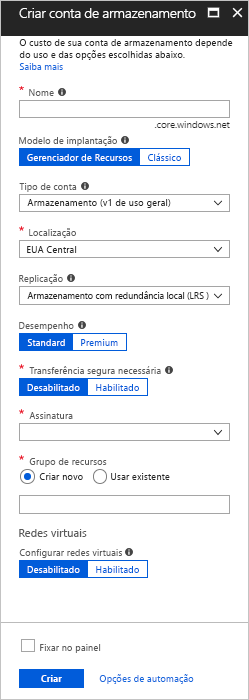
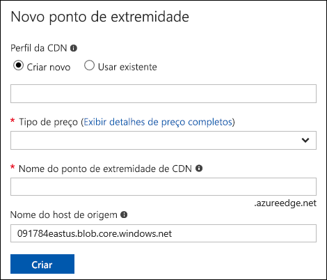
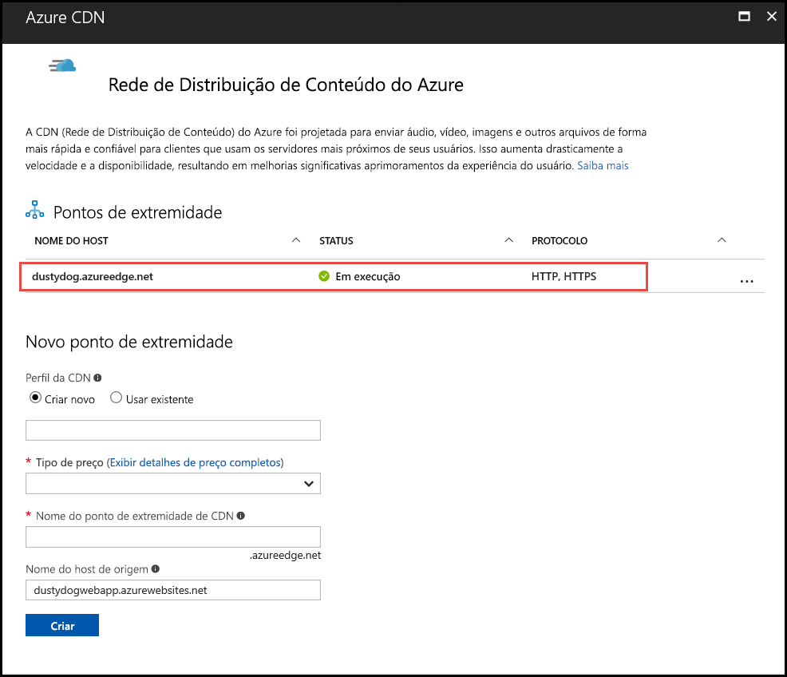

# Integrar uma conta de armazenamento do Azure com a CDN do Azure
Você pode habilitar a Rede de Distribuição de Conteúdo (CDN) do Azure para armazenar em cache o conteúdo do armazenamento do Azure. A CDN do Azure oferece aos desenvolvedores uma solução global para fornecimento de conteúdo de alta largura de banda. Ele consegue armazenar em cache blobs e conteúdo estático de instâncias de computação em nós físicos nos Estados Unidos, na Europa, na Ásia, na Austrália e na América do Sul.

## Etapa 1: Criar uma conta de armazenamento
Use o procedimento a seguir para criar uma nova conta de armazenamento para uma assinatura do Azure. A conta de armazenamento dá acesso aos serviços de Armazenamento do Microsoft Azure. A conta de armazenamento representa o mais alto nível do namespace para acessar cada um dos componentes do serviço de Armazenamento do Microsoft Azure: Blob do Azure, Fila e Tabela. Para obter mais informações, consulte: [Introdução ao Armazenamento do Microsoft Azure](../storage/common/storage-introduction.md) .

Para criar uma conta de armazenamento, você deve ser o administrador de serviços ou um coadministrador da assinatura associada.

> [!NOTE]
> Há vários métodos que você pode usar para criar uma conta de armazenamento, incluindo o Portal do Azure e o PowerShell. Este tutorial demostra como usar o portal do Azure.   
> 

**Para criar uma conta de armazenamento para uma assinatura do Azure**

1. Entre no [Portal do Azure](https://portal.azure.com).
2. No canto superior esquerdo, selecione **Criar um recurso**. No painel **Novo**, selecione **Armazenamento** e **Conta de armazenamento - blob, arquivo, tabela, fila**.
    
    O painel **Criar conta de armazenamento** aparece.   

    

3. Na caixa **Nome**, insira um nome de subdomínio. Essa entrada pode conter de 3 a 24 letras minúsculas e números.
   
    Esse valor torna-se o nome de host no URI que é usado para lidar com os recursos de blob, fila ou tabela da assinatura em questão. Para lidar com um recurso de contêiner no armazenamento de Blobs, use um URI no seguinte formato:
   
    http://*&lt;StorageAcountLabel&gt;*.blob.core.windows.net/*&lt;mycontainer&gt;*

    onde *&lt;StorageAccountLabel&gt;* refere-se ao valor inserido na caixa **Nome**.
   
    > [!IMPORTANT]    
    > O rótulo da URL forma o subdomínio do URI da conta de armazenamento e deve ser exclusivo entre todos os serviços hospedados no Azure.
   
    Esse valor também é usado como o nome da conta de armazenamento no portal ou ao acessar essa conta programaticamente.
    
4. Use os padrões para **Modelo de implantação**, **Tipo de conta**, **Desempenho** e **Replicação**. 
    
5. Para **Assinatura**, selecione a assinatura para usar com a conta de armazenamento.
    
6. Para **Grupo de recursos**, selecione ou crie um grupo de recursos. Para obter mais informações sobre grupos de recursos, confira [Visão geral do Azure Resource Manager](../azure-resource-manager/resource-group-overview.md#resource-groups).
    
7. Para **Local**, selecione um local para sua conta de armazenamento.
    
8. Selecione **Criar**. O processo de criação da conta de armazenamento pode levar vários minutos para ser concluído.

## Etapa 2: Habilitar a CDN para a conta de armazenamento

Você pode habilitar a CDN para sua conta de armazenamento diretamente na sua conta de armazenamento. 

1. Selecione uma conta de armazenamento do painel e selecione **CDN do Azure** no painel esquerdo. Se o botão **CDN do Azure** não estiver visível imediatamente, insira a CDN na caixa **Pesquisar** do painel esquerdo.
    
    O painel **Rede de Distribuição de Conteúdo do Azure** aparece.

    
    
2. Crie um novo ponto de extremidade inserindo as informações necessárias:
    - **Perfil CDN**: crie um novo perfil CDN ou use um existente.
    - **Tipo de preço**: selecione um tipo de preço somente se você estiver criando um perfil CDN.
    - **Nome do ponto de extremidade da CDN**: insira um nome de ponto de extremidade de CDN.

    > [!TIP]
    > Por padrão, um novo ponto de extremidade da CDN criado usa o nome do host de sua conta de armazenamento como o servidor de origem.

3. Selecione **Criar**. Depois que o ponto de extremidade é criado, ele aparece na lista de pontos de extremidade.

    

> [!NOTE]
> Se você deseja especificar configurações avançadas para o ponto de extremidade CDN, por exemplo, o tipo de otimização, use a [extensão do CDN do Azure](cdn-create-new-endpoint.md#create-a-new-cdn-endpoint) para criar um ponto de extremidade CDN, ou perfil CDN.

## Etapa 3: Habilitar recursos adicionais da CDN

No painel **CDN do Azure**, selecione o ponto de extremidade da CDN na lista para abrir o painel de configuração da CDN. Você pode habilitar recursos adicionais da CDN para o fornecimento, como compactação, cadeia de caracteres de consulta e filtragem de área geográfica. Você também pode adicionar o mapeamento de domínio personalizado ao seu ponto de extremidade da CDN e habilitar HTTPS do domínio personalizado.
    

## Etapa 4: acessar conteúdo da CDN
Para acessar o conteúdo armazenado em cache na CDN, utilize a URL da CDN fornecida no portal. O endereço de um blob armazenado em cache tem o seguinte formato:

http://<*EndpointName*\>.azureedge.net/<*myPublicContainer*\>/<*BlobName*\>

> [!NOTE]
> Depois que você habilitar o acesso à CDN para uma conta de armazenamento, todos os objetos disponíveis publicamente estarão qualificados para armazenamento em cache de borda da CDN. Se você modificar um objeto que está armazenado em cache na CDN atualmente, o novo conteúdo não estará disponível por meio da CDN até que a CDN atualize seu conteúdo após o período de vida do conteúdo em cache expirar.

## Etapa 5: remover conteúdo da CDN
Se não desejar mais armazenar em cache um objeto na CDN do Azure, você poderá executar uma das seguintes etapas:

* Torne o contêiner particular em vez de público. Para obter mais informações, confira [Gerenciar acesso anônimo de leitura aos contêineres e blobs](../storage/blobs/storage-manage-access-to-resources.md).
* Desabilite ou exclua o ponto de extremidade CDN usando o Portal do Azure.
* Modifique seu serviço hospedado para não responder a solicitações do objeto.

Um objeto que já está armazenado em cache na CDN do Azure permanecerá em cache até que o período de vida útil do objeto expire ou até que o ponto de extremidade seja limpo. Quando o período de vida expira, a CDN do Azure verifica se o ponto de extremidade CDN ainda é válido, e se o objeto ainda pode ser acessado anonimamente. Se não for, o objeto não estará mais armazenado em cache.

## Recursos adicionais
* [Adicionar um domínio personalizado ao seu ponto de extremidade CDN](cdn-map-content-to-custom-domain.md)
* [Configure HTTPS em um domínio personalizado da CDN do Azure](cdn-custom-ssl.md)

