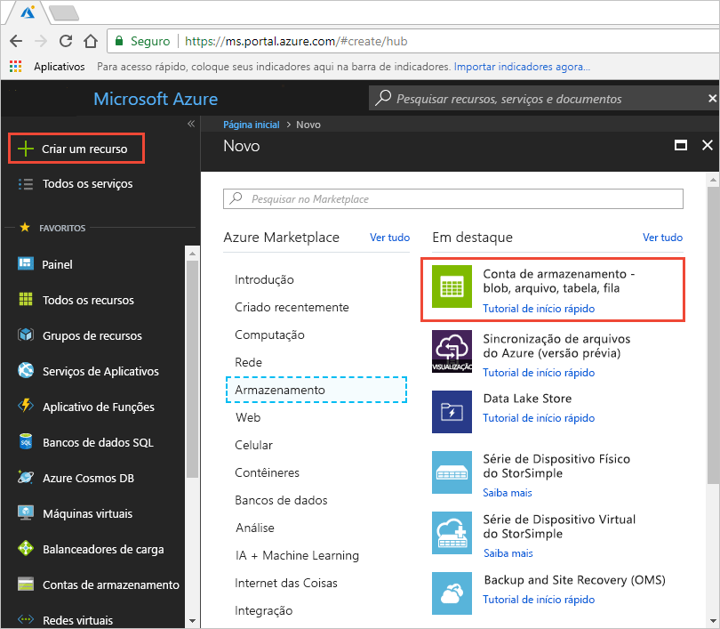

# Início Rápido: Integrar uma conta de armazenamento do Azure com a CDN do Azure
Neste início rápido, você habilita a [Rede de Distribuição de Conteúdo (CDN) do Azure](cdn-overview.md) para armazenar em cache o conteúdo do armazenamento do Azure. A CDN do Azure oferece aos desenvolvedores uma solução global para fornecimento de conteúdo de alta largura de banda. Ele consegue armazenar em cache blobs e conteúdo estático de instâncias de computação em nós físicos nos Estados Unidos, na Europa, na Ásia, na Austrália e na América do Sul.

[!INCLUDE [quickstarts-free-trial-note](../../includes/quickstarts-free-trial-note.md)]

## Faça logon no Portal do Azure
Faça logon no [Portal do Azure](https://portal.azure.com) com sua conta do Azure.

## Criar uma conta de armazenamento
Use o procedimento a seguir para criar uma nova conta de armazenamento para uma assinatura do Azure. A conta de armazenamento dá acesso aos serviços de Armazenamento do Microsoft Azure. A conta de armazenamento representa o mais alto nível do namespace para acessar cada um dos componentes do serviço de Armazenamento do Microsoft Azure: Blob do Azure, Fila e Tabela. Para obter mais informações, consulte: [Introdução ao Armazenamento do Microsoft Azure](../storage/common/storage-introduction.md) .

Para criar uma conta de armazenamento, você deve ser o administrador de serviços ou um coadministrador da assinatura associada.

Há vários métodos que você pode usar para criar uma conta de armazenamento, incluindo o Portal do Azure e o PowerShell. Este início rápido demostra como usar o portal do Azure.   

**Para criar uma conta de armazenamento para uma assinatura do Azure**

1. No Portal do Azure, no canto superior esquerdo, selecione **Criar um recurso**. 

    O **Novo** painel é exibido.

2. Selecione **Armazenamento** e, em seguida, **Conta de armazenamento – blob, arquivo, tabela, fila**.
    
    

    O painel **Criar conta de armazenamento** aparece.   

    

3. Na caixa **Nome**, insira um nome de subdomínio. Essa entrada pode conter de 3 a 24 letras minúsculas e números.
   
    Esse valor torna-se o nome de host no URI que é usado para lidar com os recursos de blob, fila ou tabela da assinatura em questão. Para lidar com um recurso de contêiner no armazenamento de Blobs, use um URI no seguinte formato:
   
    http://*&lt;StorageAcountLabel&gt;*.blob.core.windows.net/*&lt;mycontainer&gt;*

    onde *&lt;StorageAccountLabel&gt;* refere-se ao valor inserido na caixa **Nome**.
   
    > [!IMPORTANT]    
    > O rótulo da URL forma o subdomínio do URI da conta de armazenamento e deve ser exclusivo entre todos os serviços hospedados no Azure.
   
    Esse valor também é usado como o nome da conta de armazenamento no portal ou ao acessar essa conta programaticamente.
    
4. Para o restante das configurações, use os valores especificados na tabela a seguir:

    | Configuração  | Valor |
    | -------- | ----- |
    | **Modelo de implantação** | Use o valor padrão. |
    | **Tipo de conta** | Use o valor padrão. |
    | **Localidade**    | Selecione **Centro dos EUA** na lista suspensa. |
    | **Replicação** | Use o valor padrão. |
    | **Desempenho** | Use o valor padrão. |
    | **Transferência segura é necessária** | Use o valor padrão. |
    | **Assinatura** | Selecione uma assinatura do Azure na lista suspensa. |
    | **Grupo de recursos** | Selecione **Criar novo** e insira *my-resource-group-123* como o nome para seu novo grupo de recursos. Esse nome deve ser globalmente exclusivo. Caso ele já esteja em uso, é possível inserir um nome diferente ou selecionar **Usar existente** e depois **my-resource-group-123** na lista suspensa.  Para obter mais informações sobre grupos de recursos, confira [Visão geral do Azure Resource Manager](../azure-resource-manager/resource-group-overview.md#resource-groups).| 
    | **Configurar redes virtuais** | Use o valor padrão. |  
    
5. Selecione **Fixar no painel** para salvar a conta de armazenamento em seu painel após sua criação.
    
6. Selecione **Criar**. A criação da conta de armazenamento pode levar vários minutos para ser concluída.

## Habilitar a CDN do Azure para a conta de armazenamento

Você pode habilitar a CDN do Azure para sua conta de armazenamento diretamente da sua conta de armazenamento. Se você deseja especificar configurações avançadas para o ponto de extremidade CDN, por exemplo, o tipo de otimização, use a [extensão da CDN do Azure](cdn-create-new-endpoint.md) para criar um perfil CDN ou um ponto de extremidade CDN.

1. Selecione uma conta de armazenamento do painel e selecione **CDN do Azure** no painel esquerdo. Se o botão **CDN do Azure** não estiver visível imediatamente, insira a CDN na caixa **Pesquisar** do painel esquerdo para encontrá-lo.
    
    A página **CDN do Azure** é exibida.

    
    
2. Crie um novo ponto de extremidade inserindo as informações necessárias especificadas na tabela a seguir:

    | Configuração  | Valor |
    | -------- | ----- |
    | **Perfil do CDN** | Selecione **Criar novo** e insira *my-cdn-profile-123* como nome de perfil. Esse nome deve ser globalmente exclusivo. Caso ele já esteja em uso, você pode inserir um nome diferente.  |
    | **Tipo de preços** | Selecione **Verizon Standard** na lista suspensa. |
    | **Nome do ponto de extremidade do CDN** | Digite *my-endpoint-123* para seu nome de host do ponto de extremidade. Esse nome deve ser globalmente exclusivo. Caso ele já esteja em uso, você pode inserir um nome diferente. Esse nome será usado para acessar os recursos armazenados em cache no domínio _&lt;nome do ponto de extremidade&gt;_.azureedge.net. Por padrão, um novo ponto de extremidade CDN usa o nome do host de sua conta de armazenamento como o servidor de origem.|

3. Selecione **Criar**. Depois que o ponto de extremidade é criado, ele aparece na lista de pontos de extremidade.

    

## Habilitar recursos adicionais da CDN
Na página da **CDN do Azure** da conta de armazenamento, selecione o ponto de extremidade da CDN na lista para abrir a página de configuração da CDN. Nessa página, é possível habilitar recursos adicionais da CDN para sua entrega, como [compactação](cdn-improve-performance.md), [armazenamento em cache da cadeia de caracteres de consulta](cdn-query-string.md) e [filtragem de área geográfica](cdn-restrict-access-by-country.md). 
    

## Acesse o conteúdo CDN
Para acessar o conteúdo armazenado em cache na CDN, utilize a URL da CDN fornecida no portal. O endereço de um blob armazenado em cache tem o seguinte formato:

http://<*EndpointName*\>.azureedge.net/<*myPublicContainer*\>/<*BlobName*\>

> [!NOTE]
> Depois de habilitar o acesso à CDN do Azure para uma conta de armazenamento, todos os objetos disponíveis publicamente estarão qualificados para armazenamento em cache de POP da CDN. Se você modificar um objeto que está armazenado em cache na CDN atualmente, o novo conteúdo não estará disponível por meio da CDN do Azure até que esta atualize seu conteúdo após o período de vida do conteúdo em cache expirar.

## Remover o conteúdo da CDN do Azure
Se não desejar mais armazenar em cache um objeto na CDN do Azure, você poderá executar uma das seguintes etapas:

* Torne o contêiner particular em vez de público. Para obter mais informações, confira [Gerenciar acesso anônimo de leitura aos contêineres e blobs](../storage/blobs/storage-manage-access-to-resources.md).
* Desabilite ou exclua o ponto de extremidade CDN usando o Portal do Azure.
* Modifique seu serviço hospedado para não responder a solicitações do objeto.

Um objeto que já está armazenado em cache na CDN do Azure permanecerá em cache até que o período de vida útil do objeto expire ou até que o ponto de extremidade seja [limpo](cdn-purge-endpoint.md). Quando o período de vida expira, a CDN do Azure determina se o ponto de extremidade CDN ainda é válido e se o objeto ainda pode ser acessado anonimamente. Se não for, o objeto não estará mais armazenado em cache.

## Limpar recursos
Nas etapas anteriores, você criou um perfil CDN e um ponto de extremidade em um grupo de recursos. Salve esses recursos se você deseja ir para as [Próximas etapas](#next-steps) e saiba como adicionar um domínio personalizado em seu ponto de extremidade. No entanto, se você não espera usar esses recursos no futuro, poderá excluí-los ao excluir o grupo de recursos, evitando assim encargos adicionais:

1. No menu à esquerda no portal do Azure, selecione **Grupos de recursos** e, em seguida, selecione **my-resource-group-123**.

2. Na página **Grupo de recursos**, selecione **Excluir grupo de recursos**, digite *my-resource-group-123* na caixa de texto e, em seguida, selecione **Excluir**.

    Essa ação excluirá o grupo de recursos, o perfil e o ponto de extremidade que você criou neste início rápido.

3. Para excluir sua conta de armazenamento, selecione-a no painel e selecione **Excluir** no menu superior.

## Próximas etapas
Para saber mais sobre como adicionar um domínio personalizado em seu ponto de extremidade CDN, confira o tutorial a seguir:

> [!div class="nextstepaction"]
> [Tutorial: Adicionar um domínio personalizado ao seu ponto de extremidade da CDN do Azure](cdn-map-content-to-custom-domain.md)

