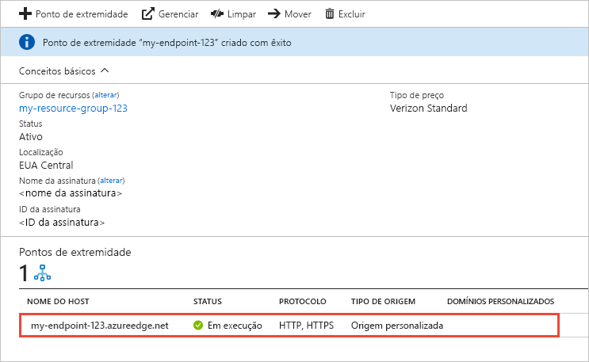

# Criar um ponto de extremidade CDN do Azure
Este artigo descreve todas as configurações para criar um ponto de extremidade [CDN (Rede de Distribuição de Conteúdo) do Azure](cdn-overview.md) em um perfil CDN existente. Depois de criar um perfil e um ponto de extremidade, você pode iniciar a distribuição de conteúdo para seus clientes. Para um início rápido sobre como criar um perfil e um ponto de extremidade, consulte [guia de início rápido: Criar um ponto de extremidade e um perfil de CDN do Azure](cdn-create-new-endpoint.md).

## Pré-requisitos
Antes de criar um ponto de extremidade da CDN, é necessário criar pelo menos um perfil CDN, que pode conter um ou mais pontos de extremidade CDN. Para organizar seus pontos de extremidade CDN por domínio de Internet, aplicativo Web ou algum outro critério, use vários perfis. Como os preços da CDN são aplicados no nível do perfil CDN, você deverá criar vários perfis CDN se quiser usar uma combinação de tipos de preços para a CDN do Azure. Para criar um perfil CDN, confira [Criar um novo perfil CDN](cdn-create-new-endpoint.md#create-a-new-cdn-profile).

## Faça logon no Portal do Azure
Faça logon no [Portal do Azure](https://portal.azure.com) com sua conta do Azure.

## Criar um novo ponto de extremidade CDN

1. No [portal do Azure](https://portal.azure.com), navegue até seu perfil CDN. Você pode ter fixado ao painel na etapa anterior. Em caso negativo, encontre-o selecionando **Todos os serviços** e selecionando **Perfis de CDN**. No painel **Perfis de CDN**, selecione o perfil ao qual você pretende adicionar seu ponto de extremidade. 
   
    O painel Perfil de CDN é exibido.

2. Selecione o **Ponto de extremidade**.
   
    
   
    A página **Adicionar um ponto de extremidade** é exibida.
   
    

3. Em **Nome**, insira um nome exclusivo para o novo ponto de extremidade de CDN. Esse nome é usado para acessar os recursos armazenados em cache no domínio  _\<endpointname >_. azureedge.net.

4. Para **Tipo de origem**, escolha um dos seguintes tipos de origem: 
   - **Armazenamento** para Armazenamento do Azure
   - **Serviço de nuvem** para o Serviços de Nuvem do Azure
   - **Aplicativo Web** para o Aplicativos Web do Azure
   - **Origem personalizada** para qualquer outro servidor Web de origem publicamente acessível (hospedado no Azure ou em outro lugar)

5. Em **Nome de host de origem**, selecione ou insira o domínio do servidor de origem. O menu suspenso lista todos os servidores de origem disponíveis do tipo especificado na etapa 4. Se você tiver selecionado **Origem personalizada** como o tipo de origem, insira o domínio do seu servidor de origem personalizado.
    
6. Em **Caminho de origem**, insira o caminho para os recursos que você quer armazenar em cache. Para permitir o armazenamento em cache de qualquer recurso no domínio especificado na etapa 5, deixe essa configuração em branco.
    
7. Em **Cabeçalho de host de origem**, insira o cabeçalho de host que você deseja que a CDN do Azure envie com cada solicitação, ou deixe o padrão.
   
   > [!NOTE]
   > Alguns tipos de origens, como o Armazenamento do Azure e Aplicativos Web, exigem que o cabeçalho de host corresponda ao domínio da origem. A menos que tenha uma origem que exija um cabeçalho de host diferente do seu domínio, você deverá deixar o valor padrão.
   > 
    
8. Para **Protocolo** e **Porta de origem**, especifique os protocolos e as portas usadas para acessar os recursos no servidor de origem. É necessário selecionar pelo menos um protocolo (HTTP ou HTTPS). Usar o domínio fornecido pela CDN (_\<endpointname >_. azureedge.net) para acessar o conteúdo HTTPS. 
   
   > [!NOTE]
   > O valor da **Porta de origem** determina somente a porta usada pelo ponto de extremidade para recuperar as informações do servidor de origem. O ponto de extremidade em si só estará disponível para os clientes finais nas portas HTTP e HTTPS (80 e 443) padrão, independentemente do valor de **Porta de origem**.  
   > 
   > Os pontos de extremidade na **CDN do Azure do Akamai** não permitem o intervalo de portas TCP completo para portas de origens. Para obter uma lista das portas de origem que não são permitidas, confira [CDN do Azure das Portas de Origem Permitidas Akamai](/previous-versions/azure/mt757337(v=azure.100)).  
   > 
   > O suporte do HTTPS para os domínios personalizados da CDN do Azure não é compatível com os produtos da **CDN do Azure do Akamai**. Para saber mais, veja [Configurar o HTTPS em um domínio personalizado CDN do Azure](cdn-custom-ssl.md).
    
9. Para **Otimizado para**, selecione um tipo de otimização que melhor corresponda ao cenário e ao tipo de conteúdo que você quer que seja distribuído pelo ponto de extremidade. Para saber mais, confira [Otimizar a CDN do Azure para o tipo de distribuição de conteúdo](cdn-optimization-overview.md).

    As seguintes configurações de tipo de otimização são compatíveis, de acordo com o tipo de perfil:
    - **CDN do Azure Standard dos perfis da Microsoft**:
       - [**Distribuição na Web geral**](cdn-optimization-overview.md#general-web-delivery)

    - **CDN do Azure Standard dos perfis da Verizon** e **CDN do Azure Premium dos perfis da Verizon**:
       - [**Distribuição na Web geral**](cdn-optimization-overview.md#general-web-delivery)
       - [**Aceleração de site dinâmica**](cdn-optimization-overview.md#dynamic-site-acceleration)

    - **CDN do Azure Standard dos perfis da Akamai**:
       - [**Distribuição na Web geral**](cdn-optimization-overview.md#general-web-delivery)
       - [**Streaming de mídia geral**](cdn-optimization-overview.md#general-media-streaming)
       - [**Streaming de mídia do vídeo por demanda**](cdn-optimization-overview.md#video-on-demand-media-streaming)
       - [**Download de arquivo grande**](cdn-optimization-overview.md#large-file-download)
       - [**Aceleração de site dinâmica**](cdn-optimization-overview.md#dynamic-site-acceleration)

10. Selecione **Adicionar** para criar um novo ponto de extremidade.
   
    Depois que o ponto de extremidade é criado, ele aparece na lista de pontos de extremidade do perfil.
    
    
    
    Como o registro demora um pouco para se propagar, o ponto de extremidade não fica imediatamente disponível para uso: 
    - Para perfis da **CDN Standard do Azure da Microsoft**, a propagação geralmente é concluída em dez minutos. 
    - Para perfis da **CDN Standard do Azure da Akamai**, a propagação normalmente é concluída em um minuto. 
    - Para perfis da **CDN Standard do Azure da Verizon** e **CDN Premium do Azure da Verizon**, a propagação geralmente conclui em 90 minutos. 
   
    Se você tentar usar o nome de domínio da CDN antes que a configuração do ponto de extremidade seja propagada para os servidores POP (ponto de presença), talvez você receba um status de resposta HTTP 404. Se passaram várias horas desde que você criou o ponto de extremidade e ainda está recebendo um status de resposta 404, confira [Solução de problemas dos pontos de extremidade da CDN do Azure que retornam o código de status 404](cdn-troubleshoot-endpoint.md).

## Limpar recursos
Para excluir um ponto de extremidade quando ele não for mais necessário, selecione-o e, em seguida, clique em **Excluir**. 

## Próximas etapas
Para saber mais sobre domínios personalizados, continue com o tutorial adicionando um domínio personalizado ao seu ponto de extremidade CDN.

> [!div class="nextstepaction"]
> [Adicionar um domínio personalizado](cdn-map-content-to-custom-domain.md)

