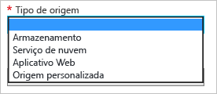

# Introdução à CDN do Azure
Este artigo descreve como habilitar a Azure CDN, criando um novo perfil e ponto de extremidade de CDN.

> [!IMPORTANT]
> Para obter uma introdução à CDN e uma lista de recursos, confira [visão geral da CDN](cdn-overview.md).
> 
> 

## Criar um novo perfil CDN
Um perfil CDN é um conjunto de pontos de extremidade CDN.  Cada perfil contém um ou mais pontos de extremidade CDN.  Você pode usar vários perfis para organizar seus pontos de extremidade CDN por domínio de Internet, aplicativo Web ou algum outro critério.

> [!NOTE]
> Uma assinatura do Azure tem limites padrão para os seguintes recursos:
> - O número de perfis CDN que podem ser criados
> - O número de pontos de extremidade que podem ser criados em um perfil CDN 
> - O número de domínios personalizados que podem ser mapeados para um ponto de extremidade
>
> Para saber mais sobre limites de assinatura de CDN, veja [Limites CDN](https://docs.microsoft.com/azure/azure-subscription-service-limits#cdn-limits).
>
> Os preços da CDN são aplicados no nível de perfil CDN. Se você quiser usar uma combinação dos tipos de preço do Azure CDN, precisará de vários perfis CDN.
> 
> 

[!INCLUDE [cdn-create-profile](../../includes/cdn-create-profile.md)]

## Criar um novo ponto de extremidade CDN
**Para criar um novo ponto de extremidade CDN**

1. No [portal do Azure](https://portal.azure.com), navegue até seu perfil CDN.  Você pode ter fixado ao painel na etapa anterior.  Se não, você poderá encontrá-lo clicando em **Procurar**, em **Perfis CDN** e clicando no perfil ao qual você pretende adicionar o ponto de extremidade.
   
    A folha do perfil CDN é exibida.
   
    ![Perfil CDN][cdn-profile-settings]
2. Clique no botão **Adicionar Ponto de Extremidade** .
   
    ![Adicionar botão de ponto de extremidade][cdn-new-endpoint-button]
   
    A folha **Adicionar um ponto de extremidade** é exibida.
   
    ![Adicionar folha de ponto de extremidade][cdn-add-endpoint]
3. Insira um **Nome** para esse ponto de extremidade CDN.  Esse nome será usado para acessar os recursos armazenados em cache no domínio `<endpointname>.azureedge.net`.
4. No menu suspenso **Tipo de origem** , selecione o tipo de origem.  Selecione **Armazenamento** para uma conta de armazenamento do Azure, **Serviço de nuvem** para um Serviço de Nuvem do Azure, **Aplicativo Web** para um Aplicativo Web do Azure ou **Origem personalizada** para qualquer outra origem de servidor Web acessível publicamente (hospedado no Azure ou em outro lugar).
   
    
5. No menu suspenso **Nome do host de origem** , selecione ou digite o domínio de origem.  O menu suspenso lista todas as origens disponíveis do tipo especificado na etapa 4.  Se você tiver selecionado *Origem personalizada* como o **Tipo de origem**, insira o domínio de sua origem personalizada.
6. Na caixa de texto **Caminho de origem** , digite o caminho para os recursos que você deseja armazenar em cache, ou deixe em branco para permitir o cache de qualquer recurso no domínio especificado na etapa 5.
7. No **Cabeçalho de host de origem**, digite o cabeçalho de host que você deseja que o CDN envie com cada solicitação ou deixe o padrão.
   
   > [!WARNING]
   > Alguns tipos de origens, como o Armazenamento do Azure e Aplicativos Web, exigem que o cabeçalho de host corresponda ao domínio da origem. A menos que tenha uma origem que exija um cabeçalho de host diferente do seu domínio, você deverá deixar o valor padrão.
   > 
   > 
8. Para **Protocolo** e **Porta de origem**, especifique os protocolos e as portas usadas para acessar os recursos na origem. É necessário selecionar pelo menos um protocolo (HTTP ou HTTPS). Use o domínio fornecido pela CDN (`<endpointname>.azureedge.net`) para acessar o conteúdo HTTPS. 
   
   > [!NOTE]
   > A **Porta de origem** afeta somente a porta que o ponto de extremidade usa para recuperar as informações da origem.  O ponto de extremidade em si só estará disponível para os clientes finais nas portas HTTP e HTTPS (80 e 443) padrão, independentemente da **Porta de origem**.  
   > 
   > **Azure CDN do Akamai** não permitem o intervalo de portas TCP completo para origens.  Para obter uma lista das portas de origem que não são permitidas, confira [CDN do Azure das Portas de Origem Permitidas Akamai](https://msdn.microsoft.com/library/mt757337.aspx).  
   > 
   > O acesso a conteúdo da CDN usando HTTPS tem as seguintes restrições:
   > 
   > * Você deve usar o certificado SSL fornecido pela CDN. Não há suporte a certificados de terceiros.
   > * O suporte a HTTPS para domínios personalizados do Azure CDN está disponível apenas com produtos **CDN do Azure da Verizon** (Standard e Premium). Ele não tem suporte em produtos **Azure CDN do Akamai**. Para saber mais, veja [Configurar o HTTPS em um domínio personalizado CDN do Azure](cdn-custom-ssl.md).
  
9. Clique no botão **Adicionar** para criar um novo ponto de extremidade.
   
   Depois que o ponto de extremidade é criado, ele aparece na lista de pontos de extremidade do perfil.
    
   ![Ponto de extremidade CDN][cdn-endpoint-success]
    
   > [!IMPORTANT]
   > Como o registro demora um pouco para se propagar, o ponto de extremidade não ficará imediatamente disponível para uso.  Para perfis da <b>CDN do Azure da Akamai</b> , a propagação normalmente é concluída em um minuto. Para perfis da <b>Azure CDN da Verizon</b>, a propagação geralmente é concluída em 90 minutos, mas em alguns casos pode levar mais tempo.
    > 
    > Os usuários que tentarem usar o nome de domínio CDN antes que a configuração do ponto de extremidade seja propagada para os POPs poderão receber códigos de resposta HTTP 404.  Se passaram várias horas desde que você criou o ponto de extremidade e ainda está recebendo respostas 404, veja [Solução de problemas dos pontos de extremidade CDN retornando status 404](cdn-troubleshoot-endpoint.md).
    > 
    > 

## Consulte também
* [Controle do comportamento do cache de solicitações com cadeias de caracteres de consulta](cdn-query-string.md)
* [Como mapear o conteúdo da CDN para um domínio personalizado](cdn-map-content-to-custom-domain.md)
* [Pré-carregar ativos em um ponto de extremidade da CDN do Azure](cdn-preload-endpoint.md)
* [Limpar um ponto de extremidade CDN do Azure](cdn-purge-endpoint.md)
* [Solucionando problemas dos pontos de extremidade CDN retornando status 404](cdn-troubleshoot-endpoint.md)

[cdn-profile-settings]: ./media/cdn-create-new-endpoint/cdn-profile-settings.png
[cdn-new-endpoint-button]: ./media/cdn-create-new-endpoint/cdn-new-endpoint-button.png
[cdn-add-endpoint]: ./media/cdn-create-new-endpoint/cdn-add-endpoint.png
[cdn-endpoint-success]: ./media/cdn-create-new-endpoint/cdn-endpoint-success.png
