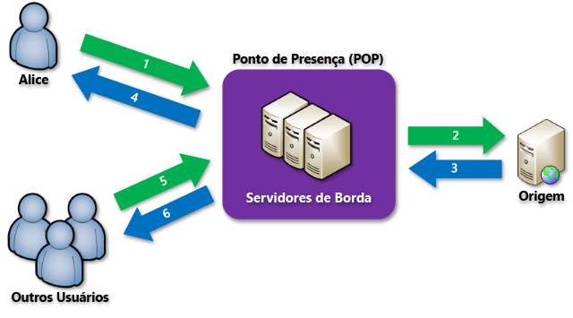

<properties
	pageTitle="Visão geral da CDN do Azure"
	description="Saiba o que é a CDN (Rede de Distribuição de Conteúdo) do Azure e como usá-la para fornecer conteúdo de alta largura de banda armazenando em cache blobs e conteúdo estático."
	services="cdn"
	documentationCenter=".NET"
	authors="camsoper"
	manager="erikre"
	editor=""/>

<tags
	ms.service="cdn"
	ms.workload="tbd"
	ms.tgt_pltfrm="na"
	ms.devlang="na"
	ms.topic="hero-article"
	ms.date="04/15/2016" 
	ms.author="casoper"/>

# Visão geral da CDN (Rede de Distribuição de Conteúdo) do Azure

A CDN (Rede de Distribuição de Conteúdo) do Azure armazena em cache conteúdo estático e blobs do Azure usados por sites em locais estrategicamente posicionados para fornecer taxa de transferência máxima para o fornecimento de conteúdo aos usuários. A CDN oferece aos desenvolvedores uma solução global de fornecimento de conteúdo de alta largura de banda armazenando em cache o conteúdo em nós físicos em todo o mundo. Para obter uma lista atual de locais de nó CDN, consulte [Locais POP da CDN do Azure](cdn-pop-locations.md).

Os benefícios do uso da CDN para armazenar em cache dados do Azure incluem:

- Melhor desempenho e experiência de usuário para usuários finais, especialmente ao se usar aplicativos em que várias viagens de ida e volta são necessárias para carregar o conteúdo.
- Grande dimensionamento para lidar melhor com alta carga instantânea, como no início de um evento de lançamento de produto.
- Distribuindo-se solicitações de usuário e fornecendo-se conteúdo de servidores de borda, menos tráfego é enviado à origem.

## Como ele funciona

1. Uma usuária (Brenda) solicita um arquivo (também chamado de ativo) usando uma URL com um nome de domínio especial, como `<endpointname>.azureedge.net`. O DNS roteia a solicitação para o local POP (Ponto de Presença) de melhor desempenho . Normalmente, esse é o POP geograficamente mais próximo ao usuário.

2. Se os servidores de borda no POP não tiverem o arquivo em seu cache, o servidor de borda solicitará o arquivo da origem. A origem pode ser um Aplicativo Web do Azure, o Serviço de Nuvem do Azure, a conta de Armazenamento do Azure ou qualquer servidor Web acessível publicamente.

3. A origem retorna o arquivo ao servidor de borda, incluindo os cabeçalhos HTTP opcionais que descrevem a TTL (Vida Útil) do arquivo.

4. O servidor de borda armazena o arquivo em cache e o retorna à solicitante original (Brenda). O arquivo permanecerá em cache no servidor de borda até que a TTL expire. Se a origem não especificar uma TTL, a TTL padrão será de sete dias.

5. Usuários adicionais (como Pedro) podem solicitar o mesmo arquivo usando essa mesma URL e também podem ser direcionados para esse mesmo POP.

6. Se a TTL do arquivo ainda não tiver expirado, o servidor de borda retornará os arquivos do cache. Isso resulta em uma experiência de usuário mais rápida e responsiva.

## Recursos Standard

A camada CDN Standard inclui os seguintes recursos:

- Fácil integração com serviços do Azure como [Armazenamento](cdn-create-a-storage-account-with-cdn.md), [Serviços de Nuvem](cdn-cloud-service-with-cdn.md), Aplicativos Web e [Serviços de Mídia](../media-services/media-services-manage-origins.md#enable_cdn)
- Suporte para HTTPS
- Balanceamento de carga
- Proteção DDOS
- [Cache de cadeia de caracteres de consulta](cdn-query-string.md)
- [Suporte a nome de domínio personalizado](cdn-map-content-to-custom-domain.md)
- [Filtragem de país](cdn-restrict-access-by-country.md)
- [Análise principal](cdn-analyze-usage-patterns.md)
- [Limpeza rápida](cdn-purge-endpoint.md)
- [Pré-carregamento de ativos](cdn-preload-endpoint.md)
- [Gerenciamento por meio da API REST](https://msdn.microsoft.com/library/mt634456.aspx)

## Recursos Premium

A camada CDN Premium inclui todos os recursos da camada Standard, além desses recursos adicionais:

- [Mecanismo de distribuição de conteúdo personalizável e baseado em regras](cdn-rules-engine.md)
- [Relatórios avançados de HTTP](cdn-advanced-http-reports.md)
- [Estatísticas em tempo real](cdn-real-time-stats.md)

## Próximas etapas

Para começar a usar a CDN, confira [Uso da CDN do Azure](./cdn-create-new-endpoint.md).

Se você for um cliente CDN, poderá gerenciar seus pontos de extremidade de CDN por meio do [Portal do Microsoft Azure](https://portal.azure.com).

<!---HONumber=AcomDC_0420_2016-->