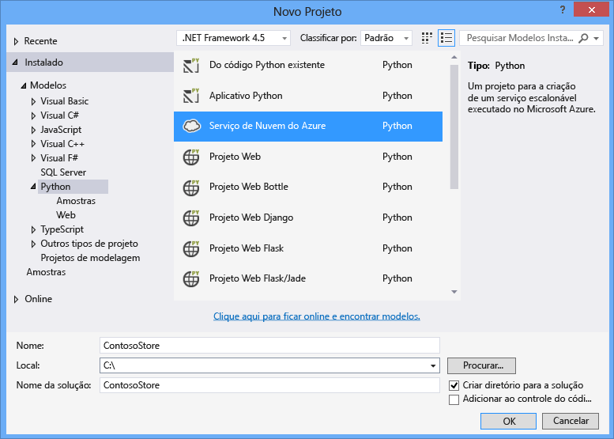
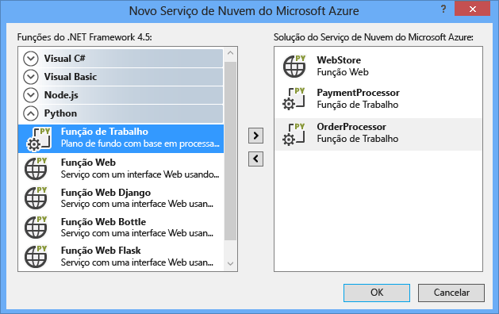
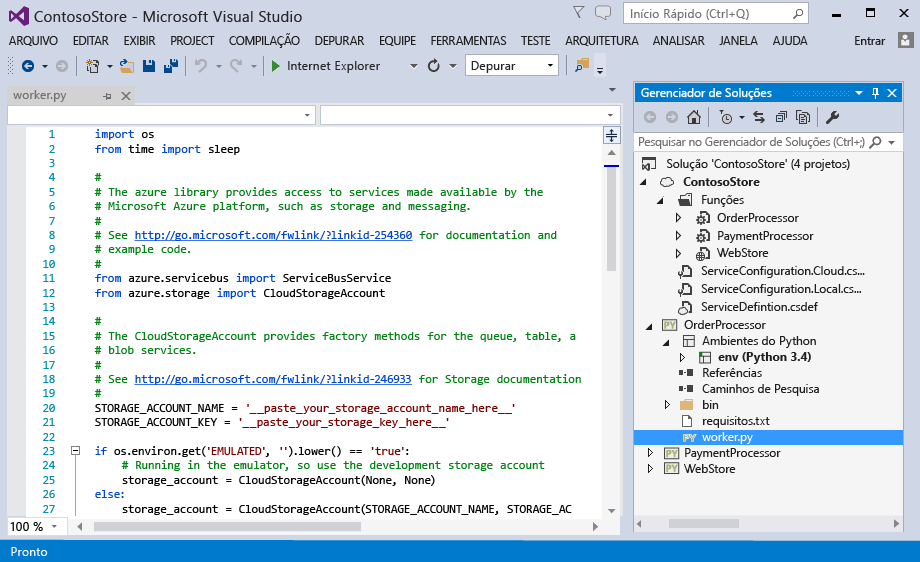
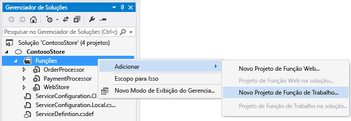
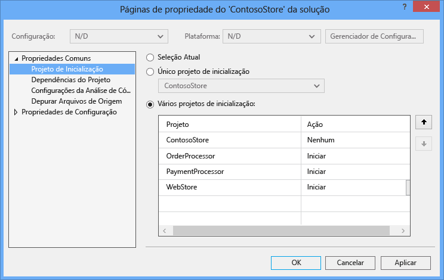
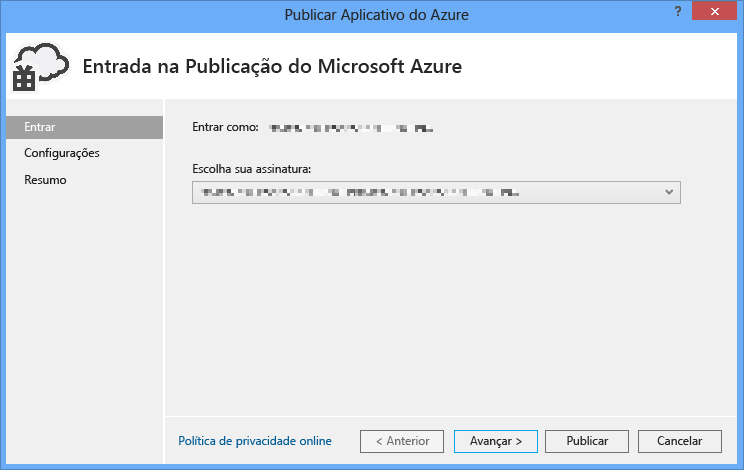
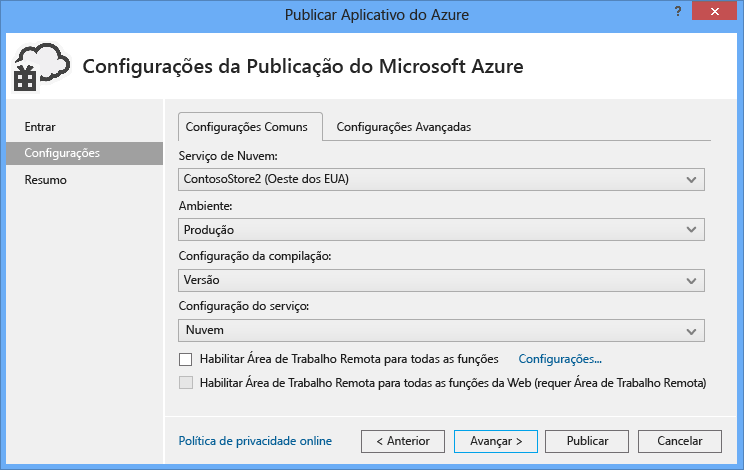
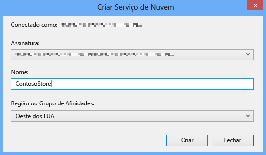
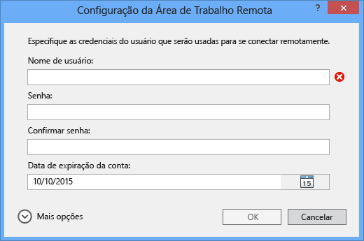
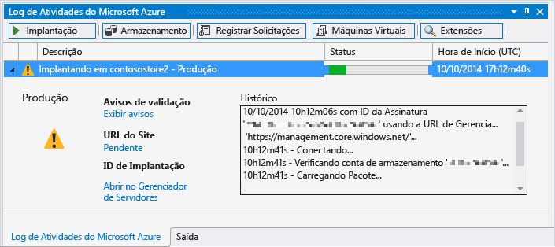

<properties
	pageTitle="Funções da Web e de Trabalho do Python com o Python Tools 2.1 para Visual Studio"
	description="Visão geral do uso do Python Tools para Visual Studio para criar serviços de nuvem do Azure, incluindo funções Web e de Trabalho."
	services=""
	documentationCenter="python"
	authors="huguesv"
	manager="wpickett"
	editor=""/>

<tags
	ms.service="cloud-services"
	ms.workload="tbd"
	ms.tgt_pltfrm="na"
	ms.devlang="python"
	ms.topic="get-started-article" 
	ms.date="02/09/2015"
	ms.author="huvalo"/>

# Funções da Web e de Trabalho do Python com o Python Tools 2.1 para Visual Studio

Este guia oferece uma visão geral do uso das funções Web e de Trabalho do Python por meio do [Python Tools para Visual Studio][].

## Pré-requisitos

 - Visual Studio 2012 ou 2013
 - [Python Tools 2.1 para Visual Studio][]
 - [Azure SDK Tools para VS 2013][] ou [Azure SDK Tools para VS 2012][]
 - [Python 2.7 de 32 bits][] ou [Python 3.4 de 32 bits][]

[AZURE.INCLUDE [create-account-and-websites-note](../includes/create-account-and-websites-note.md)]

## O que são funções Web e de Trabalho do Python?

O Azure fornece três modelos de computação para executar aplicativos: [sites do Azure][execution model-web sites], [máquinas virtuais do Azure][execution model-vms] e [Serviços de nuvem do Azure][execution model-cloud services]. Todos os três modelos oferecem suporte ao Python. Os Serviços de Nuvem, que incluem as funções Web e de trabalho, fornecem a *PaaS (plataforma como serviço)*. Dentro de um serviço de nuvem, uma função Web fornece um servidor web dos Serviços de Informações da Internet (IIS) dedicado para hospedar aplicativos web de front-end, enquanto uma função de trabalho pode executar tarefas assíncronas, de longa execução ou perpétuas independentes de interação com o usuário ou de entrada.

Para obter mais informações, consulte [O que é um Serviço de Nuvem?].

> [AZURE.NOTE]**Deseja criar um site simples?** Se o seu cenário envolve apenas um site de front-end simples, considere usar um Website do Azure leve. Você pode atualizar facilmente para um serviço de nuvem conforme o site cresce e suas necessidades mudam. Consulte o <a href="/develop/python/">Centro de Desenvolvedores do Python</a> para obter artigos que abordam o desenvolvimento de Websites do Azure. 

## Criação do projeto

No Visual Studio, você pode escolher o **Serviço de Nuvem do Azure** na caixa de diálogo **Novo Projeto**, em **Python**.

No assistente do Serviço de Nuvem do Azure, você pode selecionar para criar novas funções Web e de Trabalho.

O modelo de função de trabalho vem com o código de texto clichê para se conectar a uma conta de armazenamento ou barramento de serviço do Azure.

Você pode adicionar funções Web ou de Trabalho a um serviço de nuvem existente a qualquer momento. Você pode escolher adicionar projetos existentes em sua solução ou criar projetos novos.

Seu serviço de nuvem pode conter funções implementadas em diferentes idiomas. Por exemplo, uma função Web do Python pode ser implementada usando o Django, com funções de trabalho do Python e C#. Você pode se comunicar facilmente entre as funções usando filas do barramento de serviço ou filas de armazenamento.

## Executar localmente

Se você configurar seu projeto de serviço de nuvem como o projeto de inicialização e pressionar F5, o serviço de nuvem será executado no emulador do Azure local.

Embora o PTVS ofereça suporte à inicialização no emulador, a depuração (pontos de interrupção, etc.) não funcionará.

Para depurar suas funções Web e de Trabalho, você pode configurar o projeto de funções como o projeto de inicialização e depurá-lo. Você também pode definir vários projetos de inicialização. Clique com o botão direito do mouse na solução e selecione **Definir projetos de inicialização**.

## Publicar no Azure

Para publicar, clique com o botão direito do mouse no projeto de serviço de nuvem na solução e selecione **Publicar**.

Na página de configurações, selecione o serviço em nuvem no qual deseja publicar.

Você pode criar um novo serviço de nuvem se ainda não tiver um disponível.

Também é útil habilitar as conexões à área de trabalho remota para a(s) máquina(s) para falhas de depuração.

Quando tiver concluído os ajustes de configurações, clique em **Publicar**.

Algum progresso aparecerá na janela de saída e, então, você verá a janela Log de atividade do Microsoft Azure.

A implantação levará alguns minutos para ser concluída; em seguida, suas funções Web e/ou de Trabalho serão executadas no Azure!

## Próximas etapas

Para obter informações mais detalhadas sobre como usar funções Web e de Trabalho no Python Tools para Visual Studio, veja a documentação do PTVS:

- [Projetos do serviço de nuvem][]

Para obter mais detalhes sobre o uso dos serviços do Azure por meio das funções Web e de Trabalho, como o uso do armazenamento ou barramento de serviço do Azure, veja os guias a seguir:

- [Serviço Blob][]
- [Serviço Tabela][]
- [Serviço Fila][]
- [Filas do Barramento de Serviço][]
- [Tópicos do Barramento de Serviço][]

<!--Link references-->

[O que é um Serviço de Nuvem?]: /manage/services/cloud-services/what-is-a-cloud-service/
[execution model-web sites]: fundamentals-application-models.md#WebSites
[execution model-vms]: fundamentals-application-models.md#VMachine
[execution model-cloud services]: fundamentals-application-models.md#CloudServices
[Python Developer Center]: /develop/python/

[Serviço Blob]: storage-python-how-to-use-blob-storage.md
[Serviço Fila]: storage-python-how-to-use-queue-storage.md
[Serviço Tabela]: storage-python-how-to-use-table-storage.md
[Filas do Barramento de Serviço]: service-bus-python-how-to-use-queues.md
[Tópicos do Barramento de Serviço]: service-bus-python-how-to-use-topics-subscriptions.md

<!--External Link references-->

[Python Tools para Visual Studio]: http://aka.ms/ptvs
[Python Tools for Visual Studio Documentation]: http://pytools.codeplex.com/documentation
[Projetos do serviço de nuvem]: http://pytools.codeplex.com/wikipage?title=Features%20Cloud%20Project

[Python Tools 2.1 para Visual Studio]: http://go.microsoft.com/fwlink/?LinkId=517189
[Azure SDK Tools para VS 2013]: http://go.microsoft.com/fwlink/?LinkId=323510
[Azure SDK Tools para VS 2012]: http://go.microsoft.com/fwlink/?LinkId=323511
[Python 2.7 de 32 bits]: http://go.microsoft.com/fwlink/?LinkId=517190
[Python 3.4 de 32 bits]: http://go.microsoft.com/fwlink/?LinkId=517191

<!---HONumber=July15_HO4-->