# <a name="get-started-with-azure-cloud-services-and-aspnet"></a>Introdução aos Serviços de Nuvem do Azure e ao ASP.NET

## <a name="overview"></a>Visão geral
Este tutorial mostra como criar um aplicativo de várias camadas .NET com front-end ASP.NET MVC e implantá-lo no [serviço de nuvem do Azure](cloud-services-choose-me.md). O aplicativo usa o [Banco de Dados SQL do Azure](http://msdn.microsoft.com/library/azure/ee336279), o [serviço Blob do Azure](http://www.asp.net/aspnet/overview/developing-apps-with-windows-azure/building-real-world-cloud-apps-with-windows-azure/unstructured-blob-storage) e o [serviço Fila do Azure](http://www.asp.net/aspnet/overview/developing-apps-with-windows-azure/building-real-world-cloud-apps-with-windows-azure/queue-centric-work-pattern). Você pode [baixar o projeto do Visual Studio](http://code.msdn.microsoft.com/Simple-Azure-Cloud-Service-e01df2e4) na Galeria de Códigos do MSDN.

O tutorial mostra como criar e executar o aplicativo localmente, como implantá-lo no Azure e executá-lo na nuvem e como criá-lo do zero. Você pode começar criando do zero e depois fazer o teste e implantar as etapas posteriormente se preferir.

## <a name="contoso-ads-application"></a>O aplicativo Contoso Ads
O aplicativo é um painel de anúncios eletrônico. Os usuários criam um anúncio inserindo texto e carregando uma imagem. Eles podem ver uma lista de anúncios com imagens em miniatura e podem ver a imagem em tamanho total ao selecionar um anúncio para ver os detalhes.

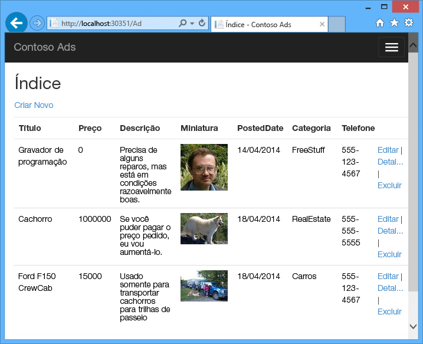

O aplicativo usa o [padrão centrado em fila](http://www.asp.net/aspnet/overview/developing-apps-with-windows-azure/building-real-world-cloud-apps-with-windows-azure/queue-centric-work-pattern) para descarregar o trabalho intensivo de CPU de criação de miniaturas para um processo de back-end.

## <a name="alternative-architecture-websites-and-webjobs"></a>Arquitetura alternativa: sites e trabalhos Web
Este tutorial mostra como executar front-end e back-end no serviço de nuvem do Azure. Uma alternativa é executar o front-end em um [site do Azure](/services/web-sites/) e usar o recurso [WebJobs](http://go.microsoft.com/fwlink/?LinkId=390226) (atualmente em versão prévia) para o back-end. Para obter um tutorial que usa WebJobs, consulte [Introdução ao SDK WebJobs do Azure](https://github.com/Azure/azure-webjobs-sdk/wiki). Para obter informações sobre como escolher os serviços que melhor se ajustam ao seu cenário, consulte [Comparação de Sites, Serviços de Nuvem e Máquinas Virtuais do Azure](../app-service/choose-web-site-cloud-service-vm.md).

## <a name="what-youll-learn"></a>O que você aprenderá
* Como habilitar seu computador para desenvolvimento do Azure ao instalar o SDK do Azure.
* Como criar um projeto de serviço de nuvem do Visual Studio com uma função de trabalho e uma função Web MVC do ASP.NET.
* Como testar o projeto de serviço de nuvem localmente, usando o emulador de armazenamento do Azure.
* Como publicar o projeto de nuvem em um serviço de nuvem do Azure e testar usando uma conta de armazenamento do Azure.
* Como carregar arquivos e armazená-los no serviço Blob do Azure.
* Como usar o serviço Fila do Azure para comunicação entre camadas.

## <a name="prerequisites"></a>pré-requisitos
O tutorial assume que você conhece os [conceitos básicos sobre os serviços de nuvem do Azure](cloud-services-choose-me.md) como terminologia de *função web* e de *função de trabalho*.  Também assumimos que você sabe como trabalhar com projetos [ASP.NET MVC](http://www.asp.net/mvc/tutorials/mvc-5/introduction/getting-started) ou de [Web Forms](http://www.asp.net/web-forms/tutorials/aspnet-45/getting-started-with-aspnet-45-web-forms/introduction-and-overview) no Visual Studio. O aplicativo função Web usa MVC, mas a maior parte do tutorial também aplica-se a Formulários da Web.

Você também pode executar o aplicativo localmente sem uma assinatura do Azure, mas precisará de uma para implantar o aplicativo na nuvem. Se não tem uma conta, você pode [ativar os benefícios de assinante MSDN](https://azure.microsoft.com/pricing/member-offers/msdn-benefits-details/?WT.mc_id=A55E3C668) ou [inscrever-se em uma avaliação gratuita](https://azure.microsoft.com/pricing/free-trial/?WT.mc_id=A55E3C668).

As instruções do tutorial funcionam com qualquer um dos seguintes produtos:

* Visual Studio 2013
* Visual Studio 2015
* Visual Studio 2017

Se você não tiver nenhum desses produtos, o Visual Studio poderá ser instalado automaticamente ao instalar o SDK do Azure.

## <a name="application-architecture"></a>Arquitetura do aplicativo
O aplicativo armazena anúncios em um banco de dados SQL usando Entity Framework Code First para criar as tabelas e acessar os dados. Para cada anúncio, o banco de dados armazena duas URLs: uma para a imagem em tamanho total e outra para a miniatura.

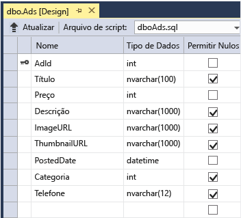

Quando um usuário carrega uma imagem, o front-end sendo executado em uma função Web armazena a imagem em um [Blob do Azure](http://www.asp.net/aspnet/overview/developing-apps-with-windows-azure/building-real-world-cloud-apps-with-windows-azure/unstructured-blob-storage)e armazena as informações do anúncio no banco de dados com uma URL que aponta para o blob. Ao mesmo tempo, ele grava uma mensagem em uma fila do Azure. Um processo de back-end sendo executado periodicamente em um função de trabalho consulta a fila para ver se há novas mensagens. Quando uma mensagem é exibida, a função de trabalho cria uma miniatura para essa imagem e atualiza o campo do banco de dados da URL de miniatura desse anúncio. O diagrama a seguir mostra como as partes do aplicativo interagem.

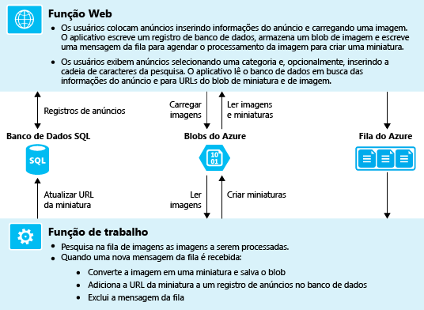

[!INCLUDE [install-sdk](../../includes/install-sdk-2017-2015-2013.md)]

## <a name="download-and-run-the-completed-solution"></a>Baixar e executar a solução completa
1. Baixar e descompactar a [solução concluída](http://code.msdn.microsoft.com/Simple-Azure-Cloud-Service-e01df2e4).
2. Inicie o Visual Studio.
3. No menu **Arquivo**, escolha **Abrir Projeto**, navegue até onde você baixou a solução e, em seguida, abra o arquivo de solução.
4. Pressione CTRL+SHIFT+B para criar a solução.

    Por padrão, o Visual Studio restaura automaticamente o conteúdo do pacote NuGet, que não foi incluído no arquivo *.zip* . Se os pacotes não forem restaurados, instale-os manualmente acessando a caixa de diálogo **Gerenciar Pacotes NuGet para Solução** e clicando no botão **Restaurar** na parte superior direita.
5. No **Gerenciador de Soluções**, certifique-se de que **ContosoAdsCloudService** foi selecionado como o projeto de inicialização.
6. Se você estiver usando o Visual Studio 2015 ou superior, altere a cadeia de conexão do SQL Server no arquivo *Web.config* do aplicativo do projeto ContosoAdsWeb e no arquivo *ServiceConfiguration.Local.cscfg* do projeto ContosoAdsCloudService. Em cada caso, altere "(localdb)\v11.0" para "(localdb)\MSSQLLocalDB".
7. Pressione CTRL+F5 para executar o aplicativo.

    Quando você executar um projeto de serviço de nuvem localmente, o Visual Studio invocará automaticamente o *emulador de computação* e o *emulador de armazenamento* do Azure. O emulador de computação usa os recursos do seu computador para simular os ambientes de função Web e de função de trabalho. O emulador de armazenamento usa um banco de dados [LocalDB do SQL Server Express](http://msdn.microsoft.com/library/hh510202.aspx) para simular o armazenamento em nuvem do Azure.

    Na primeira vez em que você executar um projeto de serviço de nuvem, levará por volta de um minuto para que os emuladores sejam inicializados. Quando a inicialização do emulador for finalizada, o navegador padrão abrirá na home page do aplicativo.

    
8. Clique em **Criar um Anúncio**.
9. Insira alguns dados de teste e selecione uma imagem em *.jpg* para carregar e depois clique em **Criar**.

    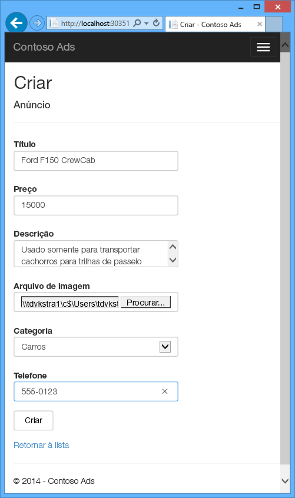

    O aplicativo vai para a Página de índice, mas não mostra uma miniatura do anúncio novo porque o processamento ainda não aconteceu.
10. Aguarde um momento e depois atualize a Página de índice para ver a miniatura.

     
11. Clique em **Detalhes** do anúncio para ver a imagem em tamanho total.

     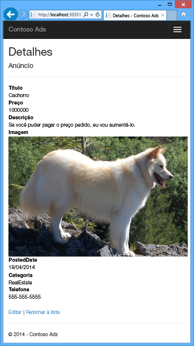

Você está executando o aplicativo totalmente em seu computador local sem conexão com a nuvem. O emulador de armazenamento guarda os dados de fila e do Blob em um banco de dados LocalDB do SQL Server Express e o aplicativo armazena os dados do anúncio em outro banco de dados LocalDB. O Entity Framework Code First criou automaticamente o banco de dados de anúncio na primeira vez que o aplicativo Web tentou acessá-lo.

Na seção a seguir você configurará a solução para usar os recursos de nuvem do Azure em filas, blobs, e o banco de dados do aplicativo quando ele for executado na nuvem. Se você preferisse continuar a executar localmente, porém usando os recursos de armazenamento e banco de dados de nuvem, isso seria possível. É apenas questão de definir as cadeias de conexão, que você verá como fazer.

## <a name="deploy-the-application-to-azure"></a>Implantar o aplicativo no Azure
Você seguirá as etapas abaixo para executar o aplicativo na nuvem:

* Criar um serviço de nuvem do Azure.
* Criar um banco de dados SQL do Azure.
* Crie uma conta de armazenamento do Azure.
* Configurar a solução para usar seu banco de dados SQL do Azure quando ele for executado no Azure.
* Configurar a solução para usar sua conta de armazenamento do Azure quando ela for executada no Azure.
* Implantar o projeto em seu serviço de nuvem do Azure.

### <a name="create-an-azure-cloud-service"></a>Criar um serviço de nuvem do Azure
Um serviço de nuvem do Azure é o ambiente em que o aplicativo será executado.

1. No seu navegador, abra o [portal do Azure](https://portal.azure.com).
2. Clique em **Criar um recurso > Computação > Serviço de Nuvem**.

3. Na caixa de entrada do nome DNS, digite um prefixo de URL para o serviço de nuvem.

    Essa URL precisa ser exclusiva.  Você receberá uma mensagem de erro se o prefixo escolhido já estiver sendo usado.
4. Especifique um novo grupo de recursos para o serviço. Clique em **Criar novo** e digite um nome na caixa de entrada do Grupo de recursos, como CS_contososadsRG.

5. Selecione a região onde deseja implantar o aplicativo.

    Este campo especifica em qual datacenter seu serviço de nuvem será hospedado. Para um aplicativo de produção, você escolheria a região mais próxima aos seus clientes. Para este tutorial, escolha a região mais próxima de você.
5. Clique em **Criar**.

    Na imagem a seguir, um serviço de nuvem é criado com a URL CSvccontosoads.cloudapp.net.

    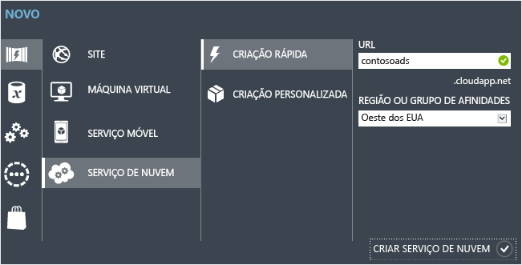

### <a name="create-an-azure-sql-database"></a>Criar um banco de dados SQL do Azure
Quando o aplicativo é executado na nuvem, ele usa um banco de dados com base na nuvem.

1. No [portal do Azure](https://portal.azure.com), clique em **Criar um recurso > Bancos de Dados > Banco de Dados SQL**.
2. Na caixa **Nome do Banco de Dados** , insira *contosoads*.
3. No **Grupo de recursos**, clique em **Usar existente** e selecione o grupo de recursos usado no serviço de nuvem.
4. Na imagem a seguir, clique em **Servidor - Configurar as configurações necessárias** e **Criar um novo servidor**.

    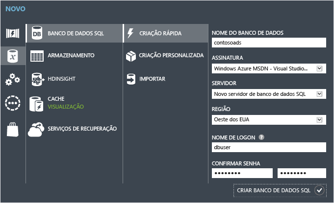

    Se a assinatura já tiver um servidor, você poderá selecioná-lo da lista suspensa.
5. Em **Nome do servidor** , digite *csvccontosodbserver*.

6. Insira um **Nome de Logon** e **Senha** de administrador.

    Se você selecionou **Criar um novo servidor**, não digitará um nome e senha existentes aqui. Você digitará um novo nome e senha que você está definindo agora para usar mais tarde ao acessar o banco de dados. Se você selecionou um servidor criado anteriormente, você será solicitado a fornecer a senha da conta do usuário administrador já criada.
7. Selecione o mesmo **Local** que você escolheu para o serviço de nuvem.

    Quando o banco de dados e o serviço de nuvem estão em datacenters diferentes (regiões diferentes), a latência aumentará e você será cobrado pela largura de banda fora do datacenter. A largura de banda em um data center é gratuita.
8. Marque a opção **Permitir que os serviços do Azure acessem o servidor**.
9. Clique em **Selecionar** no novo servidor.

    
10. Clique em **Criar**.

### <a name="create-an-azure-storage-account"></a>Criar uma conta de armazenamento do Azure
Uma conta de armazenamento do Azure fornece os recursos para dados de blob e fila de armazenamento na nuvem.

Em um aplicativo do mundo real, geralmente você cria contas separadas para dados de aplicativos e dados de log, e contas separadas para dados de teste e dados de produção. Neste tutorial você usará apenas uma conta.

1. No [portal do Azure](https://portal.azure.com), clique em **Criar um recurso > Armazenamento > Conta de armazenamento - blob, arquivo, tabela, fila**.
2. Na caixa da **Nome** , insira um prefixo de URL.

    Esse prefixo, além do texto que você vê sob a caixa será a URL exclusiva de sua conta de armazenamento. Se o prefixo inserido já estiver sendo usado por outra pessoa, você terá que escolher um diferente.
3. Defina o **Modelo de implantação** como *Clássico*.

4. Defina a lista suspensa **Replicação** para **Armazenamento com redundância local**.

    Quando a replicação geográfica está habilitada para uma conta de armazenamento, o conteúdo armazenado é replicado para um datacenter secundário para habilitar o failover caso ocorra um grande desastre no local principal. A replicação geográfica pode incorrer em custos adicionais. Para contas de teste e desenvolvimento, geralmente, você não deseja pagar pela replicação geográfica. Para saber mais, confira [Criar, gerenciar ou excluir uma conta de armazenamento](../storage/common/storage-create-storage-account.md).

5. No **Grupo de recursos**, clique em **Usar existente** e selecione o grupo de recursos usado no serviço de nuvem.
6. Defina a lista suspensa **Local** como a mesma região escolhida para o serviço de nuvem.

    Quando a conta de armazenamento do serviço de nuvem estiver em outros datacenters (outras regiões), a latência será maior e você será cobrado pela largura de banda fora do data center. A largura de banda em um data center é gratuita.

    O grupos de afinidade do Azure fornecem um mecanismo para minimizar a distância entre os recursos em um data center, o que pode reduzir a latência. Este tutorial não usa grupos de afinidade. Para obter mais informações, consulte [Como criar um grupo de afinidade no Azure](http://msdn.microsoft.com/library/jj156209.aspx).
7. Clique em **Criar**.

    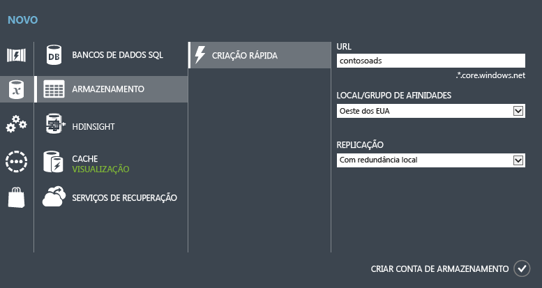

    Na imagem, uma conta de armazenamento é criada com a URL `csvccontosoads.core.windows.net`.

### <a name="configure-the-solution-to-use-your-azure-sql-database-when-it-runs-in-azure"></a>Configurar a solução para usar seu banco de dados SQL do Azure quando ele for executado no Azure
O projeto Web e o projeto de função de trabalho possuem suas próprias cadeias de conexão de banco de dados, e cada uma precisa apontar para o banco de dados SQL do Azure quando o aplicativo é executado no Azure.

Você usará uma [transformação de Web.config](http://www.asp.net/mvc/tutorials/deployment/visual-studio-web-deployment/web-config-transformations) para a função de trabalho e uma configuração de ambiente de serviço de nuvem para a função de trabalho.

> [!NOTE]
> Nesta seção e na próxima, você armazenará credenciais nos arquivos de projeto. [Não armazene dados confidenciais em repositórios de código-fonte público](http://www.asp.net/aspnet/overview/developing-apps-with-windows-azure/building-real-world-cloud-apps-with-windows-azure/source-control#secrets).
>
>

1. No projeto ContosoAdsWeb, abra o arquivo de transformação *Web.Release.config* para o arquivo *Web.config* do aplicativo, exclua o bloco de comentário que contém um elemento `<connectionStrings>` e cole o código a seguir no lugar.

    ```xml
    <connectionStrings>
        <add name="ContosoAdsContext" connectionString="{connectionstring}"
        providerName="System.Data.SqlClient" xdt:Transform="SetAttributes" xdt:Locator="Match(name)"/>
    </connectionStrings>
    ```

    Deixe o arquivo aberto para edição.
2. No [portal do Azure](https://portal.azure.com), clique em **Bancos de Dados SQL** no painel esquerdo, clique no banco de dados criado para este tutorial e clique em **Mostrar cadeias de conexão**.

    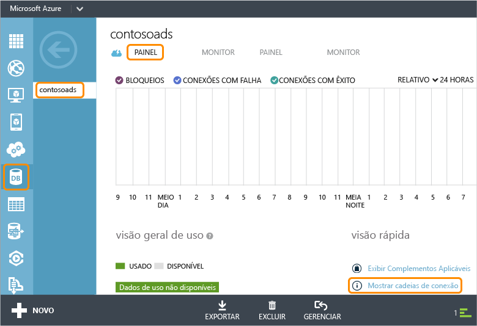

    O portal exibe as cadeias de conexão com um espaço reservado para a senha.

    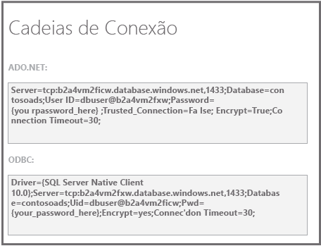
3. No arquivo de transformação *Web.Release.config*, exclua `{connectionstring}` e cole, em seu lugar, a cadeia de conexão ADO.NET do portal do Azure.
4. Na cadeia de conexão que você colou no arquivo de transformação *Web.Release.config*, substitua `{your_password_here}` pela senha que você criou para o novo Banco de Dados SQL.
5. Salve o arquivo.  
6. Selecione e copie a cadeia de conexão (sem as aspas) para usar nas etapas a seguir para configurar o projeto de função de trabalho.
7. Em **Gerenciador de Soluções**, em **Funções** no projeto de serviço de nuvem, clique com o botão direito do mouse em **ContosoAdsWorker**; depois, clique em **Propriedades**.

    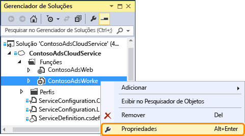
8. Clique na guia **Configurações** .
9. Altere **Configuração de Serviço** para **Nuvem**.
10. Selecione o campo **Valor** para a configuração `ContosoAdsDbConnectionString` e cole a cadeia de conexão que você copiou da seção anterior do tutorial.

     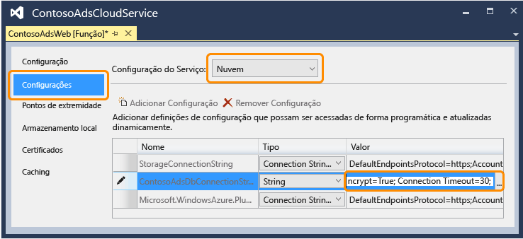
11. Salve suas alterações.  

### <a name="configure-the-solution-to-use-your-azure-storage-account-when-it-runs-in-azure"></a>Configurar a solução para usar sua conta de armazenamento do Azure quando ela for executada no Azure
As cadeias de conexão da conta de armazenamento do Azure do projeto de função de trabalho e do projeto de função Web são armazenadas nas configurações de ambiente do projeto de serviço de nuvem. Para cada projeto existe um conjunto separado de configurações a ser usado quando o aplicativo é executado localmente e quando é executado na nuvem. Você atualizará as configurações de ambiente de nuvem para os projetos de função de trabalho e da Web.

1. No **Gerenciador de Soluções**, clique com o botão direito do mouse em **ContosoAdsWeb** em **Funções** no projeto **ContosoAdsCloudService**; depois, clique em **Propriedades**.

    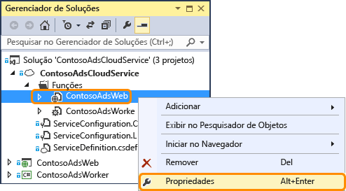
2. Clique na guia **Configurações** . Na caixa suspensa **Configuração de Serviço** selecione **Nuvem**.

    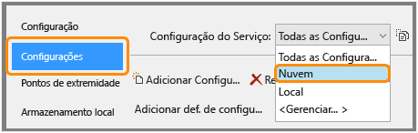
3. Selecione a entrada **StorageConnectionString** e você verá um botão de reticências (**...**) na extremidade direita da linha. Clique no botão para abrir a caixa de diálogo **Criar cadeia de conexão da conta de armazenamento** .

    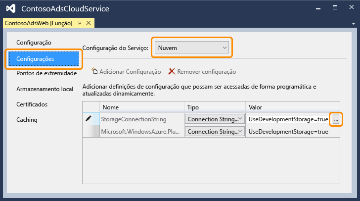
4. Na caixa de diálogo **Criar Cadeia de Conexão de Armazenamento**, clique em **Sua assinatura**, escolha a conta de armazenamento que você criou anteriormente e, em seguida, clique em **OK**. Se você não tiver feito logon, suas credenciais da conta do Azure serão solicitadas.

    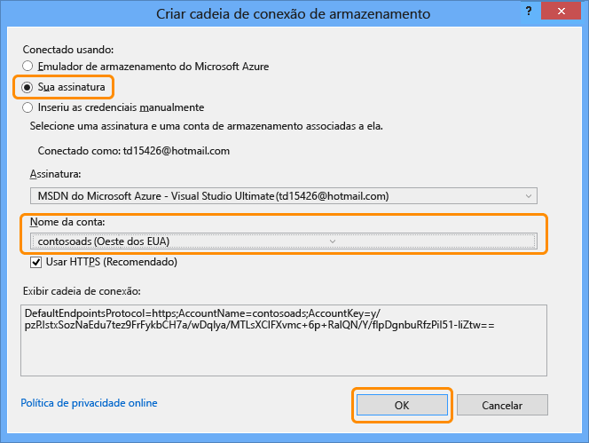
5. Salve suas alterações.
6. Siga o mesmo procedimento que usou para a cadeia de conexão `StorageConnectionString` para definir a cadeia de conexão `Microsoft.WindowsAzure.Plugins.Diagnostics.ConnectionString`.

    Essa cadeia de conexão é usada para o log.
7. Siga o mesmo procedimento que usou para a função **ContosoAdsWeb** definir as duas cadeias de conexão da função **ContosoAdsWorker**. Não se esqueça de definir **Configuração de Serviço** como **Nuvem**.

As configurações do ambiente de função que você configurou usando a interface de usuário do Visual Studio estão armazenadas no seguintes arquivos do projeto ContosoAdsCloudService:

* *ServiceDefinition.csdef* - Define os nomes de configuração.
* *ServiceConfiguration.Cloud.cscfg* - Fornece os valores para quando o aplicativo for executado na nuvem.
* *ServiceConfiguration.Local.cscfg* - Fornece os valores para quando o aplicativo for executado localmente.

Por exemplo, ServiceDefinition.csdef inclui as seguintes definições:

```xml
<ConfigurationSettings>
    <Setting name="StorageConnectionString" />
    <Setting name="ContosoAdsDbConnectionString" />
</ConfigurationSettings>
```

E o arquivo *ServiceConfiguration.Cloud.cscfg* inclui os valores inseridos para essas configurações no Visual Studio.

```xml
<Role name="ContosoAdsWorker">
    <Instances count="1" />
    <ConfigurationSettings>
        <Setting name="StorageConnectionString" value="{yourconnectionstring}" />
        <Setting name="ContosoAdsDbConnectionString" value="{yourconnectionstring}" />
        <!-- other settings not shown -->

    </ConfigurationSettings>
    <!-- other settings not shown -->

</Role>
```

A configuração `<Instances>` especifica o número de máquinas virtuais onde o Azure executará o código da função de trabalho. A seção [Próximas etapas](#next-steps) inclui links para mais informações sobre a expansão de um serviço de nuvem.

### <a name="deploy-the-project-to-azure"></a>Implantar o projeto no Azure
1. No **Gerenciador de Soluções**, clique com o botão direito do mouse no projeto de nuvem **ContosoAdsCloudService** e então selecione **Publicar**.

   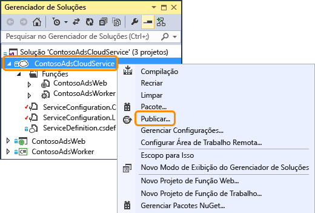
2. Na etapa **Entrar** do assistente **Publicar aplicativo do Azure**, clique em **Avançar**.

    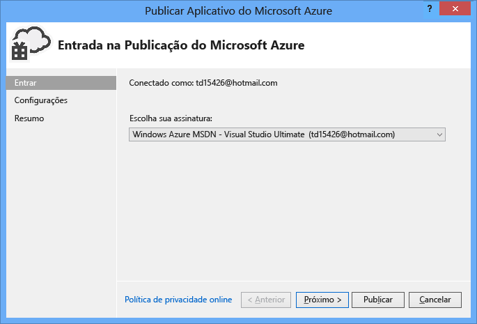
3. Na etapa **Configurações** do assistente, clique em **Avançar**.

    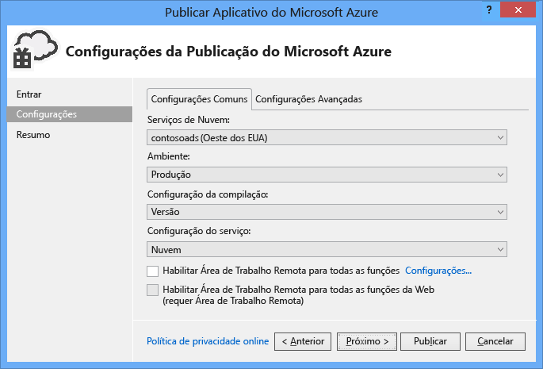

    As configurações padrão na guia **Avançado** são adequadas para este tutorial. Para obter mais informações sobre a guia avançada, consulte [Assistente de publicação de aplicativo do Azure](http://msdn.microsoft.com/library/hh535756.aspx).
4. Na etapa **Resumo**, clique em **Publicar**.

    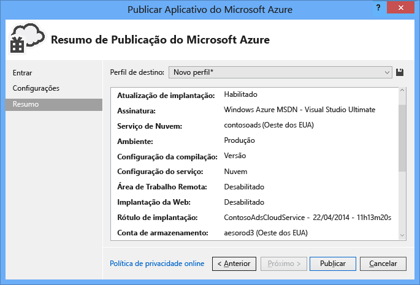

   A janela **Log de atividade do Azure** será exibida no Visual Studio.
5. Clique no ícone de seta para a direita para expandir os detalhes da implantação.

    A implantação pode levar cerca de 5 minutos ou mais para ser concluída.

    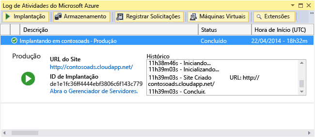
6. Quando o status da implantação for concluído, clique na **URL do aplicativo Web** para iniciar o aplicativo.
7. Você pode testar o aplicativo criando, visualizando e editando alguns anúncios, como fez ao executar o aplicativo localmente.

> [!NOTE]
> Ao finalizar o teste, exclua ou interrompa o serviço de nuvem. Mesmo que não estiver usando o serviço de nuvem, seus acúmulos serão cobrados porque os recursos do computador virtual serão reservados para o serviço. E se você deixá-lo em execução, qualquer um que encontrar sua URL poderá criar e exibir anúncios. No [portal do Azure](https://portal.azure.com) acesse a guia **Visão Geral** do seu serviço de nuvem e clique no botão **Excluir** na parte superior da página. Se apenas deseja evitar que outros acessem temporariamente o site, em vez disso clique em **Parar** . Nesse caso, as tarifas continuarão a acumular. Você pode seguir um procedimento semelhante para excluir o banco de dados SQL e a conta de armazenamento quando não precisar mais dela.
>
>

## <a name="create-the-application-from-scratch"></a>Criar o aplicativo do zero
Se ainda não fez o download do [aplicativo completo](http://code.msdn.microsoft.com/Simple-Azure-Cloud-Service-e01df2e4), faça-o agora. Você copiará os arquivos do projeto baixado para o novo projeto.

A criação do Contoso Ads envolve as seguintes etapas:

* Criar um serviço de nuvem na solução Visual Studio.
* Atualizar e adicionar pacotes NuGet.
* Definir referências de projeto.
* Configurar cadeias de conexão.
* Adicionar arquivos de código.

Após a solução ser criada, você revisará o código exclusivo dos projetos de serviço de nuvem e dos blobs e filas do Azure.

### <a name="create-a-cloud-service-visual-studio-solution"></a>Criar um serviço de nuvem na solução Visual Studio
1. No Visual Studio, selecione **Novo Projeto** from the **Arquivo** .
2. No painel esquerdo da caixa de diálogo **Novo Projeto**, expanda **Visual C#** e selecione os modelos de **Nuvem**; em seguida, selecione o modelo de **Serviço de Nuvem do Azure**.
3. Nomeie o projeto e a solução ContosoAdsCloudService e depois clique em **OK**.

    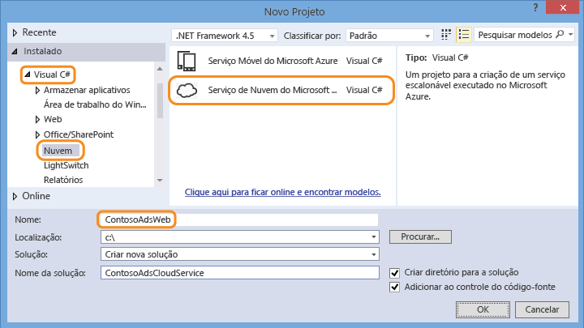
4. Na caixa de diálogo **Novo Projeto de Serviço de Nuvem** , adicione uma função de trabalho e uma função web. Nomeie a função Web ContosoAdsWeb e a função de trabalho ContosoAdsWorker. (Use o ícone da caneta no painel direito para alterar os nomes padrão das funções.)

    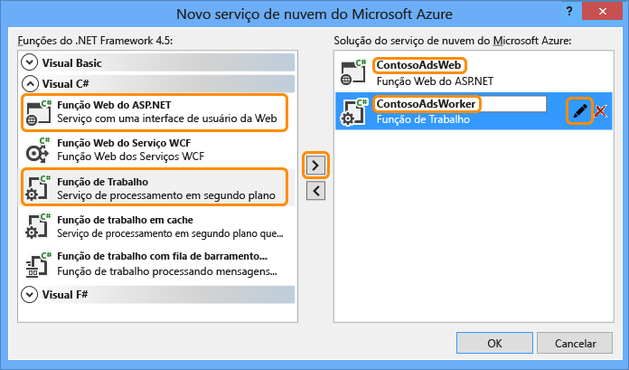
5. Quando a caixa de diálogo **Novo Projeto ASP.NET** da função web for exibida, selecione o modelo MVC e então clique em **Alterar Autenticação**.

    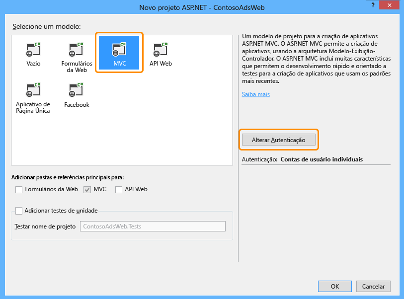
6. Na caixa de diálogo **Alterar Autenticação**, escolha **Sem Autenticação** e clique em **OK**.

    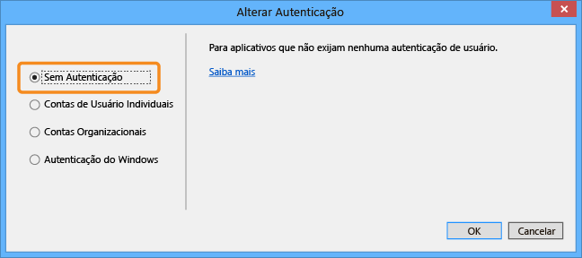
7. Na caixa de diálogo **Novo projeto ASP.NET**, clique em **OK**.
8. No **Gerenciador de Soluções**, clique com o botão direito do mouse na solução (não aquela de projetos) e selecione **Adicionar – Novo Projeto**.
9. Na caixa de diálogo **Adicionar Novo Projeto**, escolha **Windows** em **Visual C#** no painel esquerdo e clique no modelo **Biblioteca de Classes**.  
10. Nomeie o projeto *ContosoAdsCommon*, e depois clique em **OK**.

    Você precisa usar como referência o contexto e o modelo de dados do Entity Framework para os projetos de função de trabalho e da Web. Como alternativa, você pode definir as classes relacionadas ao EF no projeto de função Web e usar esse projeto como referência para o projeto de função de trabalho. Na abordagem alternativa, no entanto, o seu projeto de função de trabalho teria uma referência para assemblies da Web dos quais não precisa.

### <a name="update-and-add-nuget-packages"></a>Atualizar e adicionar pacotes NuGet
1. Abra a caixa de diálogo **Gerenciar Pacotes NuGet** para a solução.
2. Na parte superior da janela, selecione **Atualizações**.
3. Procure o pacote *WindowsAzure.Storage* e, se ele estiver na lista, selecione-o e selecione os projetos da Web e de trabalho em que ele será atualizado e clique em **Atualizar**.

    A biblioteca de armazenamento do cliente é atualizada com mais frequência que os modelos de projetos do Visual Studio, por isso, você descobrirá com frequência que a versão em um projeto que acabou de ser criado precisa ser atualizada.
4. Na parte superior da janela, selecione **Procurar**.
5. Encontre o pacote NuGet do *EntityFramework* e instale-o em todos os três projetos.
6. Encontre o pacote NuGet *Microsoft.WindowsAzure.ConfigurationManager* e instale-o no projeto de função de trabalho.

### <a name="set-project-references"></a>Definir referências de projeto
1. No projeto ContosoAdsWeb, defina uma referência para o projeto ContosoAdsCommon. Clique com o botão direito do mouse no projeto ContosoAdsWeb e depois clique em **Referências** - **Adicionar Referências**. Na caixa de diálogo **Gerenciador de Referências**, selecione **Solução – Projetos** no painel esquerdo, selecione **ContosoAdsCommon** e depois clique em **OK**.
2. No projeto ContosoAdsWorker, defina uma referência para o projeto ContosAdsCommon.

    ContosoAdsCommon conterá o modelo de dados e a classe de contexto de Entity Framework, que serão usados por front-end e back-end.
3. No projeto ContosoAdsWorker, defina uma referência para `System.Drawing`.

    Este assembly é usado pelo back-end para converter imagens em miniaturas.

### <a name="configure-connection-strings"></a>Configurar cadeias de conexão
Nesta seção iremos configurar o Armazenamento do Azure e as cadeias de conexão do SQL para o teste local. As instruções de implantação fornecidas anteriormente no tutorial explicam como definir as cadeias de conexão para quando o aplicativo for executado na nuvem.

1. No projeto ContosoAdsWeb, abra o arquivo Web.config do aplicativo e insira o elemento `connectionStrings` a seguir após o elemento `configSections`.

    ```xml
    <connectionStrings>
        <add name="ContosoAdsContext" connectionString="Data Source=(localdb)\v11.0; Initial Catalog=ContosoAds; Integrated Security=True; MultipleActiveResultSets=True;" providerName="System.Data.SqlClient" />
    </connectionStrings>
    ```

    Se você estiver usando o Visual Studio 2015 ou superior, substitua "v11.0" por "MSSQLLocalDB".
2. Salve suas alterações.
3. No projeto ContosoAdsCloudService, clique com o botão direito do mouse em ContosoAdsWeb abaixo de **Funções** e depois clique em **Propriedades**.

    
4. Na janela de propriedades de **ContosAdsWeb [Role]**, clique na guia **Configurações** e depois clique em **Adicionar configuração**.

    Deixe **Configuração de Serviço** definida como **Todas as configurações**.
5. Adicione uma configuração chamada *StorageConnectionString*. Defina **Tipo** como *ConnectionString* e defina **Valor** como *UseDevelopmentStorage=true*.

    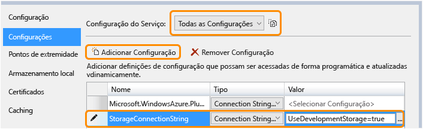
6. Salve suas alterações.
7. Siga o mesmo procedimento para adicionar uma cadeia de conexão nas propriedades da função ContosoAdsWorker.
8. Ainda na janela de propriedades de **ContosoAdsWorker [Role]** , adicione outra cadeia de conexão:

   * Nome: ContosoAdsDbConnectionString
   * Tipo: String
   * Valor: cole a mesma cadeia de conexão usada para o projeto de função Web. (O exemplo a seguir é para o Visual Studio 2013. Não se esqueça de alterar a fonte de dados se for copiar este exemplo e se estiver usando o Visual Studio 2015 ou superior.)

       ```
       Data Source=(localdb)\v11.0; Initial Catalog=ContosoAds; Integrated Security=True; MultipleActiveResultSets=True;
       ```

### <a name="add-code-files"></a>Adicionar arquivos de código
Nesta seção, você copiará códigos da solução baixada para a nova solução. As seções a seguir mostrarão e explicarão as partes principais desse código.

Para adicionar arquivos a um projeto ou pasta, clique com o botão direito do mouse em **Adicionar** - **Item Existente**. Selecione os arquivos que deseja e então clique em **Adicionar**. Se receber uma solicitação para confirmar se deseja substituir os arquivos existentes, clique em **Sim**.

1. No projeto ContosoAdsCommon, exclua o arquivo *Class1.cs* e substitua-o pelos arquivos *Ad.cs* e *ContosoAdscontext.cs* do projeto baixado.
2. No projeto ContosoAdsWeb, adicione os seguintes arquivos do projeto baixado.

   * *Global.asax.cs*  
   * Na pasta *Views\Shared*: *\_Layout.cshtml*.
   * Na pasta *Views\Home*: *Index.cshtml*.
   * Na pasta *Controllers*: *AdController.cs*.
   * Na pasta *Views\Ad* (crie a pasta primeiro): cinco arquivos *.cshtml*.
3. No projeto ContosoAdsWorker, adicione *WorkerRole.cs* do projeto baixado.

Você pode criar e executar os aplicativos conforme explicado anteriormente no tutorial e o aplicativo usará os recursos locais de banco de dados e emulador de armazenamento.

As seções a seguir explicam o código relacionado ao trabalho com os blobs e filas do ambiente do Azure. Este tutorial não explica como criar controladores e exibições MVC usando scaffolding, como escrever código do Entity Framework que funciona com bancos de dados do SQL Server ou as noções básicas da programação assíncrona no ASP.NET 4.5. Para obter informações sobre esses tópicos, consulte os seguintes recursos:

* [Introdução ao MVC 5](http://www.asp.net/mvc/tutorials/mvc-5/introduction/getting-started)
* [Introdução ao EF 6 e ao MVC 5](http://www.asp.net/mvc/tutorials/getting-started-with-ef-using-mvc)
* [Introdução à programação assíncrona no .NET 4.5](http://www.asp.net/aspnet/overview/developing-apps-with-windows-azure/building-real-world-cloud-apps-with-windows-azure/web-development-best-practices#async).

### <a name="contosoadscommon---adcs"></a>ContosoAdsCommon - Ad.cs
O arquivo Ad.cs file define uma enumeração para categorias de anúncios e uma classe de entidade POCO para as informações de anúncios.

```csharp
public enum Category
{
    Cars,
    [Display(Name="Real Estate")]
    RealEstate,
    [Display(Name = "Free Stuff")]
    FreeStuff
}

public class Ad
{
    public int AdId { get; set; }

    [StringLength(100)]
    public string Title { get; set; }

    public int Price { get; set; }

    [StringLength(1000)]
    [DataType(DataType.MultilineText)]
    public string Description { get; set; }

    [StringLength(1000)]
    [DisplayName("Full-size Image")]
    public string ImageURL { get; set; }

    [StringLength(1000)]
    [DisplayName("Thumbnail")]
    public string ThumbnailURL { get; set; }

    [DataType(DataType.Date)]
    [DisplayFormat(DataFormatString = "{0:yyyy-MM-dd}", ApplyFormatInEditMode = true)]
    public DateTime PostedDate { get; set; }

    public Category? Category { get; set; }
    [StringLength(12)]
    public string Phone { get; set; }
}
```

### <a name="contosoadscommon---contosoadscontextcs"></a>ContosoAdsCommon - ContosoAdsContext.cs
A classe ContosoAdsContext especifica que a classe de anúncio é usada em uma coleção de DbSet e qual Entity Framework será armazenada em um banco de dados SQL.

```csharp
public class ContosoAdsContext : DbContext
{
    public ContosoAdsContext() : base("name=ContosoAdsContext")
    {
    }
    public ContosoAdsContext(string connString)
        : base(connString)
    {
    }
    public System.Data.Entity.DbSet<Ad> Ads { get; set; }
}
```

A classe possui dois construtores. O primeiro deles é usado pelo projeto Web e especifica o nome de uma cadeia de conexão armazenada no arquivo Web.config. O segundo construtor permite transmitir a cadeia de conexão real usada para o projeto de função de trabalho, pois ele não tem um arquivo Web.config. Foi mostrado anteriormente onde essa cadeia de conexão foi armazenada, e você verá mais adiante como o código recupera a cadeia de conexão quando ele cria uma instância de classe DbContext.

### <a name="contosoadsweb---globalasaxcs"></a>ContosoAdsWeb - Global.asax.cs
O código que é chamado do método `Application_Start` criará um contêiner de blob *images* e uma fila *images*, se ainda não existirem. Isso garante que sempre que você começar a usar uma nova conta de armazenamento, ou começar a usar o emulador de armazenamento em um novo computador, o contêiner do blob e a fila necessários serão criados automaticamente.

O código obtém acesso à conta de armazenamento usando a cadeia de conexão de armazenamento do arquivo *.cscfg* .

```csharp
var storageAccount = CloudStorageAccount.Parse
    (RoleEnvironment.GetConfigurationSettingValue("StorageConnectionString"));
```

Em seguida, ele obtém uma referência para o contêiner do blob de *imagens* , cria o contêiner se ele ainda não existe e define permissões de acesso no novo contêiner. Por padrão, os novos contêineres permitem que somente clientes com credenciais da conta de armazenamento acessem os blobs. O site precisa que os blobs para o público para poder exibir imagens usando URLs que apontam para os blobs de imagem.

```csharp
var blobClient = storageAccount.CreateCloudBlobClient();
var imagesBlobContainer = blobClient.GetContainerReference("images");
if (imagesBlobContainer.CreateIfNotExists())
{
    imagesBlobContainer.SetPermissions(
        new BlobContainerPermissions
        {
            PublicAccess =BlobContainerPublicAccessType.Blob
        });
}
```

Um código similar obtém uma referência para a fila de *imagens* e cria uma nova fila. Nesse caso, nenhuma alteração de permissão é necessária.

```csharp
CloudQueueClient queueClient = storageAccount.CreateCloudQueueClient();
var imagesQueue = queueClient.GetQueueReference("images");
imagesQueue.CreateIfNotExists();
```

### <a name="contosoadsweb---layoutcshtml"></a>ContosoAdsWeb – \_Layout.cshtml
O arquivo *_Layout.cshtml* define o nome do aplicativo no cabeçalho e no rodapé e cria uma entrada de menu "Ads".

### <a name="contosoadsweb---viewshomeindexcshtml"></a>ContosoAdsWeb - Views\Home\Index.cshtml
O arquivo *Views\Home\Index.cshtml* exibe links de categoria na home page. Os links passam o valor inteiro da enumeração `Category` em uma variável querystring para a página Índice de anúncio.

```razor
<li>@Html.ActionLink("Cars", "Index", "Ad", new { category = (int)Category.Cars }, null)</li>
<li>@Html.ActionLink("Real estate", "Index", "Ad", new { category = (int)Category.RealEstate }, null)</li>
<li>@Html.ActionLink("Free stuff", "Index", "Ad", new { category = (int)Category.FreeStuff }, null)</li>
<li>@Html.ActionLink("All", "Index", "Ad", null, null)</li>
```

### <a name="contosoadsweb---adcontrollercs"></a>ContosoAdsWeb - AdController.cs
No arquivo *AdController.cs*, o construtor chama o método `InitializeStorage` para criar os objetos da Biblioteca do Cliente do Armazenamento do Azure que fornecem uma API para trabalhar com blobs e filas.

Em seguida, o código obtém uma referência para o contêiner do blob de *imagens* como visto anteriormente em *Global.asax.cs*. Enquanto faz isso ele define uma [política de recuperação](http://www.asp.net/aspnet/overview/developing-apps-with-windows-azure/building-real-world-cloud-apps-with-windows-azure/transient-fault-handling) padrão apropriada para um aplicativo Web. A política de recuperação de retirada exponencial padrão pode fazer com que o aplicativo Web pare de responder por mais de um minuto em tentativas repetidas de uma falha transitória. A política de recuperação especificada aqui aguarda três segundos após cada tentativa, até três tentativas.

```csharp
var blobClient = storageAccount.CreateCloudBlobClient();
blobClient.DefaultRequestOptions.RetryPolicy = new LinearRetry(TimeSpan.FromSeconds(3), 3);
imagesBlobContainer = blobClient.GetContainerReference("images");
```

Código similar obtém uma referência para a fila de *imagens* .

```csharp
CloudQueueClient queueClient = storageAccount.CreateCloudQueueClient();
queueClient.DefaultRequestOptions.RetryPolicy = new LinearRetry(TimeSpan.FromSeconds(3), 3);
imagesQueue = queueClient.GetQueueReference("images");
```

A maior parte do código do controlador é típica para trabalhar com um modelo de dados do Entity Framework usando uma classe DbContext. Uma exceção é o método HttpPost `Create` , que atualiza um arquivo e o salva no armazenamento do blob. O associador de modelo fornece um objeto [HttpPostedFileBase](http://msdn.microsoft.com/library/system.web.httppostedfilebase.aspx) para o método.

```csharp
[HttpPost]
[ValidateAntiForgeryToken]
public async Task<ActionResult> Create(
    [Bind(Include = "Title,Price,Description,Category,Phone")] Ad ad,
    HttpPostedFileBase imageFile)
```

Se o usuário selecionou um arquivo para carregamento, o código carrega o arquivo, salva o arquivo em um blob e atualiza o registro do banco de dados do anúncio com uma URL que aponta para o blob.

```csharp
if (imageFile != null && imageFile.ContentLength != 0)
{
    blob = await UploadAndSaveBlobAsync(imageFile);
    ad.ImageURL = blob.Uri.ToString();
}
```

O código que não é carregado está no método `UploadAndSaveBlobAsync` . Ele cria um nome de GUID para o blob, carrega e salva o arquivo e retorna uma referência para o blob salvo.

```csharp
private async Task<CloudBlockBlob> UploadAndSaveBlobAsync(HttpPostedFileBase imageFile)
{
    string blobName = Guid.NewGuid().ToString() + Path.GetExtension(imageFile.FileName);
    CloudBlockBlob imageBlob = imagesBlobContainer.GetBlockBlobReference(blobName);
    using (var fileStream = imageFile.InputStream)
    {
        await imageBlob.UploadFromStreamAsync(fileStream);
    }
    return imageBlob;
}
```

Depois de carregar um blob e atualizar o banco de dados, o método `Create` HttpPost criará uma mensagem da fila para informar o processo back-end que uma imagem está pronta para conversão em uma miniatura.

```csharp
string queueMessageString = ad.AdId.ToString();
var queueMessage = new CloudQueueMessage(queueMessageString);
await queue.AddMessageAsync(queueMessage);
```

O código para o método `Edit` HttpPost é semelhante, exceto pelo fato de que se o usuário seleciona um novo arquivo de imagem, quaisquer blobs existentes deverão ser excluídos.

```csharp
if (imageFile != null && imageFile.ContentLength != 0)
{
    await DeleteAdBlobsAsync(ad);
    imageBlob = await UploadAndSaveBlobAsync(imageFile);
    ad.ImageURL = imageBlob.Uri.ToString();
}
```

O próximo exemplo mostra o código que exclui blobs quando você exclui um anúncio.

```csharp
private async Task DeleteAdBlobsAsync(Ad ad)
{
    if (!string.IsNullOrWhiteSpace(ad.ImageURL))
    {
        Uri blobUri = new Uri(ad.ImageURL);
        await DeleteAdBlobAsync(blobUri);
    }
    if (!string.IsNullOrWhiteSpace(ad.ThumbnailURL))
    {
        Uri blobUri = new Uri(ad.ThumbnailURL);
        await DeleteAdBlobAsync(blobUri);
    }
}
private static async Task DeleteAdBlobAsync(Uri blobUri)
{
    string blobName = blobUri.Segments[blobUri.Segments.Length - 1];
    CloudBlockBlob blobToDelete = imagesBlobContainer.GetBlockBlobReference(blobName);
    await blobToDelete.DeleteAsync();
}
```

### <a name="contosoadsweb---viewsadindexcshtml-and-detailscshtml"></a>ContosoAdsWeb - Views\Ad\Index.cshtml e Details.cshtml
O arquivo *Index.cshtml* exibe miniaturas com os outros dados de anúncio.

```razor

```

O arquivo *Details.cshtml* exibe a imagem em tamanho real.

```razor

```

### <a name="contosoadsweb---viewsadcreatecshtml-and-editcshtml"></a>ContosoAdsWeb - Views\Ad\Create.cshtml e Edit.cshtml
Os arquivos *Create.cshtml* e *Edit.cshtml* especificam a codificação de formulário que habilita o controlador a obter o objeto `HttpPostedFileBase`.

```razor
@using (Html.BeginForm("Create", "Ad", FormMethod.Post, new { enctype = "multipart/form-data" }))
```

Um elemento `<input>` informa o navegador para fornecer uma caixa de diálogo de seleção de arquivo.

```razor
<input type="file" name="imageFile" accept="image/*" class="form-control fileupload" />
```

### <a name="contosoadsworker---workerrolecs---onstart-method"></a>ContosoAdsWorker - WorkerRole.cs - Método OnStart
O ambiente da função de trabalho do Azure chama o método `OnStart` na classe `WorkerRole` quando a função de trabalho é iniciada, e chama o método `Run` quando o método `OnStart` é concluído.

O método `OnStart` obtém a cadeia de conexão do banco de dados do arquivo *.cscfg* e a transmite para a classe DbContext do Entity Framework. O provedor SQLClient é usado por padrão para que o provedor não precisar ser especificado.

```csharp
var dbConnString = CloudConfigurationManager.GetSetting("ContosoAdsDbConnectionString");
db = new ContosoAdsContext(dbConnString);
```

Depois disso, o método obtém uma referência para a conta de armazenamento e cria a fila e o contêiner do blob, se eles não existirem. O código para isso é semelhante àquele já visto no método da função Web `Application_Start` .

### <a name="contosoadsworker---workerrolecs---run-method"></a>ContosoAdsWorker - WorkerRole.cs - Método de execução
O método `Run` é chamado quando o método `OnStart` conclui seu trabalho de inicialização. O método executa um loop infinito que procura novas mensagens na fila e as processa quando chegam.

```csharp
public override void Run()
{
    CloudQueueMessage msg = null;

    while (true)
    {
        try
        {
            msg = this.imagesQueue.GetMessage();
            if (msg != null)
            {
                ProcessQueueMessage(msg);
            }
            else
            {
                System.Threading.Thread.Sleep(1000);
            }
        }
        catch (StorageException e)
        {
            if (msg != null && msg.DequeueCount > 5)
            {
                this.imagesQueue.DeleteMessage(msg);
            }
            System.Threading.Thread.Sleep(5000);
        }
    }
}
```

Após cada interação do loop, se nenhuma mensagem foi encontrada na fila, o programa é suspenso durante um segundo. Isso evita que a função de trabalho utilize tempo excessivo de CPU e incorra em gastos de transação de armazenamento. A equipe de auxílio ao cliente da Microsoft relatou uma história sobre um desenvolvedor que esqueceu de incluir isso, implantou em produção e saiu de férias. Quando retornou, seu esquecimento custou mais que as férias.

Algumas vezes o conteúdo de uma mensagem da fila causa um erro no processamento. Isso é chamado de *mensagem suspeita*, e se você acabou de registrar um erro e reiniciou o loop, pode tentar processar essa mensagem infinitamente.  Portanto, o bloco de captura inclui uma instrução que verifica quantas vezes o aplicativo tentou processar a mensagem atual, e se isso aconteceu mais de 5 vezes, a mensagem é excluída da fila.

`ProcessQueueMessage` é chamado quando uma mensagem em fila é encontrada.

```csharp
private void ProcessQueueMessage(CloudQueueMessage msg)
{
    var adId = int.Parse(msg.AsString);
    Ad ad = db.Ads.Find(adId);
    if (ad == null)
    {
        throw new Exception(String.Format("AdId {0} not found, can't create thumbnail", adId.ToString()));
    }

    CloudBlockBlob inputBlob = this.imagesBlobContainer.GetBlockBlobReference(ad.ImageURL);

    string thumbnailName = Path.GetFileNameWithoutExtension(inputBlob.Name) + "thumb.jpg";
    CloudBlockBlob outputBlob = this.imagesBlobContainer.GetBlockBlobReference(thumbnailName);

    using (Stream input = inputBlob.OpenRead())
    using (Stream output = outputBlob.OpenWrite())
    {
        ConvertImageToThumbnailJPG(input, output);
        outputBlob.Properties.ContentType = "image/jpeg";
    }

    ad.ThumbnailURL = outputBlob.Uri.ToString();
    db.SaveChanges();

    this.imagesQueue.DeleteMessage(msg);
}
```

Esse código lê o banco de dados para obter a URL da imagem, converte a imagem para uma miniatura, salva a miniatura em um blob, atualiza o banco de dados com a URL do blob da miniatura e exclui a mensagem da fila.

> [!NOTE]
> O código no método `ConvertImageToThumbnailJPG` usa classes no namespace System.Drawing para simplificar. Entretanto, as classes nesse namespace foram projetadas para uso nos formulários do Windows. Elas não têm suporte para uso em um serviço Windows ou ASP.NET. Para obter mais informações sobre opções de processamento de imagem, consulte [Geração dinâmica de imagem](http://www.hanselman.com/blog/BackToBasicsDynamicImageGenerationASPNETControllersRoutingIHttpHandlersAndRunAllManagedModulesForAllRequests.aspx) e [Visão aprofundada de redimensionamento de imagens](http://www.hanselminutes.com/313/deep-inside-image-resizing-and-scaling-with-aspnet-and-iis-with-imageresizingnet-author-na).
>
>

## <a name="troubleshooting"></a>solução de problemas
Caso algo não funcione enquanto você estiver seguindo as instruções nesse tutorial, veja a seguir alguns erros comuns e como resolvê-los.

### <a name="serviceruntimeroleenvironmentexception"></a>ServiceRuntime.RoleEnvironmentException
O objeto `RoleEnvironment` é fornecido pelo Azure quando você executa uma aplicação no Azure ou quando você executa localmente usando o emulador de computação do Azure.  Se você obter esse erro quando estiver executando localmente, certifique-se de que definiu o projeto ContosoAdsCloudService como o projeto de inicialização. Isso define o projeto para ser executado usando o emulador de computação do Azure.

Uma das coisas para as quais o aplicativo usa o RoleEnvironment do Azure é para obter os valores de cadeia de conexão armazenados nos arquivos *.cscfg* e, portanto, uma nova causa dessa exceção é uma cadeia de conexão perdida. Certifique-se de que criou a configuração StorageConnectionString para as configurações local e de nuvem no projeto ContosoAdsWeb, e de que criou as duas cadeias de conexão para as ambas as configurações do projeto ContosoAdsWorker. Se fizer uma pesquisa **Localizar Tudo** para StorageConnectionString na solução inteira, você deverá vê-la 9 vezes em 6 filas.

### <a name="cannot-override-to-port-xxx-new-port-below-minimum-allowed-value-8080-for-protocol-http"></a>Não é possível substituir porta xxx. O valor abaixo do mínimo permitido para a nova porta é de 8080 para o protocolo http
Tente alterar o número da porta usado pelo projeto Web. Clique com o botão direito do mouse no projeto ContosoAdsWeb e depois clique em **Propriedades**. Clique na guia **Web** e depois altere o número da porta na configuração **URL do projeto**.

Para obter uma outra alternativa que possa resolver o problema, consulte a seção a seguir.

### <a name="other-errors-when-running-locally"></a>Outros erros que podem ocorrer ao executar localmente
Por padrão, os novos projetos de serviço de nuvem usam o emulador de computação expresso do Azure para simular o ambiente do Azure. Essa é uma versão leve do emulador de computação completo e em algumas condições o emulador completo funcionará quando a versão expressa não funcionar.  

Para alterar o projeto a fim de usar o emulador completo, clique com o botão direito do mouse no projeto ContosoAdsCloudService e depois clique em **Propriedades**. Na janela **Propriedades**, clique na guia **Web** e depois clique no botão de opção **Usar Emulador Completo**.

Para executar o aplicativo com o emulador completo, abra o Visual Studio com privilégios de administrador.

## <a name="next-steps"></a>Próximas etapas
Os aplicativo Contoso Ads foi, intencionalmente, mantido simples para este tutorial de introdução. Por exemplo, ele não implementa [injeção de dependência](http://www.asp.net/mvc/tutorials/hands-on-labs/aspnet-mvc-4-dependency-injection) ou os [padrões de unidade de trabalho e repositório](http://www.asp.net/mvc/tutorials/getting-started-with-ef-using-mvc/advanced-entity-framework-scenarios-for-an-mvc-web-application#repo), ele não [usa uma interface para registro em log](http://www.asp.net/aspnet/overview/developing-apps-with-windows-azure/building-real-world-cloud-apps-with-windows-azure/monitoring-and-telemetry#log), não usa [Migrações Iniciais de Código de EF](http://www.asp.net/mvc/tutorials/getting-started-with-ef-using-mvc/migrations-and-deployment-with-the-entity-framework-in-an-asp-net-mvc-application) para gerenciar as alterações de modelo de dados ou [Resiliência de Conexão de EF](http://www.asp.net/mvc/tutorials/getting-started-with-ef-using-mvc/connection-resiliency-and-command-interception-with-the-entity-framework-in-an-asp-net-mvc-application) para gerenciar erros de rede transitórios, e assim por diante.

Estes são alguns aplicativos função Web de serviço de nuvem que demonstram práticas mais reais de codificação, listados do menos para o mais complexo:

* [PhluffyFotos](http://code.msdn.microsoft.com/PhluffyFotos-Sample-7ecffd31). Em conceito, é semelhante ao Contoso Ads, mas implementa mais recursos e práticas mais reais de codificação.
* [Aplicativo multicamada de serviço de nuvem do Azure com tabelas, filas e blobs](http://code.msdn.microsoft.com/windowsazure/Windows-Azure-Multi-Tier-eadceb36). Introduz as tabelas do Armazenamento do Azure, bem como blobs e filas. Com base em uma versão mais antiga do SDK do Azure para .NET, exigirá algumas modificações para funcionar com a versão atual.
* [Noções Básicas sobre Serviço de Nuvem no Microsoft Azure](http://code.msdn.microsoft.com/Cloud-Service-Fundamentals-4ca72649). Um exemplo abrangente que demonstra uma grande variedade de melhores práticas, produzido pelo grupo de Práticas e Padrões da Microsoft.

Para obter informações sobre como desenvolver para a nuvem, consulte [Criando aplicativos de nuvem do mundo real no Azure](http://www.asp.net/aspnet/overview/developing-apps-with-windows-azure/building-real-world-cloud-apps-with-windows-azure/introduction).

Para assistir a um vídeo de introdução às melhores práticas e padrões de armazenamento do Azure [Armazenamento do Microsoft Azure – O que há de novo, melhores práticas e padrões](http://channel9.msdn.com/Events/Build/2014/3-628).

Para saber mais, consulte os recursos a seguir:

* [Serviços de nuvem do Azure Parte 1: Introdução](http://justazure.com/microsoft-azure-cloud-services-part-1-introduction/)
* [Como gerenciar serviços de nuvem](cloud-services-how-to-manage-portal.md)
* [Armazenamento do Azure](/documentation/services/storage/)
* [Como escolher um provedor de serviço de nuvem](https://azure.microsoft.com/overview/choosing-a-cloud-service-provider/)
