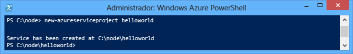
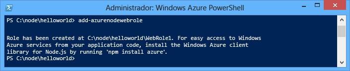
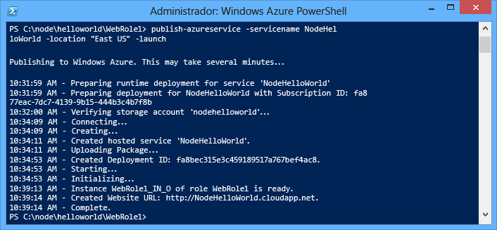
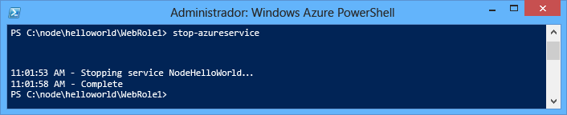
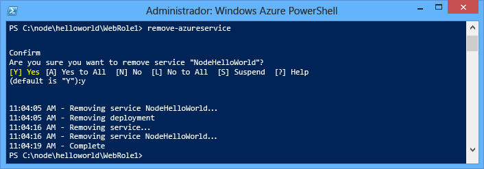

<properties
	pageTitle="Guia de introdução ao Node.js | Microsoft Azure"
	description="Saiba como criar um aplicativo Web simples do Node.js e implantá-lo em um serviço de nuvem do Azure."
	services="cloud-services"
	documentationCenter="nodejs"
	authors="rmcmurray"
	manager="wpickett"
	editor=""/>

<tags
	ms.service="cloud-services"
	ms.workload="tbd"
	ms.tgt_pltfrm="na" 
	ms.devlang="nodejs"
	ms.topic="hero-article"
	ms.date="02/04/2016" 
	ms.author="robmcm"/>

# Criar e implantar um aplicativo Node.jc para um Serviço de Nuvem do Azure

> [AZURE.SELECTOR]
- [Node.js](cloud-services-nodejs-develop-deploy-app.md)
- [.NET](cloud-services-dotnet-get-started.md)

Este tutorial mostra como criar um aplicativo simples do Node.js em execução em um Serviço de Nuvem do Azure. Os Serviços de Nuvem são os blocos de construção de aplicativos de nuvem escalonáveis no Azure. Eles permitem a separação e o gerenciamento independente e o dimensionamento dos componentes de front-end e back-end de seu aplicativo. Os serviços de nuvem fornecem uma máquina virtual exclusiva robusta para hospedar cada função confiável.

Para saber mais sobre serviços de nuvem e como eles são comparados aos Sites do Azure e máquinas virtuais, consulte [Comparação de Sites do Azure, Serviços de Nuvem e Máquinas virtuais](../app-service-web/choose-web-site-cloud-service-vm.md).

>[AZURE.TIP] Procurando desenvolver um site simples? Se o seu cenário envolver apenas um site de front-end simples, <a href="../app-service-web/web-sites-nodejs-develop-deploy-mac.md">considere usar um aplicativo Web leve</a>. Você pode atualizar facilmente para um serviço de nuvem conforme o aplicativo Web cresce e suas necessidades mudam.

Seguindo este tutorial, você irá criar um aplicativo da Web simples hospedado dentro de uma função Web. Você usará o emulador de computação para testar o aplicativo localmente e, em seguida, o implantará usando ferramentas de linha de comando do PowerShell.

O aplicativo é um aplicativo simples "hello world":

## Pré-requisitos

> [AZURE.NOTE] Este tutorial usa o PowerShell do Azure, que requer o Windows.

- Instalar e configurar o [Powershell do Azure](../powershell-install-configure.md).
- Baixe e instale o [SDK do Azure para .NET 2.7](http://www.microsoft.com/pt-BR/download/details.aspx?id=48178). Na configuração da instalação, selecione:
    - MicrosoftAzureAuthoringTools
    - MicrosoftAzureComputeEmulator

## Criar um projeto de Serviço de Nuvem do Azure

Execute as tarefas a seguir para criar um novo projeto do Serviço de Nuvem do Azure, juntamente com a estrutura básica do Node.js:

1. Execute o **Windows PowerShell** como Administrador. (No **menu Iniciar** ou **tela Iniciar**, pesquise por **Windows PowerShell**.)

2.  [Conecte o PowerShell](powershell-install-configure.md#how-to-connect-to-your-subscription) à sua assinatura.
3.  Insira o seguinte cmdlet do PowerShell para criar o projeto:

        New-AzureServiceProject helloworld

	

	O cmdlet **New-AzureServiceProject** gera uma estrutura básica para publicar um aplicativo do Node.js para um Serviço de Nuvem. Ele contém arquivos de configuração necessários para publicar no Azure. O cmdlet também altera o diretório de trabalho para o diretório de serviço.

	O cmdlet cria os seguintes arquivos:

	-   **ServiceConfiguration.Cloud.cscfg**, **ServiceConfiguration.Local.cscfg** e **ServiceDefinition.csdef**: são arquivos específicos do Azure necessários para publicar seu aplicativo. Para saber mais, consulte [Visão geral da criação de um serviço hospedado para o Azure][].

	-   **deploymentSettings.json**: armazena configurações locais que são usadas pelos cmdlets de implantação do Azure PowerShell.

4.  Digite o seguinte comando para adicionar uma nova função da Web:

        Add-AzureNodeWebRole

	

	O cmdlet **Add-AzureNodeWebRole** cria um aplicativo básico do Node.js. Ele também modifica os arquivos **.csfg** e **.csdef** para adicionar entradas de configuração para a nova função.

	> [AZURE.NOTE] Se você não especificar um nome de função, um nome padrão será usado. Você pode fornecer um nome como o primeiro parâmetro do cmdlet: `Add-AzureNodeWebRole MyRole`

O aplicativo do Node.js é definido no arquivo **server.js**, localizado no diretório da função Web (**WebRole1**, por padrão). Eis o código:

	var http = require('http');
	var port = process.env.port || 1337;
	http.createServer(function (req, res) {
	    res.writeHead(200, { 'Content-Type': 'text/plain' });
	    res.end('Hello World\n');
	}).listen(port);

Esse código é basicamente o mesmo código do exemplo "Hello World" no site [nodejs.org][], com a exceção de que ele usa o número de porta atribuído pelo ambiente de nuvem.

## Implantar o aplicativo no Azure

	[AZURE.INCLUDE [create-account-note](../../includes/create-account-note.md)]

### Baixar as configurações de publicação do Azure

Para implantar seu aplicativo do Azure, você deve primeiro baixar as definições de publicação para sua assinatura do Azure.

1.  Execute o seguinte cmdlet do PowerShell do Azure:

        Get-AzurePublishSettingsFile

	Isso irá usar o navegador para navegar para a página de download de configurações de publicação. Você precisará fazer logon com uma conta da Microsoft. Se fizer, use a conta associada com sua assinatura do Azure.

	Salve o perfil baixado para um local de arquivo, que você pode acessar facilmente.

2.  Execute o seguinte cmdlet para importar o perfil de publicação que você baixou:

        Import-AzurePublishSettingsFile [path to file]

	> [AZURE.NOTE] Depois de importar as configurações de publicação, considere a exclusão do arquivo .publishsettings baixado, pois ele contém informações que podem permitir que alguém acesse sua conta.

### Publicar o aplicativo

Para publicar, execute os seguintes comandos:

  	$ServiceName = "NodeHelloWorld" + $(Get-Date -Format ('ddhhmm'))   
	Publish-AzureServiceProject -ServiceName $ServiceName  -Location "East US" -Launch

- **-ServiceName** especifica o nome para a implantação. Esse deve ser um nome exclusivo, caso contrário, o processo de publicação falhará. O comando **Get-Date** usa uma cadeia de caracteres de data/hora que deve tornar o nome exclusivo.

- **-Location** especifica o datacenter no qual o aplicativo será hospedado. Para ver uma lista dos centros de dados disponíveis, use o cmdlet **Get-AzureLocation**.

- **-Launch** abre uma janela do navegador e navega para o serviço hospedado após a conclusão da implantação.

Após a publicação for bem-sucedida, você verá uma resposta semelhante à seguinte:

> [AZURE.NOTE]
Pode levar alguns minutos para o aplicativo ser implantado e tornar-se disponível quando for publicado pela primeira vez.

Depois que a implantação for concluída, uma janela do navegador será aberta e irá navegar para o serviço de nuvem.

Seu aplicativo está em execução no Azure.

O cmdlet **Publish-AzureServiceProject** executa as seguintes etapas:

1.  Cria um pacote a ser implantado. O pacote contém todos os arquivos em sua pasta de aplicativos.

2.  Cria uma nova **conta de armazenamento** se não existir. A conta de armazenamento do Azure é usada para armazenar o pacote de aplicativos durante a implantação. Você pode excluir com segurança a conta de armazenamento após a conclusão da implantação.

3.  Cria um novo **serviço de nuvem** se não existir. Um **serviço de nuvem** é o contêiner no qual seu aplicativo é hospedado quando é implantado no Azure. Para saber mais, consulte [Visão geral da criação de um serviço hospedado para o Azure][].

4.  Publica o pacote de implantação do Azure.

## Parando e excluindo seu aplicativo

Depois de implantar seu aplicativo, convém desativá-lo para que você possa evitar custos extras. O Azure cobra as instâncias de função web por hora de acordo com o tempo consumido do servidor. O tempo do servidor é consumido quando seu aplicativo é implantado, mesmo se as instâncias não estiverem sendo executadas e estiverem no estado parado.

1.  Na janela do Windows PowerShell, interrompa a implantação do serviço criada na seção anterior com o seguinte cmdlet:

        Stop-AzureService

	Interromper o serviço pode levar alguns minutos. Quando o serviço for interrompido, você recebe uma mensagem indicando que foi interrompido.

	

2.  Para excluir o serviço, chame o seguinte cmdlet:

        Remove-AzureService

	Quando solicitado, insira **Y** para excluir o serviço.

	Excluir o serviço pode levar alguns minutos. Após o serviço ter sido excluído, você recebe uma mensagem indicando que o serviço foi excluído.

	

	> [AZURE.NOTE] Excluir o serviço não exclui a conta de armazenamento criada quando o serviço foi inicialmente publicado e você continuará a ser cobrado pelo armazenamento usado. Para saber mais sobre como excluir uma conta de armazenamento, consulte [Como excluir uma conta de armazenamento de uma assinatura do Azure](http://msdn.microsoft.com/library/windowsazure/hh531562.aspx).

## Próximas etapas

Para obter mais informações, consulte o [Centro de desenvolvedores do Node.js](/develop/nodejs/).

[The Windows Start menu with the Azure SDK Node.js entry expanded]: ./media/cloud-services-nodejs-develop-deploy-app/azure-powershell-menu.png
[mkdir]: ./media/cloud-services-nodejs-develop-deploy-app/getting-started-6.png
[nodejs.org]: http://nodejs.org/
[A directory listing of the helloworld folder.]: ./media/cloud-services-nodejs-develop-deploy-app/getting-started-7.png
[Visão geral da criação de um serviço hospedado para o Azure]: http://msdn.microsoft.com/library/windowsazure/jj155995.aspx
[A directory listing of the WebRole1 folder]: ./media/cloud-services-nodejs-develop-deploy-app/getting-started-8.png
[The menu displayed when right-clicking the Azure emulator from the task bar.]: ./media/cloud-services-nodejs-develop-deploy-app/getting-started-11.png
[A browser window displaying http://www.windowsazure.com/ with the Free Trial link highlighted]: ./media/cloud-services-nodejs-develop-deploy-app/getting-started-12.png
[A browser window displaying the liveID sign in page]: ./media/cloud-services-nodejs-develop-deploy-app/getting-started-13.png
[Internet Explorer displaying the save as dialog for the publishSettings file.]: ./media/cloud-services-nodejs-develop-deploy-app/getting-started-14.png

[The full status output of the Publish-AzureService command]: ./media/cloud-services-nodejs-develop-deploy-app/node20.png
[How to Delete a Storage Account from an Azure Subscription]: https://www.windowsazure.com/manage/services/storage/how-to-manage-a-storage-account/
[powershell-menu]: ./media/cloud-services-nodejs-develop-deploy-app/azure-powershell-start.png
 

<!----HONumber=AcomDC_0218_2016-->