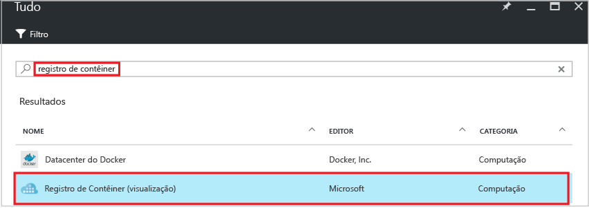
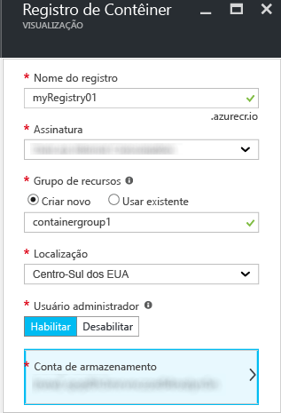
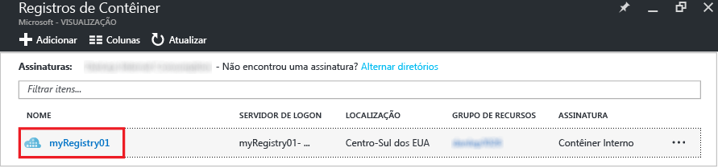
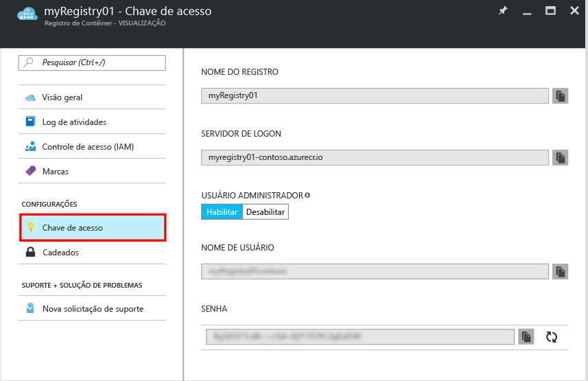

# Criar um registro de contêiner usando o portal do Azure
Use o portal do Azure para criar um registro de contêiner e gerenciar suas configurações. Você também pode criar e gerenciar registros de contêiner usando os [comandos de Azure CLI 2.0 Preview](container-registry-get-started-azure-cli.md) ou por meio de programação com a [API REST](https://go.microsoft.com/fwlink/p/?linkid=834376) do Registro de Contêiner.

Para obter informações de base e conceitos, confira [O que é o Registro de Contêiner do Azure?](container-registry-intro.md)

> [!NOTE]
> O Registro de Contêiner está atualmente em visualização.

## Criar um registro de contêiner
1. No [portal](https://portal.azure.com), clique em **+Novo**.
2. Pesquise no marketplace para localizar o **registro de contêiner**.
3. Selecione **Registro de Contêiner (visualização)** com o editor **Microsoft**. 
    
4. Clique em **Criar**. A folha **Registro de Contêiner** é exibida.

    
5. Na folha **Registro de Contêiner**, insira as informações a seguir. Clique em **Criar** quando terminar.
   
    a. **Nome do registro** - um nome de domínio de nível superior exclusivo para o registro específico. Neste exemplo, o nome do registro é *myRegistry01*, mas substitua-o por um nome exclusivo. O nome pode conter apenas letras e números.
   
    b. **Grupo de recursos** - selecione um [grupo de recursos](../azure-resource-manager/resource-group-overview.md#resource-groups) existente ou digite o nome de um novo. 
   
    c. **Local** - selecione um local de datacenter do Azure em que o serviço está [disponível](https://azure.microsoft.com/regions/services/), como **Centro-Sul dos EUA**. 
   
    d. **Usuário administrador** - se desejar, habilite um usuário administrador para acessar o registro. Você pode alterar essa configuração após a criação do registro.
   
   > [!IMPORTANT]
   > Além de fornecer acesso por meio de uma conta de usuário administrador, registros de contêiner dão suporte à autenticação com o apoio de entidades de serviço do Azure Active Directory. Para obter mais informações e considerações, confira [Autenticar em um registro de contêiner](container-registry-authentication.md).
   
    e. **Conta de armazenamento** - use a configuração padrão para criar uma [conta de armazenamento](../storage/storage-introduction.md) ou selecione uma conta de armazenamento existente no mesmo local. Observe que não há suporte para contas de armazenamento Premium e clássico.

## Gerenciar configurações do registro
Depois de criar o registro, localize as configurações do Registro, iniciando na folha **Registros de Contêiner** no portal. Por exemplo, talvez você precise das configurações para fazer logon em seu registro ou precise habilitar ou desabilitar o usuário administrador.

1. Na folha **Registros de Contêiner**, clique no nome do registro.
   
    
2. Para gerenciar as configurações de acesso, clique em **Chave de acesso**.
   
    
3. Observe as seguintes configurações:
   
   * **Servidor de logon** - o nome totalmente qualificado que você usa para fazer logon no registro. Neste exemplo, é `myregistry01-contoso.azurecr.io`.
   * **Usuário administrador** -ative/desative para habilitar ou desabilitar a conta de usuário do administrador do registro.
   * **Nome de usuário** e **senha** - as credenciais da conta de usuário administrador (se habilitado) que você pode usar para fazer logon no registro. Opcionalmente, você pode gerar a senha de novo.

## Próximas etapas
* [Enviar por push sua primeira imagem usando a CLI do Docker](container-registry-get-started-docker-cli.md)

<!--HONumber=Feb17_HO2-->

