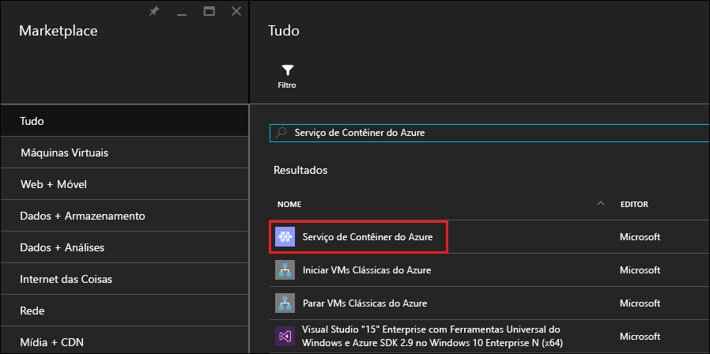
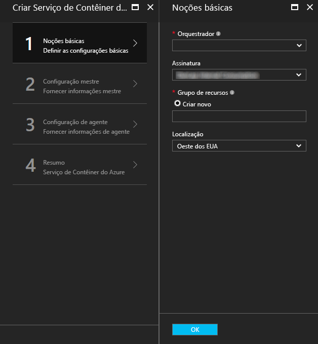
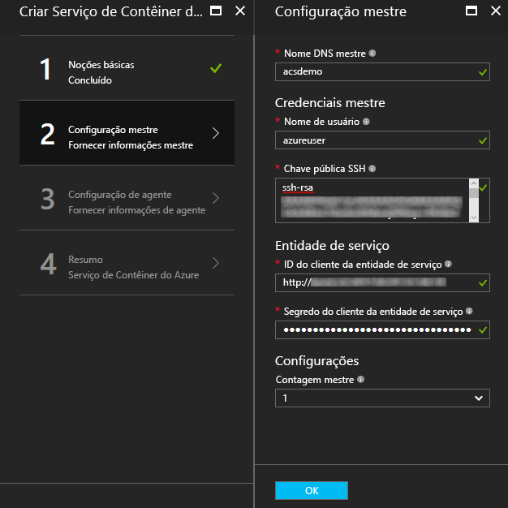
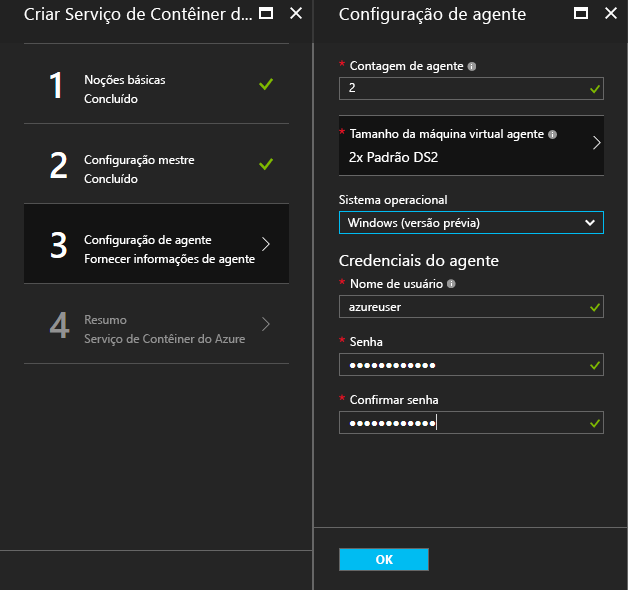

# <a name="deploy-a-docker-container-hosting-solution-using-the-azure-portal"></a>Implante uma solução de hospedagem de contêiner do Docker usando o portal do Azure


O Serviço de Contêiner do Azure fornece implantação rápida de soluções populares de orquestração e clustering de contêiner de software livre. Este documento orienta a implantar um cluster do serviço de contêiner do Azure usando o portal do Azure ou um modelo de início rápido do Azure Resource Manager. 

Você também pode implantar um cluster do Serviço de Contêiner do Azure usando a [CLI do Azure 2.0](container-service-create-acs-cluster-cli.md) ou as APIs de Serviço de Contêiner do Azure.

Para obter informações, consulte [Introdução ao Serviço de Contêiner do Azure](../container-service-intro.md).


## <a name="prerequisites"></a>Pré-requisitos

* **Assinatura do Azure**: se não tiver uma, inscreva-se em uma [avaliação gratuita](http://azure.microsoft.com/pricing/free-trial/?WT.mc_id=AA4C1C935). Para um cluster maior, considere uma assinatura pré-paga ou outras opções de compra.

    > [!NOTE]
    > O uso da assinatura do Azure e as [cotas de recursos](../../azure-subscription-service-limits.md), como as cotas de núcleos, podem limitar o tamanho do cluster que você implanta. Para solicitar um aumento de cota, abra uma [solicitação de atendimento ao cliente online](../../azure-supportability/how-to-create-azure-support-request.md) gratuitamente.
    >

* **Chave pública SSH RSA**: durante a implantação por meio do portal ou por meio de um dos modelos de início rápido do Azure, você precisa fornecer a chave pública para autenticação nas máquinas virtuais do Serviço de Contêiner do Azure. Para criar chaves SSH (Secure Shell) RSA, consulte as diretrizes para [OS X e Linux](../../virtual-machines/linux/mac-create-ssh-keys.md) ou [Windows](../../virtual-machines/linux/ssh-from-windows.md). 

* **ID e segredo de cliente de entidade de serviço** (somente Kubernetes): para obter mais informações e diretrizes para criar uma entidade de serviço do Azure Active Directory, consulte [Sobre a entidade de serviço para um cluster Kubernetes](../kubernetes/container-service-kubernetes-service-principal.md).


## <a name="create-a-cluster-by-using-the-azure-portal"></a>Criar um cluster usando o portal do Azure
1. Entre no portal do Azure, selecione **Novo** e pesquise no Azure Marketplace o **Serviço de Contêiner do Azure**.

      <br />

2. Clique em **Serviço de Contêiner do Azure** e clique em **Criar**.

3. Na folha **Informações básicas**, insira as seguintes informações:

    * **Orchestrator**: selecione um dos orquestradores de contêiner para implantar no cluster.
        * **DC/OS**: implanta um cluster de DC/OS.
        * **Swarm**: implanta um cluster Docker Swarm.
        * **Kubernetes**: implanta um cluster Kubernetes.
    * **Assinatura**: selecione uma assinatura do Azure.
    * **Grupo de recursos**: insira o nome de um novo grupo de recursos para a implantação.
    * **Local**: selecione uma região do Azure para a implantação do Serviço de Contêiner do Azure. Para disponibilidade, verifique [Produtos disponíveis por região](https://azure.microsoft.com/regions/services/).
    
      <br />
    
    Clique em **OK** quando estiver pronto para continuar.

4. Na folha **Configuração do mestre**, insira as seguintes configurações para o nó mestre do Linux ou para os nós do cluster (algumas configurações são específicas para cada orquestrador):

    * **Nome DNS de mestre**: o prefixo usado para criar um FQDN (nome de domínio totalmente qualificado) exclusivo para o mestre. O FQDN do mestre é no formato *prefixo*gerenciamento*local*.cloudapp.azure.com.
    * **Nome de usuário**: O nome de usuário para uma conta em cada uma das máquinas virtuais Linux no cluster.
    * **Chave pública SSH RSA**: adicione a chave pública que será usada para autenticação nas máquinas virtuais Linux. É importante que esta chave não contenha quebras de linha e que inclua o prefixo `ssh-rsa`. O sufixo `username@domain` é opcional. A chave deve ser algo semelhante ao seguinte: **ssh-rsa AAAAB3Nz...<...>...UcyupgH azureuser@linuxvm**. 
    * **Entidade de serviço**: se você selecionou o orquestrador Kubernetes, insira uma **ID do cliente de entidade de serviço** do Azure Active Directory (também chamada de appId) e um **Segredo do cliente de entidade de serviço** (senha). Para obter mais informações, confira [Sobre a entidade de serviço para um cluster Kubernetes](../kubernetes/container-service-kubernetes-service-principal.md).
    * **Contagem de mestres**: o número de mestres do cluster.
    * **Diagnóstico de VM**: para alguns orquestradores, você pode habilitar o diagnóstico de VM nos mestres.

      <br />

    Clique em **OK** quando estiver pronto para continuar.

5. Na folha **Configuração do agente**, insira as seguintes informações:

    * **Contagem de agentes**: para Docker Swarm e Kubernetes, esse valor será o número inicial de agentes no conjunto de dimensionamento de agentes. Para DC/OS, é o número inicial de agentes em um conjunto de escala privado. Além disso, é criado um conjunto de escala pública para DC/OS, que contém um número predeterminado de agentes. O número de agentes nesse conjunto de dimensionamento público é determinado pelo número de mestres no cluster: um agente público para um mestre e dois agentes públicos para três ou cinco mestres.
    * **Tamanho da máquina virtual de agente**: o tamanho das máquinas virtuais de agente.
    * **Sistema operacional**: essa configuração só estará disponível se você selecionou o orquestrador Kubernetes. Escolha uma distribuição do Linux ou um sistema operacional do Windows Server para executar nos agentes. Essa configuração determina se seu cluster pode executar aplicativos de contêiner do Windows ou Linux. 

        > [!NOTE]
        > O suporte ao contêiner do Windows está em versão prévia para clusters Kubernetes. Atualmente há suporte somente para agentes Linux no Serviço de Contêiner do Azure nos clusters DC/SO e Swarm.

    * **Credenciais de agente**: se você selecionou o sistema operacional Windows, insira um **Nome de usuário** e **Senha** de administrador para as VMs de agente. 

      <br />

    Clique em **OK** quando estiver pronto para continuar.

6. Após a conclusão da validação de serviço, clique em **OK**.

      <br />

7. Examine os termos. Para iniciar o processo de implantação, clique em **Criar**.

    Se tiver optado por fixar a implantação no portal do Azure, você poderá ver o status da implantação.

      <br />

A implantação leva vários minutos para ser concluída. Em seguida, o cluster do serviço de contêiner do Azure está pronto para uso.


## <a name="create-a-cluster-by-using-a-quickstart-template"></a>Criar um cluster usando um modelo de início rápido
Modelos de início rápido do Azure estão disponíveis para implantar um cluster no serviço de contêiner do Azure. Os modelos de início rápido fornecidos também podem ser modificados para incluir uma configuração do Azure avançada ou adicional. Para criar um cluster do serviço de contêiner do Azure usando um modelo de início rápido do Azure, você precisa de uma assinatura do Azure. Se não tiver uma, inscreva-se para obter uma [avaliação gratuita](http://azure.microsoft.com/pricing/free-trial/?WT.mc_id=AA4C1C935). 

Siga estas etapas para implantar um cluster usando um modelo e a CLI do Azure 2.0 (veja [instruções de instalação e configuração](/cli/azure/install-az-cli2)).

> [!NOTE] 
> Se você estiver em um sistema Windows, você pode usar etapas semelhantes para implantar um modelo usando o Azure PowerShell. Consulte as etapas nesta seção. Você também pode implantar um modelo por meio de [portal](../../azure-resource-manager/resource-group-template-deploy-portal.md) ou outros métodos.

1. Para implantar um cluster DC/SO, Docker Swarm ou Kubernetes, selecione um dos modelos de início rápido disponíveis no GitHub. Veja uma lista parcial. Os modelos DC/SO e Swarm são os mesmos, exceto para a seleção do orquestrador padrão.

    * [Modelo DC/OS](https://github.com/Azure/azure-quickstart-templates/tree/master/101-acs-dcos)
    * [Modelo do Swarm](https://github.com/Azure/azure-quickstart-templates/tree/master/101-acs-swarm)
    * [Modelo Kubernetes](https://github.com/Azure/azure-quickstart-templates/tree/master/101-acs-kubernetes)

2. Faça logon sua conta do Azure (`az login`) e certifique-se de que a CLI do Azure está conectada à sua assinatura do Azure. Você pode ver a assinatura padrão usando o comando a seguir:

    ```azurecli
    az account show
    ```
    
    Se você tiver mais de uma assinatura e a necessidade de definir uma assinatura padrão diferente, execute `az account set --subscription` e especifique o nome ou ID de assinatura.

3. Como prática recomendada, use um novo grupo de recursos para a implantação. Para criar um grupo de recursos, use o comando `az group create` para especificar um nome de grupo de recursos e um local: 

    ```azurecli
    az group create --name "RESOURCE_GROUP" --location "LOCATION"
    ```

4. Crie um arquivo JSON que contém os parâmetros necessários do modelo. Baixe o arquivo de parâmetros chamado `azuredeploy.parameters.json` que acompanha o modelo do Serviço de Contêiner do Azure `azuredeploy.json` no GitHub. Insira valores de parâmetros necessários para seu cluster. 

    Por exemplo, para usar o [modelo da DC/SO](https://github.com/Azure/azure-quickstart-templates/tree/master/101-acs-dcos), fornecer valores de parâmetro para `dnsNamePrefix` e `sshRSAPublicKey`. Consulte as descrições em `azuredeploy.json` e opções para outros parâmetros.  
 

5. Criar um cluster do serviço de contêiner, passando o arquivo de parâmetros de implantação com o seguinte comando, onde:

    * **RESOURCE_GROUP** é o nome do grupo de recursos que você criou na etapa anterior.
    * **DEPLOYMENT_NAME** (opcional) é um nome que você atribui à implantação.
    * **TEMPLATE_URI** é o local do arquivo de implantação `azuredeploy.json`. Esse URI deve ser o arquivo Bruto, não um ponteiro para a interface do usuário do GitHub. Para localizar esse URI, selecione o `azuredeploy.json` arquivo no GitHub e, em seguida, clique no **Raw** botão.  

    ```azurecli
    az group deployment create -g RESOURCE_GROUP -n DEPLOYMENT_NAME --template-uri TEMPLATE_URI --parameters @azuredeploy.parameters.json
    ```

    Você também pode fornecer parâmetros como uma cadeia de caracteres formatada em JSON na linha de comando. Use um comando semelhante a este:

    ```azurecli
    az group deployment create -g RESOURCE_GROUP -n DEPLOYMENT_NAME --template-uri TEMPLATE_URI --parameters "{ \"param1\": {\"value1\"} … }"
    ```

    > [!NOTE]
    > A implantação leva vários minutos para ser concluída.
    > 

### <a name="equivalent-powershell-commands"></a>Comandos equivalentes do PowerShell
Você também pode implantar um modelo do Serviço de Contêiner do Azure com o PowerShell. Este documento se baseia na versão 1.0 do [módulo do Azure PowerShell](https://azure.microsoft.com/blog/azps-1-0/).

1. Para implantar um cluster DC/SO, Docker Swarm ou Kubernetes, selecione um dos modelos de início rápido disponíveis no GitHub. Veja uma lista parcial. Observe que os modelos do DC/OS e do Swarm são iguais, com a exceção da seleção do orquestrador padrão.

    * [Modelo DC/OS](https://github.com/Azure/azure-quickstart-templates/tree/master/101-acs-dcos)
    * [Modelo do Swarm](https://github.com/Azure/azure-quickstart-templates/tree/master/101-acs-swarm)
    * [Modelo Kubernetes](https://github.com/Azure/azure-quickstart-templates/tree/master/101-acs-kubernetes)

2. Antes de criar um cluster em sua assinatura do Azure, verifique se sua sessão do PowerShell foi conectada ao Azure. Você pode fazer isso com o comando `Get-AzureRMSubscription` :

    ```powershell
    Get-AzureRmSubscription
    ```

3. Se precisar entrar no Azure, use o comando `Login-AzureRMAccount` :

    ```powershell
    Login-AzureRmAccount
    ```

4. Como prática recomendada, use um novo grupo de recursos para a implantação. Para criar um grupo de recursos, use o comando `New-AzureRmResourceGroup` e especifique um nome de grupo de recursos e uma região de destino:

    ```powershell
    New-AzureRmResourceGroup -Name GROUP_NAME -Location REGION
    ```

5. Depois de criar um grupo de recursos, você poderá criar seu cluster com o comando a seguir. O URI do modelo desejado é especificado com o parâmetro `-TemplateUri`. Quando você executar esse comando, o PowerShell solicitará os valores de parâmetros de implantação.

    ```powershell
    New-AzureRmResourceGroupDeployment -Name DEPLOYMENT_NAME -ResourceGroupName RESOURCE_GROUP_NAME -TemplateUri TEMPLATE_URI
    ```

#### <a name="provide-template-parameters"></a>Fornecer parâmetros de modelo
Se estiver familiarizado com o PowerShell, você saberá que pode percorrer os parâmetros disponíveis para um cmdlet digitando um sinal de subtração (-) e, em seguida, pressionando a tecla TAB. Essa mesma funcionalidade também funciona com os parâmetros definidos no modelo. Assim que você digitar o nome do modelo, o cmdlet buscará o modelo, o analisará os parâmetros e adicionará dinamicamente os parâmetros do modelo ao comando. Isso facilita a especificação dos valores de parâmetros do modelo. E, se você esquecer um valor de parâmetro necessário, o PowerShell solicitará o valor.

Aqui está o comando completo com os parâmetros incluídos. Forneça seus próprios valores para os nomes dos recursos.

```powershell
New-AzureRmResourceGroupDeployment -ResourceGroupName RESOURCE_GROUP_NAME-TemplateURI TEMPLATE_URI -adminuser value1 -adminpassword value2 ....
```

## <a name="next-steps"></a>Próximas etapas
Agora que você tem um cluster em funcionamento, confira estes documentos para obter detalhes sobre conexão e gerenciamento:

* [Conectar a um cluster do Serviço de Contêiner do Azure](../container-service-connect.md)
* [Trabalhar com o Serviço de Contêiner do Azure e o DC/SO](container-service-mesos-marathon-rest.md)
* [Trabalhar com o Serviço de Contêiner do Azure e o Docker Swarm](container-service-docker-swarm.md)
* [Trabalhar com o Serviço de Contêiner do Azure e o Kubernetes](../kubernetes/container-service-kubernetes-walkthrough.md)
