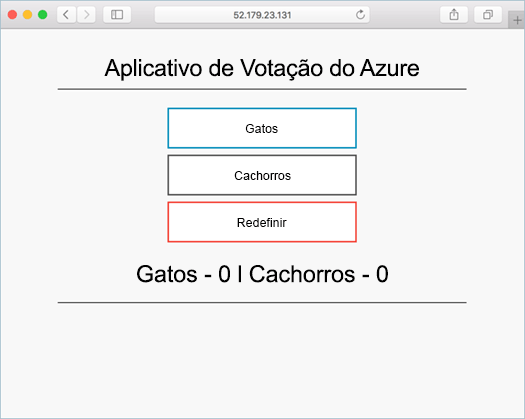

# <a name="run-applications-in-kubernetes"></a>Executar aplicativos no Kubernetes

Neste tutorial, parte quatro de sete, um aplicativo de exemplo é implantado em um cluster Kubernetes. As etapas concluídas incluem:

> [!div class="checklist"]
> * Baixar arquivos de manifesto Kubernetes
> * Executar um aplicativo no Kubernetes
> * Testar o aplicativo

Nos tutoriais subsequentes, esse aplicativo é escalado horizontalmente, atualizado e o Operations Management Suite configurado para monitorar o cluster Kubernetes.

Este tutorial assume uma compreensão básica dos conceitos de Kubernetes; para obter informações detalhadas sobre Kubernetes consulte a [documentação do Kubernetes](https://kubernetes.io/docs/home/).

## <a name="before-you-begin"></a>Antes de começar

Nos tutoriais anteriores, um aplicativo foi empacotado em uma imagem de contêiner, essa imagem foi carregada no Registro de Contêiner do Azure e um cluster Kubernetes foi criado. Se você ainda não realizou essas etapas e deseja continuar acompanhando, retorne ao [Tutorial 1 – Criar imagens de contêiner](./container-service-tutorial-kubernetes-prepare-app.md). 

No mínimo, este tutorial requer um cluster Kubernetes.

## <a name="get-manifest-file"></a>Obter arquivo de manifesto

Para este tutorial, [objetos Kubernetes](https://kubernetes.io/docs/concepts/overview/working-with-objects/kubernetes-objects/) dão implantados utilizando um manifesto Kubernetes. Um manifesto Kubernetes é um arquivo formatado YAML ou JSON que contém instruções de implantação e configuração de objetos Kubernetes.

O arquivo de manifesto do aplicativo para este tutorial está disponível no repositório do aplicativo Azure Vote, que foi clonado em um tutorial anterior. Se você ainda não tiver feito isso, clone o repositório com o seguinte comando: 

```bash
git clone https://github.com/Azure-Samples/azure-voting-app-redis.git
```

O arquivo de manifesto está localizado no seguinte diretório do repositório clonado.

```bash
/azure-voting-app-redis/kubernetes-manifests/azure-vote-all-in-one-redis.yml
```

## <a name="update-manifest-file"></a>Atualizar arquivo de manifesto

Se estiver utilizando o Registro de Contêiner do Azure para armazenar as imagens de contêiner, será necessário atualizar o manifesto com o nome ACR loginServer.

Obter o nome do servidor de logon ACR com o comando [az acr list](/cli/azure/acr#list).

```azurecli-interactive
az acr list --resource-group myResourceGroup --query "[].{acrLoginServer:loginServer}" --output table
```

O manifesto de amostra foi pré-criado com um nome de repositório da *microsoft*. Abra o arquivo com qualquer editor de texto e substitua o valor *microsoft* com o nome do servidor de logon da sua instância ACR.

```yaml
containers:
- name: azure-vote-front
  image: microsoft/azure-vote-front:redis-v1
```

## <a name="deploy-application"></a>Implantar um aplicativo

Use o comando [kubectl create](https://kubernetes.io/docs/user-guide/kubectl/v1.6/#create) para executar o aplicativo. Esse comando analisa o arquivo de manifesto e cria objetos Kubernetes definidos.

```azurecli-interactive
kubectl create -f ./azure-voting-app-redis/kubernetes-manifests/azure-vote-all-in-one-redis.yml
```

Saída:

```bash
deployment "azure-vote-back" created
service "azure-vote-back" created
deployment "azure-vote-front" created
service "azure-vote-front" created
```

## <a name="test-application"></a>Testar aplicativo

Um [serviço Kubernetes](https://kubernetes.io/docs/concepts/services-networking/service/) é criado que expõe o aplicativo para a internet. Esse processo pode levar alguns minutos. 

Para monitorar o andamento, use o comando [kubectl get service](https://review.docs.microsoft.com/en-us/azure/container-service/container-service-kubernetes-walkthrough?branch=pr-en-us-17681) com o argumento `--watch`.

```azurecli-interactive
kubectl get service azure-vote-front --watch
```

Inicialmente, o **EXTERNAL -IP** para o serviço *azure-vote-front* aparece como *pendente*. Depois que o endereço EXTERNAL -IP foi alterado de *pendente* para *endereço IP*, use `CTRL-C` para interromper o processo kubectl watch.

```bash
NAME               CLUSTER-IP    EXTERNAL-IP   PORT(S)        AGE
azure-vote-front   10.0.42.158   <pending>     80:31873/TCP   1m
azure-vote-front   10.0.42.158   52.179.23.131 80:31873/TCP   2m
```

Para consultar o aplicativo, navegue até o endereço IP externo.



## <a name="next-steps"></a>Próximas etapas

Neste tutorial, o aplicativo Azure Vote foi implantado em um cluster Kubernetes do Serviço de Contêiner do Azure. As tarefas concluídas incluem:  

> [!div class="checklist"]
> * Baixar arquivos de manifesto Kubernetes
> * Executar um aplicativo no Kubernetes
> * Testado o aplicativo

Avance para o próximo tutorial para saber mais sobre como dimensionar um aplicativo Kubernetes e a infraestrutura do Kubernetes subjacente. 

> [!div class="nextstepaction"]
> [Dimensionar um aplicativo do Kubernetes e sua infraestrutura](./container-service-tutorial-kubernetes-scale.md)
