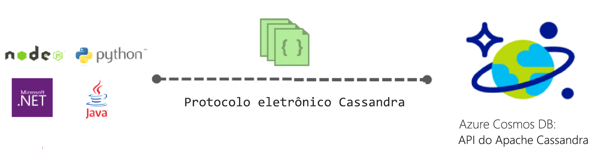

# Introdução à API do Apache Cassandra para o Azure Cosmos DB

O Azure Cosmos DB fornece a API do Cassandra (versão prévia) para aplicativos que são escritos para o Apache Cassandra que precisam de funcionalidades premium como:

* [Tamanho de armazenamento e taxa de transferência escalonáveis](partition-data.md).
* [Distribuição global turn-key](distribute-data-globally.md)
* Latências de dígito único em milissegundos no percentil 99.
* [Cinco níveis de consistência bem definidos](consistency-levels.md)
* [Indexação automática de dados](http://www.vldb.org/pvldb/vol8/p1668-shukla.pdf) sem a necessidade de lidar com o gerenciamento de esquema e de índice. 
* Garantia de alta disponibilidade, apoiada por [SLAs líderes do setor](https://azure.microsoft.com/support/legal/sla/cosmos-db/)

## O que é a API do Apache Cassandra do Azure Cosmos DB?

O Azure Cosmos DB pode ser usado como o armazenamento de dados para aplicativos escritos para o [Apache Cassandra](https://cassandra.apache.org/), usando a API do Apache Cassandra. Isso significa que, usando os [drivers do Apache licenciados em conformidade com CQLv4](https://cassandra.apache.org/doc/latest/getting_started/drivers.html?highlight=driver) existentes, seu aplicativo escrito para o Cassandra agora pode se comunicar com a API do Cassandra do Azure Cosmos DB. Em muitos casos, você pode alternar entre o uso do Apache Cassandra e a API do Apache Cassandra do Azure Cosmos DB, simplesmente alterando uma cadeia de conexão. Usando essa funcionalidade, você pode criar e executar com facilidade aplicativos de banco de dados da API do Cassandra na nuvem do Azure com a distribuição global e os [SLAs abrangentes líderes do setor](https://azure.microsoft.com/support/legal/sla/cosmos-db) do Azure Cosmos DB e, ao mesmo tempo, continuar usando as ferramentas e competências conhecidas da API do Cassandra.

A API do Cassandra possibilita interagir com os dados armazenados no Azure Cosmos DB usando as ferramentas baseadas em Linguagem de Consulta do Cassandra (como o CQLSH) e os drivers de cliente do Cassandra com os quais você já está familiarizado.

## Qual é o benefício de usar a API do Apache Cassandra para o Azure Cosmos DB?

**Sem gerenciamento de operações**: como um verdadeiro serviço totalmente gerenciado, o Azure Cosmos DB garante que os administradores da API do Cassandra não precisam se preocupar com o gerenciamento e monitoramento de inúmeras configurações em arquivos do sistema operacional, da JVM e arquivos yaml e sua interação. O Azure Cosmos DB fornece monitoramento de taxa de transferência, latência, armazenamento e disponibilidade, bem como alertas configuráveis. 

**Gerenciamento de desempenho**: o Azure Cosmos DB fornece leituras e gravações de baixa latência apoiadas por SLA no 99º percentil. Os usuários não precisam se preocupar com grande parte da sobrecarga operacional para fornecer uma boa leitura e gravação de SLAs. Isso normalmente inclui o agendamento de compactação, o gerenciamento de marcas de exclusão, a configuração de filtros de bloom e retardos de réplica. O Azure Cosmos DB elimina a preocupação de gerenciar esses problemas e permite que você se concentre nas entregas do aplicativo.

**Indexação automática**: o Azure Cosmos DB indexa automaticamente todas as colunas da tabela no banco de dados da API do Cassandra. O Azure Cosmos DB não exige a criação de índices secundários para acelerar as consultas. Ele fornece a experiência de leitura e gravação de baixa latência, ao mesmo tempo que faz uma indexação automática consistente. 

**Capacidade de usar o código e as ferramentas existentes**: o Azure Cosmos DB fornece a compatibilidade no nível de protocolo com as ferramentas e os SDKs existentes. Essa compatibilidade garante que você pode usar a base de código existente com a API do Cassandra do Azure Cosmos DB com alterações triviais.

**Elasticidade de armazenamento e taxa de transferência**: a plataforma Azure Cosmos fornece elasticidade de taxa de transferência garantida entre regiões por meio de operações simples no portal, no PowerShell ou na CLI. Dimensione as Tabelas do Azure Cosmos DB de maneira elástica com desempenho previsível diretamente à medida que seu aplicativo cresce. O Azure Cosmos DB dá suporte às tabelas da API do Cassandra que podem ser dimensionadas para tamanhos de armazenamento praticamente ilimitados. 

**Distribuição global e disponibilidade**: o Azure Cosmos DB oferece a capacidade de distribuir dados nas regiões do Azure para proporcionar aos usuários uma experiência de baixa latência, garantindo a disponibilidade. O Azure Cosmos DB fornece disponibilidade de 99,99% em uma região e disponibilidade de leitura de 99,999% em todas as regiões sem sobrecarga de operações. O Azure Cosmos DB está disponível em mais de 30 [Regiões do Azure](https://azure.microsoft.com/regions/services/). Saiba mais em [Distribuir dados globalmente](distribute-data-globally.md). 

**Opção de consistência**: o Azure Cosmos DB fornece a opção de cinco níveis de consistência bem-definidos para obter a compensação ideal entre consistência e desempenho. Esses níveis de consistência são forte, desatualização limitada, sessão, prefixo consistente e eventual. Esses níveis de consistência granulares e bem-definidos permitem que o desenvolvedor faça compensações seguras entre consistência, disponibilidade e latência. Saiba mais em [Como usar níveis de consistência para maximizar a disponibilidade e o desempenho](consistency-levels.md). 

**Nível empresarial**: seguro e em conformidade por padrão – o Azure Cosmos DB fornece [certificações de conformidade](https://www.microsoft.com/trustcenter) para garantir que os usuários possam usar a plataforma sem se preocupar com problemas de conformidade. O Azure Cosmos DB também fornece criptografia em repouso e em movimento, firewall de IP e logs de auditoria para atividades do plano de controle.  

## Como começar
Siga os guias de início rápido da API do Cassandra para criar uma conta da API do Cassandra do Azure Cosmos DB e um aplicativo do Cassandra:

* [Guia de início rápido: Criar um aplicativo Web do Cassandra com o Node.js e o Azure Cosmos DB](create-cassandra-nodejs.md)
* [Guia de início rápido: Criar um aplicativo Web do Cassandra com o Java e o Azure Cosmos DB](create-cassandra-java.md)
* [Guia de início rápido: Criar um aplicativo Web do Cassandra com o .NET e o Azure Cosmos DB](create-cassandra-dotnet.md)
* [Guia de início rápido: Criar um aplicativo Web do Cassandra com o Python e o Azure Cosmos DB](create-cassandra-python.md)

## Inscreva-se agora mesmo 

Caso você já tenha uma assinatura do Azure, inscreva-se para a API do Cassandra (versão prévia) no [portal do Azure](https://aka.ms/cosmosdb-cassandra-signup). Se estiver conhecendo o Azure agora, inscreva-se para uma [avaliação gratuita](https://azure.microsoft.com/free), em que você obtém 12 meses de acesso gratuito ao Azure Cosmos DB.

## Próximas etapas

As informações sobre a API do Cassandra do Azure Cosmos DB são integradas à documentação geral do Azure Cosmos DB, mas estas são algumas dicas para ajudá-lo a começar:

* Siga os [Guias de início rápido](create-cassandra-nodejs.md) para criar uma conta e um novo aplicativo usando uma amostra do Git
* Siga o [Tutorial](tutorial-develop-cassandra-java.md) para criar um novo aplicativo de forma programática.
* Siga o [tutorial Importar dados do Cassandra](cassandra-import-data.md) para importar os dados existentes no Azure Cosmos DB.
* Leia as [Perguntas frequentes](faq.md#cassandra).
