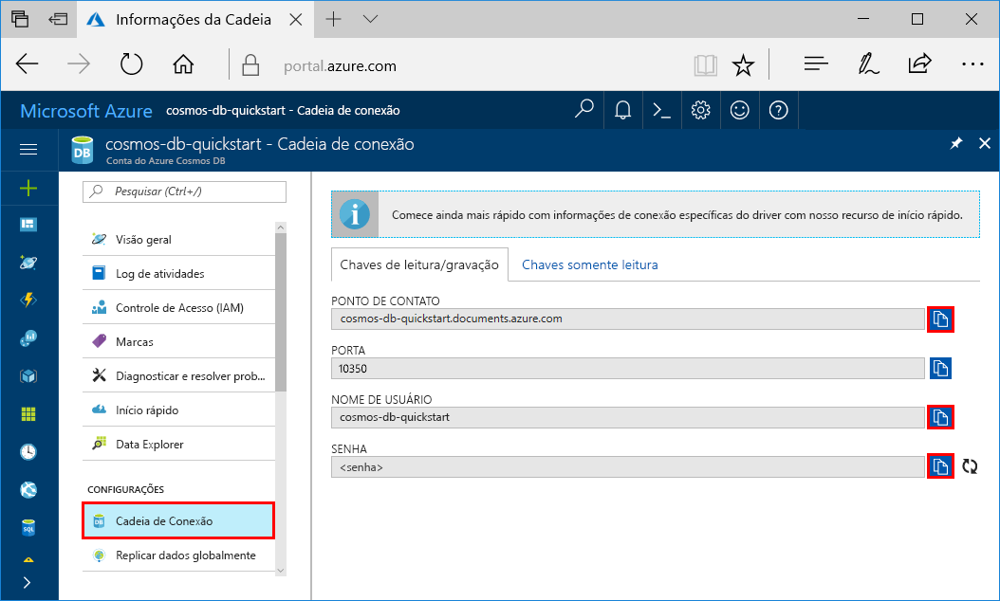
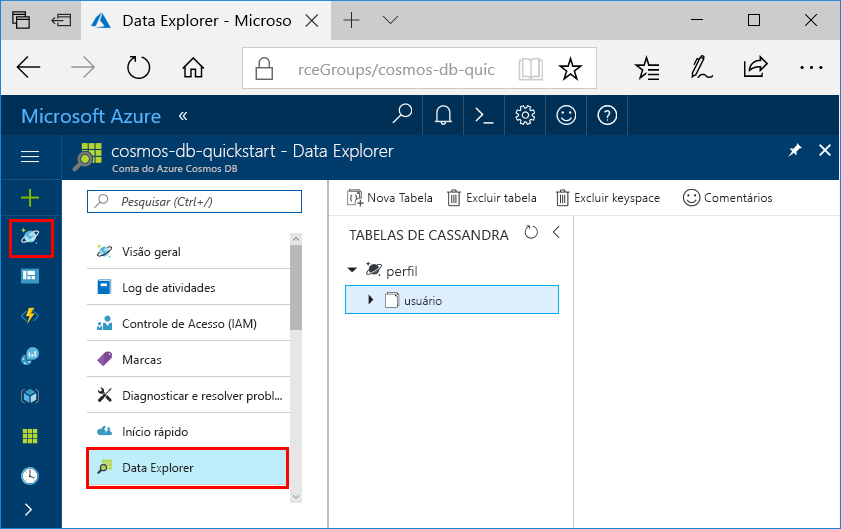

# <a name="quickstart-build-a-cassandra-app-with-net-and-azure-cosmos-db"></a>Início rápido: compilar um aplicativo do Cassandra com o .NET e o Azure Cosmos DB

> [!div class="op_single_selector"]
> * [.NET](create-cassandra-dotnet.md)
> * [Java](create-cassandra-java.md)
> * [Node.js](create-cassandra-nodejs.md)
> * [Python](create-cassandra-python.md)
>  

Este guia de início rápido mostra como usar o .NET e a [API Cassandra](cassandra-introduction.md) do Azure Cosmos DB para compilar um aplicativo de perfil clonando um exemplo do GitHub. Neste início rápido também mostra como usar o portal do Azure baseados na web para criar uma conta do Azure Cosmos DB.

O Azure Cosmos DB é o serviço de banco de dados multimodelo distribuído globalmente da Microsoft. É possível criar e consultar rapidamente documentos, tabelas, valores-chave e bancos de dados de gráfico, todos os quais se beneficiam de recursos de distribuição global e escala horizontal e no núcleo do Azure Cosmos DB. 

## <a name="prerequisites"></a>Pré-requisitos

[!INCLUDE [quickstarts-free-trial-note](../../includes/quickstarts-free-trial-note.md)] Como alternativa, você pode [Experimentar o Azure Cosmos DB gratuitamente](https://azure.microsoft.com/try/cosmosdb/) sem uma assinatura do Azure, sem ônus e sem compromisso.

Além disso, você precisa: 
* Se você ainda não tem o Visual 2017 Studio instalado, poderá baixar e usar o **Visual Studio 2017 Community Edition** [gratuito](https://www.visualstudio.com/downloads/). Verifique se você habilitou o **desenvolvimento do Azure** durante a instalação do Visual Studio.
* Instale o [Git](https://www.git-scm.com/) para clonar o exemplo.

<a id="create-account"></a>
## <a name="create-a-database-account"></a>Criar uma conta de banco de dados

[!INCLUDE [cosmos-db-create-dbaccount-cassandra](../../includes/cosmos-db-create-dbaccount-cassandra.md)]


## <a name="clone-the-sample-application"></a>Clonar o aplicativo de exemplo

Agora, vamos trabalhar com o código. Vamos clonar um aplicativo de API Cassandra do GitHub, definir a cadeia de conexão e executá-lo. Você verá como é fácil trabalhar usando dados de forma programática. 

1. Abra um prompt de comando. Criar uma nova pasta chamada `git-samples`. Não feche o prompt de comando.

    ```bash
    md "C:\git-samples"
    ```

2. Abra uma janela de terminal de git, como git bash, e use o comando `cd` para alterar para a nova pasta para instalar o aplicativo de exemplo.

    ```bash
    cd "C:\git-samples"
    ```

3. Execute o comando a seguir para clonar o repositório de exemplo. Este comando cria uma cópia do aplicativo de exemplo no seu computador.

    ```bash
    git clone https://github.com/Azure-Samples/azure-cosmos-db-cassandra-dotnet-getting-started.git
    ```

4. Depois, abra o arquivo de solução CassandraQuickStartSample no Visual Studio. 

## <a name="review-the-code"></a>Examine o código

Esta etapa é opcional. Se você estiver interessado em aprender como o código cria os recursos de banco de dados,examine os trechos de código a seguir. Os trechos de código são todos obtidos do `Program.cs` arquivo instalado na pasta `C:\git-samples\azure-cosmos-db-cassandra-dotnet-getting-started\CassandraQuickStartSample`. Caso contrário, você poderá pular para [Atualizar sua cadeia de conexão](#update-your-connection-string).

* Inicialize a sessão conectando-se a um ponto de extremidade do cluster Cassandra. A API Cassandra no Azure Cosmos DB tem suporte apenas para TLSv1.2. 

  ```csharp
   var options = new Cassandra.SSLOptions(SslProtocols.Tls12, true, ValidateServerCertificate);
   options.SetHostNameResolver((ipAddress) => CassandraContactPoint);
   Cluster cluster = Cluster.Builder().WithCredentials(UserName, Password).WithPort(CassandraPort).AddContactPoint(CassandraContactPoint).WithSSL(options).Build();
   ISession session = cluster.Connect();
   ```

* Crie um novo keyspace.

    ```csharp
    session.Execute("CREATE KEYSPACE uprofile WITH REPLICATION = { 'class' : 'NetworkTopologyStrategy', 'datacenter1' : 1 };"); 
    ```

* Crie uma nova tabela.

   ```csharp
  session.Execute("CREATE TABLE IF NOT EXISTS uprofile.user (user_id int PRIMARY KEY, user_name text, user_bcity text)");
   ```

* Insira entidades de usuário usando o objeto IMapper com uma nova sessão que se conecta ao keyspace do uprofile.

    ```csharp
    mapper.Insert<User>(new User(1, "LyubovK", "Dubai"));
    ```
    
* Consulte para obter todas as informações de usuário.

    ```csharp
   foreach (User user in mapper.Fetch<User>("Select * from user"))
   {
      Console.WriteLine(user);
   }
    ```
    
* Consulte para obter uma informação única de usuário.

    ```csharp
    mapper.FirstOrDefault<User>("Select * from user where user_id = ?", 3);
    ```

## <a name="update-your-connection-string"></a>Atualizar sua cadeia de conexão

Agora, volte ao portal do Azure para obter informações sobre a cadeia de conexão e copiá-las para o aplicativo. As informações da cadeia de conexão permitem que seu aplicativo se comunique com o banco de dados hospedado.

1. No [portal do Azure](http://portal.azure.com/), selecione **Cadeia de conexão**.

    Use o  no lado direito da tela para copiar o valor do NOME DE USUÁRIO.

    

2. No Visual Studio 2017, abra o arquivo Program.cs. 

3. Cole o valor do NOME DE USUÁRIO do portal sobre `<FILLME>` na linha 13.

    A linha 13 do Program.cs agora deve ser semelhante a 

    `private const string UserName = "cosmos-db-quickstart";`

3. Volte ao portal e copie o valor da SENHA. Cole o valor da SENHA do portal sobre `<FILLME>` na linha 14.

    A linha 14 do Program.cs agora deve ser semelhante a 

    `private const string Password = "2Ggkr662ifxz2Mg...==";`

4. Volte ao portal e copie o valor do PONTO DE CONTATO. Cole o valor do PONTO DE CONTATO do portal sobre `<FILLME>` na linha 15.

    A linha 15 do Program.cs agora deve ser semelhante a 

    `private const string CassandraContactPoint = "cosmos-db-quickstarts.cassandra.cosmosdb.azure.com"; //  DnsName`

5. Salve o arquivo Program.cs.
    
## <a name="run-the-net-app"></a>Execute o aplicativo .Net

1. No Visual Studio, selecione **Ferramentas** > **Gerenciador de Pacotes do NuGet** > **Console do Gerenciador de Pacotes**.

2. No prompt de comando, use o comando a seguir para instalar o pacote NuGet do driver .NET. 

    ```cmd
    Install-Package CassandraCSharpDriver
    ```
3. Aperte CTRL + F5 para executar o aplicativo. Seu aplicativo é exibido na janela do seu console. 

    

    Pressione CTRL + C para interromper a execução do programa e feche a janela do console. 
    
4. No portal do Azure, abra **Data Explorer** para consultar, modificar e trabalhar com esses novos dados.

    

## <a name="review-slas-in-the-azure-portal"></a>Examinar SLAs no Portal do Azure

[!INCLUDE [cosmosdb-tutorial-review-slas](../../includes/cosmos-db-tutorial-review-slas.md)]

## <a name="clean-up-resources"></a>Limpar recursos

[!INCLUDE [cosmosdb-delete-resource-group](../../includes/cosmos-db-delete-resource-group.md)]

## <a name="next-steps"></a>Próximas etapas

Neste início rápido, você aprendeu como criar uma conta do Azure Cosmos DB, como criar um contêiner usando o Data Explorer e como executar um aplicativo Web. Agora, é possível importar outros dados para sua conta do Cosmos DB. 

> [!div class="nextstepaction"]
> [Importar dados do Cassandra para o Azure Cosmos DB](cassandra-import-data.md)
