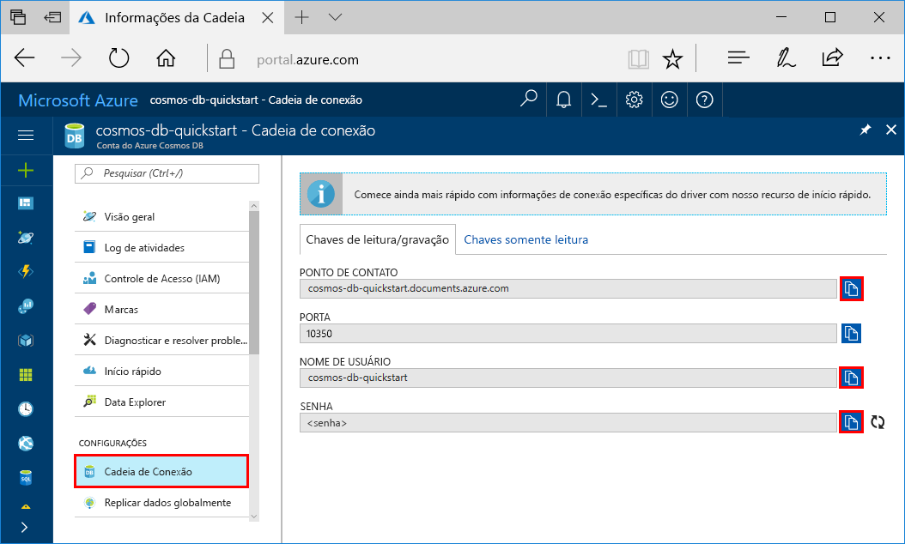
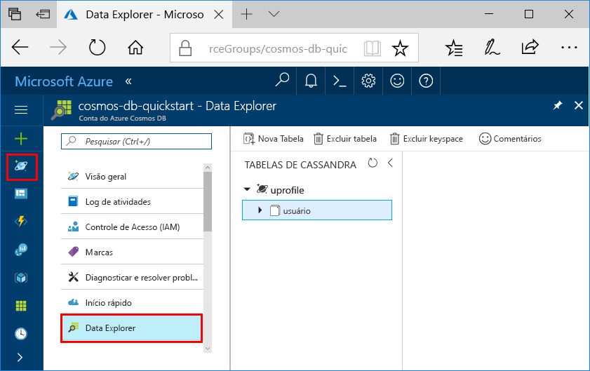

# <a name="quickstart-build-a-cassandra-app-with-nodejs-and-azure-cosmos-db"></a>Guia de início rápido: compilar um aplicativo Cassandra com o Node.js e o Azure Cosmos DB

Este guia de início rápido mostra como usar o Node.js e a [API Cassandra](cassandra-introduction.md) do Azure Cosmos DB para compilar um aplicativo de perfil clonando um exemplo do GitHub. Este guia de início rápido também mostra as etapas para a criação de uma conta do Azure Cosmos DB usando o Portal do Azure baseado na Web.

O Azure Cosmos DB é o serviço de banco de dados multimodelo distribuído globalmente da Microsoft. É possível criar e consultar rapidamente documentos, tabelas, valores-chave e bancos de dados de gráfico, todos os quais se beneficiam de recursos de distribuição global e escala horizontal e no núcleo do Azure Cosmos DB. 

## <a name="prerequisites"></a>Pré-requisitos

* Acesso ao programa de versão prévia da API Cassandra do Azure Cosmos DB. Caso ainda não tenha solicitado o acesso, [inscreva-se agora](https://aka.ms/cosmosdb-cassandra-signup).
* [Node.js](https://nodejs.org/en/) versão v0.10.29 ou superior
* [Git](http://git-scm.com/)

[!INCLUDE [quickstarts-free-trial-note](../../includes/quickstarts-free-trial-note.md)] Como alternativa, você pode [Experimentar o Azure Cosmos DB gratuitamente](https://azure.microsoft.com/try/cosmosdb/) sem uma assinatura do Azure, sem ônus e sem compromisso.


## <a name="create-a-database-account"></a>Criar uma conta de banco de dados

Antes de criar um banco de dados de documentos, você precisa criar uma conta Cassandra com o Azure Cosmos DB.

[!INCLUDE [cosmos-db-create-dbaccount-cassandra](../../includes/cosmos-db-create-dbaccount-cassandra.md)]

## <a name="clone-the-sample-application"></a>Clonar o aplicativo de exemplo

Agora vamos clonar um aplicativo de API Cassandra do github, definir a cadeia de conexão e executá-lo. Você verá como é fácil trabalhar usando dados de forma programática. 

1. Abra uma janela de terminal de git, como git bash, e use o comando `cd` para alterar para uma pasta para instalar o aplicativo de exemplo. 

    ```bash
    cd "C:\git-samples"
    ```

2. Execute o comando a seguir para clonar o repositório de exemplo. Este comando cria uma cópia do aplicativo de exemplo no seu computador.

    ```bash
    git clone https://github.com/Azure-Samples/azure-cosmos-db-cassandra-nodejs-getting-started.git
    ```

## <a name="review-the-code"></a>Examine o código

Esta etapa é opcional. Se você estiver interessado em aprender como os recursos de banco de dados são criados no código, poderá examinar os trechos de código a seguir. Os trechos de código são obtidos do arquivo `uprofile.js` na pasta C:\git-samples\azure-cosmos-db-cassandra-nodejs-getting-started. Caso contrário, você poderá pular para [Atualizar sua cadeia de conexão](#update-your-connection-string). 

* O nome de usuário e a senha são definidos usando a página de cadeia de conexão no Portal do Azure. O 'path\to\cert' fornece um caminho para um certificado X509. 

   ```nodejs
   var ssl_option = {
        cert : fs.readFileSync("path\to\cert"),
        rejectUnauthorized : true,
        secureProtocol: 'TLSv1_2_method'
        };
   const authProviderLocalCassandra = new cassandra.auth.PlainTextAuthProvider(config.username, config.password);
   ```

* O `client` é inicializado com informações do contactPoint. O contactPoint é recuperado do Portal do Azure.

    ```nodejs
    const client = new cassandra.Client({contactPoints: [config.contactPoint], authProvider: authProviderLocalCassandra, sslOptions:ssl_option});
    ```

* O `client` se conecta à API Cassandra do Azure Cosmos DB.

    ```nodejs
    client.connect(next);
    ```

* Um novo keyspace é criado.

    ```nodejs
    function createKeyspace(next) {
        var query = "CREATE KEYSPACE IF NOT EXISTS uprofile WITH replication = {\'class\': \'NetworkTopologyStrategy\', \'datacenter1\' : \'1\' }";
        client.execute(query, next);
        console.log("created keyspace");    
  }
    ```

* Uma nova tabela é criada.

   ```nodejs
   function createTable(next) {
    var query = "CREATE TABLE IF NOT EXISTS uprofile.user (user_id int PRIMARY KEY, user_name text, user_bcity text)";
        client.execute(query, next);
        console.log("created table");
   },
   ```

* Entidades de chave/valor são inseridas.

    ```nodejs
    ...
       {
          query: 'INSERT INTO  uprofile.user  (user_id, user_name , user_bcity) VALUES (?,?,?)',
          params: [5, 'IvanaV', 'Belgaum', '2017-10-3136']
        }
    ];
    client.batch(queries, { prepare: true}, next);
    ```

* Consulta para obter todos os valores de chave.

    ```nodejs
   var query = 'SELECT * FROM uprofile.user';
    client.execute(query, { prepare: true}, function (err, result) {
      if (err) return next(err);
      result.rows.forEach(function(row) {
        console.log('Obtained row: %d | %s | %s ',row.user_id, row.user_name, row.user_bcity);
      }, this);
      next();
    });
    ```  
    
* Consulta para obter uma chave-valor.

    ```nodejs
    function selectById(next) {
        console.log("\Getting by id");
        var query = 'SELECT * FROM uprofile.user where user_id=1';
        client.execute(query, { prepare: true}, function (err, result) {
        if (err) return next(err);
            result.rows.forEach(function(row) {
            console.log('Obtained row: %d | %s | %s ',row.user_id, row.user_name, row.user_bcity);
        }, this);
        next();
        });
    }
    ```  

## <a name="update-your-connection-string"></a>Atualizar sua cadeia de conexão

Agora, volte ao portal do Azure para obter informações sobre a cadeia de conexão e copiá-las para o aplicativo. Isso permite que seu aplicativo se comunique com o banco de dados hospedado.

1. No [Portal do Azure](http://portal.azure.com/), clique em **Cadeia de Conexão**. 

    Use o  no lado direito da tela para copiar o valor superior, o PONTO DE CONTATO.

    

2. Abra o arquivo `config.js` . 

3. Cole o valor PONTO DE CONTATO do portal sobre `<FillMEIN>` na linha 4.

    Agora a linha 4 deve ser semelhante a 

    `config.contactPoint = "cosmos-db-quickstarts.documents.azure.com:10350"`

4. Copie o valor NOME DE USUÁRIO do portal e cole-o sobre `<FillMEIN>` na linha 2.

    Agora a linha 2 deve ser semelhante a 

    `config.username = 'cosmos-db-quickstart';`
    
5. Copie o valor SENHA do portal e cole-o sobre `<FillMEIN>` na linha 3.

    Agora a linha 3 deve ser semelhante a

    `config.password = '2Ggkr662ifxz2Mg==';`

6. Salve o arquivo config.js.
    
## <a name="use-the-x509-certificate"></a>Use o certificado X509 

1. Se você precisar adicionar o Baltimore CyberTrust Root, ele possui número de série 02:00:00:b9 e impressão digital SHA1 d4🇩🇪20:d0:5e:66:fc:53:fe:1a:50:88:2c:78:db:28:52:ca:e4:74. Ele pode ser baixado do https://cacert.omniroot.com/bc2025.crt, salvo em um arquivo local com extensão .cer. 

2. Abra o uprofile.js e altere o 'path\to\cert' para apontar para seu novo certificado. 

3. Salve o uprofile.js. 

## <a name="run-the-app"></a>Execute o aplicativo

1. Na janela do terminal git, execute `npm install` para instalar os módulos npm necessários.

2. Execute `node uprofile.js` para iniciar seu aplicativo de nó.

3. Verifique se os resultados estão conforme o esperado na linha de comando.

    

    Pressione CTRL + C para interromper a execução do programa e feche a janela do console. 

    Agora é possível abrir o Data Explorer no Portal do Azure para ver a consulta, modificar e trabalhar com esses novos dados. 

     

## <a name="review-slas-in-the-azure-portal"></a>Examinar SLAs no Portal do Azure

[!INCLUDE [cosmosdb-tutorial-review-slas](../../includes/cosmos-db-tutorial-review-slas.md)]

## <a name="clean-up-resources"></a>Limpar recursos

[!INCLUDE [cosmosdb-delete-resource-group](../../includes/cosmos-db-delete-resource-group.md)]

## <a name="next-steps"></a>Próximas etapas

Neste início rápido, você aprendeu como criar uma conta do Azure Cosmos DB, como criar uma coleção usando o Data Explorer e como executar um aplicativo. Agora, é possível importar outros dados para sua conta do BD Cosmos. 

> [!div class="nextstepaction"]
> [Importar dados do Cassandra no Azure Cosmos DB](cassandra-import-data.md)


