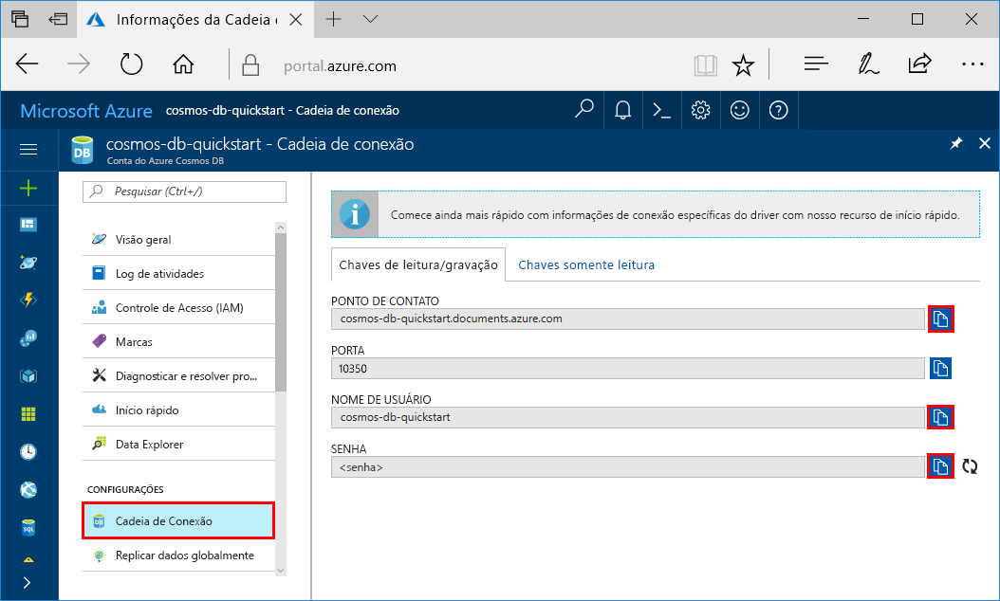
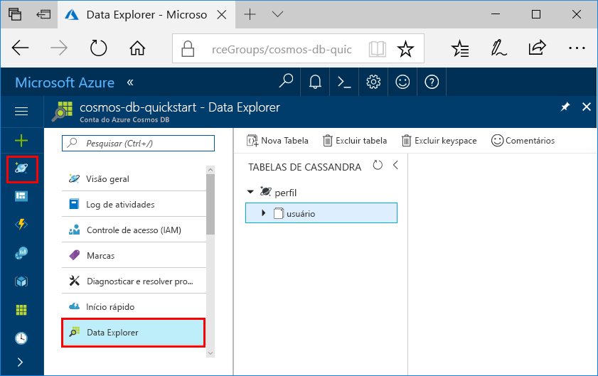

# <a name="quickstart-build-a-cassandra-app-with-python-and-azure-cosmos-db"></a>Guia de início rápido: compilar um aplicativo do Cassandra com o Python e o Azure Cosmos DB

Este guia de início rápido mostra como usar o Python e a [API Cassandra](cassandra-introduction.md) do Azure Cosmos DB para compilar um aplicativo de perfil clonando um exemplo do GitHub. Este guia de início rápido também mostra as etapas para a criação de uma conta do Azure Cosmos DB usando o Portal do Azure baseado na Web.

O Azure Cosmos DB é o serviço de banco de dados multimodelo distribuído globalmente da Microsoft. É possível criar e consultar rapidamente documentos, tabelas, valores-chave e bancos de dados de gráfico, todos os quais se beneficiam de recursos de distribuição global e escala horizontal e no núcleo do Azure Cosmos DB.   

## <a name="prerequisites"></a>Pré-requisitos

[!INCLUDE [quickstarts-free-trial-note](../../includes/quickstarts-free-trial-note.md)] Como alternativa, você pode [Experimentar o Azure Cosmos DB gratuitamente](https://azure.microsoft.com/try/cosmosdb/) sem uma assinatura do Azure, sem ônus e sem compromisso.

Acesso ao programa de versão prévia da API Cassandra do Azure Cosmos DB. Caso ainda não tenha solicitado o acesso, [inscreva-se agora](cassandra-introduction.md#sign-up-now).

Além disso:
* Versão v2.7.14 do [Python](https://www.python.org/downloads/)
* [Git](http://git-scm.com/)
* [Driver do Python para Apache Cassandra](https://github.com/datastax/python-driver)

## <a name="create-a-database-account"></a>Criar uma conta de banco de dados

Antes de criar um banco de dados de documentos, você precisa criar uma conta Cassandra com o Azure Cosmos DB.

[!INCLUDE [cosmos-db-create-dbaccount-cassandra](../../includes/cosmos-db-create-dbaccount-cassandra.md)]

## <a name="clone-the-sample-application"></a>Clonar o aplicativo de exemplo

Agora vamos clonar um aplicativo de API Cassandra do github, definir a cadeia de conexão e executá-lo. Você verá como é fácil trabalhar usando dados de forma programática. 

1. Abra uma janela de terminal de git, como git bash, e use o comando `cd` para alterar para uma pasta para instalar o aplicativo de exemplo. 

    ```bash
    cd "C:\git-samples"
    ```

2. Execute o comando a seguir para clonar o repositório de exemplo. Este comando cria uma cópia do aplicativo de exemplo no seu computador. 

    ```bash
    git clone https://github.com/Azure-Samples/azure-cosmos-db-cassandra-python-getting-started.git
    ```

## <a name="review-the-code"></a>Examine o código

Esta etapa é opcional. Se você estiver interessado em aprender como os recursos de banco de dados são criados no código, poderá examinar os trechos de código a seguir. Os trechos de código são todos obtidos do arquivo `pyquickstart.py`. Caso contrário, você poderá pular para [Atualizar sua cadeia de conexão](#update-your-connection-string). 

* O nome de usuário e a senha são definidos usando a página de cadeia de conexão no Portal do Azure. Você substitui o path\to\cert pelo caminho para o certificado X509.

   ```python
    ssl_opts = {
            'ca_certs': 'path\to\cert',
            'ssl_version': ssl.PROTOCOL_TLSv1_2
            }
    auth_provider = PlainTextAuthProvider( username=cfg.config['username'], password=cfg.config['password'])
    cluster = Cluster([cfg.config['contactPoint']], port = cfg.config['port'], auth_provider=auth_provider, ssl_options=ssl_opts)
    session = cluster.connect()
   
   ```

* O `cluster` é inicializado com informações do contactPoint. O contactPoint é recuperado do Portal do Azure.

    ```python
   cluster = Cluster([cfg.config['contactPoint']], port = cfg.config['port'], auth_provider=auth_provider)
    ```

* O `cluster` se conecta à API Cassandra do Azure Cosmos DB.

    ```python
    session = cluster.connect()
    ```

* Um novo keyspace é criado.

    ```python
   session.execute('CREATE KEYSPACE IF NOT EXISTS uprofile WITH replication = {\'class\': \'NetworkTopologyStrategy\', \'datacenter1\' : \'1\' }')
    ```

* Uma nova tabela é criada.

   ```
   session.execute('CREATE TABLE IF NOT EXISTS uprofile.user (user_id int PRIMARY KEY, user_name text, user_bcity text)');
   ```

* Entidades de chave/valor são inseridas.

    ```Python
    insert_data = session.prepare("INSERT INTO  uprofile.user  (user_id, user_name , user_bcity) VALUES (?,?,?)")
    batch = BatchStatement()
    batch.add(insert_data, (1, 'LyubovK', 'Dubai'))
    batch.add(insert_data, (2, 'JiriK', 'Toronto'))
    batch.add(insert_data, (3, 'IvanH', 'Mumbai'))
    batch.add(insert_data, (4, 'YuliaT', 'Seattle'))
    ....
    session.execute(batch)
    ```

* Consulta para obter todos os valores de chave.

    ```Python
    rows = session.execute('SELECT * FROM uprofile.user')
    ```  
    
* Consulta para obter uma chave-valor.

    ```Python
    
    rows = session.execute('SELECT * FROM uprofile.user where user_id=1')
    ```  

## <a name="update-your-connection-string"></a>Atualizar sua cadeia de conexão

Agora, volte ao portal do Azure para obter informações sobre a cadeia de conexão e copiá-las para o aplicativo. Isso permite que seu aplicativo se comunique com o banco de dados hospedado.

1. No [Portal do Azure](http://portal.azure.com/), clique em **Cadeia de Conexão**. 

    Use o  no lado direito da tela para copiar o valor superior, o PONTO DE CONTATO.

    

2. Abra o arquivo `config.py` . 

3. Cole o valor PONTO DE CONTATO do portal sobre `<FILLME>` na linha 10.

    Agora a linha 10 deve ser semelhante a 

    `'contactPoint': 'cosmos-db-quickstarts.documents.azure.com:10350'`

4. Copie o valor NOME DE USUÁRIO do portal e cole-o sobre `<FILLME>` na linha 6.

    Agora a linha 6 deve ser semelhante a 

    `'username': 'cosmos-db-quickstart',`
    
5. Copie o valor SENHA do portal e cole-o sobre `<FILLME>` na linha 8.

    Agora a linha 8 deve ser semelhante a

    `'password' = '2Ggkr662ifxz2Mg==`';`

6. Salve o arquivo config.py.
    
## <a name="use-the-x509-certificate"></a>Use o certificado X509

1. Se você precisar adicionar o Baltimore CyberTrust Root, ele possui número de série 02:00:00:b9 e impressão digital SHA1 d4🇩🇪20:d0:5e:66:fc:53:fe:1a:50:88:2c:78:db:28:52:ca:e4:74. Ele pode ser baixado do https://cacert.omniroot.com/bc2025.crt, salvo em um arquivo local com extensão .cer

2. Abra o pyquickstart.py e altere o 'path\to\cert' para apontar para seu novo certificado.

3. Salve o pyquickstart.py.

## <a name="run-the-app"></a>Execute o aplicativo

1. Use o comando cd no terminal git para alterar para a pasta azure-cosmos-db-cassandra-python-getting-started. 

2. Execute os seguintes comandos para instalar os módulos necessários:

    ```python
    python -m pip install cassandra-driver
    python -m pip install prettytable
    python -m pip install requests
    python -m pip install pyopenssl
    ```

2. Execute o seguinte comando para iniciar o aplicativo de nó:

    ```
    python pyquickstart.py
    ```

3. Verifique se os resultados estão conforme o esperado na linha de comando.

    Pressione CTRL + C para interromper a execução do programa e feche a janela do console. 

    
    
    Agora é possível abrir o Data Explorer no Portal do Azure para ver a consulta, modificar e trabalhar com esses novos dados. 

    

## <a name="review-slas-in-the-azure-portal"></a>Examinar SLAs no Portal do Azure

[!INCLUDE [cosmosdb-tutorial-review-slas](../../includes/cosmos-db-tutorial-review-slas.md)]

## <a name="clean-up-resources"></a>Limpar recursos

[!INCLUDE [cosmosdb-delete-resource-group](../../includes/cosmos-db-delete-resource-group.md)]

## <a name="next-steps"></a>Próximas etapas

Neste início rápido, você aprendeu como criar uma conta do Azure Cosmos DB, como criar uma coleção usando o Data Explorer e como executar um aplicativo. Agora, é possível importar outros dados para sua conta do BD Cosmos. 

> [!div class="nextstepaction"]
> [Importar dados do Cassandra para o Azure Cosmos DB](cassandra-import-data.md)

