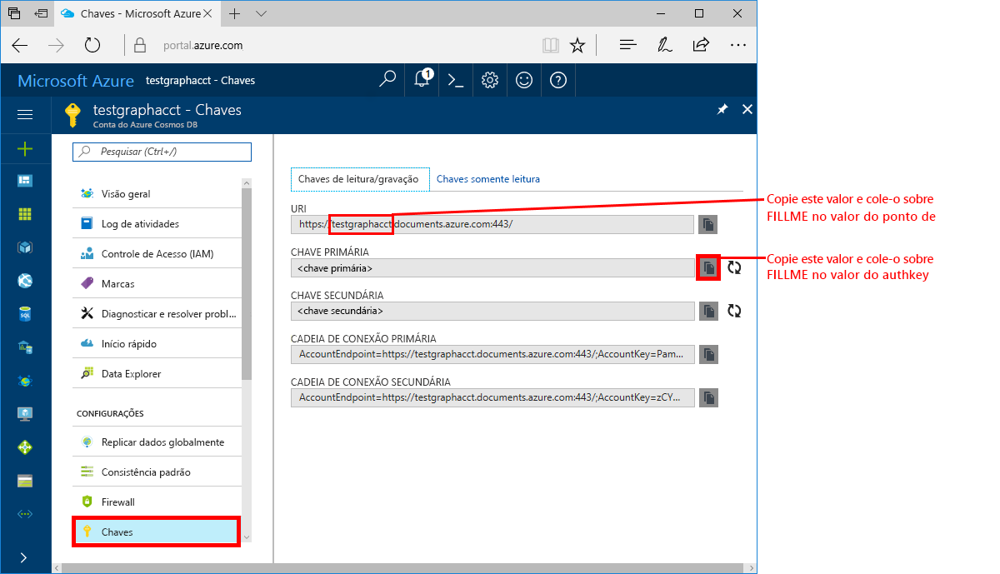
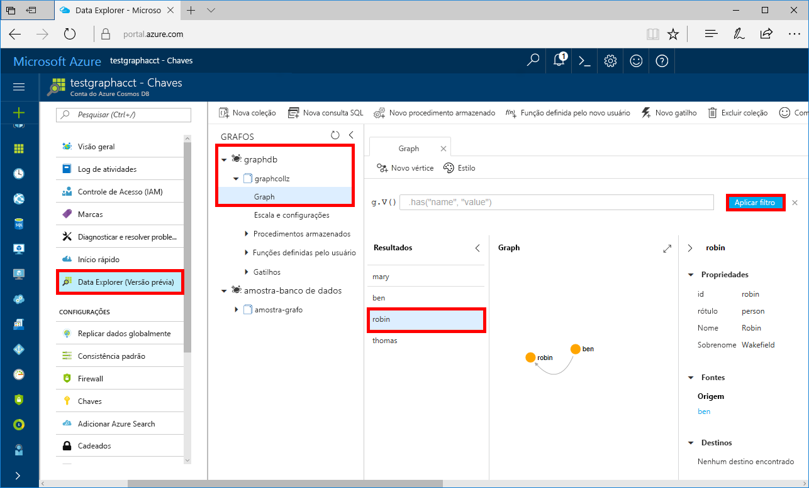

# <a name="azure-cosmos-db-build-a-net-framework-or-core-application-using-the-graph-api"></a>Azure Cosmos DB: compilar um aplicativo .NET Framework ou Core usando a API do Graph

O Azure Cosmos DB é o serviço de banco de dados multimodelo distribuído globalmente da Microsoft. É possível criar e consultar rapidamente documentos, chave/valor e bancos de dados do grafo. Todos se beneficiam de recursos de escala horizontal e distribuição global no núcleo do Azure Cosmos DB. 

Este início rápido demonstra como criar uma conta do Azure Cosmos DB, um banco de dados e um grafo (contêiner) usando o Portal do Azure. Depois, compile e execute um aplicativo de console criado usando o driver de código-aberto [Gremlin.Net](http://tinkerpop.apache.org/docs/3.2.7/reference/#gremlin-DotNet).  

## <a name="prerequisites"></a>pré-requisitos

Se você ainda não tem o Visual 2017 Studio instalado, poderá baixar e usar o **Visual Studio 2017 Community Edition** [gratuito](https://www.visualstudio.com/downloads/). Verifique se você habilitou o **desenvolvimento do Azure** durante a instalação do Visual Studio.

Se você já tem o Visual Studio 2017 instalado, verifique se está com o [Visual Studio 2017 Atualização 3](https://www.visualstudio.com/en-us/news/releasenotes/vs2017-relnotes).

[!INCLUDE [quickstarts-free-trial-note](../../includes/quickstarts-free-trial-note.md)]

## <a name="create-a-database-account"></a>Criar uma conta de banco de dados

[!INCLUDE [cosmos-db-create-dbaccount-graph](../../includes/cosmos-db-create-dbaccount-graph.md)]

## <a name="add-a-graph"></a>Adicionar um grafo

[!INCLUDE [cosmos-db-create-graph](../../includes/cosmos-db-create-graph.md)]

## <a name="clone-the-sample-application"></a>Clonar o aplicativo de exemplo

Agora, clonaremos um aplicativo de API do Graph do GitHub, definiremos a cadeia de conexão e o executaremos. Você verá como é fácil trabalhar usando dados de forma programática. 

1. Abra uma janela de terminal do Git, como git bash, e `cd` para seu diretório de trabalho.  

2. Execute o comando a seguir para clonar o repositório de exemplo. 

    ```bash
    git clone https://github.com/Azure-Samples/azure-cosmos-db-graph-gremlindotnet-getting-started.git
    ```

3. Em seguida, abra o Visual Studio e o arquivo da solução.

4. Restaure os pacotes NuGet no projeto. Isso deve incluir o driver Gremlin.Net, bem como o pacote Newtonsoft.Json.

5. Também é possível instalar o driver Gremlin.Net manualmente, versão 3.2.7, usando o gerenciador de pacotes Nuget ou o [utilitário de linha de comando do nuget](https://docs.microsoft.com/en-us/nuget/install-nuget-client-tools): 

    ```bash
    nuget install Gremlin.Net -Version 3.2.7
    ```

## <a name="review-the-code"></a>Examine o código

Façamos uma rápida revisão do que está acontecendo no aplicativo. Abra o arquivo Program.cs e você verá que essas linhas de código criam os recursos do BD Cosmos do Azure. 

* Defina os parâmetros de conexão baseados na conta criada acima (linha 19): 

    ```csharp
    private static string hostname = "your-endpoint.gremlin.cosmosdb.azure.com";
    private static int port = 443;
    private static string authKey = "your-authentication-key";
    private static string database = "your-database";
    private static string collection = "your-collection-or-graph";
    ```

* Os comandos de Gremlin a serem executados são listados em um dicionário (linha 26):

    ```csharp
    private static Dictionary<string, string> gremlinQueries = new Dictionary<string, string>
    {
        { "Cleanup",        "g.V().drop()" },
        { "AddVertex 1",    "g.addV('person').property('id', 'thomas').property('firstName', 'Thomas').property('age', 44)" },
        { "AddVertex 2",    "g.addV('person').property('id', 'mary').property('firstName', 'Mary').property('lastName', 'Andersen').property('age', 39)" },
        { "AddVertex 3",    "g.addV('person').property('id', 'ben').property('firstName', 'Ben').property('lastName', 'Miller')" },
        { "AddVertex 4",    "g.addV('person').property('id', 'robin').property('firstName', 'Robin').property('lastName', 'Wakefield')" },
        { "AddEdge 1",      "g.V('thomas').addE('knows').to(g.V('mary'))" },
        { "AddEdge 2",      "g.V('thomas').addE('knows').to(g.V('ben'))" },
        { "AddEdge 3",      "g.V('ben').addE('knows').to(g.V('robin'))" },
        { "UpdateVertex",   "g.V('thomas').property('age', 44)" },
        { "CountVertices",  "g.V().count()" },
        { "Filter Range",   "g.V().hasLabel('person').has('age', gt(40))" },
        { "Project",        "g.V().hasLabel('person').values('firstName')" },
        { "Sort",           "g.V().hasLabel('person').order().by('firstName', decr)" },
        { "Traverse",       "g.V('thomas').out('knows').hasLabel('person')" },
        { "Traverse 2x",    "g.V('thomas').out('knows').hasLabel('person').out('knows').hasLabel('person')" },
        { "Loop",           "g.V('thomas').repeat(out()).until(has('id', 'robin')).path()" },
        { "DropEdge",       "g.V('thomas').outE('knows').where(inV().has('id', 'mary')).drop()" },
        { "CountEdges",     "g.E().count()" },
        { "DropVertex",     "g.V('thomas').drop()" },
    };
    ```


* Crie um objeto de conexão `GremlinServer` usando os parâmetros fornecidos acima (linha 52):

    ```csharp
    var gremlinServer = new GremlinServer(hostname, port, enableSsl: true, 
                                                    username: "/dbs/" + database + "/colls/" + collection, 
                                                    password: authKey);
    ```

* Crie um novo objeto `GremlinClient` (linha 56):

    ```csharp
    var gremlinClient = new GremlinClient(gremlinServer);
    ```

* Execute cada consulta Gremlin usando o objeto `GremlinClient` com uma tarefa assíncrona (linha 63). Isso lerá as consultas Gremlin do dicionário definido acima (linha 26):

    ```csharp
    var task = gremlinClient.SubmitAsync<dynamic>(query.Value);
    task.Wait();
    ```

* Recupere o resultado e leia os valores, que são formatados como um dicionário, usando a classe `JsonSerializer` do Newtonsoft.Json:

    ```csharp
    foreach (var result in task.Result)
    {
        // The vertex results are formed as dictionaries with a nested dictionary for their properties
        string output = JsonConvert.SerializeObject(result);
        Console.WriteLine(String.Format("\tResult:\n\t{0}", output));
    }
    ```

## <a name="update-your-connection-string"></a>Atualizar sua cadeia de conexão

Agora, volte ao portal do Azure para obter informações sobre a cadeia de conexão e copiá-las para o aplicativo.

1. No [Portal do Azure](http://portal.azure.com/), clique em **Chaves**. 

    Copie a primeira parte do valor do URI.

    

2. Em Program.cs, cole o valor sobre `your-endpoint` na variável `hostname` na linha 19. 

    `"private static string hostname = "your-endpoint.gremlin.cosmosdb.azure.com";`

    Agora, o valor de ponto de extremidade deve ter esta aparência:

    `"private static string hostname = "testgraphacct.gremlin.cosmosdb.azure.com";`

3. Copie seu valor de **CHAVE PRIMÁRIA** no portal e cole-o na variável `authkey`, substituindo o espaço reservado `"your-authentication-key"` na linha 21. 

    `private static string authKey = "your-authentication-key";`

4. Usando as informações do banco de dados criado acima, cole o nome do banco de dados dentro da variável `database` na linha 22. 

    `private static string database = "your-database";`

5. De modo semelhante, usando as informações da coleção criada acima, cole a coleção (que também é o nome do grafo) dentro da variável `collection` na linha 23. 

    `private static string collection = "your-collection-or-graph";`

6. Salve o arquivo Program.cs. 

Agora, você atualizou o aplicativo com todas as informações necessárias para se comunicar com o Azure Cosmos DB. 

## <a name="run-the-console-app"></a>Execute o aplicativo de console

Clique em CTRL + F5 para executar o aplicativo. O aplicativo imprimirá os comandos e resultados de consulta Gremlin no console.

   A janela do console exibe os vértices e bordas sendo adicionadas ao grafo. Quando o script for concluído, pressione ENTER para fechar a janela do console.

## <a name="browse-using-the-data-explorer"></a>Navegar usando o Data Explorer

Agora você pode voltar ao Data Explorer no Portal do Azure e procurar e consultar seus novos dados de grafo.

1. No Data Explorer, o novo banco de dados aparece no painel Grafos. Expanda os nós do banco de dados e da coleção, depois clique em **Grafo**.

2. Clique no botão **Aplicar Filtro** para usar a consulta padrão para exibir todos os vértices no grafo. Os dados gerados pelo aplicativo de exemplo são exibidos no painel Grafos.

    É possível ampliar e diminuir o zoom do grafo, expandir o espaço de exibição do grafo, adicionar outros vértices e mover vértices na superfície de exibição.

    

## <a name="review-slas-in-the-azure-portal"></a>Examinar SLAs no Portal do Azure

[!INCLUDE [cosmosdb-tutorial-review-slas](../../includes/cosmos-db-tutorial-review-slas.md)]

## <a name="clean-up-resources"></a>Limpar recursos

Se você não continuar usando este aplicativo, exclua todos os recursos criados por esse início rápido no portal do Azure com as seguintes etapas: 

1. No menu à esquerda no Portal do Azure, clique em **Grupos de recursos** e depois clique no nome do recurso criado. 
2. Em sua página de grupo de recursos, clique em **Excluir**, digite o nome do recurso para excluir na caixa de texto e depois clique em **Excluir**.

## <a name="next-steps"></a>Próximas etapas

Neste início rápido, você aprendeu como criar uma conta do Azure Cosmos DB, como criar um grafo usando o Data Explorer e como executar um aplicativo. Agora, você pode criar consultas mais complexas e implementar uma lógica de passagem de grafo avançada usando o Gremlin. 

> [!div class="nextstepaction"]
> [Consultar usando o Gremlin](tutorial-query-graph.md)

