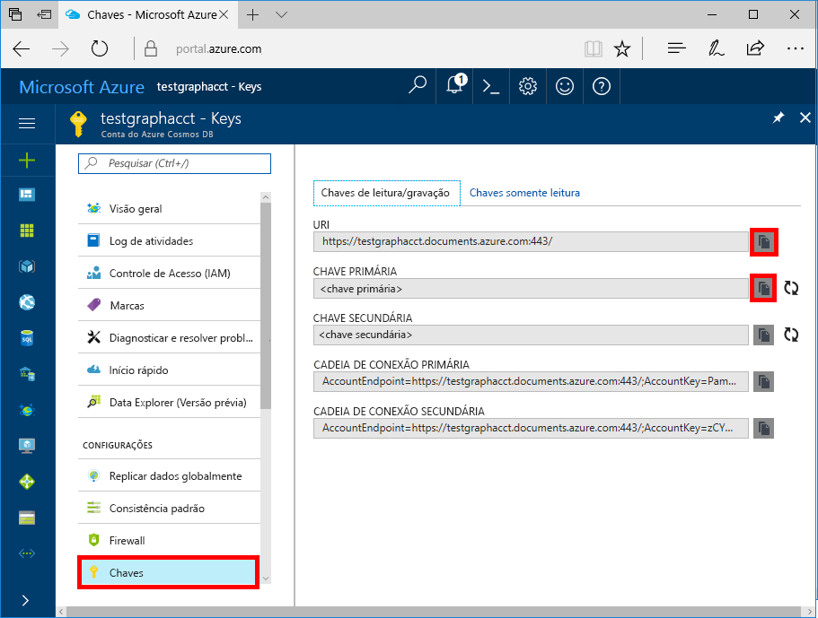

# <a name="azure-cosmos-db-create-query-and-traverse-a-graph-in-the-gremlin-console"></a>BD Cosmos do Azure: criar, consultar e percorrer um gráfico no console do Gremlin

O BD Cosmos do Azure é o serviço multimodelo de banco de dados distribuído globalmente da Microsoft. É possível criar e consultar rapidamente documentos, chave/valor e bancos de dados do gráfico. Todos se beneficiam de recursos de escala horizontal e distribuição global no núcleo do BD Cosmos do Azure. 

Este início rápido demonstra como criar uma conta do Azure Cosmos DB, um banco de dados e um gráfico (contêiner) usando o Portal do Azure e, depois, use o [console do Gremlin](https://tinkerpop.apache.org/docs/current/reference/#gremlin-console) do [Apache TinkerPop](http://tinkerpop.apache.org) para trabalhar com os dados da API do Graph (versão prévia). Neste tutorial, você criará e consultará vértices e bordas ao atualizar uma propriedade de vértice, consultar vértices, percorrer o gráfico e remover um vértice.


O console Gremlin é baseado em Groovy/Java e é executado no Linux, Mac e Windows. Você pode baixá-lo no [site do Apache TinkerPop](https://www.apache.org/dyn/closer.lua/tinkerpop/3.2.5/apache-tinkerpop-gremlin-console-3.2.5-bin.zip).

## <a name="prerequisites"></a>Pré-requisitos

Você precisa ter uma assinatura do Azure para criar uma conta do BD Cosmos do Azure para este início rápido.

[!INCLUDE [quickstarts-free-trial-note](../../includes/quickstarts-free-trial-note.md)]

Também é necessário instalar o [Console do Gremlin](http://tinkerpop.apache.org/). Use a versão 3.2.5 ou posterior.

## <a name="create-a-database-account"></a>Crie uma conta de banco de dados

[!INCLUDE [cosmos-db-create-dbaccount-graph](../../includes/cosmos-db-create-dbaccount-graph.md)]

## <a name="add-a-graph"></a>Adicionar um gráfico

[!INCLUDE [cosmos-db-create-graph](../../includes/cosmos-db-create-graph.md)]

## <a id="ConnectAppService"></a>Conectar-se ao serviço de aplicativo
1. Antes de iniciar o console do Gremlin, crie ou modifique seu arquivo de configuração remote-secure.yaml no diretório apache-tinkerpop-gremlin-console-3.2.5/conf.
2. Preencha as configurações de *host*, *porta*, *nome de usuário*, *senha*, *connectionPool* e *serializador*:

    Configuração|Valor sugerido|Descrição
    ---|---|---
    hosts|[***.graphs.azure.com]|Confira a captura de tela abaixo. Esse é o valor de URI Gremlin na página Visão geral do portal do Azure, entre colchetes, com :443 / à direita removido.<br><br>Esse valor também pode ser recuperado da guia de chaves usando o valor de URI removendo https://, alterando os documentos para gráficos e removendo :443/ à direita.
    porta|443|Definir para 443.
    Nome de Usuário|*Seu nome de usuário*|O recurso do formulário `/dbs/<db>/colls/<coll>` onde `<db>` é o nome do banco de dados e `<coll>` é o nome da coleção.
    Senha|*Sua chave primária*| Confira a segunda captura de tela abaixo. Esta é sua chave primária, que você pode recuperar da página de chaves do portal do Azure, na caixa de chave Primária. Use o botão de cópia no lado esquerdo da caixa para copiar o valor.
    connectionPool|{enableSsl: true}|Sua configuração do pool de conexão para SSL.
    serializador|{ className: org.apache.tinkerpop.gremlin.<br>driver.ser.GraphSONMessageSerializerV1d0,<br> config: { serializeResultToString: true }}|Defina para esse valor e exclua todas as quebras de linha `\n` ao colar o valor.

    Para obter o valor de hosts, copie o valor do **URI Gremlin** na página **Visão geral**: 

    Para obter o valor da senha, copie a **Chave primária** na página **Chaves**: 


3. No seu terminal, execute `bin/gremlin.bat` ou `bin/gremlin.sh` para iniciar o [Gremlin Console](http://tinkerpop.apache.org/docs/3.2.5/tutorials/getting-started/).
4. No seu terminal, execute `:remote connect tinkerpop.server conf/remote-secure.yaml` para se conectar ao seu serviço de aplicativo.

    > [!TIP]
    > Se você receber o erro `No appenders could be found for logger`, verifique se atualizou o valor de serializador no arquivo remote-secure.yaml, conforme descrito na etapa 2. 

Ótimo! Agora que a instalação está concluída, vamos começar a executar alguns dos comandos de console.

Vamos tentar um comando count() simples. Digite o seguinte no console no prompt:
```
:> g.V().count()
```

> [!TIP]
> Observe o `:>` que precede o texto `g.V().count()`. 
>
> Isso faz parte do comando que você precisa digitar. É importante ao usar o console Gremlin, com o Azure Cosmos DB.  
>
> Omitir este prefixo `:>` instrui o console a executar o comando no local, geralmente, em um gráfico na memória.
> O uso de `:>` informa ao console para executar um comando remoto, neste caso no Cosmos DB (ou no emulador de localhost ou em uma instância > do Azure).


## <a name="create-vertices-and-edges"></a>Criar vértices e bordas

Vamos começar pela adição de quatro vértices pessoais para *Paulo*, *Maria Eduarda*, *Valentina*, *Pedro* e *Davi*.

Entrada (Thomas):

```
:> g.addV('person').property('firstName', 'Thomas').property('lastName', 'Andersen').property('age', 44).property('userid', 1)
```

Saída:

```
==>[id:796cdccc-2acd-4e58-a324-91d6f6f5ed6d,label:person,type:vertex,properties:[firstName:[[id:f02a749f-b67c-4016-850e-910242d68953,value:Thomas]],lastName:[[id:f5fa3126-8818-4fda-88b0-9bb55145ce5c,value:Andersen]],age:[[id:f6390f9c-e563-433e-acbf-25627628016e,value:44]],userid:[[id:796cdccc-2acd-4e58-a324-91d6f6f5ed6d|userid,value:1]]]]
```
Entrada (Mary Kay):

```
:> g.addV('person').property('firstName', 'Mary Kay').property('lastName', 'Andersen').property('age', 39).property('userid', 2)

```

Saída:

```
==>[id:0ac9be25-a476-4a30-8da8-e79f0119ea5e,label:person,type:vertex,properties:[firstName:[[id:ea0604f8-14ee-4513-a48a-1734a1f28dc0,value:Mary Kay]],lastName:[[id:86d3bba5-fd60-4856-9396-c195ef7d7f4b,value:Andersen]],age:[[id:bc81b78d-30c4-4e03-8f40-50f72eb5f6da,value:39]],userid:[[id:0ac9be25-a476-4a30-8da8-e79f0119ea5e|userid,value:2]]]]

```

Entrada (Robin):

```
:> g.addV('person').property('firstName', 'Robin').property('lastName', 'Wakefield').property('userid', 3)
```

Saída:

```
==>[id:8dc14d6a-8683-4a54-8d74-7eef1fb43a3e,label:person,type:vertex,properties:[firstName:[[id:ec65f078-7a43-4cbe-bc06-e50f2640dc4e,value:Robin]],lastName:[[id:a3937d07-0e88-45d3-a442-26fcdfb042ce,value:Wakefield]],userid:[[id:8dc14d6a-8683-4a54-8d74-7eef1fb43a3e|userid,value:3]]]]
```

Entrada (Ben):

```
:> g.addV('person').property('firstName', 'Ben').property('lastName', 'Miller').property('userid', 4)

```

Saída:

```
==>[id:ee86b670-4d24-4966-9a39-30529284b66f,label:person,type:vertex,properties:[firstName:[[id:a632469b-30fc-4157-840c-b80260871e9a,value:Ben]],lastName:[[id:4a08d307-0719-47c6-84ae-1b0b06630928,value:Miller]],userid:[[id:ee86b670-4d24-4966-9a39-30529284b66f|userid,value:4]]]]
```

Entrada (tomada):

```
:> g.addV('person').property('firstName', 'Jack').property('lastName', 'Connor').property('userid', 5)
```

Saída:

```
==>[id:4c835f2a-ea5b-43bb-9b6b-215488ad8469,label:person,type:vertex,properties:[firstName:[[id:4250824e-4b72-417f-af98-8034aa15559f,value:Jack]],lastName:[[id:44c1d5e1-a831-480a-bf94-5167d133549e,value:Connor]],userid:[[id:4c835f2a-ea5b-43bb-9b6b-215488ad8469|userid,value:5]]]]
```


Em seguida, vamos adicionar bordas para relações entre as pessoas.

Entrada (Thomas -> Mary Kay):

```
:> g.V().hasLabel('person').has('firstName', 'Thomas').addE('knows').to(g.V().hasLabel('person').has('firstName', 'Mary Kay'))
```

Saída:

```
==>[id:c12bf9fb-96a1-4cb7-a3f8-431e196e702f,label:knows,type:edge,inVLabel:person,outVLabel:person,inV:0d1fa428-780c-49a5-bd3a-a68d96391d5c,outV:1ce821c6-aa3d-4170-a0b7-d14d2a4d18c3]
```

Entrada (Thomas -> Robin):

```
:> g.V().hasLabel('person').has('firstName', 'Thomas').addE('knows').to(g.V().hasLabel('person').has('firstName', 'Robin'))
```

Saída:

```
==>[id:58319bdd-1d3e-4f17-a106-0ddf18719d15,label:knows,type:edge,inVLabel:person,outVLabel:person,inV:3e324073-ccfc-4ae1-8675-d450858ca116,outV:1ce821c6-aa3d-4170-a0b7-d14d2a4d18c3]
```

Entrada (Robin -> Ben):

```
:> g.V().hasLabel('person').has('firstName', 'Robin').addE('knows').to(g.V().hasLabel('person').has('firstName', 'Ben'))
```

Saída:

```
==>[id:889c4d3c-549e-4d35-bc21-a3d1bfa11e00,label:knows,type:edge,inVLabel:person,outVLabel:person,inV:40fd641d-546e-412a-abcc-58fe53891aab,outV:3e324073-ccfc-4ae1-8675-d450858ca116]
```

## <a name="update-a-vertex"></a>Atualizar um vértice

Vamos atualizar o vértice do *Thomas* com uma nova idade de *45*.

Entrada:
```
:> g.V().hasLabel('person').has('firstName', 'Thomas').property('age', 45)
```
Saída:

```
==>[id:ae36f938-210e-445a-92df-519f2b64c8ec,label:person,type:vertex,properties:[firstName:[[id:872090b6-6a77-456a-9a55-a59141d4ebc2,value:Thomas]],lastName:[[id:7ee7a39a-a414-4127-89b4-870bc4ef99f3,value:Andersen]],age:[[id:a2a75d5a-ae70-4095-806d-a35abcbfe71d,value:45]]]]
```

## <a name="query-your-graph"></a>Consultar o gráfico

Agora, vamos executar uma variedade de consultas em relação ao gráfico.

Primeiro, vamos tentar uma consulta com um filtro para retornar somente pessoas com mais de 40 anos de idade.

Entrada (consulta de filtro):

```
:> g.V().hasLabel('person').has('age', gt(40))
```

Saída:

```
==>[id:ae36f938-210e-445a-92df-519f2b64c8ec,label:person,type:vertex,properties:[firstName:[[id:872090b6-6a77-456a-9a55-a59141d4ebc2,value:Thomas]],lastName:[[id:7ee7a39a-a414-4127-89b4-870bc4ef99f3,value:Andersen]],age:[[id:a2a75d5a-ae70-4095-806d-a35abcbfe71d,value:45]]]]
```

Em seguida, vamos projetar o primeiro nome para as pessoas que têm mais de 40 anos de idade.

Entrada (filtro + consulta de projeção):

```
:> g.V().hasLabel('person').has('age', gt(40)).values('firstName')
```

Saída:

```
==>Thomas
```

## <a name="traverse-your-graph"></a>Percorrer o gráfico

Vamos percorrer o gráfico para retornar todos os amigos de Thomas.

Entrada (amigos de Thomas):

```
:> g.V().hasLabel('person').has('firstName', 'Thomas').outE('knows').inV().hasLabel('person')
```

Saída: 

```
==>[id:f04bc00b-cb56-46c4-a3bb-a5870c42f7ff,label:person,type:vertex,properties:[firstName:[[id:14feedec-b070-444e-b544-62be15c7167c,value:Mary Kay]],lastName:[[id:107ab421-7208-45d4-b969-bbc54481992a,value:Andersen]],age:[[id:4b08d6e4-58f5-45df-8e69-6b790b692e0a,value:39]]]]
==>[id:91605c63-4988-4b60-9a30-5144719ae326,label:person,type:vertex,properties:[firstName:[[id:f760e0e6-652a-481a-92b0-1767d9bf372e,value:Robin]],lastName:[[id:352a4caa-bad6-47e3-a7dc-90ff342cf870,value:Wakefield]]]]
```

Em seguida, vamos obter a próxima camada de vértices. Percorra o gráfico para retornar todos os amigos de Thomas.

Entrada (amigos de amigos de Thomas):

```
:> g.V().hasLabel('person').has('firstName', 'Thomas').outE('knows').inV().hasLabel('person').outE('knows').inV().hasLabel('person')
```
Saída:

```
==>[id:a801a0cb-ee85-44ee-a502-271685ef212e,label:person,type:vertex,properties:[firstName:[[id:b9489902-d29a-4673-8c09-c2b3fe7f8b94,value:Ben]],lastName:[[id:e084f933-9a4b-4dbc-8273-f0171265cf1d,value:Miller]]]]
```

## <a name="drop-a-vertex"></a>Remover um vértice

Agora vamos excluir um vértice do banco de dados do gráfico.

Entrada (tirar conector da tomada):

```
:> g.V().hasLabel('person').has('firstName', 'Jack').drop()
```

## <a name="clear-your-graph"></a>Limpar o gráfico

Por fim, vamos limpar o banco de dados de todos os vértices e bordas.

Entrada:

```
:> g.E().drop()
:> g.V().drop()
```

Parabéns! Você concluiu este tutorial sobre BD Cosmos do Azure: API do Graph!

## <a name="review-slas-in-the-azure-portal"></a>Examinar SLAs no Portal do Azure

[!INCLUDE [cosmosdb-tutorial-review-slas](../../includes/cosmos-db-tutorial-review-slas.md)]

## <a name="clean-up-resources"></a>Limpar recursos

Se você não continuar usando este aplicativo, exclua todos os recursos criados por esse início rápido no portal do Azure com as seguintes etapas:  

1. No menu à esquerda no Portal do Azure, clique em **Grupos de recursos** e depois clique no nome do recurso criado. 
2. Em sua página de grupo de recursos, clique em **Excluir**, digite o nome do recurso para excluir na caixa de texto e depois clique em **Excluir**.

## <a name="next-steps"></a>Próximas etapas

Neste início rápido, você aprendeu a criar uma conta do BD Cosmos do Azure, criar um gráfico usando o Data Explorer, criar vértices e bordas e percorrer o gráfico usando o console de Gremlin. Agora, você pode criar consultas mais complexas e implementar uma lógica de passagem de gráfico avançada usando o Gremlin. 

> [!div class="nextstepaction"]
> [Consultar usando o Gremlin](tutorial-query-graph.md)

