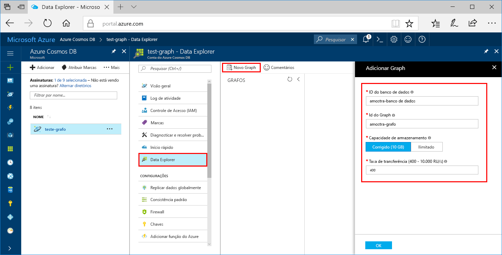

# <a name="azure-cosmos-db-create-a-graph-database-using-java-and-the-azure-portal"></a>Azure Cosmos DB: Criar um banco de dados de gráfico usando o Java e o portal do Azure

O BD Cosmos do Azure é o serviço multimodelo de banco de dados distribuído globalmente da Microsoft. Usando o Azure Cosmos DB, você pode criar e consultar rapidamente documentos, tabelas e bancos de dados de grafo gerenciados. 

Este guia de início rápido cria um banco de dados de grafos simples usando as ferramentas do Portal do Azure para o Azure Cosmos DB. Ele também mostra como criar rapidamente um aplicativo de console do Java usando um banco de dados de grafos com o driver [Gremlin Java](https://mvnrepository.com/artifact/org.apache.tinkerpop/gremlin-driver) do OSS. Estas instruções podem ser seguidas em qualquer sistema operacional compatível com Java. Este guia de início rápido familiariza você com a criação e a modificação dos grafos na interface do usuário ou programaticamente, o que for sua preferência. 

## <a name="prerequisites"></a>Pré-requisitos
[!INCLUDE [quickstarts-free-trial-note](../../includes/quickstarts-free-trial-note.md)]

Além disso:

* [Java Development Kit (JDK) 1.7 +](http://www.oracle.com/technetwork/java/javase/downloads/jdk8-downloads-2133151.html)
    * No Ubuntu, execute `apt-get install default-jdk` para instalar o JDK.
    * Defina a variável de ambiente JAVA_HOME para apontar para a pasta onde o JDK está instalado.
* [Baixar](http://maven.apache.org/download.cgi) e [instalar](http://maven.apache.org/install.html) um armazenamento binário [Maven](http://maven.apache.org/)
    * No Ubuntu, você pode executar `apt-get install maven` para instalar o Maven.
* [Git](https://www.git-scm.com/)
    * No Ubuntu, você pode executar `sudo apt-get install git` para instalar o Git.

## <a name="create-a-database-account"></a>Criar uma conta de banco de dados

Antes de criar um banco de dados de gráfico, você precisa criar uma conta do banco de dados Gremlin (Graph) com o Azure Cosmos DB.

[!INCLUDE [cosmos-db-create-dbaccount-graph](../../includes/cosmos-db-create-dbaccount-graph.md)]

## <a name="add-a-graph"></a>Adicionar um gráfico

Agora, você pode usar a ferramenta Data Explorer no portal do Azure para criar um banco de dados de gráfico. 

1. Clique em **Data Explorer** > **Novo Grafo**.

    A área **Adicionar Grafo** é exibida à direita, talvez seja necessário rolar para a direita para vê-la.

    

2. Na página **Adicionar Grafo**, insira as configurações do novo grafo.

    Configuração|Valor sugerido|Descrição
    ---|---|---
    ID do banco de dados|banco de dados de exemplo|Digite *banco de dados de exemplo* como o nome do novo banco de dados. Os nomes de banco de dados devem ter entre um e 255 caracteres e não podem conter `/ \ # ?` nem espaços à direita.
    ID do Gráfico|gráfico de exemplo|Digite *grafo de exemplo* como o nome da nova coleção. Os nomes de gráfico têm os mesmos requisitos de caractere do que as IDs de banco de dados.
    Capacidade de Armazenamento|Fixo (10 GB)|Altere o valor para **Fixo (10 GB)**. Esse valor é a capacidade de armazenamento do banco de dados.
    Taxa de transferência|400 RUs|Altere a taxa de transferência para 400 unidades de solicitação por segundo (RU/s). Se quiser reduzir a latência, você poderá escalar verticalmente a taxa de transferência mais tarde.
    Chave de partição|Deixar em branco|Para este início rápido, deixe a chave de partição em branco.

3. Quando o formulário estiver preenchido, clique em **OK**.

## <a name="clone-the-sample-application"></a>Clonar o aplicativo de exemplo

Agora, vamos trabalhar com o código. Vamos clonar um aplicativo de API do Graph do GitHub, definir a cadeia de conexão e executá-lo. Você verá como é fácil trabalhar usando dados de forma programática.  

1. Abra uma janela de terminal de git, como git bash, e use o comando `cd` para alterar para uma pasta para instalar o aplicativo de exemplo.  

    ```bash
    cd "C:\git-samples"
    ```

2. Execute o comando a seguir para clonar o repositório de exemplo. Este comando cria uma cópia do aplicativo de exemplo no seu computador. 

    ```bash
    git clone https://github.com/Azure-Samples/azure-cosmos-db-graph-java-getting-started.git
    ```

## <a name="review-the-code"></a>Examine o código

Esta etapa é opcional. Se você estiver interessado em aprender como os recursos de banco de dados são criados no código, poderá examinar os trechos de código a seguir. Os trechos de código são obtidos do arquivo `Program.java` na pasta C:\git-samples\azure-cosmos-db-graph-java-getting-started\src\GetStarted. Caso contrário, você poderá pular para [Atualizar sua cadeia de conexão](#update-your-connection-string). 

* O `Client` Gremlin é inicializado da configuração em `src/remote.yaml`.

    ```java
    cluster = Cluster.build(new File("src/remote.yaml")).create();
    ...
    client = cluster.connect();
    ```

* Uma série de etapas do Gremlin são executadas usando o método `client.submit`.

    ```java
    ResultSet results = client.submit(gremlin);

    CompletableFuture<List<Result>> completableFutureResults = results.all();
    List<Result> resultList = completableFutureResults.get();

    for (Result result : resultList) {
        System.out.println(result.toString());
    }
    ```

## <a name="update-your-connection-information"></a>Atualizar as informações de conexão

Agora, volte ao Portal do Azure para obter as informações de conexão e copiá-las para o aplicativo. Essas configurações permitem que seu aplicativo se comunique com o banco de dados hospedado.

1. No [Portal do Azure](http://portal.azure.com/), clique em **Chaves**. 

    Copie a primeira parte do valor do URI.

    
2. Abra o arquivo src/remote.yaml e cole o valor em `$name$` em `hosts: [$name$.graphs.azure.com]`.

    A linha 1 do remote.yaml agora deve ser semelhante a 

    `hosts: [test-graph.graphs.azure.com]`

3. No Portal do Azure, use o botão de copiar para copiar a CHAVE PRIMÁRIA e cole-a em `$masterKey$` em `password: $masterKey$`.

    A linha 4 do remote.yaml agora deve ser semelhante a 

    `password: 2Ggkr662ifxz2Mg==`

4. Altere a linha 3 do remote.yaml de

    `username: /dbs/$database$/colls/$collection$`

    para 

    `username: /dbs/sample-database/colls/sample-graph`

5. Salve o arquivo remote.yaml.

## <a name="run-the-console-app"></a>Execute o aplicativo de console

1. Na janela do terminal git, `cd` para a pasta azure-cosmos-db-graph-java-getting-started.

    ```git
    cd "C:\git-samples\azure-cosmos-db-graph-java-getting-started"
    ```

2. Na janela do terminal git, digite `mvn package` para instalar os pacotes necessários do Java.

3. Na janela do terminal de git, execute `mvn exec:java -D exec.mainClass=GetStarted.Program` para iniciar o aplicativo Java.

    A janela do terminal exibe os vértices sendo adicionados ao gráfico. Após o programa parar, volte para o Portal do Azure no seu navegador da Internet. 

<a id="add-sample-data"></a>
## <a name="review-and-add-sample-data"></a>Revisar e adicionar dados de exemplo

Agora, você pode voltar para o Data Explorer, ver os vértices adicionados ao gráfico e acrescentar pontos de dados adicionais.

1. Clique em **Data Explorer**, expanda **grafo de exemplo**, clique em **Grafo** e em **Aplicar Filtro**. 

   

2. Na lista **Resultados**, observe os novos usuários adicionados ao gráfico. Selecione **ben** e observe que ele está conectado a robin. Você pode mover os vértices arrastando e soltando, ampliar e reduzir rolando o botão de rolagem do mouse e expandir o tamanho do grafo com a seta dupla. 

   

3. Vamos adicionar alguns novos usuários. Clique no botão **Novo Vértice** para adicionar dados ao gráfico.

   

4. Digite um rótulo de *pessoa*.

5. Clique em **Adicionar propriedade** para adicionar cada uma das propriedades a seguir. Observe que você pode criar propriedades exclusivas para cada pessoa no gráfico. Somente a chave da id é necessária.

    chave|valor|Observações
    ----|----|----
    ID|ashley|O identificador exclusivo do vértice. Se você não especificar uma ID, ela será gerada para você.
    gender|feminino| 
    técnico | java | 

    > [!NOTE]
    > Neste início rápido, criamos uma coleção não particionada. No entanto, se você criar uma coleção particionada especificando uma chave de partição durante a criação da coleção, então, precisará incluir a chave de partição como uma chave em cada novo vértice. 

6. Clique em **OK**. Talvez seja necessário expandir a tela para ver **OK** na parte inferior da tela.

7. Clique em **Novo Vértice** novamente e acrescente um novo usuário. 

8. Digite um rótulo de *pessoa*.

9. Clique em **Adicionar propriedade** para adicionar cada uma das propriedades a seguir:

    chave|valor|Observações
    ----|----|----
    ID|rakesh|O identificador exclusivo do vértice. Se você não especificar uma ID, ela será gerada para você.
    gender|masculino| 
    escola|MIT| 

10. Clique em **OK**. 

11. Clique em **Aplicar Filtro** com o filtro `g.V()` padrão para exibir todos os valores no grafo. Todos os usuários agora aparecem na lista **Resultados**. 

    Conforme você adiciona mais dados, pode usar os filtros para limitar os resultados. Por padrão, o Data Explorer usa `g.V()` para recuperar todos os vértices em um grafo. Você pode alterá-lo para outra [consulta de grafo](tutorial-query-graph.md), como `g.V().count()`, para retornar uma contagem de todos os vértices no grafo no formato JSON. Se você tiver alterado o filtro, altere o filtro de volta para `g.V()` e clique em **Aplicar Filtro** para exibir todos os resultados novamente.

12. Agora, podemos conectar rakesh e ashley. Verifique se **ashley** está selecionada na lista **Resultados**, em seguida, clique no botão de edição ao lado de **Destinos** à direita inferior. Talvez seja necessário ampliar a janela para ver a área **Propriedades**.

   

13. Na caixa **Destino**, digite *rakesh* e na caixa **Rótulo da aresta**, digite *conhece*, em seguida, clique na marca de seleção.

   

14. Agora, selecione **rakesh** na lista de resultados e veja se ashley e rakesh estão conectados. 

   

   Isso conclui a parte da criação de recursos deste tutorial. Você pode continuar a adicionar vértices ao seu grafo, modificar os vértices existentes ou alterar as consultas. Agora vamos examinar as métricas que o Azure Cosmos DB fornece e, em seguida, limpar os recursos. 

## <a name="review-slas-in-the-azure-portal"></a>Examinar SLAs no Portal do Azure

[!INCLUDE [cosmosdb-tutorial-review-slas](../../includes/cosmos-db-tutorial-review-slas.md)]

## <a name="clean-up-resources"></a>Limpar recursos

[!INCLUDE [cosmosdb-delete-resource-group](../../includes/cosmos-db-delete-resource-group.md)]

## <a name="next-steps"></a>Próximas etapas

Neste início rápido, você aprendeu como criar uma conta do BD Cosmos do Azure, como criar um gráfico usando o Data Explorer e como executar um aplicativo. Agora, você pode criar consultas mais complexas e implementar uma lógica de passagem de gráfico avançada usando o Gremlin. 

> [!div class="nextstepaction"]
> [Consultar usando o Gremlin](tutorial-query-graph.md)

