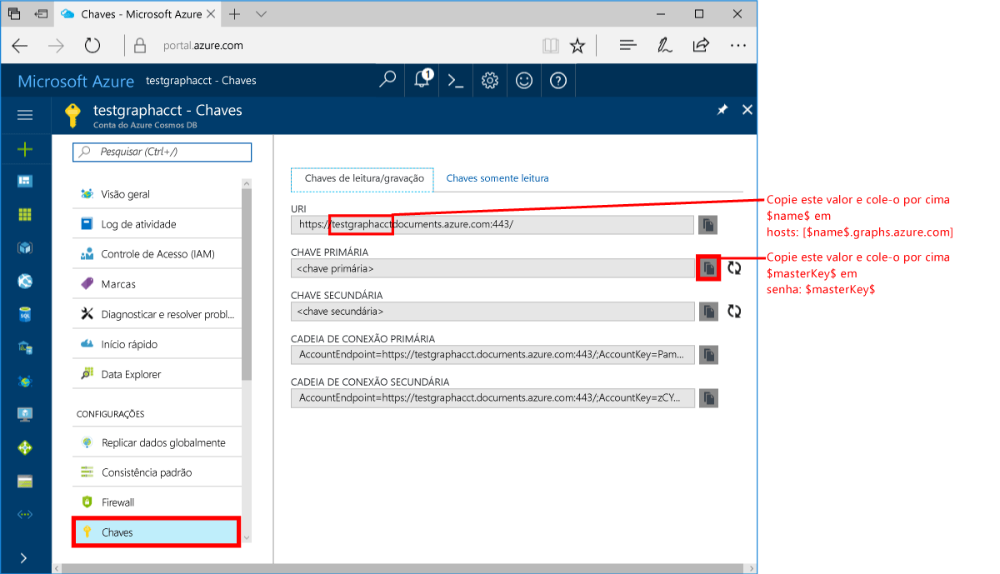
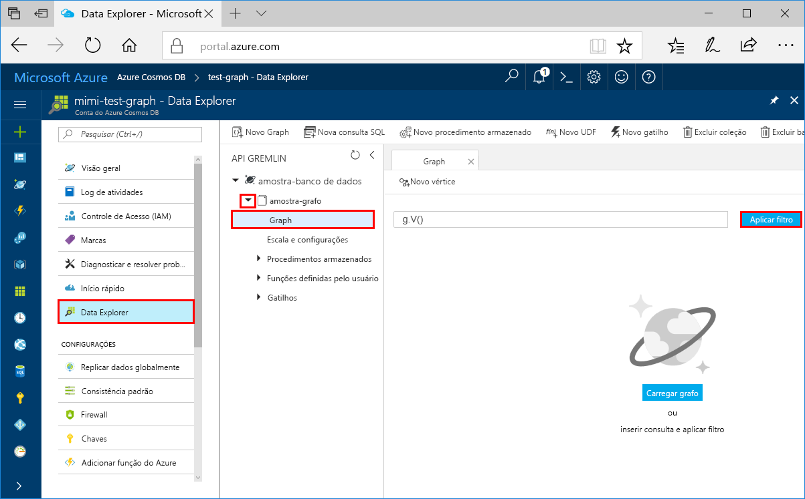
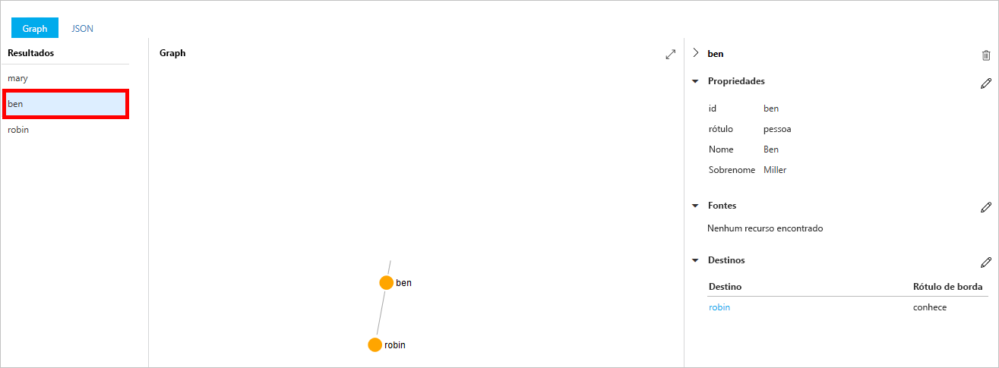
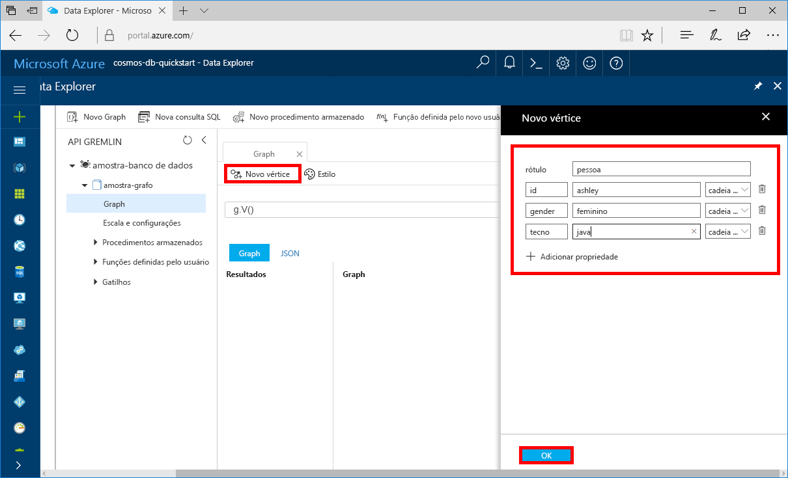
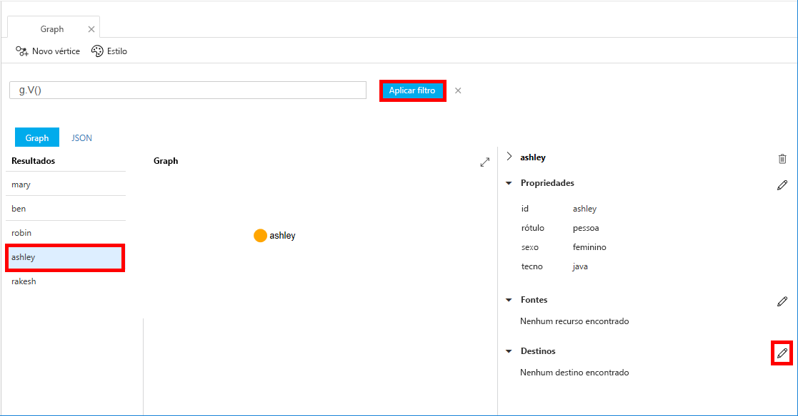
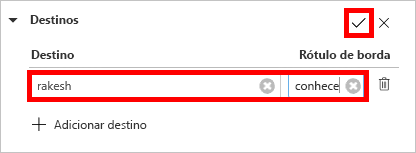
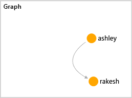

# <a name="azure-cosmos-db-create-a-graph-database-using-java-and-the-azure-portal"></a>Azure Cosmos DB: Criar um banco de dados de gráfico usando o Java e o portal do Azure

O BD Cosmos do Azure é o serviço multimodelo de banco de dados distribuído globalmente da Microsoft. É possível criar e consultar rapidamente documentos, chave/valor e bancos de dados do gráfico. Todos se beneficiam de recursos de escala horizontal e distribuição global no núcleo do Azure Cosmos DB. 

Este início rápido cria um banco de dados de gráfico usando as ferramentas do portal do Azure para o Azure Cosmos DB. Este início rápido também mostra como criar rapidamente um aplicativo de console do Java usando um banco de dados de gráfico com o driver [Gremlin Java](https://mvnrepository.com/artifact/org.apache.tinkerpop/gremlin-driver) do OSS. As instruções neste guia rápido podem ser seguidas em qualquer sistema operacional capaz de executar o Java. Ao concluir este início rápido, você estará familiarizado com a criação e a modificação dos recursos do gráfico na IU ou programaticamente, o que for sua preferência. 

## <a name="prerequisites"></a>Pré-requisitos

* [Java Development Kit (JDK) 1.7 +](http://www.oracle.com/technetwork/java/javase/downloads/jdk8-downloads-2133151.html)
    * No Ubuntu, execute `apt-get install default-jdk` para instalar o JDK.
    * Defina a variável de ambiente JAVA_HOME para apontar para a pasta onde o JDK está instalado.
* [Baixar](http://maven.apache.org/download.cgi) e [instalar](http://maven.apache.org/install.html) um armazenamento binário [Maven](http://maven.apache.org/)
    * No Ubuntu, você pode executar `apt-get install maven` instalar o Maven.
* [Git](https://www.git-scm.com/)
    * No Ubuntu, você pode executar `sudo apt-get install git` instalar o Git.

[!INCLUDE [quickstarts-free-trial-note](../../includes/quickstarts-free-trial-note.md)]

## <a name="create-a-database-account"></a>Crie uma conta de banco de dados

Antes de criar um banco de dados de gráfico, você precisa criar uma conta do banco de dados Gremlin (Graph) com o Azure Cosmos DB.

[!INCLUDE [cosmos-db-create-dbaccount-graph](../../includes/cosmos-db-create-dbaccount-graph.md)]

## <a name="add-a-graph"></a>Adicionar um gráfico

Agora, você pode usar a ferramenta Data Explorer no portal do Azure para criar um banco de dados de gráfico. 

1. No Portal do Azure, no menu de navegação à esquerda, clique em **Data Explorer (Versão prévia)**. 
2. Na folha **Data Explorer (Versão prévia)**, clique em **Novo Gráfico**, então, preencha a página usando as seguintes informações.

    

    Configuração|Valor sugerido|Descrição
    ---|---|---
    ID do banco de dados|banco de dados de exemplo|A ID do novo banco de dados. Os nomes de banco de dados devem ter entre um e 255 caracteres e não podem conter `/ \ # ?` nem espaços à direita.
    ID do Gráfico|gráfico de exemplo|A ID do novo gráfico. Os nomes de Gráfico possuem os mesmos requisitos de caractere que os ids de banco de dados.
    Capacidade de Armazenamento| 10 GB|Mantenha o valor padrão. Essa é a capacidade de armazenamento do banco de dados.
    Taxa de transferência|400 RUs|Mantenha o valor padrão. Você pode escalar verticalmente a taxa de transferência mais tarde se desejar reduzir a latência.
    RU/m|Desativar|Mantenha o valor padrão.
    Chave de partição|Deixar em branco|Para este início rápido, deixe a chave de partição em branco.

3. Quando o formulário estiver preenchido, clique em **OK**.

## <a name="clone-the-sample-application"></a>Clonar o aplicativo de exemplo

Agora, iremos clonar um aplicativo de gráfico do github, definir a cadeia de conexão e executá-la. Você verá como é fácil trabalhar usando dados de forma programática. 

1. Abra uma janela de terminal do Git, como git bash, e `cd` para um diretório de trabalho.  

2. Execute o comando a seguir para clonar o repositório de exemplo. 

    ```bash
    git clone https://github.com/Azure-Samples/azure-cosmos-db-graph-java-getting-started.git
    ```

## <a name="review-the-code"></a>Examine o código

Façamos uma rápida revisão do que está acontecendo no aplicativo. Abra o arquivo `Program.java` na pasta \src\GetStarted e encontre estas linhas de código. 

* O `Client` Gremlin é inicializado da configuração em `src/remote.yaml`.

    ```java
    cluster = Cluster.build(new File("src/remote.yaml")).create();
    ...
    client = cluster.connect();
    ```

* Uma série de etapas do Gremlin são executadas usando o método `client.submit`.

    ```java
    ResultSet results = client.submit(gremlin);

    CompletableFuture<List<Result>> completableFutureResults = results.all();
    List<Result> resultList = completableFutureResults.get();

    for (Result result : resultList) {
        System.out.println(result.toString());
    }
    ```

## <a name="update-your-connection-string"></a>Atualizar sua cadeia de conexão

1. Abra o arquivo src/remote.yaml. 

3. Preencha os valores *hosts*, *nome de usuário* e *senha* no arquivo src/remote.yaml. O restante das configurações não precisa ser alterado.

    Configuração|Valor sugerido|Descrição
    ---|---|---
    Hosts|[***.graphs.azure.com]|Consulte a captura de tela após esta tabela. Este é o valor do URI Gremlin na página Visão geral do portal do Azure, entre colchetes, com :443/ à direita removido.<br><br>Esse valor também pode ser recuperado da guia de chaves usando o valor de URI removendo https://, alterando os documentos para gráficos e removendo :443/ à direita.
    Nome de Usuário|/dbs/sample-database/colls/sample-graph|O recurso do formulário `/dbs/<db>/colls/<coll>`, no qual `<db>` é o nome do banco de dados existente e `<coll>` é o nome da coleção existente.
    Senha|*Sua chave mestra principal*|Consulte a segunda captura de tela após esta tabela. Este valor é sua chave primária, que você pode recuperar na página Chaves do portal do Azure, na caixa Chave Primária. Copie o valor usando o botão de cópia no lado direito da caixa.

    Para obter o valor Hosts, copie o valor **URI do Gremlin** na página **Visão geral**. Se estiver vazio, consulte as instruções na linha Hosts na tabela anterior sobre como criar o URI do Gremlin na folha Chaves.


    Para obter o valor Senha, copie a **Chave primária** na folha **Chaves**: 

## <a name="run-the-console-app"></a>Execute o aplicativo de console

1. Na janela do terminal git, `cd` para a pasta azure-cosmos-db-graph-java-getting-started.

2. Na janela do terminal git, digite `mvn package` para instalar os pacotes necessários do Java.

3. Na janela do terminal de git, execute `mvn exec:java -D exec.mainClass=GetStarted.Program` na janela de terminal para iniciar o aplicativo Java.

A janela do terminal exibe os vértices sendo adicionados ao gráfico. Após a conclusão do programa, volte para o portal do Azure no seu navegador da Internet. 

<a id="add-sample-data"></a>
## <a name="review-and-add-sample-data"></a>Revisar e adicionar dados de exemplo

Agora, você pode voltar para o Data Explorer, ver os vértices adicionados ao gráfico e acrescentar pontos de dados adicionais.

1. No Data Explorer, expanda o **banco de dados de exemplo**/**gráfico de exemplo**, clique em **Gráfico**, em seguida, clique em **Aplicar Filtro**. 

   

2. Na lista **Resultados**, observe os novos usuários adicionados ao gráfico. Selecione **ben** e observe que ele está conectado a robin. Você pode mover os vértices no gerenciador de gráficos, ampliar e reduzir, e expandir o tamanho da superfície do gerenciador de gráficos. 

   

3. Vamos adicionar alguns novos usuários ao gráfico usando o Data Explorer. Clique no botão **Novo Vértice** para adicionar dados ao gráfico.

   

4. Digite um rótulo da *pessoa*, em seguida, insira as seguintes chaves e valores para criar o primeiro vértice no gráfico. Observe que você pode criar propriedades exclusivas para cada pessoa no gráfico. Somente a chave da id é necessária.

    chave|valor|Observações
    ----|----|----
    ID|ashley|O identificador exclusivo do vértice. Se você não especificar uma id, uma será gerada para você.
    gender|feminino| 
    técnico | java | 

    > [!NOTE]
    > Neste início rápido, criamos uma coleção não particionada. No entanto, se você criar uma coleção particionada especificando uma chave de partição durante a criação da coleção, então, precisará incluir a chave de partição como uma chave em cada novo vértice. 

5. Clique em **OK**. Você pode precisar expandir a tela para ver **OK** na parte inferior da tela.

6. Clique em **Novo Vértice** novamente e acrescente um novo usuário adicional. Digite um rótulo da *pessoa*, em seguida, insira as chaves e valores a seguir:

    chave|valor|Observações
    ----|----|----
    ID|rakesh|O identificador exclusivo do vértice. Se você não especificar uma id, uma será gerada para você.
    gender|masculino| 
    escola|MIT| 

7. Clique em **OK**. 

8. Clique em **Aplicar Filtro** com o filtro `g.V()` padrão. Todos os usuários agora aparecem na lista **Resultados**. Conforme você adiciona mais dados, pode usar os filtros para limitar os resultados. Por padrão, o Data Explorer usa `g.V()` para recuperar todos os vértices em um gráfico, mas você pode mudar isso para uma [consulta do gráfico](tutorial-query-graph.md) diferente, como `g.V().count()`, para retornar uma contagem de todos os vértices no gráfico no formato JSON.

9. Agora, podemos conectar rakesh e ashley. Verifique se **ashley** está selecionada na lista **Resultados**, em seguida, clique no botão de edição ao lado de **Destinos** à direita inferior. Talvez seja necessário ampliar a janela para ver a área **Propriedades**.

   

10. Na caixa **Destino**, digite *rakesh*e na caixa **Rótulo de borda**, digite *sabe*, em seguida, clique na caixa de seleção.

   

11. Agora, selecione **rakesh** na lista de resultados e veja se ashley e rakesh estão conectados. 

   

    Você também pode usar o Data Explorer para criar procedimentos armazenados, UDFs e gatilhos para executar a lógica de negócios do servidor, além de dimensionar a taxa de transferência. O Data Explorer expõe todo o acesso a dados interno via programação disponível nas APIs, mas oferece acesso fácil aos dados no Portal do Azure.


## <a name="review-slas-in-the-azure-portal"></a>Examinar SLAs no Portal do Azure

[!INCLUDE [cosmosdb-tutorial-review-slas](../../includes/cosmos-db-tutorial-review-slas.md)]

## <a name="clean-up-resources"></a>Limpar recursos

Se você não continuar usando este aplicativo, exclua todos os recursos criados por esse início rápido no portal do Azure com as seguintes etapas: 

1. No menu à esquerda no Portal do Azure, clique em **Grupos de recursos** e depois clique no nome do recurso criado. 
2. Em sua página de grupo de recursos, clique em **Excluir**, digite o nome do recurso para excluir na caixa de texto e depois clique em **Excluir**.

## <a name="next-steps"></a>Próximas etapas

Neste início rápido, você aprendeu como criar uma conta do BD Cosmos do Azure, como criar um gráfico usando o Data Explorer e como executar um aplicativo. Agora, você pode criar consultas mais complexas e implementar uma lógica de passagem de gráfico avançada usando o Gremlin. 

> [!div class="nextstepaction"]
> [Consultar usando o Gremlin](tutorial-query-graph.md)


