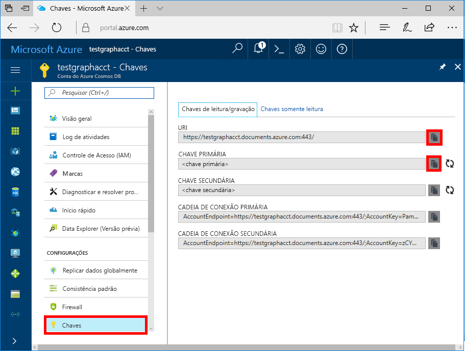

# <a name="azure-cosmos-db-build-a-nodejs-application-by-using-graph-api"></a>Azure Cosmos DB: Compilar um aplicativo Node.js usando a API do Graph

O Azure Cosmos DB é o serviço de banco de dados multimodelo da Microsoft e é distribuído globalmente. É possível criar e consultar rapidamente documentos, chave/valor e bancos de dados do gráfico. Todos se beneficiam de recursos de escala horizontal e distribuição global no núcleo do Azure Cosmos DB. 

Este artigo de início rápido demonstra como criar uma conta do Azure Cosmos DB para a API do Graph (versão prévia), um banco de dados e um gráfico usando o portal do Azure. Em seguida, você compila e executa um aplicativo de console usando o driver [Gremlin Node.js](https://www.npmjs.com/package/gremlin-secure) de software livre.  

> [!NOTE]
> O módulo npm `gremlin-secure` é uma versão modificada do `gremlin` módulo, com suporte para SSL e SASL necessários para se conectar com Azure Cosmos DB. O código-fonte está disponível no [GitHub](https://github.com/CosmosDB/gremlin-javascript).
>

## <a name="prerequisites"></a>Pré-requisitos

Antes que possa executar esta amostra, você deverá ter os seguintes pré-requisitos:
* [Node.js](https://nodejs.org/en/) versão v0.10.29 ou posterior
* [Git](http://git-scm.com/)

[!INCLUDE [quickstarts-free-trial-note](../../includes/quickstarts-free-trial-note.md)]

## <a name="create-a-database-account"></a>Crie uma conta de banco de dados

[!INCLUDE [cosmos-db-create-dbaccount-graph](../../includes/cosmos-db-create-dbaccount-graph.md)]

## <a name="add-a-graph"></a>Adicionar um gráfico

[!INCLUDE [cosmos-db-create-graph](../../includes/cosmos-db-create-graph.md)]

## <a name="clone-the-sample-application"></a>Clonar o aplicativo de exemplo

Agora, clonaremos um aplicativo de API do Graph do GitHub, definiremos a cadeia de conexão e o executaremos. Você verá como é fácil trabalhar usando dados de forma programática. 

1. Abra uma janela de terminal do Git, tal como um Git Bash e altere (por meio do comando `cd`) para um diretório de trabalho.  

2. Execute o comando a seguir para clonar o repositório de exemplo. 

    ```bash
    git clone https://github.com/Azure-Samples/azure-cosmos-db-graph-nodejs-getting-started.git
    ```

3. Abra o arquivo da solução no Visual Studio. 

## <a name="review-the-code"></a>Examine o código

Façamos uma rápida revisão do que está acontecendo no aplicativo. Abra o arquivo `app.js` e você descobrirá que as linhas de código a seguir. 

* O cliente Gremlin é criado.

    ```nodejs
    const client = Gremlin.createClient(
        443, 
        config.endpoint, 
        { 
            "session": false, 
            "ssl": true, 
            "user": `/dbs/${config.database}/colls/${config.collection}`,
            "password": config.primaryKey
        });
    ```

  Todas as configurações estão em `config.js` e podem ser editadas na seção Editar a seguir.

* Uma série de etapas do Gremlin são executadas usando o método `client.execute`.

    ```nodejs
    console.log('Running Count'); 
    client.execute("g.V().count()", { }, (err, results) => {
        if (err) return console.error(err);
        console.log(JSON.stringify(results));
        console.log();
    });
    ```

## <a name="update-your-connection-string"></a>Atualizar sua cadeia de conexão

Agora, volte ao portal do Azure para obter informações sobre a cadeia de conexão e copiá-las para o aplicativo.

1. No [portal do Azure](http://portal.azure.com/), na sua conta do Azure Cosmos DB, no menu de navegação esquerdo, clique em **Chaves**e, em seguida, clique em **Chaves de leitura/gravação**. Você usa os botões de cópia no lado direito da URI e a chave primária para o arquivo `app.js` na próxima etapa.

    

2. Copie o valor do URI do Gremlin do portal (usando o botão copiar) e transforme-o no valor da chave `config.endpoint` em config.js. O ponto de extremidade do Gremlin deve ser apenas o nome de host sem número de porta do protocolo como `mygraphdb.graphs.azure.com` (não `https://mygraphdb.graphs.azure.com` ou `mygraphdb.graphs.azure.com:433`).

    `config.endpoint = "GRAPHENDPOINT";`

3. Copie o valor da chave primária do portal e transforme-a no valor de config.primaryKey no config.js. Agora, você atualizou o aplicativo com todas as informações necessárias para se comunicar com o BD Cosmos do Azure. 

    `config.primaryKey = "PRIMARYKEY";`

4. Insira o nome do banco de dados e o nome do gráfico (contêiner) para o valor de config.database e config.collection. 

Aqui está um exemplo da aparência seu arquivo config.js concluído:

```nodejs
var config = {}

// Note that this must not have HTTPS or the port number
config.endpoint = "mygraphdb.graphs.azure.com";
config.primaryKey = "OjlhK6tjxfSXyKtrmCiM9O6gQQgu5DmgAoauzD1PdPIq1LZJmILTarHvrolyUYOB0whGQ4j21rdAFwoYep7Kkw==";
config.database = "graphdb"
config.collection = "Persons"

module.exports = config;
```

## <a name="run-the-console-app"></a>Execute o aplicativo de console

1. Abra uma janela de terminal e mude (por meio do comando `cd`) para um diretório de instalação para o arquivo package.json incluído no projeto.  

2. Executar `npm install` para instalar os módulos npm necessários, incluindo `gremlin-secure`.

3. Execute `node app.js` em um terminal para iniciar o aplicativo de nó.

## <a name="browse-with-data-explorer"></a>Procurar com o Data Explorer

Agora você pode voltar ao Data Explorer no Portal do Azure e exibir, consultar, modificar e trabalhar com seus novos dados gráficos.

No Data Explorer, o novo banco de dados aparece no painel **Coleções**. Expanda **graphdb**, **graphcoll** e, em seguida, clique em **Gráfico**.

Os dados gerados pelo aplicativo de exemplo são exibidos no painel **Gráficos**.

## <a name="review-slas-in-the-azure-portal"></a>Examinar SLAs no Portal do Azure

[!INCLUDE [cosmosdb-tutorial-review-slas](../../includes/cosmos-db-tutorial-review-slas.md)]

## <a name="clean-up-your-resources"></a>Limpar seus recursos

Se você não planeja continuar usando este aplicativo, exclua todos os recursos criados neste artigo fazendo o seguinte: 

1. No portal do Azure, no menu de navegação à esquerda, clique em **Grupos de recursos** e depois clique no nome do recurso criado. 
2. Em sua página de grupo de recursos, clique em **Excluir**, digite o nome do recurso a ser excluído e depois clique em **Excluir**.

## <a name="next-steps"></a>Próximas etapas

Neste artigo, você aprendeu como criar uma conta do Azure Cosmos DB, como criar um gráfico usando o Data Explorer e como executar um aplicativo. Agora, você pode criar consultas mais complexas e implementar uma lógica de passagem de gráfico avançada usando o Gremlin. 

> [!div class="nextstepaction"]
> [Consultar usando o Gremlin](tutorial-query-graph.md)

