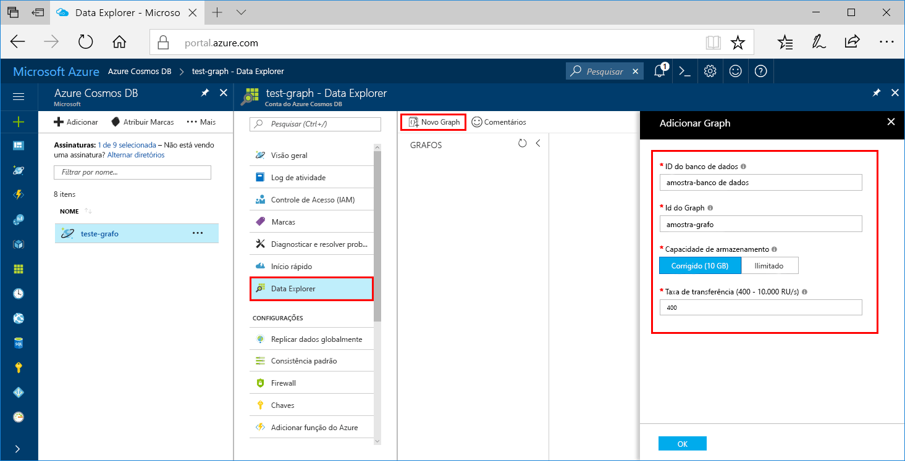
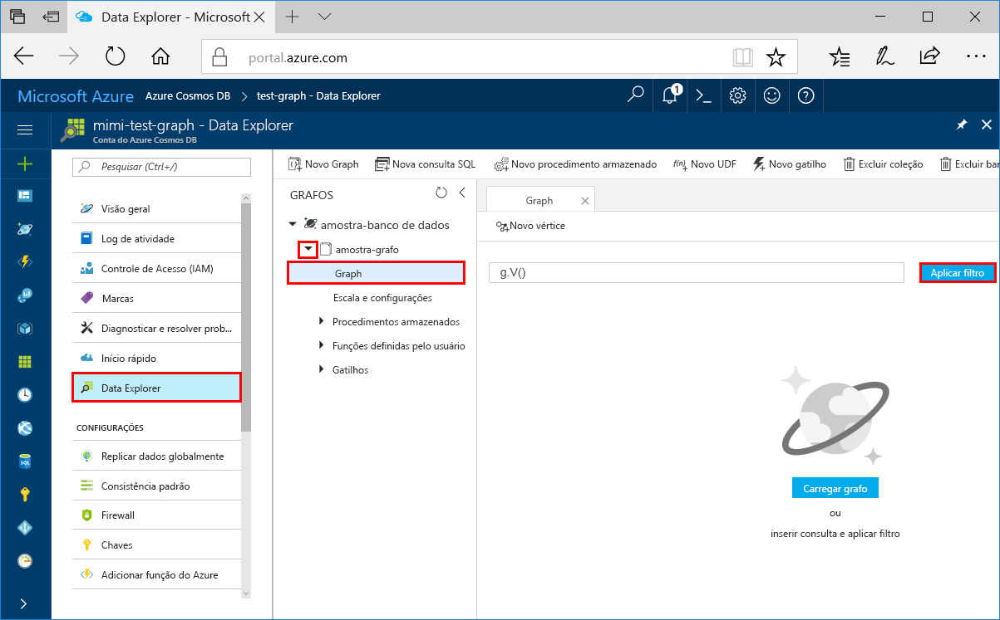
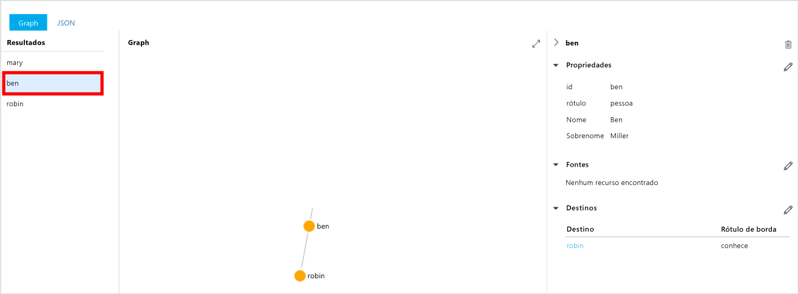
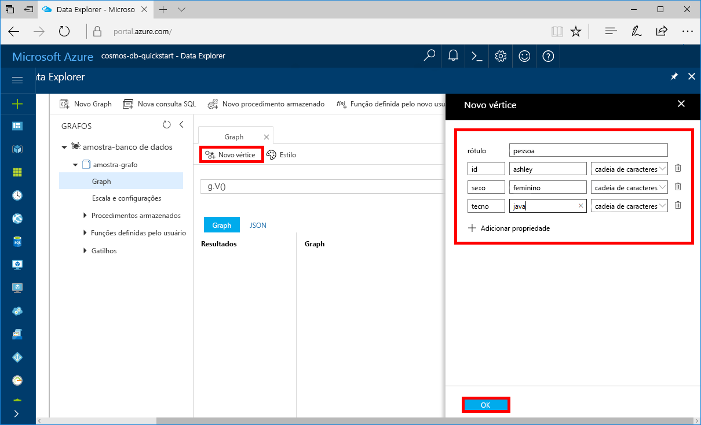
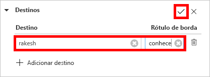
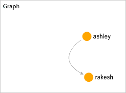

# <a name="azure-cosmos-db-create-a-graph-database-using-php-and-the-azure-portal"></a>Azure Cosmos DB: Criar um banco de dados de grafo usando o PHP e o Portal do Azure

Este guia de início rápido mostra como usar o PHP e a [API do Graph](graph-introduction.md) do Azure Cosmos DB para compilar um aplicativo de console clonando um exemplo do GitHub. Este guia de início rápido também mostra as etapas para a criação de uma conta do Azure Cosmos DB usando o Portal do Azure baseado na Web.   

O Azure Cosmos DB é o serviço de banco de dados multimodelo distribuído globalmente da Microsoft. É possível criar e consultar rapidamente documentos, tabelas, valores-chave e bancos de dados de gráfico, todos os quais se beneficiam de recursos de distribuição global e escala horizontal e no núcleo do Azure Cosmos DB.  

## <a name="prerequisites"></a>pré-requisitos

[!INCLUDE [quickstarts-free-trial-note](../../includes/quickstarts-free-trial-note.md)] Como alternativa, você pode [Experimentar o Azure Cosmos DB gratuitamente](https://azure.microsoft.com/try/cosmosdb/) sem uma assinatura do Azure, sem ônus e sem compromisso.

Além disso:
* [PHP](http://php.net/) 5.6 ou mais recente
* [Compositor](https://getcomposer.org/download/)

## <a name="create-a-database-account"></a>Criar uma conta de banco de dados

Antes de criar um banco de dados de grafo, você precisa criar uma conta do banco de dados Gremlin (Graph) com o Azure Cosmos DB.

[!INCLUDE [cosmos-db-create-dbaccount-graph](../../includes/cosmos-db-create-dbaccount-graph.md)]

## <a name="add-a-graph"></a>Adicionar um grafo

Agora, você pode usar a ferramenta Data Explorer no portal do Azure para criar um banco de dados de grafo. 

1. Clique em **Data Explorer** > **Novo Grafo**.

    A área **Adicionar Grafo** é exibida à direita, talvez seja necessário rolar para a direita para vê-la.

    

2. Na página **Adicionar Grafo**, insira as configurações do novo grafo.

    Configuração|Valor sugerido|DESCRIÇÃO
    ---|---|---
    ID do banco de dados|banco de dados de exemplo|Digite *banco de dados de exemplo* como o nome do novo banco de dados. Os nomes de banco de dados devem ter entre um e 255 caracteres e não podem conter `/ \ # ?` nem espaços à direita.
    ID do Grafo|grafo de exemplo|Digite *grafo de exemplo* como o nome da nova coleção. Os nomes de grafo têm os mesmos requisitos de caractere do que as IDs de banco de dados.
    Capacidade de Armazenamento|Fixo (10 GB)|Deixe o valor padrão de **Fixo (10 GB)**. Esse valor é a capacidade de armazenamento do banco de dados.
    Throughput|400 RUs|Altere a taxa de transferência para 400 unidades de solicitação por segundo (RU/s). Se quiser reduzir a latência, você poderá escalar verticalmente a taxa de transferência mais tarde.

3. Quando o formulário estiver preenchido, clique em **OK**.

## <a name="clone-the-sample-application"></a>Clonar o aplicativo de exemplo

Agora, vamos trabalhar com o código. Vamos clonar um aplicativo de API do Graph do GitHub, definir a cadeia de conexão e executá-lo. Você verá como é fácil trabalhar usando dados de forma programática.  

1. Abra um prompt de comando, crie uma nova pasta chamada exemplos de git e feche o prompt de comando.

    ```bash
    md "C:\git-samples"
    ```

2. Abra uma janela de terminal de git, como git bash, e use o comando `cd` para alterar para uma pasta para instalar o aplicativo de exemplo.  

    ```bash
    cd "C:\git-samples"
    ```

3. Execute o comando a seguir para clonar o repositório de exemplo. Este comando cria uma cópia do aplicativo de exemplo no seu computador. 

    ```bash
    git clone https://github.com/Azure-Samples/azure-cosmos-db-graph-php-getting-started.git
    ```

## <a name="review-the-code"></a>Examine o código

Esta etapa é opcional. Se você estiver interessado em aprender como os recursos de banco de dados são criados no código, poderá examinar os trechos de código a seguir. Os trechos são todos obtidos do arquivo `connect.php`na pasta C:\git-samples\azure-cosmos-db-graph-php-getting-started\. Caso contrário, você poderá pular para [Atualizar sua cadeia de conexão](#update-your-connection-information). 

* O Gremlin `connection` é inicializado no início do arquivo `connect.php` utilizando o objeto `$db`.

    ```php
    $db = new Connection([
        'host' => '<your_server_address>.graphs.azure.com',
        'username' => '/dbs/<db>/colls/<coll>',
        'password' => 'your_primary_key'
        ,'port' => '443'

        // Required parameter
        ,'ssl' => TRUE
    ]);
    ```

* Uma série de etapas do Gremlin são executadas usando o método `$db->send($query);`.

    ```php
    $query = "g.V().drop()";
    ...
    $result = $db->send($query);
    $errors = array_filter($result);
    }
    ```

## <a name="update-your-connection-information"></a>Atualizar as informações de conexão

Agora, volte ao Portal do Azure para obter as informações de conexão e copiá-las para o aplicativo. Essas configurações permitem que seu aplicativo se comunique com o banco de dados hospedado.

1. No [Portal do Azure](http://portal.azure.com/), clique em **Chaves**. 

    Copie a primeira parte do valor do URI.

    
2. Abra o arquivo `connect.php` e na linha 8 cole o valor do URI em `your_server_address`.

    A inicialização do objeto de conexão agora deve ser semelhante a essa:

    ```php
    $db = new Connection([
        'host' => 'testgraphacct.graphs.azure.com',
        'username' => '/dbs/<db>/colls/<coll>',
        'password' => 'your_primary_key'
        ,'port' => '443'

        // Required parameter
        ,'ssl' => TRUE
    ]);
    ```

3. Altere o parâmetro `username` no objeto de Conexão com o banco de dados e o nome do gráfico. Se você utilizou os valores recomendados de `sample-database` e `sample-graph`, ele devem ser semelhantes a esses:

    `'username' => '/dbs/sample-database/colls/sample-graph'`

    É desse modo que todo o objeto de Conexão deverá apresentar-se nesse momento:

    ```php
    $db = new Connection([
        'host' => 'testgraphacct.graphs.azure.com',
        'username' => '/dbs/sample-database/colls/sample-graph',
        'password' => 'your_primary_key',
        'port' => '443'

        // Required parameter
        ,'ssl' => TRUE
    ]);
    ```

4. No Portal do Azure, utilize o botão de cópia para copiar a CHAVE PRIMÁRIA e cole-a sobre `your_primary_key` no parâmetro de senha.

    A inicialização do objeto DE Conexão deverá ser assim:

    ```php
    $db = new Connection([
        'host' => 'testgraphacct.graphs.azure.com',
        'username' => '/dbs/sample-database/colls/sample-graph',
        'password' => '2Ggkr662ifxz2Mg==',
        'port' => '443'

        // Required parameter
        ,'ssl' => TRUE
    ]);
    ```

5. Salve o arquivo `connect.php`.

## <a name="run-the-console-app"></a>Execute o aplicativo de console

1. Na janela do terminal git, `cd` na pasta azure-cosmos-db-graph-php-getting-started.

    ```git
    cd "C:\git-samples\azure-cosmos-db-graph-php-getting-started"
    ```

2. Na janela do terminal git, utilize o seguinte comando para instalar as dependências PHP necessárias.

   ```
   composer install
   ```

3. Na janela do terminal git, utilize os comandos a seguir para iniciar o aplicativo PHP.
    
    ```
    php connect.php
    ```

    A janela do terminal exibe os vértices sendo adicionados ao grafo. 
    
    Se ocorrerem erros de tempo limite, verifique se você atualizou as informações de conexão corretamente em [Atualizar suas informações de conexão](#update-your-connection-information) e também tente executar o último comando novamente. 
    
    Após o programa parar, pressione Enter e volte para o Portal do Azure no seu navegador da Internet. 

<a id="add-sample-data"></a>
## <a name="review-and-add-sample-data"></a>Revisar e adicionar dados de exemplo

Agora, você pode voltar para o Data Explorer, ver os vértices adicionados ao grafo e acrescentar pontos de dados adicionais.

1. Clique em **Data Explorer**, expanda **grafo de exemplo**, clique em **Grafo** e em **Aplicar Filtro**. 

   

2. Na lista **Resultados**, observe os novos usuários adicionados ao grafo. Selecione **ben** e observe que ele está conectado a robin. Você pode mover os vértices arrastando e soltando, ampliar e reduzir rolando o botão de rolagem do mouse e expandir o tamanho do grafo com a seta dupla. 

   

3. Vamos adicionar alguns novos usuários. Clique no botão **Novo Vértice** para adicionar dados ao grafo.

   

4. Digite um rótulo de *pessoa*.

5. Clique em **Adicionar propriedade** para adicionar cada uma das propriedades a seguir. Observe que você pode criar propriedades exclusivas para cada pessoa no grafo. Somente a chave da id é necessária.

    chave|value|Observações
    ----|----|----
    ID|ashley|O identificador exclusivo do vértice. Se você não especificar uma ID, ela será gerada para você.
    gender|feminino| 
    técnico | java | 

    > [!NOTE]
    > Neste início rápido, criamos uma coleção não particionada. No entanto, se você criar uma coleção particionada especificando uma chave de partição durante a criação da coleção, então, precisará incluir a chave de partição como uma chave em cada novo vértice. 

6. Clique em **OK**. Talvez seja necessário expandir a tela para ver **OK** na parte inferior da tela.

7. Clique em **Novo Vértice** novamente e acrescente um novo usuário. 

8. Digite um rótulo de *pessoa*.

9. Clique em **Adicionar propriedade** para adicionar cada uma das propriedades a seguir:

    chave|value|Observações
    ----|----|----
    ID|rakesh|O identificador exclusivo do vértice. Se você não especificar uma ID, ela será gerada para você.
    gender|masculino| 
    escola|MIT| 

10. Clique em **OK**. 

11. Clique no botão **Aplicar Filtro** com o filtro `g.V()` padrão para exibir todos os valores no gráfico. Todos os usuários agora aparecem na lista **Resultados**. 

    Conforme você adiciona mais dados, pode usar os filtros para limitar os resultados. Por padrão, o Data Explorer usa `g.V()` para recuperar todos os vértices em um grafo. Você pode alterá-lo para outra [consulta de grafo](tutorial-query-graph.md), como `g.V().count()`, para retornar uma contagem de todos os vértices no grafo no formato JSON. Se você tiver alterado o filtro, altere o filtro de volta para `g.V()` e clique em **Aplicar Filtro** para exibir todos os resultados novamente.

12. Agora, podemos conectar rakesh e ashley. Verifique se **ashley** está selecionada na lista **Resultados**, em seguida, clique no botão de edição ao lado de **Destinos** à direita inferior. Talvez seja necessário ampliar a janela para ver a área **Propriedades**.

   

13. Na caixa **Destino**, digite *rakesh* e na caixa **Rótulo da aresta**, digite *conhece*, em seguida, clique na marca de seleção.

   

14. Agora, selecione **rakesh** na lista de resultados e veja se ashley e rakesh estão conectados. 

   

   Isso conclui a parte da criação de recursos deste tutorial. Você pode continuar a adicionar vértices ao seu grafo, modificar os vértices existentes ou alterar as consultas. Agora vamos examinar as métricas que o Azure Cosmos DB fornece e, em seguida, limpar os recursos. 

## <a name="review-slas-in-the-azure-portal"></a>Examinar SLAs no Portal do Azure

[!INCLUDE [cosmosdb-tutorial-review-slas](../../includes/cosmos-db-tutorial-review-slas.md)]

## <a name="clean-up-resources"></a>Limpar recursos

[!INCLUDE [cosmosdb-delete-resource-group](../../includes/cosmos-db-delete-resource-group.md)]

## <a name="next-steps"></a>Próximas etapas

Neste início rápido, você aprendeu como criar uma conta do Azure Cosmos DB, como criar um grafo usando o Data Explorer e como executar um aplicativo. Agora, você pode criar consultas mais complexas e implementar uma lógica de passagem de grafo avançada usando o Gremlin. 

> [!div class="nextstepaction"]
> [Consultar usando o Gremlin](tutorial-query-graph.md)

