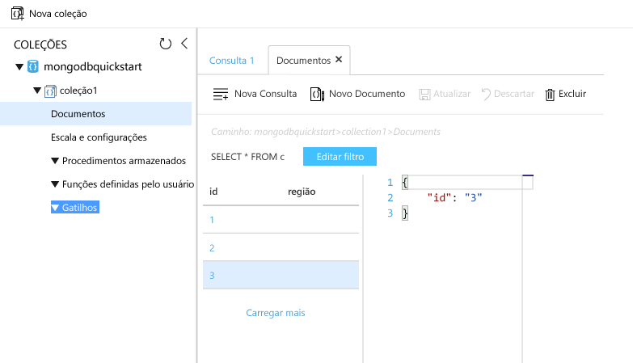

# <a name="azure-cosmos-db-migrate-an-existing-nodejs-mongodb-web-app"></a>BD Cosmos do Azure: migrar um aplicativo Web MongoDB do Node.js existente 

O BD Cosmos do Azure é o serviço multimodelo de banco de dados distribuído globalmente da Microsoft. É possível criar e consultar rapidamente documentos, chave/valor e bancos de dados do gráfico. Todos se beneficiam de recursos de escala horizontal e distribuição global no núcleo do BD Cosmos do Azure. 

Este início rápido demonstra como usar um aplicativo [MongoDB](mongodb-introduction.md) existente escrito no Node.js e como conectá-lo ao banco de dados do BD Cosmos do Azure, que dá suporte a conexões de cliente do MongoDB. Em outras palavras, o aplicativo Node.js só sabe que está se conectando a um banco de dados usando as APIs do MongoDB. Está claro para o aplicativo que os dados estão armazenados no BD Cosmos do Azure.

Quando terminar, você terá um aplicativo MEAN (MongoDB, Express, Angular e Node.js) executando no [Azure Cosmos DB](https://azure.microsoft.com/services/cosmos-db/). 


[!INCLUDE [cloud-shell-try-it](../../includes/cloud-shell-try-it.md)]

Se você optar por instalar e usar a CLI localmente, este tópico exigirá que você esteja executando a CLI do Azure versão 2.0 ou posterior. Execute `az --version` para encontrar a versão. Se você precisa instalar ou atualizar, consulte [Instalar a CLI 2.0 do Azure]( /cli/azure/install-azure-cli). 

## <a name="prerequisites"></a>Pré-requisitos 
Se você não tiver uma assinatura do Azure, crie uma [conta gratuita](https://azure.microsoft.com/free/?WT.mc_id=A261C142F) antes de começar. 
[!INCLUDE [cosmos-db-emulator-mongodb](../../includes/cosmos-db-emulator-mongodb.md)]

Além da CLI do Azure, você precisa do [Node.js](https://nodejs.org/) e do [Git](http://www.git-scm.com/downloads) instalados localmente para executar os comandos `npm` e `git`.

Você deve ter conhecimento prático de Node.js. Este início rápido não se destina a ajudá-lo a desenvolver aplicativos Node.js em geral.

## <a name="clone-the-sample-application"></a>Clonar o aplicativo de exemplo

Abra uma janela de terminal do Git, como git bash, e `cd` para um diretório de trabalho.  

Execute os comandos a seguir para clonar o repositório de exemplo. Esse repositório de exemplo contém o aplicativo [MEAN.js](http://meanjs.org/) padrão. 

```bash
git clone https://github.com/prashanthmadi/mean
```

## <a name="run-the-application"></a>Executar o aplicativo

Instale os pacotes necessários e inicie o aplicativo.

```bash
cd mean
npm install
npm start
```

## <a name="log-in-to-azure"></a>Fazer logon no Azure

Se você estiver usando uma CLI do Azure instalada, faça logon na sua assinatura do Azure com o comando [az login](/cli/azure/#login) e siga as instruções na tela. Você poderá ignorar esta etapa se estiver usando o Azure Cloud Shell.

```azurecli
az login 
``` 
   
## <a name="add-the-azure-cosmos-db-module"></a>Adicione o módulo do BD Cosmos do Azure

Se você estiver usando uma CLI do Azure instalada, verifique se o componente `cosmosdb` já está instalado ao executar o comando `az`. Se `cosmosdb` estiver na lista de comandos básicos, vá para o próximo comando. Você poderá ignorar esta etapa se estiver usando o Azure Cloud Shell.

Se `cosmosdb` não estiver na lista de comandos base, reinstale a [CLI do Azure 2.0]( /cli/azure/install-azure-cli).

## <a name="create-a-resource-group"></a>Criar um grupo de recursos

Crie um [grupo de recursos](../azure-resource-manager/resource-group-overview.md) com o [az group create](/cli/azure/group#create). Um grupo de recursos do Azure é um contêiner lógico no qual os recursos do Azure, como os aplicativos Web, bancos de dados e contas de armazenamento, são implantados e gerenciados. 

O exemplo a seguir cria um grupo de recursos na região da Europa Ocidental. Escolha um nome exclusivo para o grupo de recursos.

Se você estiver usando o Azure Cloud Shell, clique em **Experimente**, siga as instruções na tela para fazer logon e copie o comando para o prompt de comando.

```azurecli-interactive
az group create --name myResourceGroup --location "West Europe"
```

## <a name="create-an-azure-cosmos-db-account"></a>Criar uma conta do Azure Cosmos DB

Crie uma conta do BD Cosmos do Azure usando o comando [az cosmosdb create](/cli/azure/cosmosdb#create).

No comando a seguir, substitua seu próprio nome de conta exclusivo do BD Cosmos do Azure quando vir o espaço reservado `<cosmosdb-name>`. Esse nome exclusivo será usado como parte de seu ponto de extremidade do BD Cosmos do Azure (`https://<cosmosdb-name>.documents.azure.com/`), portanto, o nome precisa ser exclusivo em todas as contas do BD Cosmos do Azure no Azure. 

```azurecli-interactive
az cosmosdb create --name <cosmosdb-name> --resource-group myResourceGroup --kind MongoDB
```

O parâmetro `--kind MongoDB` habilita conexões do cliente MongoDB.

Quando a conta do BD Cosmos do Azure é criada, a CLI do Azure mostra informações semelhantes ao exemplo a seguir. 

> [!NOTE]
> Este exemplo usa JSON como o formato de saída da CLI do Azure, que é o padrão. Para usar outro formato de saída, consulte [Formatos de saída para comandos da CLI 2.0 do Azure](https://docs.microsoft.com/cli/azure/format-output-azure-cli).

```json
{
  "databaseAccountOfferType": "Standard",
  "documentEndpoint": "https://<cosmosdb-name>.documents.azure.com:443/",
  "id": "/subscriptions/00000000-0000-0000-0000-000000000000/resourceGroups/myResourceGroup/providers/Microsoft.Document
DB/databaseAccounts/<cosmosdb-name>",
  "kind": "MongoDB",
  "location": "West Europe",
  "name": "<cosmosdb-name>",
  "readLocations": [
    {
      "documentEndpoint": "https://<cosmosdb-name>-westeurope.documents.azure.com:443/",
      "failoverPriority": 0,
      "id": "<cosmosdb-name>-westeurope",
      "locationName": "West Europe",
      "provisioningState": "Succeeded"
    }
  ],
  "resourceGroup": "myResourceGroup",
  "type": "Microsoft.DocumentDB/databaseAccounts",
  "writeLocations": [
    {
      "documentEndpoint": "https://<cosmosdb-name>-westeurope.documents.azure.com:443/",
      "failoverPriority": 0,
      "id": "<cosmosdb-name>-westeurope",
      "locationName": "West Europe",
      "provisioningState": "Succeeded"
    }
  ]
} 
```

## <a name="connect-your-nodejs-application-to-the-database"></a>Conectar o aplicativo Node.js ao banco de dados

Nesta etapa, você conecta o aplicativo de exemplo MEAN.js ao BD Cosmos do Azure que acabou de ser criado usando uma cadeia de conexão do MongoDB. 

<a name="devconfig"></a>
## <a name="configure-the-connection-string-in-your-nodejs-application"></a>Configurar a cadeia de conexão em seu aplicativo Node.js

No seu repositório MEAN.js abra `config/env/local-development.js`.

Substitua o conteúdo deste arquivo pelo código a seguir. Substitua também os dois espaços reservados `<cosmosdb-name>` com seu nome de conta do Azure Cosmos DB.

```javascript
'use strict';

module.exports = {
  db: {
    uri: 'mongodb://<cosmosdb-name>:<primary_master_key>@<cosmosdb-name>.documents.azure.com:10255/mean-dev?ssl=true&sslverifycertificate=false'
  }
};
```

## <a name="retrieve-the-key"></a>Recuperar a chave

Para se conectar ao BD Cosmos do Azure, você precisa da chave do banco de dados. Use o comando [az cosmosdb list-keys](/cli/azure/cosmosdb#list-keys) para recuperar a chave primária.

```azurecli-interactive
az cosmosdb list-keys --name <cosmosdb-name> --resource-group myResourceGroup --query "primaryMasterKey"
```

A CLI do Azure emite informações semelhantes ao seguinte exemplo. 

```json
"RUayjYjixJDWG5xTqIiXjC..."
```

Copie o valor de `primaryMasterKey`. Cole isso no `<primary_master_key>` em `local-development.js`.

Salve suas alterações.

### <a name="run-the-application-again"></a>Execute o aplicativo novamente.

Execute `npm start` novamente. 

```bash
npm start
```

Agora, uma mensagem de console deve informar que o ambiente de desenvolvimento está em execução. 

Navegue até `http://localhost:3000` em um navegador. Clique em **Inscrever-se** no menu superior e tente criar dois usuários fictícios. 

O aplicativo de exemplo MEAN.js armazena dados do usuário no banco de dados. Se você tiver êxito e o MEAN.js entrar automaticamente no usuário criado, então a conexão do BD Cosmos do Azure estará funcionando. 


## <a name="view-data-in-data-explorer"></a>Exibir dados no Data Explorer

Os dados armazenados pelo BD Cosmos do Azure estão disponíveis para exibir, consultar e executar a lógica de negócios no portal do Azure.

Para exibir, consultar e trabalhar com os dados de usuário criados na etapa anterior, faça logon no [portal do Azure](https://portal.azure.com) no seu navegador da Web.

Na caixa de pesquisa superior, digite BD Cosmos do Azure. Quando a folha de conta do BD Cosmos abrir, selecione sua conta do BD Cosmos. No painel de navegação esquerdo, clique em Data Explorer. Expanda a coleção no painel Coleções e, em seguida, será possível exibir os documentos na coleção, consultar os dados e até mesmo criar e executar gatilhos, UDFs e procedimentos armazenados. 




## <a name="deploy-the-nodejs-application-to-azure"></a>Implantar o aplicativo Node.js no Azure

Nessa etapa, você implanta seu aplicativo Node.js conectado ao MongoDB no BD Cosmos do Azure.

Você talvez tenha notado que o arquivo de configuração alterado anteriormente é voltado para o ambiente de desenvolvimento (`/config/env/local-development.js`). Quando você implanta seu aplicativo no Serviço de Aplicativo, ele será executado no ambiente de produção por padrão. Agora, você precisa fazer a mesma alteração no arquivo de configuração respectivo.

No seu repositório MEAN.js abra `config/env/production.js`.

No objeto `db`, substitua o valor de `uri` conforme mostrado no exemplo a seguir. Certifique-se de substituir os espaços reservados como antes.

```javascript
'mongodb://<cosmosdb-name>:<primary_master_key>@<cosmosdb-name>.documents.azure.com:10255/mean?ssl=true&sslverifycertificate=false',
```

> [!NOTE] 
> A opção `ssl=true` é importante porque o [BD Cosmos do Azure requer SSL](connect-mongodb-account.md#connection-string-requirements). 
>
>

No terminal, confirme todas as alterações no Git. É possível copiar ambos os comandos para os executar juntos.

```bash
git add .
git commit -m "configured MongoDB connection string"
```
## <a name="clean-up-resources"></a>Limpar recursos

Se você não continuar usando este aplicativo, exclua todos os recursos criados por esse início rápido no portal do Azure com as seguintes etapas:

1. No menu à esquerda no Portal do Azure, clique em **Grupos de recursos** e depois clique no nome do recurso criado. 
2. Em sua página de grupo de recursos, clique em **Excluir**, digite o nome do recurso para excluir na caixa de texto e depois clique em **Excluir**.

## <a name="next-steps"></a>Próximas etapas

Neste início rápido, você aprendeu como criar uma conta do BD Cosmos do Azure e como criar uma coleção do MongoDB usando o Data Explorer. Agora, é possível migrar os dados do MongoDB para o BD Cosmos do Azure.  

> [!div class="nextstepaction"]
> [Importar dados do MongoDB no BD Cosmos do Azure](mongodb-migrate.md)

