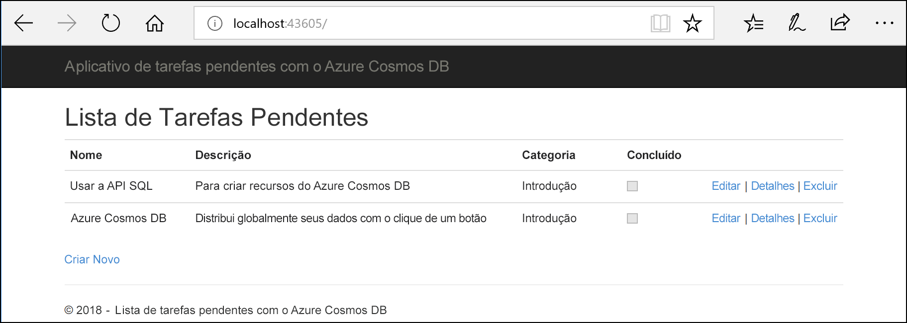
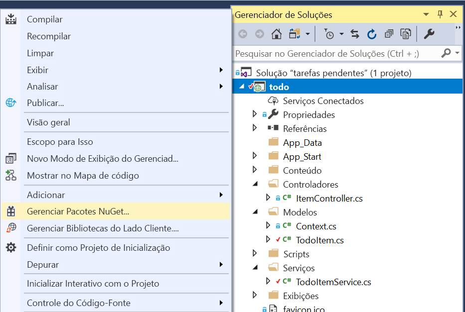
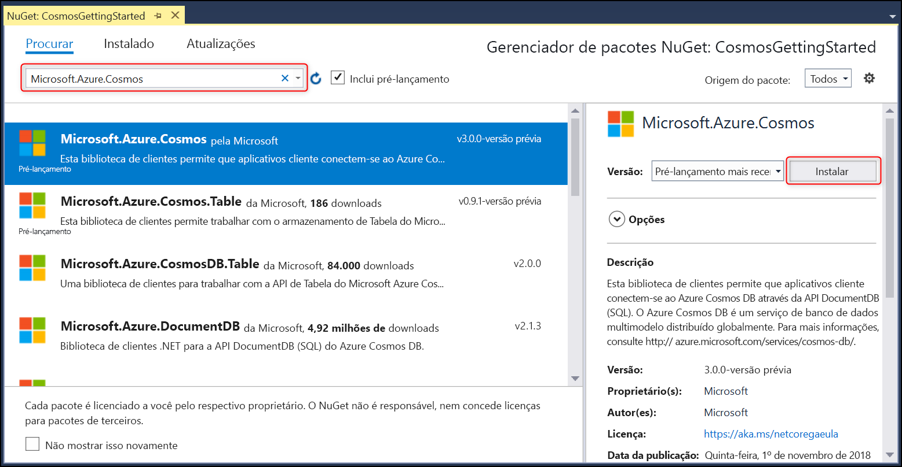

# <a name="quickstart-build-an-aspnet-web-app-using-azure-cosmos-db-sql-api-account"></a>Início Rápido: Criar um aplicativo Web do ASP.NET usando a conta de API de SQL do Azure Cosmos DB

> [!div class="op_single_selector"]
> * [.NET (Versão prévia)](create-sql-api-dotnet-preview.md)
> * [.NET](create-sql-api-dotnet.md)
> * [Java](create-sql-api-java.md)
> * [Node.js](create-sql-api-nodejs.md)
> * [Python](create-sql-api-python.md)
> * [Xamarin](create-sql-api-xamarin-dotnet.md)
>  
> 

O Azure Cosmos DB é o serviço de banco de dados multimodelo, altamente disponível, distribuído globalmente da Microsoft. É possível criar e consultar rapidamente documentos, chave/valor e bancos de dados do grafo. Todos se beneficiam de recursos de escala horizontal e distribuição global no núcleo do Azure Cosmos DB. 

Este início rápido demonstra como criar uma conta de [API do SQL](sql-api-introduction.md), um banco de dados e um contêiner do Azure Cosmos DB usando o portal do Azure. Você, em seguida, compilará e implantará um aplicativo Web de lista de tarefas pendentes do ASP.NET compilado na [API do .NET do SQL](sql-api-sdk-dotnet.md), conforme mostrado na captura de tela a seguir. 

Este guia de início rápido usa a versão 3.0 ou superior do SDK do .NET do Azure Cosmos DB. 



## <a name="prerequisites"></a>Pré-requisitos

Se você ainda não tem o Visual 2017 Studio instalado, poderá baixar e usar o **Visual Studio 2017 Community Edition** [gratuito](https://www.visualstudio.com/downloads/). Verifique se você habilitou a carga de trabalho de **desenvolvimento do Azure** durante a instalação do Visual Studio.

[!INCLUDE [quickstarts-free-trial-note](../../includes/quickstarts-free-trial-note.md)] 
[!INCLUDE [cosmos-db-emulator-docdb-api](../../includes/cosmos-db-emulator-docdb-api.md)]  

<a id="create-account"></a>
## <a name="create-a-database-account"></a>Criar uma conta de banco de dados

[!INCLUDE [cosmos-db-create-dbaccount-preview](../../includes/cosmos-db-create-dbaccount-preview.md)]

<a id="create-collection"></a>
## <a name="add-a-collection"></a>Adicionar uma coleção

[!INCLUDE [cosmos-db-create-collection-preview](../../includes/cosmos-db-create-collection-preview.md)]

<a id="add-sample-data"></a>
## <a name="add-sample-data"></a>Adicionar dados de exemplo

[!INCLUDE [cosmos-db-create-sql-api-add-sample-data](../../includes/cosmos-db-create-sql-api-add-sample-data.md)]

## <a name="query-your-data"></a>Consultar seus dados

[!INCLUDE [cosmos-db-create-sql-api-query-data](../../includes/cosmos-db-create-sql-api-query-data.md)]

## <a name="clone-the-sample-application"></a>Clonar o aplicativo de exemplo

Agora, vamos trabalhar com o código. Vamos clonar um [aplicativo de API do SQL do GitHub](https://github.com/Azure-Samples/cosmos-dotnet-todo-app), definir a cadeia de conexão e executá-lo. 

1. Abra um prompt de comando, crie uma nova pasta chamada exemplos de git e feche o prompt de comando.

    ```bash
    md "C:\git-samples"
    ```

2. Abra uma janela de terminal de git, como git bash, e use o comando `cd` para alterar para a nova pasta para instalar o aplicativo de exemplo.

    ```bash
    cd "C:\git-samples"
    ```

3. Execute o comando a seguir para clonar o repositório de exemplo. Este comando cria uma cópia do aplicativo de exemplo no seu computador.

    ```bash
    git clone https://github.com/Azure-Samples/cosmos-dotnet-todo-app.git
    ```

4. Abra o arquivo da solução **todo.sln** no Visual Studio. 

## <a name="review-the-code"></a>Examine o código

Esta etapa é opcional. Se você estiver interessado em aprender como os recursos de banco de dados são criados no código, poderá examinar os snippets de código a seguir. Caso contrário, você poderá pular para [Atualizar sua cadeia de conexão](#update-your-connection-string). 

Observe que se você estiver familiarizado com a versão anterior do SDK do .NET, poderá estar acostumado a ver os termos "coleção" e "documento". Como o Azure Cosmos DB é compatível com vários modelos de API, a versão 3.0 ou superior do SDK do .NET usa os termos genéricos “contêiner” e “item”. Um contêiner pode ser uma coleção, um gráfico ou uma tabela. Um item pode ser um documento, borda/vértice ou linha e descreve o conteúdo do contêiner. [Saiba mais sobre bancos de dados, contêineres e itens.](databases-containers-items.md)

Os trechos de código a seguir são todos obtidos no arquivo ToDoItemService.cs.

* O CosmosClient é inicializado nas linhas 68 - 69.

    ```csharp
    CosmosConfiguration config = new CosmosConfiguration(Endpoint, PrimaryKey);
    client = new CosmosClient(config);
    ```

* Um novo banco de dados é criado na linha 71.

    ```csharp
    CosmosDatabase database = await client.Databases.CreateDatabaseIfNotExistsAsync(DatabaseId);
    ```

* Um novo contêiner é criado na linha 72 com chave de partição "/categoria."

    ```csharp
    CosmosContainer container = await database.Containers.CreateContainerIfNotExistsAsync(ContainerId, "/category");
    ```

## <a name="update-your-connection-string"></a>Atualizar sua cadeia de conexão

Agora, volte ao portal do Azure para obter informações sobre a cadeia de conexão e copiá-las para o aplicativo.

1. No [portal do Azure](https://portal.azure.com/), na sua conta do Azure Cosmos DB, no painel de navegação esquerdo, selecione **Chaves** e, em seguida, selecione **Chaves de leitura/gravação**. Você usará os botões de cópia no lado direito da tela para copiar o URI e a Chave Primária para o arquivo web.config na próxima etapa.

    

2. No Visual Studio 2017, abra o arquivo **web.config**. 

3. Copie o valor do URI do portal (usando o botão de cópia) e transforme-o no valor da chave do ``endpoint`` em web.config. 

    `<add key="endpoint" value="FILLME" />`

4. Em seguida, copie o valor da CHAVE PRIMÁRIA do portal e transforme-o no valor do ``primarykey`` em web.config. 

    `<add key="primaryKey" value="FILLME" />`
    
5. Em seguida, atualize o valor de banco de dados e do contêiner para corresponder ao nome do banco de dados e contêiner que você criou anteriormente. Agora, você atualizou o aplicativo com todas as informações necessárias para se comunicar com o Azure Cosmos DB. 

    `<add key="database" value="Tasks" />`

    `<add key="container" value="Items" />`
    
## <a name="run-the-web-app"></a>Executar o aplicativo Web

1. No **Gerenciador de Soluções**, clique com o botão direito do mouse no seu novo projeto de aplicativo de console, que está em sua solução do Visual Studio e clique em **Gerenciar pacotes do NuGet...**
    
    
1. Na guia **NuGet**, clique em **Procurar** e insira **Microsoft.Azure.Cosmos** na caixa de pesquisa.
1. Nos resultados, encontre **Microsoft.Azure.Cosmos** e clique em **Instalar**.
   A ID do pacote para a Biblioteca de Clientes do API do SQL do Azure Cosmos DB é [Biblioteca de Clientes do Microsoft Azure Cosmos DB](https://www.nuget.org/packages/Microsoft.Azure.Cosmos/).

   

    Se receber uma mensagem sobre a análise das alterações para a solução, clique em **OK**. Se receber uma mensagem sobre a aceitação da licença, clique em **Aceito**.

1. Selecione CTRL + F5 para executar o aplicativo. Seu aplicativo é exibido no navegador. 

1. Selecione **Criar Novo** no navegador e crie algumas novas tarefas em seu aplicativo de tarefas pendentes. Você também deve ver as tarefas criadas em [Adicionar dados de exemplo](#add-sample-data)

   

Agora, é possível voltar ao Data Explorer e ver, consultar, modificar e trabalhar com esses novos dados. 

## <a name="review-slas-in-the-azure-portal"></a>Examinar SLAs no Portal do Azure

[!INCLUDE [cosmosdb-tutorial-review-slas](../../includes/cosmos-db-tutorial-review-slas.md)]

## <a name="clean-up-resources"></a>Limpar recursos

[!INCLUDE [cosmosdb-delete-resource-group](../../includes/cosmos-db-delete-resource-group.md)]

## <a name="next-steps"></a>Próximas etapas

Neste início rápido, você aprendeu como criar uma conta do Azure Cosmos DB, como criar um contêiner e adicionar itens usando o Data Explorer e como executar um aplicativo Web. Agora, é possível importar outros dados para sua conta do Cosmos DB. 

> [!div class="nextstepaction"]
> [Importar dados no Azure Cosmos DB](import-data.md)


