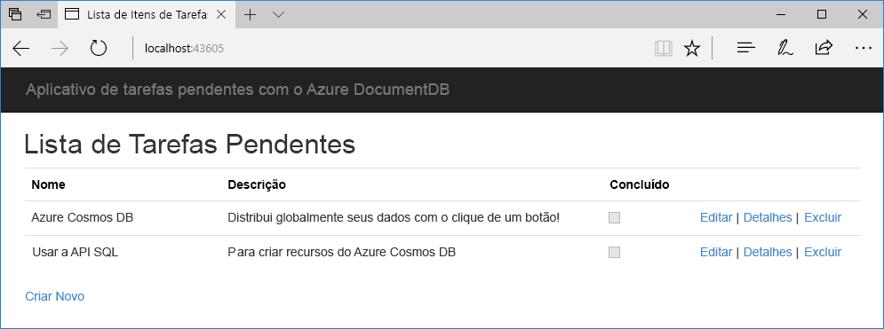

# <a name="quickstart-build-a-net-web-app-using-sql-api-account-in-azure-cosmos-db"></a>Início Rápido: Criar um aplicativo Web do .NET usando a conta da API do SQL no Azure Cosmos DB

> [!div class="op_single_selector"]
> * [.NET](create-sql-api-dotnet.md)
> * [.NET (versão prévia)](create-sql-api-dotnet-preview.md)
> * [Java](create-sql-api-java.md)
> * [Node.js](create-sql-api-nodejs.md)
> * [Python](create-sql-api-python.md)
> * [Xamarin](create-sql-api-xamarin-dotnet.md)
>  
> 

O Azure Cosmos DB é o serviço de banco de dados multimodelo distribuído globalmente da Microsoft. É possível usar o Azure Cosmos DB para criar e consultar rapidamente bancos de dados de chave/valor, bancos de dados de documentos e bancos de dados de grafo. Todos se beneficiam de recursos de escala horizontal e distribuição global no núcleo do Azure Cosmos DB. 

Este início rápido demonstra como usar o portal do Azure para criar uma conta de [API de SQL](sql-api-introduction.md) do Azure Cosmos DB, criar uma coleção e um banco de dados de documentos e adicionar dados à coleção. Você então usa um aplicativo Web de [SDK do .NET SQL](sql-api-sdk-dotnet.md) para adicionar mais dados à coleção. 

Neste início rápido, você usa o Data Explorer no portal do Azure para criar o banco de dados e a coleção. Você também pode criar o banco de dados e a coleção usando o código de exemplo do .NET. Para obter mais informações, veja [Examinar o código .NET](#review-the-net-code). 

## <a name="prerequisites"></a>Pré-requisitos

Visual Studio 2017 com o fluxo de trabalho de desenvolvimento do Azure instalado
- Você pode baixar e usar o [Visual Studio 2017 Community Edition](https://www.visualstudio.com/downloads/) **gratuito**. Verifique se você habilitou o **desenvolvimento do Azure** durante a instalação do Visual Studio. 

Uma assinatura do Azure ou uma conta de avaliação gratuita do Azure Cosmos DB
- [!INCLUDE [quickstarts-free-trial-note](../../includes/quickstarts-free-trial-note.md)] 
- [!INCLUDE [cosmos-db-emulator-docdb-api](../../includes/cosmos-db-emulator-docdb-api.md)]  

<a id="create-account"></a>
## <a name="create-an-azure-cosmos-db-account"></a>Criar uma conta do Azure Cosmos DB

[!INCLUDE [cosmos-db-create-dbaccount](../../includes/cosmos-db-create-dbaccount.md)]

<a id="create-collection-database"></a>
## <a name="add-a-database-and-a-collection"></a>Adicionar um banco de dados e uma coleção 

Você pode usar o Data Explorer no portal do Azure para criar um banco de dados e uma coleção. 

1.  Selecione a página **Data Explorer** na navegação esquerda em sua página da conta do Azure Cosmos DB e selecione **Nova Coleção**. 
    
    Talvez seja necessário rolar para a direita para ver a área **Adicionar Coleção**.
    
    
    
1.  Na página **Adicionar coleção**, insira as configurações da nova coleção.
    
    |Configuração|Valor sugerido|DESCRIÇÃO
    |---|---|---|
    |**Id do banco de dados**|ToDoList|Insira *ToDoList* como o nome para o novo banco de dados. Os nomes dos banco de dados devem conter de 1 a 255 caracteres e não podem conter `/, \\, #, ?` nem um espaço à direita.|
    |**Id da coleção**|Itens|Insira *Itens* como o nome da nova coleção. As IDs da coleção possuem os mesmos requisitos de caractere que os nomes de bancos de dados.|
    |**Chave de partição**| /category| O exemplo descrito neste artigo usa */category* como a chave de partição.|
    |**Taxa de transferência**|400|Deixe a taxa de transferência em 400 unidades de solicitação por segundo (RU/s). Se quiser reduzir a latência, você poderá escalar verticalmente a taxa de transferência mais tarde.| 
    
    Não adicione **Chaves exclusivas** para este exemplo. Chaves exclusivas permitem que você adicione uma camada de integridade de dados ao banco de dados garantindo a exclusividade de um ou mais valores por chave de partição. Para obter mais informações, veja [Chaves exclusivas no Azure Cosmos DB](unique-keys.md).
    
1.  Selecione **OK**. 
    O Data Explorer exibe o novo banco de dados e a coleção.
    
    

## <a name="add-data-to-your-database"></a>Adicionar dados a seu banco de dados

Adicione dados a seu novo banco de dados usando o Data Explorer.

1. No **Data Explorer**, o novo banco de dados aparece no painel **Coleções**. Expanda o banco de dados **ToDoList**, expanda a coleção **Itens**, selecione **Documentos** e, em seguida, selecione **Novo Documento**. 
   
   
   
1. Adicione a seguinte estrutura ao documento no lado direito do painel **Documentos**:

     ```json
     {
         "id": "1",
         "category": "personal",
         "name": "groceries",
         "description": "Pick up apples and strawberries.",
         "isComplete": false
     }
     ```

1. Clique em **Salvar**.
   
   
   
1. Selecione **Novo Documento** novamente e crie e salve um outro documento com uma única `id` e quaisquer outras propriedades e valores desejados. Os documentos podem ter qualquer estrutura, pois o Azure Cosmos DB não impõe nenhum esquema a seus dados.

## <a name="query-your-data"></a>Consultar seus dados

[!INCLUDE [cosmos-db-create-sql-api-query-data](../../includes/cosmos-db-create-sql-api-query-data.md)]

## <a name="use-the-net-web-app-to-manage-data"></a>Use o aplicativo Web do .NET para gerenciar dados

Para ver como é fácil trabalhar com seus dados do Azure Cosmos DB de modo programático, clone o aplicativo Web do .NET da API SQL de exemplo do GitHub, atualize a cadeia de conexão e execute o aplicativo para atualizar seus dados. 

Você também poderia criar o banco de dados e a coleção usando o código de exemplo do .NET. Para obter mais informações, veja [Examinar o código .NET](#review-the-net-code).

### <a name="clone-the-sample-app"></a>Clonar o aplicativo de exemplo

Primeiro, clone um [aplicativo de API do SQL](https://github.com/Azure-Samples/documentdb-dotnet-todo-app) em C# do GitHub. 

1. Abra uma janela do terminal do git, como Git Bash, crie um diretório chamado *git-samples* e altere-o para: 
   
   ```bash
   mkdir /c/git-samples/
   cd /c/git-samples/
   ```
   
1. Execute o seguinte comando para clonar o repositório de exemplo e criar uma cópia do aplicativo de exemplo em seu computador:
   
   ```bash
   git clone https://github.com/Azure-Samples/documentdb-dotnet-todo-app.git
   ```

### <a name="update-the-connection-string"></a>Atualizar a cadeia de conexão 

1. Navegue até o arquivo *todo.sln* e abra-o de seu aplicativo clonado no Visual Studio. 

1. No **Gerenciador de Soluções** do Visual Studio, abra o arquivo *web.config*. 

1. Volte para o portal do Azure para copiar as informações de sua cadeia de conexão para colar em *web.config*.
   
   1. Na navegação esquerda de sua conta do Azure Cosmos DB, selecione **Chaves**.
      
      
      
   1. Em **Chaves de Leitura/Gravação**, copie o valor do **URI** usando o botão de copiar à direita e, em seguida, cole-o na chave `endpoint` em *web.config*. Por exemplo:  
      
      `<add key="endpoint" value="https://mysqlapicosmosdb.documents.azure.com:443/" />`
      
   1. Copie o valor em 	**CHAVE PRIMÁRIA** e cole-o na chave `authKey` em *web.config*. Por exemplo: 
      
      `<add key="authKey" value="19ZDNJAiYL26tmnRvoez6hmtIfBGwjun50PWRjNYMC2ig8Ob9hYk7Fq1RYSv8FcIYnh1TdBISvCh7s6yyb0000==" />`

       
1. Verifique se os valores de banco de dados e coleção em *web.config* correspondem aos nomes que você criou anteriormente. 

   ```csharp
   <add key="database" value="ToDoList"/>
   <add key="collection" value="Items"/>
   ```
 
1. Salve o *web.config.* Agora, você atualizou o aplicativo com todas as informações necessárias para se comunicar com o Azure Cosmos DB.

### <a name="run-the-web-app"></a>Executar o aplicativo Web

1. No Visual Studio, clique com o botão direito do mouse no projeto **todo** no **Gerenciador de Soluções** e selecione **Gerenciar Pacotes do NuGet**. 

1. Na caixa **Procurar** do NuGet, digite *DocumentDB*.

1. Nos resultados, instale a biblioteca **Microsoft.Azure.DocumentDB** se ainda não estiver instalada. Isso instala o pacote [Microsoft.Azure.DocumentDB](https://www.nuget.org/packages/Microsoft.Azure.DocumentDB/) e todas as dependências.
   
   Se o NuGet Package Manager exibir uma mensagem de que alguns pacotes estão ausentes da solução, selecione **Restaurar** para instalá-los de fontes internas. 

1. Selecione **Ctrl**+**F5** para executar o aplicativo em seu navegador. 

1. Selecione **Criar Novo** no aplicativo de tarefas pendentes e crie algumas tarefas.

   

Agora é possível voltar ao Data Explorer no portal do Azure para ver, consultar, modificar e trabalhar com seus novos dados. 

## <a name="review-the-net-code"></a>Examinar o código do .NET

Esta etapa é opcional. Neste início rápido, você criou um banco de dados e uma coleção no portal do Azure e adicionou dados de amostra usando a amostra do .NET. No entanto, você também pode criar o banco de dados e a coleção usando o exemplo .NET. Examine os snippets de código a seguir se você estiver interessado em como os recursos de banco de dados são criados no código. Os snippets de código são todos obtidos do arquivo *DocumentDBRepository.cs* no projeto **todo**.

* Esse código inicializa o `DocumentClient`: 

    ```csharp
    client = new DocumentClient(new Uri(ConfigurationManager.AppSettings["endpoint"]), ConfigurationManager.AppSettings["authKey"]);
    ```

* Esse código cria o novo banco de dados usando o método `CreateDatabaseAsync`:

    ```csharp
    await client.CreateDatabaseAsync(new Database { Id = DatabaseId });
    ```

* O código a seguir cria a nova coleção usando o método `CreateDocumentCollectionAsync`:

    ```csharp
    private static async Task CreateCollectionIfNotExistsAsync()
    {
        try
        {
           await client.ReadDocumentCollectionAsync(UriFactory.CreateDocumentCollectionUri(DatabaseId, CollectionId));
        }
        catch (DocumentClientException e)
        {
           if (e.StatusCode == System.Net.HttpStatusCode.NotFound)
           {
              await client.CreateDocumentCollectionAsync(
              UriFactory.CreateDatabaseUri(DatabaseId),
              new DocumentCollection
              {
                  Id = CollectionId
              },
              new RequestOptions { OfferThroughput = 400 });
           }
           else
           {
             throw;
           }
        }
    }
    ```

## <a name="clean-up-resources"></a>Limpar recursos

[!INCLUDE [cosmosdb-delete-resource-group](../../includes/cosmos-db-delete-resource-group.md)]

## <a name="next-steps"></a>Próximas etapas

Neste início rápido, você aprendeu a criar uma conta do Azure Cosmos DB, criar uma coleção usando o Data Explorer e o banco de dados e executar um aplicativo Web do .NET para atualizar seus dados. Agora, é possível importar outros dados para sua conta do Azure Cosmos DB. 

> [!div class="nextstepaction"]
> [Importar dados no Azure Cosmos DB](import-data.md)

