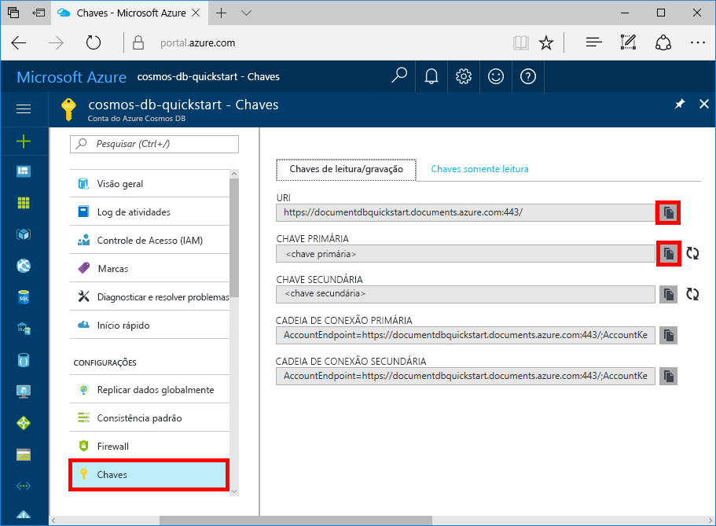

# <a name="quickstart-build-a-nodejs-app-using-azure-cosmos-db-sql-api-account"></a>Início Rápido: Criar um aplicativo Web do Node.js usando a conta de API de SQL do Azure Cosmos DB

> [!div class="op_single_selector"]
> * [.NET](create-sql-api-dotnet.md)
> * [.NET (versão prévia)](create-sql-api-dotnet-preview.md)
> * [Java](create-sql-api-java.md)
> * [Node.js](create-sql-api-nodejs.md)
> * [Python](create-sql-api-python.md)
> * [Xamarin](create-sql-api-xamarin-dotnet.md)
>  

O Azure Cosmos DB é o serviço de banco de dados multimodelo distribuído globalmente da Microsoft. É possível criar e consultar rapidamente documentos, chave/valor e bancos de dados do grafo. Todos se beneficiam de recursos de escala horizontal e distribuição global no núcleo do Azure Cosmos DB. 

Este início rápido demonstra como criar uma conta de [API do SQL](sql-api-introduction.md), um banco de dados de documento e um contêiner do Azure Cosmos DB usando o portal do Azure. Em seguida, crie e execute um aplicativo de console criado no [SDK do JavaScript em SQL](sql-api-sdk-node.md). Este início rápido usa a versão 2.0 do [SDK do JavaScript](https://www.npmjs.com/package/@azure/cosmos).

## <a name="prerequisites"></a>Pré-requisitos

[!INCLUDE [quickstarts-free-trial-note](../../includes/quickstarts-free-trial-note.md)] 
[!INCLUDE [cosmos-db-emulator-docdb-api](../../includes/cosmos-db-emulator-docdb-api.md)]

* Além disso:
    * [Node.js](https://nodejs.org/en/) versão v6.0.0 ou superior
    * [Git](https://git-scm.com/)

## <a name="create-a-database-account"></a>Criar uma conta de banco de dados

[!INCLUDE [cosmos-db-create-dbaccount](../../includes/cosmos-db-create-dbaccount.md)]

## <a name="add-a-collection"></a>Adicionar uma coleção

[!INCLUDE [cosmos-db-create-collection](../../includes/cosmos-db-create-collection.md)]

## <a name="add-sample-data"></a>Adicionar dados de exemplo

[!INCLUDE [cosmos-db-create-sql-api-add-sample-data](../../includes/cosmos-db-create-sql-api-add-sample-data.md)]

## <a name="query-your-data"></a>Consultar seus dados

[!INCLUDE [cosmos-db-create-sql-api-query-data](../../includes/cosmos-db-create-sql-api-query-data.md)]

## <a name="clone-the-sample-application"></a>Clonar o aplicativo de exemplo

Agora vamos clonar um aplicativo de API do SQL do GitHub, definir a cadeia de conexão e executá-lo.

1. Abra um prompt de comando, crie uma nova pasta chamada exemplos de git e feche o prompt de comando.

    ```bash
    md "C:\git-samples"
    ```

2. Abra uma janela de terminal de git, como git bash, e use o comando `cd` para alterar para a nova pasta para instalar o aplicativo de exemplo.

    ```bash
    cd "C:\git-samples"
    ```

3. Execute o comando a seguir para clonar o repositório de exemplo. Este comando cria uma cópia do aplicativo de exemplo no seu computador.

    ```bash
    git clone https://github.com/Azure-Samples/azure-cosmos-db-sql-api-nodejs-getting-started.git
    ```

## <a name="review-the-code"></a>Examine o código

Esta etapa é opcional. Se você estiver interessado em aprender como os recursos de banco de dados são criados no código, poderá examinar os snippets de código a seguir. Caso contrário, você poderá pular para [Atualizar sua cadeia de conexão](#update-your-connection-string). 

Observe que se você estiver familiarizado com a versão anterior do SDK do JavaScript, poderá estar acostumado a ver os termos 'coleção' e 'documento'. Como o Azure Cosmos DB dá suporte a [vários modelos de API](https://docs.microsoft.com/azure/cosmos-db/introduction), a versão 2.0 ou superior do SDK do JavaScript usa o termos genéricos 'contêiner', que pode ser uma coleção, um gráfico ou uma tabela, e 'item' para descrever o conteúdo do contêiner.

Todos os snippets de código a seguir são retirados do arquivo **app.js**.

* O `CosmosClient` é inicializado.

    ```javascript
    const client = new CosmosClient({ endpoint: endpoint, auth: { masterKey: masterKey } });
    ```

* Um novo banco de dados é criado.

    ```javascript
    const { database } = await client.databases.createIfNotExists({ id: databaseId });
    ```

* É criado um novo contêiner (coleção).

    ```javascript
    const { container } = await client.database(databaseId).containers.createIfNotExists({ id: containerId });
    ```

* Um item (documento) é criado.

    ```javascript
    const { item } = await client.database(databaseId).container(containerId).items.create(itemBody);
    ```

* Uma consulta SQL no JSON é executada.

    ```javascript
    const querySpec = {
        query: "SELECT VALUE r.children FROM root r WHERE r.lastName = @lastName",
        parameters: [
            {
                name: "@lastName",
                value: "Andersen"
            }
        ]
    };

    const { result: results } = await client.database(databaseId).container(containerId).items.query(querySpec).toArray();
    for (var queryResult of results) {
        let resultString = JSON.stringify(queryResult);
        console.log(`\tQuery returned ${resultString}\n`);
    }
    ```    

## <a name="update-your-connection-string"></a>Atualizar sua cadeia de conexão

Agora, volte ao portal do Azure para obter informações sobre a cadeia de conexão e copiá-las para o aplicativo.

1. No[Portal do Azure](https://portal.azure.com/), na sua conta do Azure Cosmos DB, no painel de navegação esquerdo, clique em **Chaves** e, em seguida, clique em **Chaves de leitura/gravação**. Você usará os botões de cópia no lado direito da tela para copiar o URI e a Chave Primária para o arquivo `config.js` na próxima etapa.

    

2. Abra o arquivo `config.js`. 

3. Copie o valor do URI do portal (usando o botão de cópia) e transforme-o no valor da chave do ponto de extremidade em `config.js`. 

    `config.endpoint = "https://FILLME.documents.azure.com"`

4. Em seguida, copie o valor da CHAVE PRIMÁRIA do portal e transforme-o no valor de `config.primaryKey` em `config.js`. Agora, você atualizou o aplicativo com todas as informações necessárias para se comunicar com o Azure Cosmos DB. 

    `config.primaryKey = "FILLME"`
    
## <a name="run-the-app"></a>Execute o aplicativo
1. Executar `npm install` em um terminal para instalar os módulos npm necessários

2. Execute `node app.js` em um terminal para iniciar o aplicativo de nó.

Agora, é possível voltar ao Data Explorer e ver a consulta, modificar e trabalhar com esses novos dados. 

## <a name="review-slas-in-the-azure-portal"></a>Examinar SLAs no Portal do Azure

[!INCLUDE [cosmosdb-tutorial-review-slas](../../includes/cosmos-db-tutorial-review-slas.md)]

## <a name="clean-up-resources"></a>Limpar recursos

[!INCLUDE [cosmosdb-delete-resource-group](../../includes/cosmos-db-delete-resource-group.md)]

## <a name="next-steps"></a>Próximas etapas

Neste início rápido, você aprendeu como criar uma conta do Azure Cosmos DB, como criar uma coleção usando o Data Explorer e como executar um aplicativo. Agora, é possível importar outros dados para sua conta do Cosmos DB. 

> [!div class="nextstepaction"]
> [Importar dados no Azure Cosmos DB](import-data.md)


