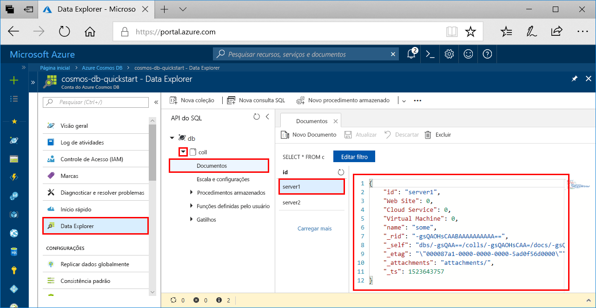

# <a name="azure-cosmos-db-build-a-sql-api-app-with-python-and-the-azure-portal"></a>Azure Cosmos DB: compilar um aplicativo de API do SQL com o Python e com o Portal do Azure

O Azure Cosmos DB é o serviço de banco de dados multimodelo distribuído globalmente da Microsoft. É possível criar e consultar rapidamente documentos, chave/valor e bancos de dados do grafo. Todos se beneficiam de recursos de escala horizontal e distribuição global no núcleo do Azure Cosmos DB. 

Este início rápido demonstra como criar uma conta [API do SQL](sql-api-introduction.md) do Azure Cosmos DB, um banco de dados de documento e uma coleção usando o Portal do Azure. Em seguida, você compila e executa um aplicativo de console criado na [API do Python do SQL](sql-api-sdk-python.md).

[!INCLUDE [quickstarts-free-trial-note](../../includes/quickstarts-free-trial-note.md)] [!INCLUDE [cosmos-db-emulator-docdb-api](../../includes/cosmos-db-emulator-docdb-api.md)]

## <a name="prerequisites"></a>pré-requisitos

* [Python 3.6](https://www.python.org/downloads/) com \<install location\>\Python36 e \<install location>\Python36\Scripts adicionados ao seu CAMINHO. 
* [Visual Studio Code](https://code.visualstudio.com/)
* [Extensão do Python para Visual Studio Code](https://marketplace.visualstudio.com/items?itemName=ms-python.python#overview)

## <a name="create-a-database-account"></a>Criar uma conta de banco de dados

[!INCLUDE [cosmos-db-create-dbaccount](../../includes/cosmos-db-create-dbaccount.md)]

## <a name="add-a-collection"></a>Adicionar uma coleção

[!INCLUDE [cosmos-db-create-collection](../../includes/cosmos-db-create-collection.md)]

## <a name="add-sample-data"></a>Adicionar dados de exemplo

[!INCLUDE [cosmos-db-create-sql-api-add-sample-data](../../includes/cosmos-db-create-sql-api-add-sample-data.md)]

## <a name="query-your-data"></a>Consultar seus dados

[!INCLUDE [cosmos-db-create-sql-api-query-data](../../includes/cosmos-db-create-sql-api-query-data.md)]

## <a name="clone-the-sample-application"></a>Clonar o aplicativo de exemplo

Agora vamos clonar um aplicativo de API do SQL do GitHub, definir a cadeia de conexão e executá-lo. Você verá como é fácil trabalhar usando dados de forma programática. 

1. Abra um prompt de comando, crie uma nova pasta chamada exemplos de git e feche o prompt de comando.

    ```bash
    md "C:\git-samples"
    ```

2. Abra uma janela de terminal de git, como git bash, e use o comando `cd` para alterar para a nova pasta para instalar o aplicativo de exemplo.

    ```bash
    cd "C:\git-samples"
    ```

3. Execute o comando a seguir para clonar o repositório de exemplo. Este comando cria uma cópia do aplicativo de exemplo no seu computador. 

    ```bash
    git clone https://github.com/Azure-Samples/azure-cosmos-db-documentdb-python-getting-started.git
    ```  
    
## <a name="review-the-code"></a>Examine o código

Esta etapa é opcional. Se você estiver interessado em aprender como os recursos de banco de dados são criados no código, poderá examinar os trechos de código a seguir. Caso contrário, você poderá pular para [Atualizar sua cadeia de conexão](#update-your-connection-string). 

Todos os trechos de código a seguir foram retirados do arquivo DocumentDBGetStarted.py.

* O DocumentClient é inicializado.

    ```python
    # Initialize the Python client
    client = document_client.DocumentClient(config['ENDPOINT'], {'masterKey': config['MASTERKEY']})
    ```

* Um novo banco de dados é criado.

    ```python
    # Create a database
    db = client.CreateDatabase({ 'id': config['SQL_DATABASE'] })
    ```

* Uma nova coleção é criada.

    ```python
    # Create collection options
    options = {
        'offerEnableRUPerMinuteThroughput': True,
        'offerVersion': "V2",
        'offerThroughput': 400
    }

    # Create a collection
    collection = client.CreateCollection(db['_self'], { 'id': config['SQL_COLLECTION'] }, options)
    ```

* Alguns documentos são criados.

    ```python
    # Create some documents
    document1 = client.CreateDocument(collection['_self'],
        { 
            'id': 'server1',
            'Web Site': 0,
            'Cloud Service': 0,
            'Virtual Machine': 0,
            'name': 'some' 
        })
    ```

* Uma consulta é executada usando SQL

    ```python
    # Query them in SQL
    query = { 'query': 'SELECT * FROM server s' }    
            
    options = {} 
    options['enableCrossPartitionQuery'] = True
    options['maxItemCount'] = 2

    result_iterable = client.QueryDocuments(collection['_self'], query, options)
    results = list(result_iterable);

    print(results)
    ```

## <a name="update-your-connection-string"></a>Atualizar sua cadeia de conexão

Agora, volte ao portal do Azure para obter informações sobre a cadeia de conexão e copiá-las para o aplicativo.

1. No [Portal do Azure](http://portal.azure.com/), em sua conta do Azure Cosmos DB, clique em **Chaves** no painel de navegação esquerdo. Você usará os botões de cópia do lado direito da tela para copiar o **URI** e a **Chave Primária** para o arquivo DocumentDBGetStarted.py na próxima etapa.

    

2. Abra o arquivo C:\git-samples\azure-cosmos-db-documentdb-python-getting-startedDocumentDBGetStarted.py no Visual Studio Code. 

3. Copie o valor do **URI** no portal (usando o botão de cópia) e transforme-o no valor da chave do **ponto de extremidade** em DocumentDBGetStarted.py. 

    `'ENDPOINT': 'https://FILLME.documents.azure.com',`

4. Em seguida, copie o valor da **CHAVE PRIMÁRIA** do portal e torne-o o valor de **config.MASTERKEY** em DocumentDBGetStarted.py. Agora, você atualizou o aplicativo com todas as informações necessárias para se comunicar com o Azure Cosmos DB. 

    `'MASTERKEY': 'FILLME',`

5. Salve o arquivo DocumentDBGetStarted.py.
    
## <a name="run-the-app"></a>Execute o aplicativo

1. No Visual Studio Code, selecione **Exibir**>**Paleta de Comandos**. 

2. No prompt, insira **Python: Selecionar Interpretador** e, em seguida, selecione a versão do Python que você quer usar.

    O Rodapé no Visual Studio Code é atualizado para indicar o interpretador selecionado. 

3. Selecione **Exibir** > **Terminal Integrado** para abrir o terminal integrado do Visual Studio Code.

4. Na janela do terminal integrada, verifique se você está na pasta azure-cosmos-db-documentdb-python-getting-started. Se não estiver, execute o comando a seguir para alternar para a pasta raiz. 

    ```
    cd "C:\git-samples\azure-cosmos-db-documentdb-python-getting-started"`
    ```

5. Execute o seguinte comando para instalar o pacote pydocumentdb. 

    ```
    pip3 install pydocumentdb
    ```

    Se você receber um erro de acesso negado ao tentar instalar pydocumentdb, precisará [executar o VS Code como administrador](https://stackoverflow.com/questions/37700536/visual-studio-code-terminal-how-to-run-a-command-with-administrator-rights).

6. Execute o seguinte comando para executar o exemplo, criar e armazenar novos documentos no Azure Cosmos DB.

    ```
    python DocumentDBGetStarted.py
    ```

7. Para confirmar a criação e gravação dos novos documentos, no Portal do Azure, selecione **Data Explorer**, expanda **coll**, expanda **Documentos** e, depois, selecione o documento **server1**. O conteúdo do documento server1 corresponde o conteúdo retornado na janela do terminal integrado. 

    

## <a name="review-slas-in-the-azure-portal"></a>Examinar SLAs no Portal do Azure

[!INCLUDE [cosmosdb-tutorial-review-slas](../../includes/cosmos-db-tutorial-review-slas.md)]

## <a name="clean-up-resources"></a>Limpar recursos

[!INCLUDE [cosmosdb-delete-resource-group](../../includes/cosmos-db-delete-resource-group.md)]

## <a name="next-steps"></a>Próximas etapas

Neste início rápido, você aprendeu como criar uma conta do Azure Cosmos DB, como criar uma coleção usando o Data Explorer e como executar um aplicativo. Agora, é possível importar outros dados para sua conta do Cosmos DB. 

> [!div class="nextstepaction"]
> [Importar dados no Azure Cosmos DB para a API do SQL](import-data.md)


