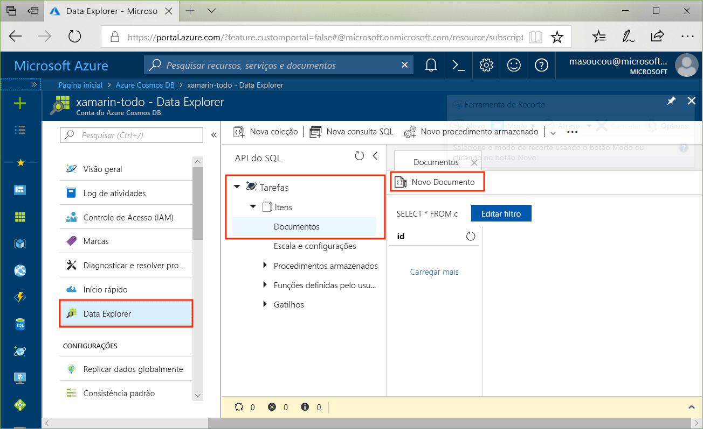
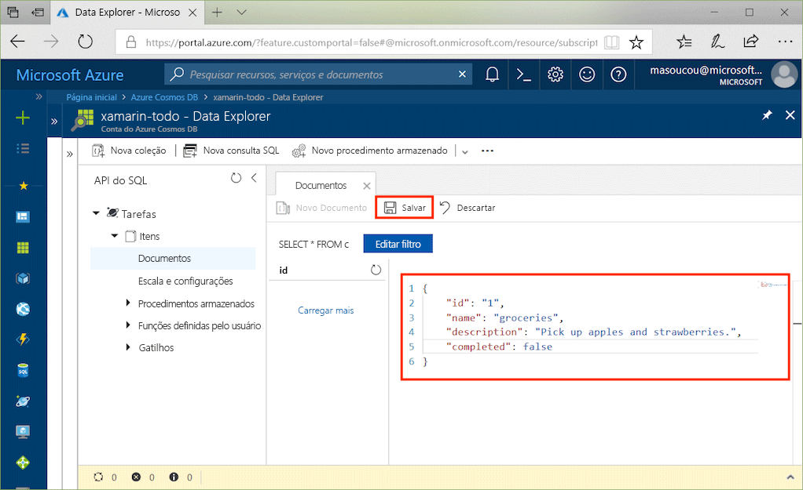
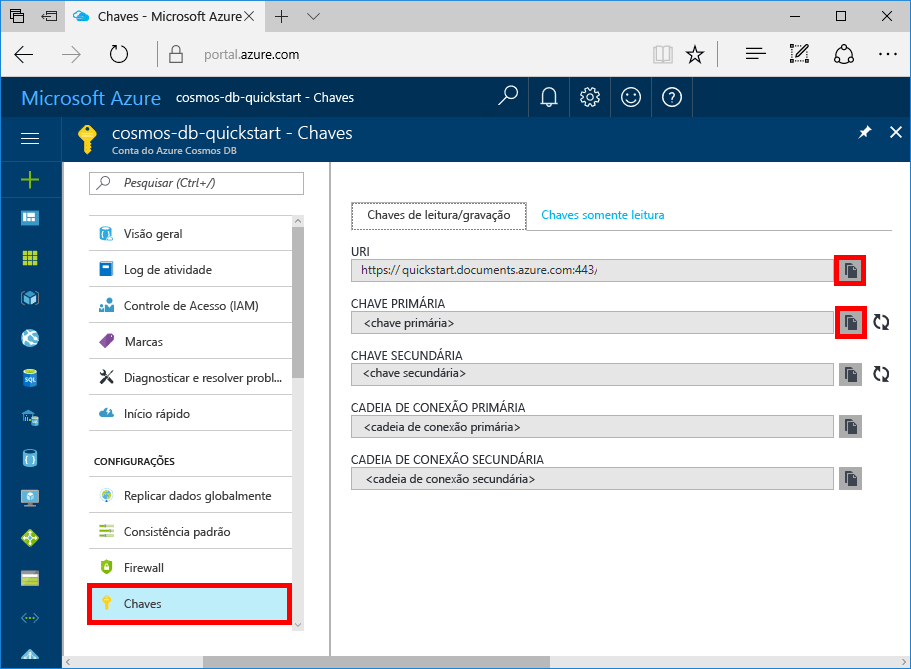

# <a name="azure-cosmos-db-build-a-todo-app-with-xamarin"></a>Azure Cosmos DB: compilar um aplicativo de tarefas pendentes com o Xamarin

O Azure Cosmos DB é o serviço de banco de dados multimodelo distribuído globalmente da Microsoft. É possível criar e consultar rapidamente documentos, chave/valor e bancos de dados do grafo. Todos se beneficiam de recursos de escala horizontal e distribuição global no núcleo do Azure Cosmos DB.

> [!NOTE]
> Encontre um exemplo de código de um aplicativo Xamarin de exemplo totalmente canônico mostrando várias ofertas do Azure, incluindo o CosmosDB, no GitHub clicando [aqui](https://github.com/xamarinhq/app-geocontacts). Esse aplicativo demonstra a exibição de contatos geograficamente disperso, e permite que os contatos atualizem sua localização.

Este início rápido demonstra como criar uma conta de API do SQL do Azure Cosmos DB, um banco de dados de documento e uma coleção usando o Portal do Azure. Em seguida, você compilará e implantará um aplicativo Web de lista de tarefas pendentes na [API do SQL .NET](sql-api-sdk-dotnet.md) e no [Xamarin](https://docs.microsoft.com/xamarin/#pivot=platforms&panel=Cross-Platform) usando o [Xamarin.Forms](https://docs.microsoft.com/xamarin/#pivot=platforms&panel=XamarinForms) e o [padrão de arquitetura MVVM](https://docs.microsoft.com/xamarin/xamarin-forms/xaml/xaml-basics/data-bindings-to-mvvm).


## <a name="prerequisites"></a>pré-requisitos

Se você está desenvolvendo no Windows e ainda não tem o Visual Studio 2017 instalado, pode baixar e usar o [Visual Studio 2017 Community Edition](https://www.visualstudio.com/downloads/) **grátis**. Verifique se você habilitou as cargas de trabalho do **Desenvolvimento do Azure** e do **Desenvolvimento móvel com .NET** durante a instalação do Visual Studio.

Se estiver usando um Mac, você pode baixar o [Visual Studio para Mac](https://www.visualstudio.com/vs/mac/) **grátis**.

[!INCLUDE [quickstarts-free-trial-note](../../includes/quickstarts-free-trial-note.md)]
[!INCLUDE [cosmos-db-emulator-docdb-api](../../includes/cosmos-db-emulator-docdb-api.md)]

## <a name="create-a-database-account"></a>Criar uma conta de banco de dados

[!INCLUDE [cosmos-db-create-dbaccount](../../includes/cosmos-db-create-dbaccount.md)]

## <a name="add-a-collection"></a>Adicionar uma coleção

[!INCLUDE [cosmos-db-create-collection](../../includes/cosmos-db-create-collection.md)]

## <a name="add-sample-data"></a>Adicionar dados de exemplo

Agora você pode adicionar dados à sua nova coleção usando o Data Explorer.

1. No Data Explorer > expanda o banco de dados **Tarefas** > expanda a coleção **Itens** > clique em **Documentos** > e clique em **Novos Documentos**.

   

2. Agora, adicione um documento à coleção com a seguinte estrutura.

     ```json
     {
         "id": "1",
         "name": "groceries",
         "description": "Pick up apples and strawberries.",
         "completed": false
     }
     ```

3. Depois de ter adicionado o json à guia **Documentos**, clique em **Salvar**.

    

4. Crie e salve mais um documento onde você insere um valor exclusivo para a propriedade `id` e altere as outras propriedades quando achar adequado. Os novos documentos podem ter qualquer estrutura que você deseje, pois o Azure Cosmos DB não impõe nenhum esquema para seus dados.

     Agora você pode usar consultas no Data Explorer para recuperar os dados. Por padrão, o Data Explorer usa `SELECT * FROM c` para recuperar todos os documentos na coleção, mas você pode alterar isso para uma [consulta SQL ](sql-api-sql-query.md) diferente, como `SELECT * FROM c ORDER BY c._ts DESC`, para retornar todos os documentos em ordem descendente com base no carimbo de data/hora.

     Você também pode usar o Data Explorer para criar procedimentos armazenados, UDFs e gatilhos para executar a lógica de negócios do servidor, além de dimensionar a taxa de transferência. O Data Explorer expõe todo o acesso a dados interno via programação disponível nas APIs, mas oferece acesso fácil aos dados no Portal do Azure.

## <a name="clone-the-sample-application"></a>Clonar o aplicativo de exemplo

Agora vamos clonar o aplicativo de API do SQL Xamarin no github: revise o código, obtenha as chaves de API e execute-o. Você verá como é fácil trabalhar usando dados de forma programática.

1. Abra uma janela de terminal do Git, como git bash, e `cd` para um diretório de trabalho.

2. Execute o comando a seguir para clonar o repositório de exemplo.

    ```bash
    git clone https://github.com/Azure/azure-documentdb-dotnet.git
    ```

3. Em seguida, abra o arquivo ToDoItems.sln da pasta exemplos/xamarin/ToDoItems no Visual Studio.

## <a name="obtain-your-api-keys"></a>Obter as chaves de API

Volte ao Portal do Azure para obter as informações da sua chave de API e copie-as para o aplicativo.

1. No [Portal do Azure](http://portal.azure.com/), na sua conta de API do SQL do Azure Cosmos DB, no painel de navegação esquerdo, clique em **Chaves** e, em seguida, clique em **Chaves de leitura/gravação**. Você usará os botões de cópia do lado direito da tela para copiar o URI e a Chave Primária para o arquivo APIKeys.cs na próxima etapa.

    

2. Tanto no Visual Studio 2017 quanto no Visual Studio para Mac, abra o arquivo APIKeys.cs na pasta azure-documentdb-dotnet/samples/xamarin/ToDoItems/ToDoItems.Core/Helpers.

3. Copie o valor do URI do portal (usando o botão de cópia) e o torne o valor da variável `CosmosEndpointUrl` no arquivo APIKeys.cs.

    `public static readonly string CosmosEndpointUrl = "{Azure Cosmos DB account URL}";`

4. Em seguida, copie o valor da CHAVE PRIMÁRIA do portal e transforme-o no valor de `Cosmos Auth Key` no arquivo APIKeys.cs.

    `public static readonly string CosmosAuthKey = "{Azure Cosmos DB secret}";`

## <a name="review-the-code"></a>Examine o código

Esta solução demonstra como criar um aplicativo de tarefas pendentes usando a API do SQL do Azure Cosmos DB e o Xamarin.Forms. O aplicativo tem duas guias. A primeira contém uma exibição de lista mostrando itens de tarefas pendentes que ainda não foram concluídas. A segunda guia exibe os itens de tarefas pendentes que foram concluídos. Além de exibir os itens de tarefas pendentes não concluídos na primeira guia, você também pode adicionar novos itens de tarefas pendentes, editar os existentes e marcar itens como concluído.


O código na solução ToDoItems contém:

* ToDoItems.Core: trata-se de um projeto .NET Standard contendo um projeto Xamarin.Forms e o código de lógica de aplicativo compartilhado que mantém os itens de tarefas pendentes no Azure Cosmos DB.
* ToDoItems.Android: este projeto contém o aplicativo Android.
* ToDoItems.iOS: este projeto contém o aplicativo iOS.

Agora vamos fazer uma rápida revisão de como o aplicativo se comunica com o Azure Cosmos DB.

* O Pacote NuGet do [Microsoft.Azure.DocumentDb.Core](https://www.nuget.org/packages/Microsoft.Azure.DocumentDB.Core/) deve ser adicionado em todos os projetos.
* A classe `ToDoItem` na pasta azure-documentdb-dotnet/samples/xamarin/ToDoItems/ToDoItems.Core/Models modela os documentos na coleção **Itens** criada acima. Observe que a propriedade de nomeação diferencia maiúsculas de minúsculas.
* A classe `CosmosDBService` na pasta azure-documentdb-dotnet/samples/xamarin/ToDoItems/ToDoItems.Core/Services encapsula a comunicação ao Azure Cosmos DB.
* Na classe `CosmosDBService` há uma variável do tipo `DocumentClient`. O `DocumentClient` é usado para configurar e executar solicitações em relação à conta do Azure Cosmos DB e é instanciado na linha 31:

    ```csharp
    docClient = new DocumentClient(new Uri(APIKeys.CosmosEndpointUrl), APIKeys.CosmosAuthKey);
    ```

* Ao consultar uma coleção de documentos, é usado o método `DocumentClient.CreateDocumentQuery<T>`, como visto aqui na função `CosmosDBService.GetToDoItems`:

    ```csharp
    public async static Task<List<ToDoItem>> GetToDoItems()
    {
        var todos = new List<ToDoItem>();

        var todoQuery = docClient.CreateDocumentQuery<ToDoItem>(
                                UriFactory.CreateDocumentCollectionUri(databaseName, collectionName),
                                .Where(todo => todo.Completed == false)
                                .AsDocumentQuery();

        while (todoQuery.HasMoreResults)
        {
            var queryResults = await todoQuery.ExecuteNextAsync<ToDoItem>();

            todos.AddRange(queryResults);
        }

        return todos;
    }
    ```

    O `CreateDocumentQuery<T>` usa um URI que aponta para a coleção criada na seção anterior. E também é possível especificar operadores LINQ, como uma cláusula `Where`. Nesse caso, somente os itens de tarefas pendentes que não foram concluídos são retornados.

    A função `CreateDocumentQuery<T>` é executada de forma síncrona e retorna um `IQueryable<T>`. No entanto, o método `AsDocumentQuery` converte o `IQueryable<T>` para um objeto `IDocumentQuery<T>` que pode ser executado de forma assíncrona, não bloqueando, portanto, o thread de interface do usuário para aplicativos móveis.

    A função `IDocumentQuery<T>.ExecuteNextAsync<T>` recupera a página de resultados do Azure Cosmos DB, na qual uma verificação `HasMoreResults` vê se ainda há resultados adicionais a serem retornados.

> [!TIP]
> Várias funções que operam em coleções e documentos do Azure Cosmos DB utilizam um URI como parâmetro para especificar o endereço da coleção ou do documento. Esse URI é construído usando a classe `URIFactory`. Todos os URIs para bancos de dados, coleções e documentos podem ser criados com essa classe.

* A função `ComsmosDBService.InsertToDoItem` na linha 107 demonstra como inserir um novo documento:

    ```csharp
    public async static Task InsertToDoItem(ToDoItem item)
    {
        ...
        await docClient.CreateDocumentAsync(UriFactory.CreateDocumentCollectionUri(databaseName, collectionName), item);
        ...
    }
    ```

    O URI da coleção de documento é especificado, assim como o item a ser inserido.

* A função `CosmosDBService.UpdateToDoItem` na linha 124 demonstra como substituir um documento existente por um novo:

    ```csharp
    public async static Task UpdateToDoItem(ToDoItem item)
    {
        ...
        var docUri = UriFactory.CreateDocumentUri(databaseName, collectionName, item.Id);

        await docClient.ReplaceDocumentAsync(docUri, item);
    }
    ```

    Aqui, é necessário um novo URI para identificar exclusivamente o documento a ser substituído, e ele é obtido usando o `UriFactory.CreateDocumentUri` e passando a ele os nomes de banco de dados e de coleção e a ID do documento.

    O `DocumentClient.ReplaceDocumentAsync` substitui o documento identificado pelo URI por aquele especificado como um parâmetro.

* A exclusão de um item é demonstrada com a função `CosmosDBService.DeleteToDoItem` na linha 115:

    ```csharp
    public async static Task DeleteToDoItem(ToDoItem item)
    {
        ...
        var docUri = UriFactory.CreateDocumentUri(databaseName, collectionName, item.Id);

        await docClient.DeleteDocumentAsync(docUri);
    }
    ```

    Observe novamente o URI de documento exclusivo que está sendo criado e passado para a função `DocumentClient.DeleteDocumentAsync`.

## <a name="run-the-app"></a>Execute o aplicativo

Agora, você atualizou o aplicativo com todas as informações necessárias para se comunicar com o Azure Cosmos DB.

As etapas a seguir demonstram como executar o aplicativo usando o depurador do Visual Studio para Mac.

> [!NOTE]
> O uso do aplicativo de versão Android é exatamente o mesmo, e quaisquer diferenças serão indicadas nas etapas abaixo. Se você deseja depurar com o Visual Studio no Windows, documente as tarefas pendentes para que elas possam ser encontradas pelo [iOS aqui](https://docs.microsoft.com/xamarin/ios/deploy-test/debugging-in-xamarin-ios?tabs=vswin) e pelo [Android aqui](https://docs.microsoft.com/xamarin/android/deploy-test/debugging/).

1. Primeiro, selecione a plataforma de destino desejada clicando no menu suspenso em destaque e selecionando a opção ToDoItems.iOS para iOS ou ToDoItems.Android para Android.

    

2. Para iniciar a depuração do aplicativo, pressione cmd+Enter ou clique no botão de execução.

    

3. Quando o simulador do iOS ou o emulador do Android concluir a inicialização, o aplicativo exibirá duas guias: para iOS, na parte inferior da tela; para Android, na parte superior da tela. A primeira mostra os itens de tarefas pendentes não concluídos; a segunda mostra os itens de tarefas pendentes concluídos.

    

4. Para concluir um item de tarefas pendentes em iOS, deslize-o para a esquerda > toque no botão **Concluir**. Para concluir um item de tarefas pendentes em Android, pressione e segure o item > toque no botão Concluir.

    

5. Para editar um item de tarefas pendentes > toque no item > uma nova tela é exibida, permitindo que você insira novos valores. Ao tocar no botão Salvar, serão mantidas as alterações no Azure Cosmos DB.

    

6. Para adicionar um item de tarefas pendentes > toque no botão **Adicionar** no canto superior direito da tela inicial > uma nova página de edição em branco será exibida.

    

## <a name="review-slas-in-the-azure-portal"></a>Examinar SLAs no Portal do Azure

[!INCLUDE [cosmosdb-tutorial-review-slas](../../includes/cosmos-db-tutorial-review-slas.md)]

## <a name="clean-up-resources"></a>Limpar recursos

Se você não continuar usando este aplicativo, exclua todos os recursos criados por esse início rápido no portal do Azure com as seguintes etapas:

1. No menu à esquerda no Portal do Azure, clique em **Grupos de recursos** e depois clique no nome do recurso criado.
2. Em sua página de grupo de recursos, clique em **Excluir**, digite o nome do recurso para excluir na caixa de texto e depois clique em **Excluir**.

## <a name="next-steps"></a>Próximas etapas

Neste início rápido, você aprendeu a criar uma conta do Azure Cosmos DB, criar uma coleção usando o Data Explorer e compilar e implantar um aplicativo Xamarin. Agora, é possível importar outros dados para sua conta do Azure Cosmos DB.

> [!div class="nextstepaction"]
> [Importar dados no Azure Cosmos DB](import-data.md)
