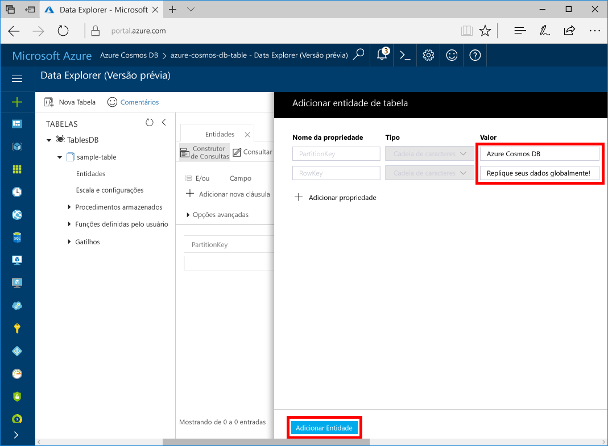

# <a name="quickstart-build-a-table-api-app-with-net-and-azure-cosmos-db"></a>Início rápido: criar um aplicativo de API de Tabela com .NET e Azure Cosmos DB 

Este guia de início rápido mostra como usar o Java e a [API de Tabela](table-introduction.md) do Azure Cosmos DB para compilar um aplicativo clonando um exemplo do GitHub. Este guia de início rápido também mostra como criar uma conta do Azure Cosmos DB e como usar o Data Explorer para criar tabelas e entidades no Portal do Azure baseado na Web.

O BD Cosmos do Azure é o serviço multimodelo de banco de dados distribuído globalmente da Microsoft. É possível criar e consultar rapidamente documentos, chave/valor e bancos de dados do gráfico. Todos se beneficiam de recursos de escala horizontal e distribuição global no núcleo do Azure Cosmos DB. 

## <a name="prerequisites"></a>Pré-requisitos

Se você ainda não tem o Visual 2017 Studio instalado, poderá baixar e usar o **Visual Studio 2017 Community Edition** [gratuito](https://www.visualstudio.com/downloads/). Verifique se você habilitou o **desenvolvimento do Azure** durante a instalação do Visual Studio.

[!INCLUDE [quickstarts-free-trial-note](../../includes/quickstarts-free-trial-note.md)]

## <a name="create-a-database-account"></a>Crie uma conta de banco de dados

[!INCLUDE [cosmos-db-create-dbaccount-table](../../includes/cosmos-db-create-dbaccount-table.md)]

## <a name="add-a-table"></a>Adicionar uma tabela

[!INCLUDE [cosmos-db-create-table](../../includes/cosmos-db-create-table.md)]

## <a name="add-sample-data"></a>Adicionar dados de exemplo

Agora é possível adicionar dados à sua nova tabela usando o Data Explorer.

1. No Data Explorer, expanda **sample-table**, clique em **Entidades** e clique em **Adicionar Entidade**.

   
2. Agora adicione dados às caixas de valor PartitionKey e RowKey e clique em **Adicionar Entidade**.

   
  
    Agora, é possível adicionar mais entidades à tabela, editar as entidades ou consultar os dados no Data Explorer. Por meio do Data Explorer, também é possível dimensionar a taxa de transferência e adicionar procedimentos armazenados, funções definidas pelo usuário e gatilhos à tabela.

## <a name="clone-the-sample-application"></a>Clonar o aplicativo de exemplo

Agora, clonaremos um aplicativo de Tabela do github, definiremos a cadeia de conexão e o executaremos. Você verá como é fácil trabalhar usando dados de forma programática. 

1. Abra uma janela de terminal de git, como git bash, e use o comando `cd` para alterar para uma pasta para instalar o aplicativo de exemplo. 

    ```bash
    cd "C:\git-samples"
    ```

2. Execute o comando a seguir para clonar o repositório de exemplo. Este comando cria uma cópia do aplicativo de exemplo no seu computador. 

    ```bash
    git clone https://github.com/Azure-Samples/storage-table-dotnet-getting-started.git
    ```

3. Em seguida, abra o arquivo da solução TableStorage no Visual Studio. 

## <a name="update-your-connection-string"></a>Atualizar sua cadeia de conexão

Agora, volte ao portal do Azure para obter informações sobre a cadeia de conexão e copiá-las para o aplicativo. Isso permite que seu aplicativo se comunique com o banco de dados hospedado. 

1. No [Portal do Azure](http://portal.azure.com/), clique em **Cadeia de Conexão**. 

    Use os botões de cópia no lado direito da tela para copiar a CADEIA DE CONEXÃO PRIMÁRIA.

    

2. No Visual Studio, abra o arquivo App.config. 

3. Remova a marca de comentário da StorageConnectionString na linha 8 e comente a StorageConnectionString na linha 7, pois este tutorial não usa o Emulador de Armazenamento. 

3. Cole o valor da CADEIA DE CONEXÃO PRIMÁRIA no valor da StorageConnectionString na linha 8. 

    ```
    <add key="StorageConnectionString" value="DefaultEndpointsProtocol=https;AccountName=[AccountName];AccountKey=[AccountKey]" />`
    ```

    Agora a linha 8 deve ser semelhante a

    ```
    <add key="StorageConnectionString" value="DefaultEndpointsProtocol=https;AccountName=<account name>;AccountKey=txZACN9f...==;TableEndpoint=https://<account name>.table.cosmosdb.azure.com;" />
    ```

4. Salve o arquivo App.config.

Agora, você atualizou o aplicativo com todas as informações necessárias para se comunicar com o Azure Cosmos DB. 

## <a name="build-and-deploy-the-app"></a>Compilar e implantar o aplicativo

1. No Visual Studio, clique com o botão direito do mouse no projeto **TableStorage** em **Gerenciador de Soluções** e depois clique em **Gerenciar Pacotes NuGet**. 

2. Na caixa **Procurar** do NuGet, digite *Microsoft.Azure.CosmosDB.Table*.

3. Com base nos resultados, instale a biblioteca **Microsoft.Azure.CosmosDB.Table**. Isso instala o pacote da API de Tabela do Azure Cosmos DB e todas as dependências.

4. Clique em CTRL + F5 para executar o aplicativo.

    A janela de console exibe os dados da tabela sendo adicionados ao novo banco de dados de tabela no Azure Cosmos DB.

    Agora, é possível voltar ao Data Explorer e ver a consulta, modificar e trabalhar com esses novos dados.

## <a name="review-slas-in-the-azure-portal"></a>Examinar SLAs no Portal do Azure

[!INCLUDE [cosmosdb-tutorial-review-slas](../../includes/cosmos-db-tutorial-review-slas.md)]

## <a name="clean-up-resources"></a>Limpar recursos

[!INCLUDE [cosmosdb-delete-resource-group](../../includes/cosmos-db-delete-resource-group.md)]

## <a name="next-steps"></a>Próximas etapas

Neste início rápido, você aprendeu como criar uma conta do BD Cosmos do Azure, como criar uma tabela usando o Data Explorer e como executar um aplicativo.  Agora, você pode consultar os dados usando a API de Tabela.  

> [!div class="nextstepaction"]
> [Importar dados de tabela para a API de Tabela](table-import.md)

