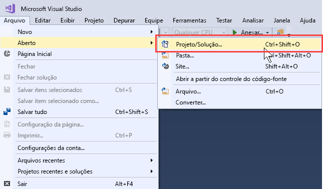
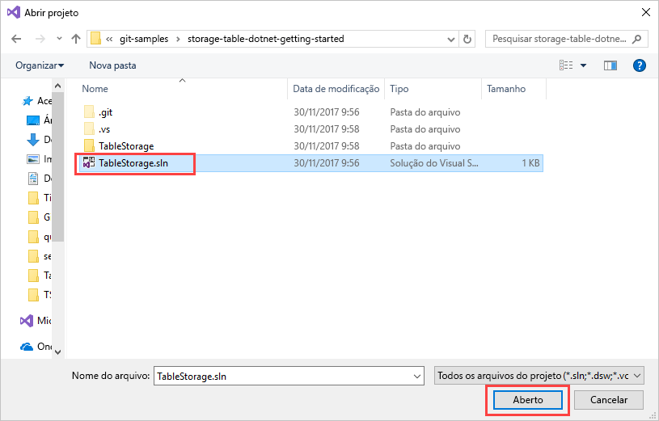
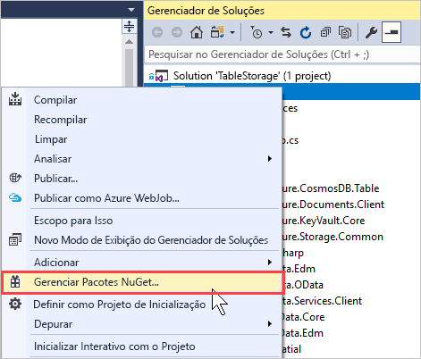
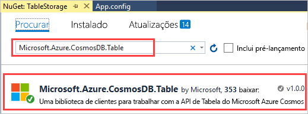
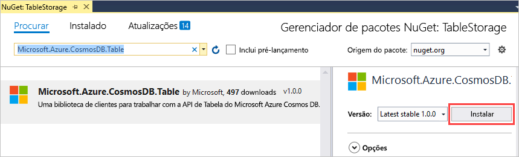
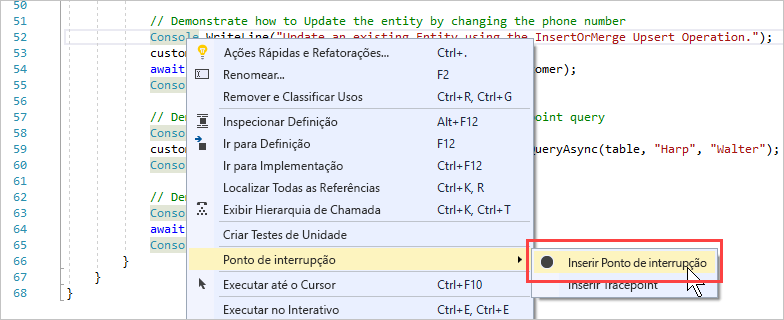
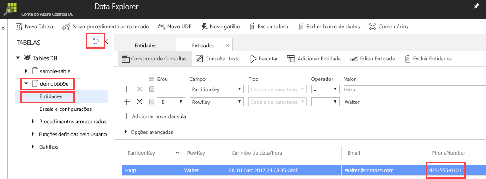

# <a name="quickstart-build-a-table-api-app-with-net-and-azure-cosmos-db"></a>Início rápido: criar um aplicativo de API de Tabela com .NET e Azure Cosmos DB 

Este guia de início rápido mostra como usar o .NET e a [API de Tabela](table-introduction.md) do Azure Cosmos DB para criar um aplicativo por meio da clonagem de um exemplo do GitHub. Este guia de início rápido também mostra como criar uma conta do Azure Cosmos DB e como usar o Data Explorer para criar tabelas e entidades no Portal do Azure baseado na Web.

O Azure Cosmos DB é o serviço de banco de dados multimodelo distribuído globalmente da Microsoft. É possível criar e consultar rapidamente documentos, chave/valor e bancos de dados do grafo. Todos se beneficiam de recursos de escala horizontal e distribuição global no núcleo do Azure Cosmos DB. 

## <a name="prerequisites"></a>pré-requisitos

Se você ainda não tem o Visual 2017 Studio instalado, poderá baixar e usar o **Visual Studio 2017 Community Edition** [gratuito](https://www.visualstudio.com/downloads/). Verifique se você habilitou o **desenvolvimento do Azure** durante a instalação do Visual Studio.

[!INCLUDE [quickstarts-free-trial-note](../../includes/quickstarts-free-trial-note.md)]

## <a name="create-a-database-account"></a>Criar uma conta de banco de dados

> [!IMPORTANT] 
> Você precisa criar uma nova conta de API de tabela para trabalhar com os SDKs de API de tabela disponíveis. Não há suporte para contas de API de tabela criadas durante a versão prévia pelos SDKs disponíveis.
>

[!INCLUDE [cosmos-db-create-dbaccount-table](../../includes/cosmos-db-create-dbaccount-table.md)]

## <a name="add-a-table"></a>Adicionar uma tabela

[!INCLUDE [cosmos-db-create-table](../../includes/cosmos-db-create-table.md)]

## <a name="add-sample-data"></a>Adicionar dados de exemplo

Agora é possível adicionar dados à sua nova tabela usando o Data Explorer.

1. No Data Explorer, expanda **sample-table**, clique em **Entidades** e clique em **Adicionar Entidade**.

   
2. Agora, adicione dados às caixas de valor PartitionKey e RowKey e clique em **Adicionar Entidade**.

   
  
    Agora, é possível adicionar mais entidades à tabela, editar as entidades ou consultar os dados no Data Explorer. Por meio do Data Explorer, também é possível dimensionar a taxa de transferência e adicionar procedimentos armazenados, funções definidas pelo usuário e gatilhos à tabela.

## <a name="clone-the-sample-application"></a>Clonar o aplicativo de exemplo

Agora, clonaremos um aplicativo de Tabela do GitHub, definiremos a cadeia de conexão e o executaremos. Você verá como é fácil trabalhar usando dados de forma programática. 

1. Abra uma janela de terminal do Git, como Git Bash, e use o comando `cd` para alterar para uma pasta para instalar o aplicativo de exemplo. 

    ```bash
    cd "C:\git-samples"
    ```

2. Execute o comando a seguir para clonar o repositório de exemplo. Este comando cria uma cópia do aplicativo de exemplo no seu computador. 

    ```bash
    git clone https://github.com/Azure-Samples/storage-table-dotnet-getting-started.git
    ```
## <a name="open-the-sample-application-in-visual-studio"></a>Abrir o aplicativo de exemplo no Visual Studio

1. No Visual Studio, do menu **Arquivo**, escolha **Abrir** e, em seguida, escolha **Projeto/Solução**. 

    

2. Navegue até a pasta onde você clonou o aplicativo de exemplo e abra o arquivo TableStorage.sln.

    

## <a name="update-your-connection-string"></a>Atualizar sua cadeia de conexão

Agora, volte ao portal do Azure para obter informações sobre a cadeia de conexão e copiá-las para o aplicativo. Isso permite que seu aplicativo se comunique com o banco de dados hospedado. 

1. No [Portal do Azure](http://portal.azure.com/), clique em **Cadeia de Conexão**. 

    Use o botão de cópia no lado direito da tela para copiar a **CADEIA DE CONEXÃO PRIMÁRIA**.

    

2. No Visual Studio, abra o arquivo App.config. 

3. Remova a marca de comentário da StorageConnectionString na linha 8 e comente a StorageConnectionString na linha 7, pois este tutorial não usa o Emulador de Armazenamento do SDK do Azure. As linhas 7 e 8 agora devem ter esta aparência:

    ```
    <!--key="StorageConnectionString" value="UseDevelopmentStorage=true;" />-->
    <add key="StorageConnectionString" value="DefaultEndpointsProtocol=https;AccountName=[AccountName];AccountKey=[AccountKey]" />
    ```

4. Cole o valor de **CADEIA DE CONEXÃO PRIMÁRIA** do portal no valor de StorageConnectionString na linha 8. Cole a cadeia de caracteres entre aspas. 

    > [!IMPORTANT]
    > Se o ponto de extremidade usa documents.azure.com, isso significa que você tem uma conta de versão prévia, e você precisa criar um [nova conta de API de tabela](#create-a-database-account) para trabalhar com o SDK de API de tabela geralmente disponível. 
    > 

    Agora, a linha 8 deve ser semelhante a:

    ```
    <add key="StorageConnectionString" value="DefaultEndpointsProtocol=https;AccountName=<account name>;AccountKey=txZACN9f...==;TableEndpoint=https://<account name>.table.cosmosdb.azure.com;" />
    ```

5. Pressione CTRL+S para salvar o arquivo App.config.

Agora, você atualizou o aplicativo com todas as informações necessárias para se comunicar com o Azure Cosmos DB. 

## <a name="build-and-deploy-the-app"></a>Compilar e implantar o aplicativo

1. No Visual Studio, clique com o botão direito do mouse no projeto **TableStorage** em **Gerenciador de Soluções** e depois clique em **Gerenciar Pacotes NuGet**. 

   
2. Na caixa **Procurar** do NuGet, digite *Microsoft.Azure.CosmosDB.Table*. Isso localizará a biblioteca de clientes de API de tabela do Cosmos DB.
   
   

3. Clique em **Instalar** para instalar a biblioteca **Microsoft.Azure.CosmosDB.Table**. Isso instala o pacote da API de Tabela do Azure Cosmos DB e todas as dependências.

    

4. Abra BasicSamples.cs. Clique com o botão direito do mouse na linha 52, selecione **Ponto de Interrupção** e, em seguida, selecione **Inserir Ponto de Interrupção**. Insira outro ponto de interrupção na linha 55.

    

5. Pressione F5 para executar o aplicativo.

    A janela de console exibe o nome do novo banco de dados de tabela (neste caso, demo91ab4) no Azure Cosmos DB. 
    
    

    Se você receber um erro sobre dependências, consulte [solução de problemas](table-sdk-dotnet.md#troubleshooting).

    Quando atingir o primeiro ponto de interrupção, volte para o Data Explorer no Portal do Azure. Clique no botão **Atualizar**, expanda a tabela demonstração* e clique em **Entidades**. A guia **Entidades** à direita mostra a nova entidade que foi adicionada para Walter Harp. Observe que o número de telefone para a nova entidade é 425-555-0101.

    
    
6. Feche a guia **Entidades** no Data Explorer.
    
7. Pressione F5 para executar o aplicativo até o próximo ponto de interrupção. 

    Quando você atinge o ponto de interrupção, retorne ao Portal do Azure, clique em **Entidades** novamente para abrir a guia **Entidades** e observe que o número de telefone foi atualizado para 425-555-0105.

8. Pressione F5 para executar o aplicativo. 
 
   O aplicativo adiciona entidades para uso em um aplicativo de exemplo avançado que atualmente não é compatível com a API de Tabela. O aplicativo, em seguida, exclui a tabela criada pelo aplicativo de exemplo.

9. Na janela do console, pressione Enter para encerrar a execução do aplicativo. 
  

## <a name="review-slas-in-the-azure-portal"></a>Examinar SLAs no Portal do Azure

[!INCLUDE [cosmosdb-tutorial-review-slas](../../includes/cosmos-db-tutorial-review-slas.md)]

## <a name="clean-up-resources"></a>Limpar recursos

[!INCLUDE [cosmosdb-delete-resource-group](../../includes/cosmos-db-delete-resource-group.md)]

## <a name="next-steps"></a>Próximas etapas

Neste início rápido, você aprendeu como criar uma conta do BD Cosmos do Azure, como criar uma tabela usando o Data Explorer e como executar um aplicativo.  Agora, você pode consultar os dados usando a API de Tabela.  

> [!div class="nextstepaction"]
> [Importar dados de tabela para a API de Tabela](table-import.md)

