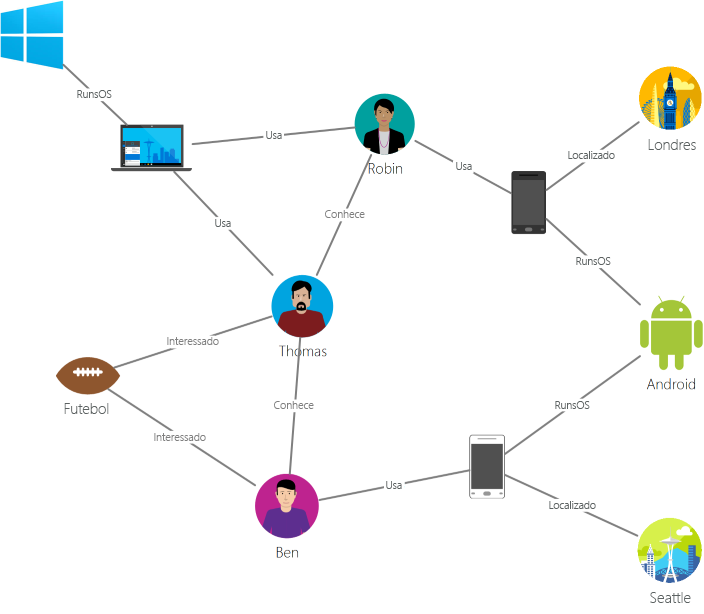
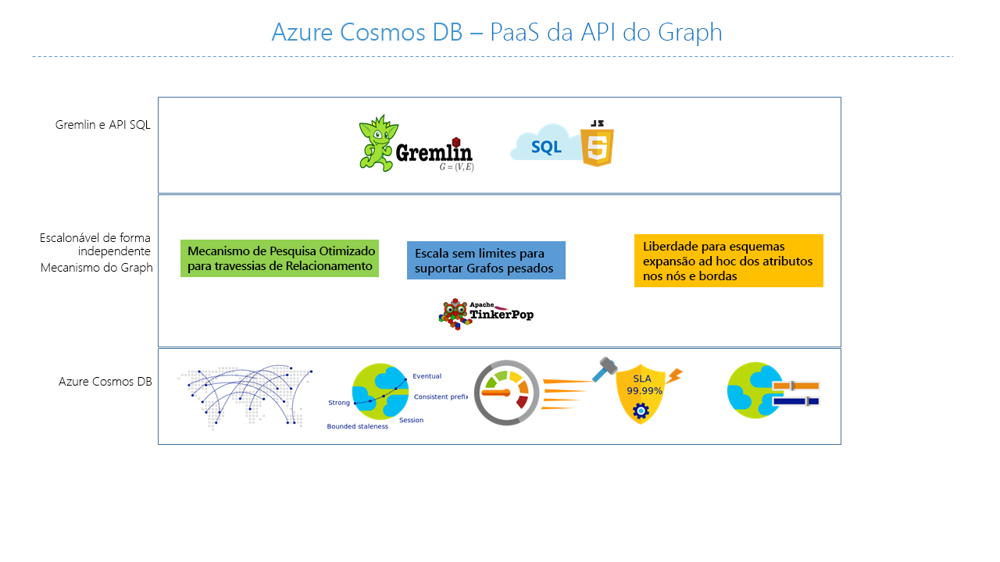

# Introdução ao BD Cosmos do Azure: API do Graph

O [BD Cosmos do Azure](introduction.md) é o serviço de banco de dados multi-modelo distribuído globalmente da Microsoft para aplicativos de missão crítica. O BD Cosmos do Azure fornece com tudo incluído[ distribuição global](distribute-data-globally.md), [dimensionamento elástico da taxa de transferência e do armazenamento](partition-data.md) mundialmente, latências de milissegundos de um dígito no 99º percentil, [cinco níveis de consistência bem-definidos](consistency-levels.md) e garantia de alta disponibilidade, tudo isso com suporte de [SLAs líderes do setor](https://azure.microsoft.com/support/legal/sla/cosmos-db/). O Azure Cosmos DB [indexa dados automaticamente](http://www.vldb.org/pvldb/vol8/p1668-shukla.pdf) sem a necessidade de lidar com o gerenciamento do esquema e do índice. Ele tem vários modelos e dá suporte a modelos de dados de colunas, gráficos, chave-valor e documentos.

O BD Cosmos do Azure API do Graph fornece:

- Modelagem de gráfico
- APIs transversais
- Distribuição global com tudo incluído
- Escala elástica de armazenamento e taxa de transferência com latências de leitura menores que 10 ms e menores que 15 ms no 99º percentil
- Indexação automática com disponibilidade imediata de consulta
- Níveis de consistência ajustáveis
- SLAs abrangentes, incluindo 99,99% de disponibilidade

Para consultar o BD Cosmos do Azure, você pode usar o [Apache TinkerPop](http://tinkerpop.apache.org) idioma de passagem gráfica, [Gremlin](http://tinkerpop.apache.org/docs/current/reference/#graph-traversal-steps), ou outros sistemas de gráfico compatível com TinkerPop como [Apache Spark GraphX](spark-connector-graph.md).

Este artigo fornece uma visão geral da API do Graph do BD Cosmos do Azure e explica como você pode usá-lo para armazenar grandes gráficos com bilhões de vértices e bordas. Você pode consultar os gráficos com latência de milissegundo e desenvolver a estrutura do gráfico e o esquema facilmente.

## Banco de dados do gráfico
Os dados da forma como aparecem no mundo real são conectados naturalmente. A modelagem de dados tradicional se concentra em entidades. Para muitos aplicativos, também há a necessidade de modelar as relações e as entidades.

Um [gráfico](http://mathworld.wolfram.com/Graph.html) é uma estrutura composta por [vértices](http://mathworld.wolfram.com/GraphVertex.html) e [bordas](http://mathworld.wolfram.com/GraphEdge.html). Os vértices e as bordas podem ter um número arbitrário de propriedades. Os vértices denotam objetos individuais, como uma pessoa, um lugar ou um evento. As bordas indicam relações entre os vértices. Por exemplo, uma pessoa pode conhecer a outra pessoa, estar envolvida em um evento e foi recentemente a um local. As propriedades expressam informações sobre os vértices e as bordas. Propriedades de exemplo incluem um vértice que tem um nome, uma idade e uma borda que tem um carimbo de data e/ou um peso. Mais formalmente, esse modelo é conhecido como um [gráfico de propriedade](http://tinkerpop.apache.org/docs/current/reference/#intro). O BD Cosmos do Azure dá suporte ao modelo de gráfico da propriedade.

Por exemplo, o gráfico de exemplo a seguir mostra as relações entre pessoas, dispositivos móveis, interesses e sistemas de operação.

Os gráficos são úteis para compreender uma ampla variedade de conjuntos de dados de ciências, tecnologia e negócios. Bancos de dados de gráfico permitem modelar e armazenar gráficos de forma natural e eficiente, o que os torna atraentes para muitos cenários. Bancos de dados de gráfico normalmente são bancos de dados NoSQL, porque frequentemente esses casos de uso também precisam de iteração rápida e flexibilidade de esquema.

Os gráficos oferecem uma nova e avançada técnica de modelagem de dados. No entanto, isso por si só não é motivo suficiente para usar um banco de dados de gráfico. Para muitos casos de uso e padrões que envolvem passagens de gráfico, os gráficos superam o desempenho de bancos de dados SQL e NoSQL tradicionais em ordens de magnitude. Essa diferença no desempenho aumenta ainda mais ao percorrer mais de uma relação, como a de amigo de amigo.

É possível combinar as passagens rápidas fornecidas pelos bancos de dados de gráfico com algoritmos de gráfico, como pesquisa por profundidade, pesquisa por amplitude e algoritmo de Dijkstra, a fim de solucionar problemas em vários domínios como redes sociais, geoespacial, gerenciamento de conteúdo e recomendações.

## Gráficos de escala planetária com o BD Cosmos do Azure
O BD Cosmos do Azure é um banco de dados de gráfico totalmente gerenciado que oferece distribuição global, dimensionamento elástico do armazenamento e da taxa de transferência, indexação e consulta automática, níveis de consistência ajustáveis e suporte ao padrão TinkerPop.  

O BD Cosmos do Azure oferece os seguintes recursos diferenciados em comparação a outros bancos de dados de gráfico no mercado:

* Dimensionamento elástico do armazenamento e da taxa de transferência

 Gráficos no mundo real precisam ser dimensionados além da capacidade de um único servidor. Com o BD Cosmos do Azure, é possível expandir facilmente seus gráficos em vários servidores. Também é possível dimensionar de forma independente a taxa de transferência do seu gráfico com base em seus padrões de acesso. O BD Cosmos do Azure dá suporte a bancos de dados de gráfico que podem ser dimensionados para tamanhos de armazenamento e taxa de transferência provisionada virtualmente ilimitados.

* Replicação de várias regiões

 O BD Cosmos do Azure de forma transparente replica seus dados de gráfico para todas as regiões que você associou com sua conta. A replicação permite que você desenvolva aplicativos que exigem acesso global aos dados. Há vantagens e desvantagens nas áreas de consistência, disponibilidade e desempenho e garantias correspondentes. O BD Cosmos do Azure fornece failover transparente regional com APIs de hospedagem múltipla. Pode você dimensionar elasticamente a taxa de transferência e o armazenamento no mundo todo.

* Passagens e consultas rápidas com sintaxe familiar de Gremlin

 Armazenar bordas e vértices heterogêneos e consultar esses documentos por meio de uma sintaxe Gremlin familiar. O BD Cosmos do Azure utiliza uma tecnologia de indexação estruturada por registro, livre de bloqueios e altamente executável para indexar automaticamente todo o conteúdo. Essa capacidade habilita passagens e consultas avançadas em tempo real sem a necessidade de especificar dicas de esquema, índices secundários ou exibições. Saiba mais em [Consultar gráficos usando Gremlin](gremlin-support.md).

* Totalmente gerenciado

 O BD Cosmos do Azure elimina a necessidade de gerenciar recursos do computador e do banco de dados. Com um serviço totalmente gerenciado do Microsoft Azure, você não precisa gerenciar máquinas virtuais, implantar e configurar software, gerenciar o dimensionamento ou lidar com complexas atualizações de camadas de dados. Cada gráfico é salvo em backup automaticamente e protegido contra falhas regionais. Você pode adicionar facilmente uma conta do BD Cosmos do Azure e provisionar a capacidade conforme for necessário, permitindo que você se concentre em seu aplicativo sem se preocupar com a operação e com o gerenciamento do banco de dados.

* Indexação automática

 Por padrão, o BD Cosmos do Azure indexa automaticamente todas as propriedades dentro dos nós e bordas do gráfico e não espera ou exige qualquer esquema ou criação de índices secundários.

* Compatibilidade com o Apache TinkerPop

 O BD Cosmos do Azure dá suporte nativo ao padrão de software de código aberto Apache TinkerPop e pode ser integrado a outros sistemas de gráfico habilitados para TinkerPop. Dessa forma, é possível migrar facilmente de outro banco de dados de gráfico, como Titan ou Neo4j, ou usar o BD Cosmos do Azure com estruturas de análise de gráfico como o [Apache Spark GraphX](spark-connector-graph.md).

* Níveis de consistência ajustáveis

 Escolha entre cinco níveis de consistência bem-definidos para chegar ao equilíbrio ideal entre consistência e desempenho. Para operações de consulta e leitura, o Azure Cosmos DB oferece cinco níveis de consistência diferentes: forte, desatualização limitada, sessão, prefixo constante e eventual. Esses níveis de consistência granulares e bem-definidos permitem que você faça compensações seguras entre consistência, disponibilidade e latência. Saiba mais em [Usando níveis de consistência para maximizar a disponibilidade e o desempenho no Banco de Dados de Documentos](consistency-levels.md).

O BD Cosmos do Azure também possibilita usar vários modelos, como documento e gráfico, nos mesmos contêineres/bancos de dados. Você pode usar uma coleção de documentos para armazenar dados de gráfico lado a lado com documentos. Você pode usar tanto consultas SQL em vez de consultas JSON e Gremlin para consultar os mesmos dados como um gráfico.

## Introdução
É possível criar contas do BD Cosmos do Azure por meio da interface de linha de comando (CLI) do Azure, do Azure Powershell ou do portal do Azure com suporte para a API do Graph. Após a criação, o portal do Azure fornece um ponto de extremidade de serviço, como o `https://<youraccount>.graphs.azure.com`, que fornece um front-end do WebSocket para Gremlin. Você pode configurar suas ferramentas compatíveis com TinkerPop, como o [console do Gremlin](http://tinkerpop.apache.org/docs/current/reference/#gremlin-console), para se conectar a esse ponto de extremidade e criar aplicativos no Java, Node.js ou qualquer driver de cliente Gremlin.

A tabela a seguir mostra drivers Gremlin populares que você pode usar com o BD Cosmos do Azure:

| Baixar | Documentação |
| --- | --- |
| [Java](https://mvnrepository.com/artifact/com.tinkerpop.gremlin/gremlin-java) |[Gremlin JavaDoc](http://tinkerpop.apache.org/javadocs/current/full/) |
| [Node.js](https://www.npmjs.com/package/gremlin) |[Gremlin-JavaScript no GitHub](https://github.com/jbmusso/gremlin-javascript) |
| [Console do Gremlin](https://tinkerpop.apache.org/downloads.html) |[Documentos do TinkerPop](http://tinkerpop.apache.org/docs/current/reference/#gremlin-console) |

O BD Cosmos do Azure também fornece uma biblioteca .NET com métodos de extensão Gremlin além de [BD Cosmos do Azure SDKs](documentdb-sdk-dotnet.md) via NuGet. Essa biblioteca fornece um servidor Gremlin "em processamento" que pode ser usado para se conectar diretamente a partições de dados do DocumentDB.

| Baixar | Documentação |
| --- | --- |
| [.NET](https://www.nuget.org/packages/Microsoft.Azure.Graphs/) |[Microsoft.Azure.Graphs](https://msdn.microsoft.com/library/azure/dn948556.aspx) |

Usando o [Emulador BD Cosmos do Azure](local-emulator.md), você pode usar a API do Graph para desenvolver e testar local sem criar uma assinatura Azure ou incorrer qualquer custo. Quando estiver satisfeito com o funcionamento de seu aplicativo no Emulador, você pode passar a usar uma conta do BD Cosmos do Azure na nuvem.

## Cenários de suporte a gráfico do BD Cosmos do Azure
Veja alguns cenários em que o suporte para gráfico do BD Cosmos do Azure pode ser usado:

* Redes Sociais

 Combinando dados sobre seus clientes e as interações deles com outras pessoas, você pode desenvolver experiências personalizadas, prever o comportamento do cliente ou conectar pessoas com interesses semelhantes. O BD Cosmos do Azure pode ser usado para gerenciar redes sociais e monitorar dados e preferências do cliente.

* Mecanismos de recomendação

 Este cenário costuma ser usado no setor de varejo. Combinando informações sobre produtos, usuários e interações do usuário, como compras, navegação ou a classificação de um item, você pode criar recomendações personalizadas. O BD Cosmos do Azure, com sua baixa latência, dimensionamento elástico e suporte para gráfico nativo, é ideal para modelar essas interações.

* Geoespacial

 Muitos aplicativos de telecomunicações, logística e planejamento de viagens precisam encontrar um local de interesse em uma área específica ou localizar a rota mais curta/ideal entre dois locais. O BD Cosmos do Azure é uma solução natural para esses problemas.

* Internet das coisas

 Com a rede e as conexões entre dispositivos IoT modeladas como um gráfico, é possível ter uma melhor compreensão do estado de seus dispositivos e ativos, e de como alterações em uma parte da rede podem afetar outra parte.

## Próximas etapas
Para saber mais sobre o suporte para gráfico no BD Cosmos do Azure, consulte:

* Introdução ao [Tutorial de gráfico do BD Cosmos do Azure](create-graph-dotnet.md).
* Saiba como [consultar gráficos no BD Cosmos do Azure usando o Gremlin](gremlin-support.md).

