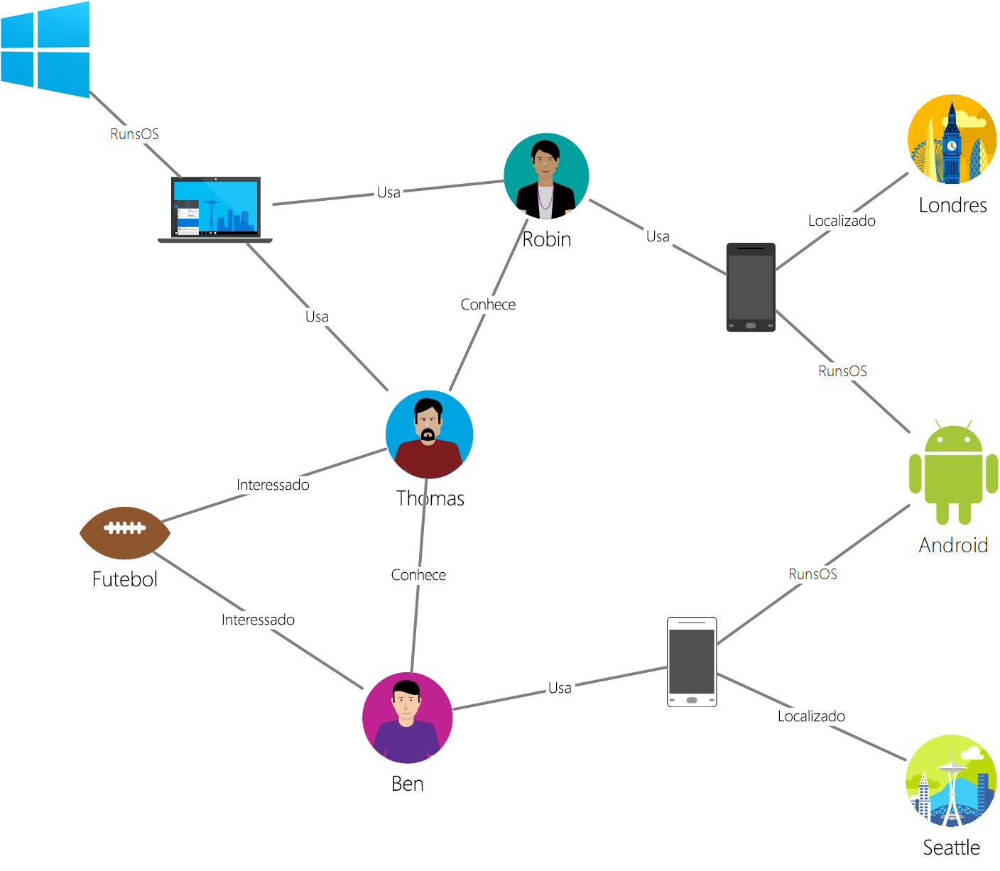

# <a name="azure-cosmos-db-gremlin-graph-support"></a>Suporte do BD Cosmos do Azure para gráfico do Gremlin
O Azure Cosmos DB dá suporte ao idioma de percurso do gráfico do [Apache Tinkerpop](http://tinkerpop.apache.org), [Gremlin]([Gremlin](http://tinkerpop.apache.org/docs/current/reference/#graph-traversal-steps)) que é uma API do Graph para criar entidades de gráfico e executar operações de consulta do gráfico. É possível usar a linguagem Gremlin para criar entidades de gráfico (vértices e bordas), modificar propriedades dentro dessas entidades, executar consultas e passagens e excluir entidades. 

O BD Cosmos do Azure traz recursos prontos para empresas para bancos de dados de gráfico. Isso inclui distribuição global, dimensionamento independente do armazenamento e da taxa de transferência, latências de milissegundos de dígito único previsíveis, indexação automática e SLAs de 99,99%. Como o BD Cosmos do Azure dá suporte a TinkerPop/Gremlin, você pode migrar com facilidade aplicativos escritos usando outro banco de dados de gráfico sem a necessidade de fazer alterações no código. Além disso, devido ao suporte para Gremlin, o BD Cosmos do Azure integra-se perfeitamente com estruturas de análise habilitadas para TinkerPop, como o [Apache Spark GraphX](http://spark.apache.org/graphx/). 

Neste artigo, fornecemos uma explicação rápida do Gremlin e listamos os recursos e etapas do Gremlin que têm suporte na versão prévia do suporte para API do Graph.

## <a name="gremlin-by-example"></a>Gremlin pelo exemplo
Vamos usar um gráfico de exemplo para entender como as consultas podem ser expressas no Gremlin. A figura a seguir mostra um aplicativo de negócios que gerencia dados sobre usuários, interesses e dispositivos na forma de um gráfico.  

 

Este gráfico tem os seguintes tipos de vértice (chamados de "rótulo" no Gremlin):

- Pessoas: o gráfico tem três pessoas; Robin, Thomas e Ben
- Interesses: os interesses dessas pessoas, que neste exemplo é o jogo de futebol
- Dispositivos: os dispositivos que as pessoas usam
- Sistemas operacionais: os sistemas operacionais que os dispositivos executam

Nós representamos as relações entre essas entidades usando os seguintes tipos/rótulos de borda:

- Knows (conhece): por exemplo, "Thomas conhece Robin"
- Interested (interessado): para representar os interesses das pessoas em nosso gráfico, por exemplo, "Ben está interessado em futebol"
- RunsOS: o laptop executa o sistema operacional Windows
- Uses (usa): para representar qual dispositivo uma pessoa usa. Por exemplo, Robin usa um telefone Motorola com o número de série 77

Vamos executar algumas operações nesse gráfico usando o [Console do Gremlin](http://tinkerpop.apache.org/docs/current/reference/#gremlin-console). Você também pode executar essas operações usando drivers do Gremlin na plataforma de sua escolha (Java, Node.js, Python ou .NET).  Antes de examinarmos o que tem suporte no BD Cosmos do Azure, vejamos alguns exemplos para nos familiarizarmos com a sintaxe.

Primeiro, vamos ver o CRUD. A seguinte instrução do Gremlin insere o vértice "Thomas" no gráfico:

```
:> g.addV('person').property('id', 'thomas.1').property('firstName', 'Thomas').property('lastName', 'Andersen').property('age', 44)
```

Em seguida, a seguinte instrução do Gremlin insere uma borda do tipo "conhece" entre Thomas e Robin.

```
:> g.V('thomas.1').addE('knows').to(g.V('robin.1'))
```

A consulta a seguir retorna os vértices do tipo "pessoa" na ordem decrescente de seus nomes:
```
:> g.V().hasLabel('person').order().by('firstName', decr)
```

Os gráficos se destacam em situações em que você precisa responder perguntas como "Quais sistemas operacionais os amigos de Thomas usam?". Você pode executar essa passagem simples do Gremlin para obter informações do gráfico:

```
:> g.V('thomas.1').out('knows').out('uses').out('runsos').group().by('name').by(count())
```
Agora, vejamos o que o BD Cosmos do Azure oferece para desenvolvedores de Gremlin.

## <a name="gremlin-features"></a>Recursos do Gremlin
O TinkerPop é um padrão que abrange uma ampla variedade de tecnologias de gráfico. Portanto, ele tem uma terminologia padrão para descrever quais recursos são fornecidos por um provedor de gráfico. O BD Cosmos do Azure fornece um banco de dados de gráfico gravável, persistente e de alta simultaneidade que pode ser particionado em vários servidores ou clusters. 

A tabela a seguir lista os recursos do TinkerPop que são implementados pelo BD Cosmos do Azure: 

| Categoria | Implementação do BD Cosmos do Azure |  Observações | 
| --- | --- | --- |
| Recursos de gráfico | Fornece Persistence e ConcurrentAccess na versão prévia. Projetado para dar suporte a Transactions | Métodos de computador podem ser implementados por meio do conector Spark. |
| Recursos variáveis | Dá suporte a Boolean, Integer, Byte, Double, Float, Integer, Long, String | Dá suporte a tipos primitivos, é compatível com tipos complexos por meio do modelo de dados |
| Recursos do vértice | Dá suporte a RemoveVertices, MetaProperties, AddVertices, MultiProperties, StringIds, UserSuppliedIds, AddProperty, RemoveProperty  | Dá suporte à criação, modificação e exclusão de vértices |
| Recursos de propriedade do vértice | StringIds, UserSuppliedIds, AddProperty, RemoveProperty, BooleanValues, ByteValues, DoubleValues, FloatValues, IntegerValues, LongValues, StringValues | Dá suporte à criação, modificação e exclusão de propriedades do vértice |
| Recursos da borda | AddEges, RemoveEdges, StringIds, UserSuppliedIds, AddProperty, RemoveProperty | Dá suporte à criação, modificação e exclusão de bordas |
| Recursos de propriedade da borda | Properties, BooleanValues, ByteValues, DoubleValues, FloatValues, IntegerValues, LongValues, StringValues | Dá suporte à criação, modificação e exclusão de propriedades da borda |

## <a name="gremlin-wire-format-graphson"></a>Formato de transmissão do Gremlin: GraphSON

O BD Cosmos do Azure usa o [formato GraphSON](https://github.com/thinkaurelius/faunus/wiki/GraphSON-Format) ao retornar resultados de operações Gremlin. GraphSON é o formato padrão do Gremlin para representar vértices, bordas e propriedades (propriedades com um ou vários valores) usando JSON. 

Por exemplo, o trecho a seguir mostra uma representação em GraphSON de um vértice *retornado ao cliente* no Azure Cosmos DB. 

```json
  {
    "id": "a7111ba7-0ea1-43c9-b6b2-efc5e3aea4c0",
    "label": "person",
    "type": "vertex",
    "outE": {
      "knows": [
        {
          "id": "3ee53a60-c561-4c5e-9a9f-9c7924bc9aef",
          "inV": "04779300-1c8e-489d-9493-50fd1325a658"
        },
        {
          "id": "21984248-ee9e-43a8-a7f6-30642bc14609",
          "inV": "a8e3e741-2ef7-4c01-b7c8-199f8e43e3bc"
        }
      ]
    },
    "properties": {
      "firstName": [
        {
          "value": "Thomas"
        }
      ],
      "lastName": [
        {
          "value": "Andersen"
        }
      ],
      "age": [
        {
          "value": 45
        }
      ]
    }
  }
```

As propriedades usadas por GraphSON para vértices são as seguintes:

| Propriedade | Descrição |
| --- | --- |
| ID | A ID do vértice. Deve ser exclusiva (em combinação com o valor de _partition, se aplicável) |
| label | O rótulo do vértice. É opcional e é usado para descrever o tipo de entidade. |
| type | Usado para distinguir vértices de documentos que não são gráficos |
| propriedades | Recipiente de propriedades definidas pelo usuário associadas ao vértice. Cada propriedade pode ter vários valores. |
| _partition (configurável) | A chave de partição do vértice. Pode ser usada para escalar horizontalmente os gráficos para vários servidores |
| outE | Contém uma lista de bordas externas de um vértice. Armazenar as informações de adjacência com o vértice permite a execução rápida de passagens. As bordas são agrupadas com base em seus rótulos. |

E a borda contém as seguintes informações para ajudar com a navegação para outras partes do gráfico.

| Propriedade | Descrição |
| --- | --- |
| ID | A ID da borda. Deve ser exclusiva (em combinação com o valor de _partition, se aplicável) |
| label | O rótulo da borda. Esta propriedade é opcional e é usada para descrever o tipo de relacionamento. |
| inV | Recipiente de propriedades definidas pelo usuário associadas à borda. Cada propriedade pode ter vários valores. |
| propriedades | Recipiente de propriedades definidas pelo usuário associadas à borda. Cada propriedade pode ter vários valores. |

Cada propriedade pode armazenar diversos valores em uma matriz. 

| Propriedade | Descrição |
| --- | --- |
| valor | O valor da propriedade

## <a name="gremlin-partitioning"></a>Particionamento do Gremlin

No BD Cosmos do Azure, os gráficos são armazenados dentro de contêineres que podem ser dimensionados de forma independente em termos de armazenamento e taxa de transferência (expressa em solicitações normalizadas por segundo). Cada contêiner deve definir uma propriedade de chave de partição opcional, mas recomendada, que determina um limite de partição lógico para dados relacionados. Cada vértice/borda deve ter uma propriedade `id` exclusiva para entidades dentro desse valor de chave de partição. Os detalhes são abrangidos em [Particionamento no BD Cosmos do Azure](partition-data.md).

As operações de Gremlin funcionam perfeitamente em dados de gráfico que abrangem várias partições no BD Cosmos do Azure. No entanto, é recomendável escolher uma chave de partição para seus gráficos que seja usada comumente como filtro em consultas, tenha muitos valores distintos e frequência semelhante de acesso a esses valores. 

## <a name="gremlin-steps"></a>Etapas do Gremlin
Agora, vejamos as etapas do Gremlin com suporte do BD Cosmos do Azure. Para obter uma referência completa sobre o Gremlin, consulte [Referência do TinkerPop](http://tinkerpop.apache.org/docs/current/reference).

| Etapa | Descrição | Documentação do TinkerPop 3.2 | Observações |
| --- | --- | --- | --- |
| `addE` | Adiciona uma borda entre dois vértices | [Etapa addE](http://tinkerpop.apache.org/docs/current/reference/#addedge-step) | |
| `addV` | Adiciona um vértice ao gráfico | [Etapa addV](http://tinkerpop.apache.org/docs/current/reference/#addvertex-step) | |
| `and` | Certifique-se de que todas as passagens retornam um valor | [e uma etapa](http://tinkerpop.apache.org/docs/current/reference/#and-step) | |
| `as` | Um modulador de etapa para atribuir uma variável à saída de uma etapa | [Etapa as](http://tinkerpop.apache.org/docs/current/reference/#as-step) | |
| `by` | Um modulador de etapa usado com `group` e `order` | [Etapa by](http://tinkerpop.apache.org/docs/current/reference/#by-step) | |
| `coalesce` | Retorna a primeira passagem que retorna um resultado | [Etapa coalesce](http://tinkerpop.apache.org/docs/current/reference/#coalesce-step) | |
| `constant` | Retorna um valor constante. Usada com `coalesce`| [Etapa constant](http://tinkerpop.apache.org/docs/current/reference/#constant-step) | |
| `count` | Retorna a contagem da passagem | [Etapa count](http://tinkerpop.apache.org/docs/current/reference/#count-step) | |
| `dedup` | Retorna os valores com as duplicatas removidas | [Etapa dedup](http://tinkerpop.apache.org/docs/current/reference/#dedup-step) | |
| `drop` | Remove os valores (vértice/borda) | [Etapa drop](http://tinkerpop.apache.org/docs/current/reference/#drop-step) | |
| `fold` | Atua como uma barreira que calcula o valor agregado dos resultados| [Etapa fold](http://tinkerpop.apache.org/docs/current/reference/#fold-step) | |
| `group` | Agrupa os valores com base nos rótulos especificados| [Etapa group](http://tinkerpop.apache.org/docs/current/reference/#group-step) | |
| `has` | Usada para filtrar propriedades, vértices e bordas. Dá suporte às variantes `hasLabel`, `hasId`, `hasNot` e `has`. | [Etapa has](http://tinkerpop.apache.org/docs/current/reference/#has-step) | |
| `inject` | Insere valores em um fluxo| [Etapa inject](http://tinkerpop.apache.org/docs/current/reference/#inject-step) | |
| `is` | Usada para executar um filtro usando uma expressão booliana | [Etapa is](http://tinkerpop.apache.org/docs/current/reference/#is-step) | |
| `limit` | Usada para limitar o número de itens na passagem| [Etapa limit](http://tinkerpop.apache.org/docs/current/reference/#limit-step) | |
| `local` | A etapa local encapsula uma seção de uma passagem, de forma semelhante a uma subconsulta | [Etapa local](http://tinkerpop.apache.org/docs/current/reference/#local-step) | |
| `not` | Usada para produzir a negação de um filtro | [Etapa not](http://tinkerpop.apache.org/docs/current/reference/#not-step) | |
| `optional` | Retorna o resultado da passagem especificada se ela produzir um resultado. Caso contrário, retorna o elemento de chamada | [Etapa optional](http://tinkerpop.apache.org/docs/current/reference/#optional-step) | |
| `or` | Garante que pelo menos uma das passagens retorne um valor | [Etapa or](http://tinkerpop.apache.org/docs/current/reference/#or-step) | |
| `order` | Retorna os resultados na ordem de classificação especificada | [Etapa order](http://tinkerpop.apache.org/docs/current/reference/#order-step) | |
| `path` | Retorna o caminho completo da passagem | [Etapa path](http://tinkerpop.apache.org/docs/current/reference/#path-step) | |
| `project` | Projeta as propriedades como um mapa | [Etapa project](http://tinkerpop.apache.org/docs/current/reference/#project-step) | |
| `properties` | Retorna as propriedades para os rótulos especificados | [Etapa properties](http://tinkerpop.apache.org/docs/current/reference/#properties-step) | |
| `range` | Filtra para o intervalo de valores especificado| [Etapa range](http://tinkerpop.apache.org/docs/current/reference/#range-step) | |
| `repeat` | Repete a etapa o número de vezes especificado. Usada para efetuar loop | [Etapa repeat](http://tinkerpop.apache.org/docs/current/reference/#repeat-step) | |
| `sample` | Usada para fazer a amostragem dos resultados da passagem | [Etapa sample](http://tinkerpop.apache.org/docs/current/reference/#sample-step) | |
| `select` | Usada para projetar resultados da passagem |  [Etapa select](http://tinkerpop.apache.org/docs/current/reference/#select-step) | |
| `store` | Usada para agregações sem bloqueio da passagem | [Etapa store](http://tinkerpop.apache.org/docs/current/reference/#store-step) | |
| `tree` | Agrega os caminhos de um vértice em uma árvore | [Etapa tree](http://tinkerpop.apache.org/docs/current/reference/#tree-step) | |
| `unfold` | Desenrola um iterador como uma etapa| [Etapa unfold](http://tinkerpop.apache.org/docs/current/reference/#unfold-step) | |
| `union` | Mescla resultados de várias passagens| [Etapa union](http://tinkerpop.apache.org/docs/current/reference/#union-step) | |
| `V` | Inclui as etapas necessárias para passagens entre vértices e bordas `V`, `E`, `out`, `in`, `both`, `outE`, `inE`, `bothE`, `outV`, `inV`, `bothV` e `otherV` para | [Etapa vertex](http://tinkerpop.apache.org/docs/current/reference/#vertex-steps) | |
| `where` | Usada para filtrar os resultados da passagem. Dá suporte aos operadores `eq`, `neq`, `lt`, `lte`, `gt`, `gte` e `between`  | [Etapa where](http://tinkerpop.apache.org/docs/current/reference/#where-step) | |

O mecanismo otimizado para gravação do BD Cosmos do Azure dá suporte à indexação automática de todas as propriedades dentro dos vértices e bordas por padrão. Sendo assim, consultas com filtros, consultas de intervalo, classificações ou agregações de qualquer propriedade são processadas no índice e atendidas de modo eficiente. Para obter mais informações sobre como a indexação funciona no BD Cosmos do Azure, consulte nosso artigo sobre [Indexação independente do esquema](http://www.vldb.org/pvldb/vol8/p1668-shukla.pdf).

## <a name="next-steps"></a>Próximas etapas
* Comece a compilar um aplicativo de gráfico [usando nossos SDKs](create-graph-dotnet.md) 
* Saiba mais sobre o [Suporte para gráfico do BD Cosmos do Azure](graph-introduction.md)
