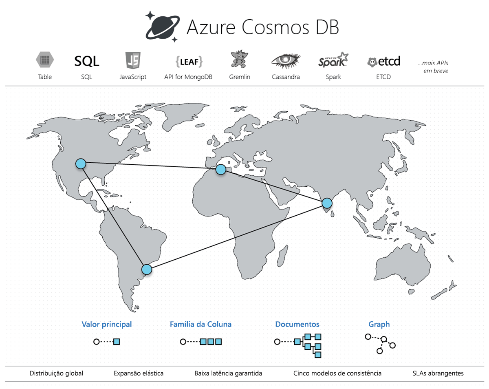

# Bem-vindo ao Azure Cosmos DB

O BD Cosmos do Azure é o multimodelo de banco de dados distribuído globalmente da Microsoft. Com o clique de um botão, o BD Cosmos do Azure permite que você dimensione a taxa de transferência e o armazenamento de maneira elástica e independente em qualquer número de regiões geográficas do Azure. Ele oferece garantias de taxa de transferência, disponibilidade, latência e consistência com [SLAs](https://aka.ms/acdbsla) (contratos de nível de serviço) abrangentes, algo que nenhum outro serviço de banco de dados pode oferecer.

Você pode [Experimentar o Azure Cosmos DB gratuitamente](https://azure.microsoft.com/try/cosmosdb/) sem uma assinatura do Azure, gratuitamente e sem compromisso.

## Soluções que se beneficiam do Azure Cosmos DB

Qualquer [Web, celular, jogos e aplicativos de IoT](use-cases.md) que precisam lidar com grandes quantidades de leituras e gravações em uma escala [global](distribute-data-globally.md) com baixo tempo de resposta para uma variedade de dados se beneficiará da disponibilidade, alta taxa de transferência, baixa latência e consistência ajustável [garantida](https://azure.microsoft.com/support/legal/sla/cosmos-db/) do Azure Cosmos DB.

## Principais recursos
Como um serviço de banco de dados distribuído globalmente, o Azure fornece Cosmos DB fornece as seguintes funcionalidades para ajudá-lo a criar aplicativos altamente responsivos e escalonáveis:

* **Distribuição global turnkey**
    * Você pode [distribuir seus dados](distribute-data-globally.md) para qualquer número de [regiões do Azure](https://azure.microsoft.com/regions/), com o [clique de um botão](tutorial-global-distribution-documentdb.md). Isso permite que você coloque seus dados onde os usuários estão, garantindo a menor latência possível aos seus clientes. 
    * Ao usar as APIs de hospedagem múltipla do Azure Cosmos DB, o aplicativo sempre sabe onde é a região mais próxima e enviará solicitações para o data center mais próximo. Tudo isso é possível sem alterações de configuração. Você define sua região de gravação e quantas regiões de leitura do seu jeito e o resto é feito para você.

* **Vários modelos de dados e APIs populares para acessar e consultar dados**
    * O modelo de dados com base em atom-record-sequence (ARS) onde o Azure Cosmos DB é criado, se baseia nos vários modelos de dados e oferece suporte nativo, incluindo, mas não limitado ao documento, gráfico, valor de chave, tabela e modelos de dados de colunas.
    * APIs para os seguintes modelos de dados são compatíveis com SDKs disponíveis em vários idiomas:
        * [API do DocumentDB](documentdb-introduction.md)
        * [API do MongoDB](mongodb-introduction.md)
        * [API de Tabela](table-introduction.md)
        * [API do Graph (Gremlin)](graph-introduction.md)
        * Modelos de dados adicionais em breve 

* **Dimensionar elasticamente a taxa de transferência e o armazenamento sob demanda, em todo o mundo**
    * Dimensione facilmente a taxa de transferência do banco de dados em uma granularidade [por segundo](request-units.md) e altere-a sempre que desejar. 
    * Dimensione o tamanho do armazenamento [de forma transparente e automática](partition-data.md) para cobrir a seus requisitos de tamanho agora e para sempre.

* **Criar aplicativos altamente responsivos e críticos**
    * O Azure Cosmos DB garante aos seus clientes uma baixa latência de ponta a ponta no 99º percentil. 
    * Para um item típico de 1 KB, o Cosmos BD garante a latência de ponta a ponta de leituras em até 10 ms e gravações indexadas em até 15 ms no 99º percentil, na mesma região do Azure. As latências medianas são significativamente menores (abaixo de 5 ms).

* **Garantir disponibilidade "sempre ativa"**
    * Disponibilidade de 99,99% em uma única região.
    * Implante em qualquer número de[regiões do Azure](https://azure.microsoft.com/regions) para uma maior disponibilidade.
    * [Simule uma falha](regional-failover.md) de uma ou mais regiões com a garantia de nenhuma perda de dados. 

* **Escrever aplicativos distribuídos globalmente, da maneira correta**
    * Cinco [modelos de consistência](consistency-levels.md) oferecem um espectro de consistência forte semelhante ao SQL até uma consistência eventual semelhante ao NoSQL e tudo o que há entre elas. 
  
* **Garantia do dinheiro de volta**
    * Agilidade nos seus dados ou o seu dinheiro de volta. 
    * [Contratos de nível de serviço](https://aka.ms/acdbsla) para disponibilidade, latência, taxa de transferência e consistência. 

* **Sem gerenciamento de esquema/índice de banco de dados**
    * Pare de se preocupar sobre como manter o esquema e os índices do seu banco de dados em sincronia com o esquema do seu aplicativo. Somos livres de esquema. 
    * O mecanismo de banco de dados do Azure Cosmos DB é completamente independente de esquema: ele indexa automaticamente todos os dados que ingere sem a necessidade de qualquer esquema ou índice e proporciona consultas incrivelmente rápidas. 

* **Baixo custo de propriedade**
    * Cinco a dez vezes [mais econômico](https://aka.ms/cosmos-db-tco-paper) que uma solução não gerenciada.
    * Três vezes mais barato do que o DynamoDB.

## Comparação de funcionalidade

O Azure Cosmos DB fornece as melhores funcionalidades de bancos de dados relacionais e não relacionais.

| Funcionalidades | Bancos de dados relacionais   | Bancos de dados não relacionais (NoSQL) |    Azure Cosmos DB |
| --- | --- | --- | --- |
| Distribuição global | Não | Não | Sim, a distribuição turnkey em 30 + regiões, com as APIs de hospedagem múltipla|
| Escala horizontal | Não | Sim | Sim, você pode dimensionar de maneira independente o armazenamento e a taxa de transferência | 
| Garantias de latência | Não | Sim | Sim, 99% de leituras em < 10 ms e gravações em < 15 ms | 
| Alta disponibilidade | Não | Sim | Sim, o Cosmos DB está sempre ativo, tem vantagens e desvantagens PACELC e fornece opções de failover automático e manual|
| Modelo de dados + API | Relacional + SQL | Multimodelo + API OSS | Multimodelo + SQL + API OSS (e mais em breve) |
| SLAs | Sim | Não | Sim, SLAs abrangentes de latência, taxa de transferência, consistência e disponibilidade |

## Próximas etapas
Comece no Azure Cosmos DB com um dos nossos guias de início rápido:

* [Introdução à API DocumentDB do Azure Cosmos DB](create-documentdb-dotnet.md)
* [Introdução à API MongoDB do Azure Cosmos DB](create-mongodb-nodejs.md)
* [Introdução à API do Graph do Azure Cosmos DB](create-graph-dotnet.md)
* [Introdução à API de Tabela do Azure Cosmos DB](create-table-dotnet.md)

