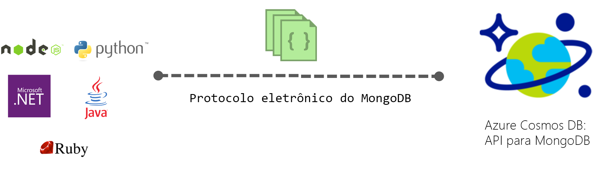

# Introdução ao Azure Cosmos DB: API para MongoDB

O [Azure Cosmos DB](../cosmos-db/introduction.md) é o serviço multimodelo de banco de dados da Microsoft, distribuído globalmente, para aplicativos críticos. O Azure Cosmos DB fornece [distribuição global imediata](distribute-data-globally.md), [dimensionamento elástico da taxa de transferência e do armazenamento](partition-data.md) mundialmente, latências de milissegundos de um dígito no 99º percentil, [cinco níveis de consistência bem-definidos](consistency-levels.md) e garantia de alta disponibilidade, tudo isso com suporte de [SLAs líderes do setor](https://azure.microsoft.com/support/legal/sla/cosmos-db/). O Azure Cosmos DB [indexa dados automaticamente](http://www.vldb.org/pvldb/vol8/p1668-shukla.pdf) sem a necessidade de lidar com o gerenciamento do esquema e do índice. Ele tem vários modelos e suporta modelos de dados de colunas, gráficos, valores-chave e documentos. 

 

Os bancos de dados do Cosmos DB podem ser usados como o armazenamento de dados para aplicativos escritos para o [MongoDB](https://docs.mongodb.com/manual/introduction/). Isso significa que, ao usar [drivers](https://docs.mongodb.org/ecosystem/drivers/) existentes, o aplicativo escrito para o MongoDB agora pode se comunicar com o Cosmos DB e usar bancos de dados do Cosmos DB, em vez de bancos de dados do MongoDB. Em muitos casos, é possível alternar o uso do MongoDB para o Cosmos DB, bastando alterar uma cadeia de conexão. Com essa funcionalidade, você pode facilmente criar e executar aplicativos de banco de dados do MongoDB na nuvem do Azure com a distribuição global e os [SLAs abrangentes líderes do setor](https://azure.microsoft.com/support/legal/sla/cosmos-db) do Azure Cosmos DB e, ao mesmo tempo, continuar usando as ferramentas e competências conhecidas do MongoDB.

## Qual é a vantagem de usar o Azure Cosmos DB para aplicativos do MongoDB?

**Produtividade e armazenamento elasticamente escalonáveis:** aumente ou reduza verticalmente seu banco de dados MongoDB para atender às necessidades de o aplicativo. Os dados são armazenados em SSD (discos de estado sólido) para fornecer latências baixas previsíveis. O Cosmos DB dá suporte a coleções do MongoDB que podem ser dimensionadas para tamanhos de armazenamento e produtividade provisionada praticamente ilimitados. Você pode dimensionar o Cosmos DB de forma elástica com desempenho previsível à medida que o aplicativo cresce. 

**Replicação de várias regiões:** o Cosmos DB replica os dados de forma transparente para todas as regiões associadas à sua conta do MongoDB, permitindo que você desenvolva aplicativos que exigem acesso global aos dados e fornecendo compensações entre consistência, disponibilidade e desempenho, tudo isso com garantias correspondentes. O Cosmos DB fornece failover regional transparente com APIs de hospedagem múltipla e a capacidade de dimensionar de forma elástica a produtividade e o armazenamento em todo o mundo. Saiba mais em [Distribuir dados globalmente](distribute-data-globally.md).

**Compatibilidade com o MongoDB**: use os conhecimentos, o código do aplicativo e as ferramentas do MongoDB que você já tem. Desenvolva aplicativos usando o MongoDB e implante-os em produção usando o serviço Cosmos DB distribuído globalmente e totalmente gerenciado.

**Sem gerenciamento de servidor**: você não precisa gerenciar nem dimensionar os bancos de dados do MongoDB. O Cosmos DB é um serviço totalmente gerenciado, o que significa que você não precisa gerenciar infraestruturas ou Máquinas Virtuais por conta própria. O Cosmos DB está disponível em mais de 30 [Regiões do Azure](https://azure.microsoft.com/regions/services/).

**Níveis de consistência ajustáveis:** escolha entre cinco níveis de consistência bem-definidos para chegar ao equilíbrio ideal entre consistência e desempenho. Para operações de consulta e leitura, o Cosmos DB oferece cinco níveis de consistência distintos: forte, desatualização limitada, sessão, prefixo constante e eventual. Esses níveis de consistência granulares e bem-definidos permitem que você faça compensações seguras entre consistência, disponibilidade e latência. Saiba mais em [Como usar níveis de consistência para maximizar a disponibilidade e o desempenho](consistency-levels.md).

**Indexação automática**: por padrão, o Cosmos DB indexa automaticamente todas as propriedades em documentos do banco de dados do MongoDB e não espera nem exige nenhum esquema ou a criação de índices secundários.

**Nível empresarial**: o Azure Cosmos DB dá suporte a várias réplicas locais para proporcionar 99,99% de disponibilidade e proteção de dados em caso de falhas locais e regionais. O Azure Cosmos DB apresenta recursos de segurança e [certificações de conformidade](https://www.microsoft.com/trustcenter) de nível empresarial. 

Saiba mais neste vídeo do Azure Friday com Scott Hanselman e o Gerente Principal de Engenharia do Azure Cosmos DB, Kirill Gavrylyuk.

> [!VIDEO https://channel9.msdn.com/Shows/Azure-Friday/Introducing-Azure-Cosmos-DB/player]
> 

## Como começar

Siga os guias de início rápido do MongoDB para criar uma conta do Cosmos DB e migrar o aplicativo do Mongo DB existente para usar o Cosmos DB ou criar uma nova:

* [Migrar um aplicativo Web do MongoDB do Node.js existente](create-mongodb-nodejs.md).
* [Criar um aplicativo Web de API do MongoDB com .NET e o Portal do Azure](create-mongodb-dotnet.md)
* [Criar um aplicativo de console de API do MongoDB com Java e o Portal do Azure](create-mongodb-java.md)

## Próximas etapas

As informações sobre a API do MongoDB no Azure Cosmos DB são integradas à documentação geral do Azure Cosmos DB, mas estas são algumas dicas para ajudá-lo a começar:

* Siga o tutorial [Conectar-se a uma conta do MongoDB](connect-mongodb-account.md) para saber como obter informações sobre a cadeia de conexão da sua conta.
* Siga o tutorial [Usar o MongoChef com o Azure Cosmos DB](mongodb-mongochef.md) para saber como criar uma conexão entre o banco de dados do Azure Cosmos DB e o aplicativo MongoDB no MongoChef.
* Siga o tutorial [Migrar dados para o Azure Cosmos DB com suporte de protocolo para o MongoDB](mongodb-migrate.md) para importar seus dados para um banco de dados da API para MongoDB.
* Conectar-se a uma conta da API para MongoDB usando o [Robomongo](mongodb-robomongo.md).
* Saiba quantos RUs suas operações estão usando com o [comando GetLastRequestStatistics e as métricas do Portal do Azure](request-units.md#GetLastRequestStatistics).
* Saiba como [configurar preferências de leitura para aplicativos distribuídos globalmente](../cosmos-db/tutorial-global-distribution-mongodb.md).

