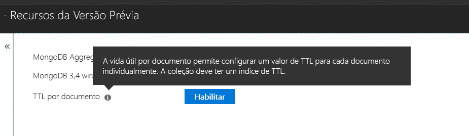

# <a name="expire-data-with-azure-cosmos-dbs-api-for-mongodb"></a>Expirar os dados com a API do Azure Cosmos DB para MongoDB

A funcionalidade de vida útil (TTL) permite que o banco de dados expire automaticamente os dados. A API do Azure Cosmos DB para MongoDB usa as funcionalidades de TTL principais do Cosmos DB. Há suporte para dois modos: definindo um valor de TTL padrão em toda a coleção e definindo valores TTL individuais para cada documento. A lógica que rege os índices de TTL e os valores de TTL por documento na API do Cosmos DB para MongoDB é a [mesma que no Cosmos DB](../cosmos-db/mongodb-indexing.md).

## <a name="ttl-indexes"></a>Índices TTL
Para habilitar a vida útil universalmente em uma coleção, um ["Índice TTL" (índice de vida útil)](../cosmos-db/mongodb-indexing.md) precisa ser criado. O TTL é um índice no campo _ts com um valor de "expireAfterSeconds".

Exemplo:
```JavaScript
globaldb:PRIMARY> db.coll.createIndex({"_ts":1}, {expireAfterSeconds: 10})
{
        "_t" : "CreateIndexesResponse",
        "ok" : 1,
        "createdCollectionAutomatically" : true,
        "numIndexesBefore" : 1,
        "numIndexesAfter" : 4
}
```

O comando no exemplo acima criará um índice com a funcionalidade de vida útil. Quando o índice é criado, o banco de dados excluirá automaticamente todos os documentos nessa coleção que não foram modificados nos últimos 10 segundos. 

> [!NOTE]
> **_ts** é um campo específico do Azure Cosmos DB e não pode ser acessado por clientes do MongoDB. É uma propriedade reservada (sistema) que contém o carimbo de data/hora da última modificação do documento.
>
    
Adicionalmente, um exemplo de C#: 

```csharp
var options = new CreateIndexOptions {ExpireAfter = TimeSpan.FromSeconds(10)}; 
var field = new StringFieldDefinition<BsonDocument>("_ts"); 
var indexDefinition = new IndexKeysDefinitionBuilder<BsonDocument>().Ascending(field); 
await collection.Indexes.CreateOneAsync(indexDefinition, options); 
``` 

## <a name="set-time-to-live-value-for-a-document"></a>Definir o valor de vida útil de um documento 
Também há suporte para valores de vida útil por documento. Os documentos devem conter uma propriedade de nível raiz "ttl" (em minúsculas) e um índice de TTL conforme descrito acima deve ter sido criado para essa coleção. Os valores de vida útil definidos em um documento substituirão o valor de TTL da coleção.

O valor de TTL deve ser um int32. Como alternativa, um int64 que se ajusta a um int32, ou um duplo sem partes decimais que se ajusta a um int32. Os valores da propriedade TTL que não estão em conformidade com essas especificações são permitidos, mas não são tratados como um valor de TTL do documento significativo.

O valor de TTL para o documento é opcional. Os documentos sem um valor de TTL podem ser inseridos na coleção.  Nesse caso, o valor de TTL da coleção será respeitado. 

Os documentos a seguir têm valores de vida útil válidos. Assim que os documentos são inseridos, os valores de vida útil do documento substituem valores de vida útil da coleção. Portanto, os documentos serão removidos após 20 segundos.  

```JavaScript 
globaldb:PRIMARY> db.coll.insert({id:1, location: "Paris", ttl: 20.0}) 
globaldb:PRIMARY> db.coll.insert({id:1, location: "Paris", ttl: NumberInt(20)}) 
globaldb:PRIMARY> db.coll.insert({id:1, location: "Paris", ttl: NumberLong(20)}) 
```

Os documentos a seguir têm valores de vida útil inválidos. Os documentos serão inseridos, mas o valor de TTL do documento não será respeitado. Portanto, os documentos serão removidos após 10 segundos devido ao valor de TTL da coleção. 

```JavaScript 
globaldb:PRIMARY> db.coll.insert({id:1, location: "Paris", ttl: 20.5}) //TTL value contains non-zero decimal part. 
globaldb:PRIMARY> db.coll.insert({id:1, location: "Paris", ttl: NumberLong(2147483649)}) //TTL value is greater than Int32.MaxValue (2,147,483,648). 
``` 

## <a name="how-to-activate-the-per-document-ttl-feature"></a>Como ativar o recurso de vida útil por documento

O recurso de TTL por documento pode ser ativado com a API do Azure Cosmos DB para MongoDB.

 

## <a name="next-steps"></a>Próximas etapas
* [Expirar os dados no Azure Cosmos DB automaticamente com a vida útil](../cosmos-db/time-to-live.md)
* [Indexando o banco de dados Cosmos configurado com a API do Azure Cosmos DB para MongoDB](../cosmos-db/mongodb-indexing.md)
