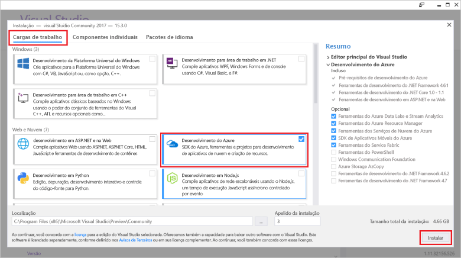

# <a name="create-an-azure-functions-http-trigger-with-an-azure-cosmos-db-input-binding"></a>Como criar um gatilho de HTTP de Azure Functions com uma associação de entrada do Azure Cosmos DB

O Azure Cosmos DB é um banco de dados multimodelo distribuído globalmente, sem esquema e sem servidor. A Azure Function é um serviço de computação sem servidor que permite que você execute o código sob demanda. Ao emparelhar esses dois Serviços do Azure, você tem a base para uma arquitetura sem servidor que permite que você se concentre em criar ótimos aplicativos sem se preocupar com provisionamento e manutenção de servidores para as necessidades do seu banco de dados e de computação.

Este tutorial baseia-se no código criado no [Início rápido da API do Graph para .NET](create-graph-dotnet.md). Este tutorial adiciona uma Azure Function que contém um [gatilho HTTP](https://github.com/MicrosoftDocs/azure-docs-pr/azure-functions/functions-bindings-http-webhook.md#http-trigger). O gatilho HTTP usa uma [associação de entrada](https://github.com/MicrosoftDocs/azure-docs-pr/azure-functions/functions-triggers-bindings.md) do Azure Cosmos DB para recuperar dados do banco de dados de gráfico criado no início rápido. Este gatilho HTTP específico aciona uma consulta de dados ao Azure Cosmos DB, mas as associações de entrada do Azure Cosmos DB podem ser usadas para recuperar valores de entradas de dados para tudo o que a sua função precisar.

Este tutorial cobre as seguintes tarefas:

> [!div class="checklist"]
> * Criar um projeto da Azure Function 
> * Criar um gatilho HTTP
> * Como publicar a Azure Function
> * Conectar a Azure Function ao banco de dados do Azure Cosmos DB

## <a name="prerequisites"></a>Pré-requisitos

- [Visual Studio 2017 versão 15.3](https://www.visualstudio.com/vs/preview/), incluindo a carga de trabalho de **desenvolvimento do Azure**.

    
    
- Depois de instalar ou fazer upgrade para o Visual Studio 2017 versão 15.3, você deve atualizar manualmente as ferramentas do Visual Studio 2017 para Azure Functions. Você pode atualizar as ferramentas no menu **Ferramentas**, em **Extensões e atualizações...** > **Atualizações** > **Visual Studio Marketplace** > **Ferramentas Azure Functions e Trabalhos da Web** > **Atualizar**.

- Conclua o tutorial [Como compilar um aplicativo .NET usando a API do Graph](tutorial-develop-graph-dotnet.md) ou use o exemplo de código [azure-cosmos-db-graph-dotnet-getting-started](https://github.com/Azure-Samples/azure-cosmos-db-graph-dotnet-getting-started) do repositório GitHub para compilar o projeto.
 
## <a name="build-a-function-in-visual-studio"></a>Como compilar uma função no Visual Studio

1. Adicione um projeto do **Azure Functions** à solução clicando o botão direito no nó em**Gerenciador de Soluções** e, em seguida, escolha **Adicionar**  >  **Novo Projeto**. Escolha **Azure Functions** na caixa de diálogo e defina o nome dele como **PeopleDataFunctions**.

   

2. Depois de criar o projeto do Azure Functions, realize as atualizações e instalações relacionadas ao NuGet. 

    a. Para garantir que você tem as funções de SDK mais atuais, use o Gerenciador de NuGet para atualizar o pacote **Microsoft.NET.Sdk.Functions**. No **Gerenciador de Soluções**, clique com o botão direito do mouse no projeto e escolha **Gerenciar Pacotes NuGet**. Na guia **Instalados**, selecione Microsoft.NET.Sdk.Functions e, então, clique em **Atualizar**.

   

    b. Na guia **Procurar**, digite **azure.graphs** para localizar o pacote **Microsoft.Azure.Graphs** e, em seguida, clique em **Instalar**. Este pacote contém o SDK de cliente .NET do API do Graph.

   

    c. Na guia **Procurar**, digite **mono.csharp** para localizar o pacote **Mono.CSharp** e, em seguida, clique em **Instalar**.

   

3. O Gerenciador de soluções agora deve incluir os pacotes que você instalou, conforme mostrado aqui. 
   
   Em seguida, é preciso escrever um código, portanto, vamos adicionar um novo item **Azure Function** ao projeto. 

    a. Clique com o botão direito do mouse no nó do projeto no **Gerenciador de Soluções**, escolha **Adicionar** > **Novo Item**.   
    b. Na caixa de diálogo **Adicionar Novo Item**, selecione **Itens do Visual C#**, selecione **Azure Function**, digite **Pesquisa** como o nome para seu projeto e, em seguida, clique em **Adicionar**.  
 
   

4. A Azure Function atenderá solicitações HTTP para que o modelo de gatilho Http seja apropriado aqui.
   
   Na caixa **Nova Azure Function**, selecione **gatilho Http**. Também queremos que essa Azure Function seja "bastante aberta", portanto, definimos os **Direitos de acesso** para **Anônimo**, para permitir que qualquer pessoa possa acessá-la. Clique em **OK**.

   

5. Depois de adicionar Search.cs ao projeto da Azure Function, copie as instruções em **uso** sobrescrevendo as existentes usando as instruções:

   ```csharp
   using Microsoft.Azure.Documents;
   using Microsoft.Azure.Documents.Client;
   using Microsoft.Azure.Documents.Linq;
   using Microsoft.Azure.Graphs;
   using Microsoft.Azure.WebJobs;
   using Microsoft.Azure.WebJobs.Extensions.Http;
   using Microsoft.Azure.WebJobs.Host;
   using System;
   using System.Collections.Generic;
   using System.Configuration;
   using System.Linq;
   using System.Net;
   using System.Net.Http;
   using System.Threading.Tasks;
   ```

6. Em seguida, substitua o código da classe da Azure Function pelo código a seguir. O código pesquisa o banco de dados do Azure Cosmos DB usando a API do Graph para qualquer pessoa ou para uma pessoa específica identificada pelo `name` parâmetro de cadeia de caracteres de consulta.

   ```csharp
   public static class Search
   {
       static string endpoint = ConfigurationManager.AppSettings["Endpoint"];
       static string authKey = ConfigurationManager.AppSettings["AuthKey"];

       [FunctionName("Search")]
       public static async Task<HttpResponseMessage> Run(
           [HttpTrigger(AuthorizationLevel.Anonymous, "get", "post", Route = null)]HttpRequestMessage req,
           TraceWriter log)
       {
           log.Info("C# HTTP trigger function processed a request.");

           // the person objects are free-form in structure
           List<dynamic> results = new List<dynamic>();

           // open the client's connection
           using (DocumentClient client = new DocumentClient(
               new Uri(endpoint),
               authKey,
               new ConnectionPolicy
               {
                   ConnectionMode = ConnectionMode.Direct,
                   ConnectionProtocol = Protocol.Tcp
               }))
           {
               // get a reference to the database the console app created
               Database database = await client.CreateDatabaseIfNotExistsAsync(
                   new Database
                   {
                       Id = "graphdb"
                   });

               // get an instance of the database's graph
               DocumentCollection graph = await client.CreateDocumentCollectionIfNotExistsAsync(
                   UriFactory.CreateDatabaseUri("graphdb"),
                   new DocumentCollection { Id = "graphcollz" },
                   new RequestOptions { OfferThroughput = 1000 });

               // build a gremlin query based on the existence of a name parameter
               string name = req.GetQueryNameValuePairs()
                   .FirstOrDefault(q => string.Compare(q.Key, "name", true) == 0)
                   .Value;

               IDocumentQuery<dynamic> query = (!String.IsNullOrEmpty(name))
                   ? client.CreateGremlinQuery<dynamic>(graph, string.Format("g.V('{0}')", name))
                   : client.CreateGremlinQuery<dynamic>(graph, "g.V()");

               // iterate over all the results and add them to the list
               while (query.HasMoreResults)
                   foreach (dynamic result in await query.ExecuteNextAsync())
                       results.Add(result);
           }

           // return the list with an OK response
           return req.CreateResponse<List<dynamic>>(HttpStatusCode.OK, results);
       }
   }
   ```

   O código tem basicamente a mesma lógica de conexão como o aplicativo de console original, que propaga o banco de dados com uma simples consulta para recuperar os registros correspondentes.

## <a name="debug-the-azure-function-locally"></a>Como depurar a Azure Function localmente

Agora que o código está concluído, você pode usar as ferramentas de depuração locais da Azure Function e o emulador para executar o código localmente para testá-lo.

1. Antes que o código seja executado corretamente, você deve configurá-lo para execução local com as informações de conexão do Azure Cosmos DB. Você pode usar o arquivo local.settings.json para configurar a Azure Function para execução local da mesma forma que usa o arquivo App.config para configurar o aplicativo de console original para execução.

    Para fazer isso, adicione as seguintes linhas de código para local.settings.json e, em seguida, copie o ponto de extremidade e a AuthKey do arquivo App.Config no projeto GraphGetStarted, conforme mostrado na imagem a seguir.

   ```json
    "Endpoint": "",
    "AuthKey": ""
    ```

   

2. Altere o projeto de inicialização para o novo aplicativo de funções. No **Gerenciador de Soluções**, clique o botão direito do mouse em **PeopleDataFunctions** e selecione **Definir como projeto de inicialização**.

3. No **Gerenciador de Soluções**, clique o botão direito do mouse em **Dependências** no projeto **PeopleDataFunctions** e, em seguida, clique em **Adicionar referência**. Na lista, selecione System.Configuration e, em seguida, clique em **Ok**.

3. Agora vamos executar o aplicativo. Pressione F5 para iniciar a ferramenta de depuração local, func.exe, com o código da Azure Function hospedado e pronto para uso.

   No final da saída inicial do func.exe, podemos ver que a Azure Function está sendo hospedada no localhost:7071. Isso é útil para testá-lo em um cliente.

   

4. Para testar a Azure Function, use o [Visual Studio Code](http://code.visualstudio.com/) com a extensão de Huachao Mao, [cliente REST](https://marketplace.visualstudio.com/items?itemName=humao.rest-client). O cliente REST oferece funcionalidade de solicitação HTTP local ou remota em um único clique. 

    Para fazer isso, crie um novo arquivo denominado test-function-locally.http e adicione o seguinte código:

    ```http
    get http://localhost:7071/api/Search

    get http://localhost:7071/api/Search?name=ben
   ```

    Agora, clique a primeira linha de código e selecione **Enviar solicitação** conforme mostrado na imagem a seguir.

   

   Você verá a resposta HTTP bruta de cabeçalhos de Azure Function de execução local, o conteúdo do corpo JSON, tudo.

   

5. Agora, selecione a segunda linha de código e, em seguida, selecione **Enviar solicitação**. Ao adicionar o parâmetro de cadeia de caracteres de consulta `name` com um valor conhecido no banco de dados, é possível filtrar os resultados retornados da Azure Function.

   

Depois que a Azure Function é validada e parece estar funcionando corretamente, a última etapa é publicá-la no serviço de aplicativo do Azure e configurá-la para ser executada na nuvem.

## <a name="publish-the-azure-function"></a>Como publicar a Azure Function

1. No **Gerenciador de Soluções**, clique o botão direito do mouse no projeto e selecione **Publicar**.

   

2. Estamos prontos para publicar o projeto na nuvem para testá-lo em um cenário publicamente disponível. Na guia **Publicar**, selecione o **Aplicativo da Azure Function** e, então, selecione **Criar Novo** para criar uma Azure Function em sua assinatura do Azure e, em seguida, clique em **Publicar**.

   

3. Na caixa de diálogo **Publicar**, faça o seguinte:
   
    a. Em **Nome do Aplicativo**, dê um nome exclusivo para a função.

    b. Em **Assinatura**, selecione a assinatura do Azure que será usada.
   
    c. Em **Grupo de recursos**, crie um novo grupo de recursos e use o mesmo nome do aplicativo.
   
    d. Para **Plano do serviço de aplicativo**, clique em **Novo** para criar um novo com base em consumo de plano de serviço de aplicativo porque pretendemos usar o método de pagamento "pague pelo que usar" para a Azure Function sem servidor. Use os padrões na página **Como configurar o plano de serviço de aplicativo** e, em seguida, clique em **OK**.
   
    e. Para a **Conta de armazenamento**, também clique em **Novo** para criar uma nova conta de armazenamento para ser usada com a Azure Function no caso de precisarmos oferecer suporte para Blobs, tabelas ou filas para disparar a execução de outros recursos. Use os padrões na página **Conta de Armazenamento** e, em seguida, clique em **OK**.

    f. Em seguida, clique o botão **Criar** na caixa de diálogo para criar todos os recursos na sua assinatura do Azure. O Visual Studio baixa um perfil de publicação (um arquivo XML simples) que será usado na próxima vez que você publicar seu código da Azure Function.

   

    O Visual Studio então exibe uma página de publicação que você pode usar se você fizer alterações na função e precisar republicá-la. Você não precisa realizar qualquer ação nessa página agora.

4. Depois que a Azure Function é publicada, você pode acessar a página da sua Azure Function no [Portal do Azure](https://portal.azure.com/). Lá, você encontrará um link para as **configurações de aplicativo** da Azure Function. Abra este link para configurar a Azure Function ao vivo para conectividade do banco de dados do Azure Cosmos DB com o seu banco de dados pessoal.

   

5. Assim como você fez anteriormente no arquivo de App.config do aplicativo de console e no arquivo local.settings.json do aplicativo da Azure Function, você precisará adicionar o ponto de extremidade e o AuthKey no banco de dados do banco de dados do Azure Cosmos DB para a função publicada. Dessa forma, não é necessário fazer check-in do código de configuração que contém as chaves; você pode configurá-los no portal e deixá-los armazenados no controle de origem. Para adicionar cada valor, clique o botão **Adicionar nova configuração**, adicione **Ponto de extremidade** e o valor do app.config e, em seguida, clique em **Adicionar nova configuração** novamente e adicione **AuthKey** e o valor personalizado. Depois que você adicionou e salvou os valores, as configurações devem parecer com o seguinte.

   

6. Depois que a Azure Function está configurada corretamente na sua assinatura do Azure, você pode usar novamente a extensão do cliente de REST do Visual Studio Code para consultar a URL da Azure Function disponível publicamente. Adicione estas duas linhas de código ao test-function-locally.http e, em seguida, execute cada linha para testar essa função. Substitua o nome da função na URL com o nome da sua função.

    ```json
    get https://peoplesearchfunction.azurewebsites.net/api/Search

    get https://peoplesearchfunction.azurewebsites.net/api/Search?name=thomas
    ```

    A função responde com os dados recuperados do banco de dados do Azure Cosmos DB.

    


## <a name="next-steps"></a>Próximas etapas

Neste tutorial, você fez o seguinte:

> [!div class="checklist"]
> * Criou um projeto de Azure Function 
> * Criou um gatilho HTTP
> * Publicou a Azure Function
> * Conectou a função ao banco de dados do Azure Cosmos DB

Agora você pode seguir para a seção Conceitos para obter mais informações sobre o Cosmos DB.

> [!div class="nextstepaction"]
> [Distribuição global](distribute-data-globally.md) 

Este artigo se baseia em uma série de publicações do blog [Sem esquemas e sem servidor do Brady Gaster](http://www.bradygaster.com/category/%20Serverless%20&%20Schemaless). Visite o blog dele para ver as publicações adicionais da série.
