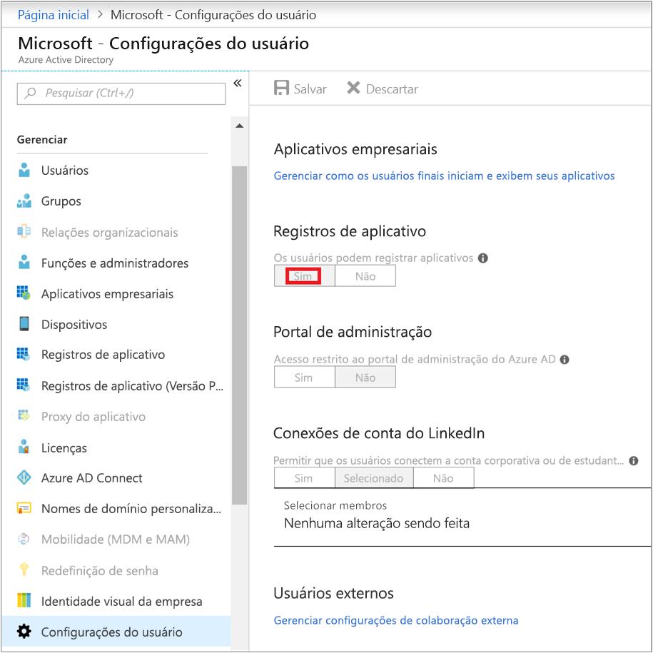
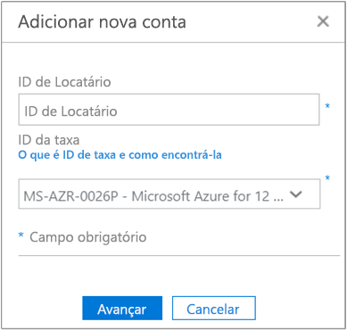
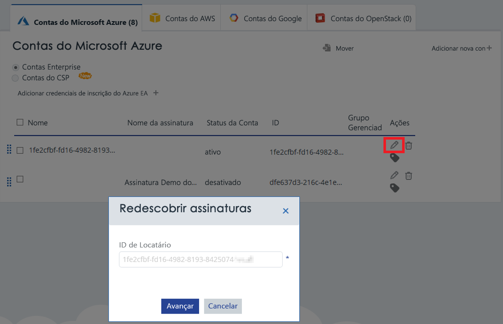

# Ativar assinaturas e contas do Azure com o Gerenciamento de Custos do Azure

Adicionar ou atualizar suas credenciais do Azure Resource Manager permite que o Gerenciamento de Custos do Azure descubra todas as contas e assinaturas no seu locatário do Azure. Se você também tem a extensão de diagnóstico do Azure habilitada em suas máquinas virtuais, Gerenciamento de Custos do Azure pode coletar métricas estendidas como CPU e memória. Este artigo descreve como habilitar o acesso usando APIs do Azure Resource Manager para contas novas e existentes. Ele também descreve como resolver problemas comuns de conta.

Gerenciamento de Custos do Azure não pode acessar a maioria dos dados de sua assinatura do Azure quando a assinatura não está _ativa_. Você deve editar contas _não ativas_ para que o Gerenciamento de Custos do Azure possa acessá-las.

## Permissões necessárias do Azure

Permissões específicas são necessárias para concluir os procedimentos neste artigo. Você ou o administrador de locatário deve ter as seguintes permissões:

- Permissão para registrar o aplicativo CloudynCollector com seu locatário do Azure AD.
- A capacidade de atribuir o aplicativo em uma função em suas assinaturas do Azure.

Em suas assinaturas do Azure, as contas devem ter `Microsoft.Authorization/*/Write` acesso para atribuir o aplicativo CloudynCollector. Esta ação deve ser concedida pela função [Proprietário](../active-directory/role-based-access-built-in-roles.md#owner) ou pela função [Administrador de Acesso do Usuário](../active-directory/role-based-access-built-in-roles.md#user-access-administrator).

Se sua conta tiver a função **Colaborador**, você não tem a permissão adequada para atribuir o aplicativo. Você recebe um erro durante ao tentar atribuir o aplicativo CloudynCollector à sua assinatura do Azure.

### Verificar as permissões do Azure Active Directory

1. Faça logon no [Portal do Azure](https://portal.azure.com).
2. No portal do Azure, selecione **Azure Active Directory**.
3. No Azure Active Directory, selecione **Configurações de Usuário**.
4. Verifique a opção **Registros do Aplicativo**.
    - Se estiver definido como **Sim**, os usuários não administradores podem registrar aplicativos do AD. Essa configuração significa que qualquer usuário no locatário do Azure AD pode registrar um aplicativo. Você pode prosseguir com as permissões de assinatura do Azure necessárias.  
    
    - Se a opção **Registros do aplicativo** estiver definida como **Não**, apenas os usuários administrativos do locatário podem registrar aplicativos do Active Directory do Azure. Seu administrador de locatário deve registrar o aplicativo CloudynCollector.

## Adicionar uma conta ou atualizar uma assinatura

Quando você adiciona uma assinatura a uma atualização de conta, você concede ao Gerenciamento de Custos do Azure acesso para seus dados do Azure.

### Adicionar uma nova conta (assinatura)

1. No portal do Gerenciamento de Custos do Azure, clique no símbolo de engrenagem no canto superior direito e selecione **Contas na Nuvem**.
2. Clique em **Adicionar nova conta** e a caixa **Adicionar nova conta** é exibida. Insira as informações necessárias.  
    

### Atualizar uma assinatura

1. Se você quiser atualizar uma assinatura _não ativa_ que já existe no Gerenciamento de Custos do Azure no Gerenciamento de Contas, clique no símbolo de lápis de edição à direita do _GUID de locatário_.
    
2. Se necessário, insira a ID de locatário. Se você não souber sua ID de locatário, use as seguintes etapas para localizá-lo:
    1. Faça logon no [Portal do Azure](https://portal.azure.com).
    2. No portal do Azure, selecione **Azure Active Directory**.
    3. Para obter a ID de locatário, selecione **Propriedades** do seu locatário do Azure AD.
    4. Copie o GUID em ID de Diretório. Esse valor é a ID do locatário.
    Para saber mais, confira [Obter ID do locatário](../azure-resource-manager/resource-group-create-service-principal-portal.md#get-tenant-id).
3. Se necessário, selecione a ID de taxa. Se você não souber a ID de taxa, use as seguintes etapas para localizá-lo.
    1. No canto superior direito do portal do Azure, clique em suas informações de usuário e, em seguida, clique em **Exibir minha fatura**.
    2. Em **Conta de Cobrança**, clique em **Assinaturas**.
    3. Em **Minhas assinaturas**, selecione a assinatura.
    4. Sua ID de taxa é mostrada em **ID da oferta**. Copiar a ID de oferta para a assinatura.
4. Na caixa Adicionar nova conta (ou Editar assinatura), clique em **Salvar** (ou **Próxima**). Você será redirecionado para o portal do Azure.
5. Entre no portal. Clique em **Aceitar** para autorizar o coletor do Gerenciamento de Custos do Azure acessar sua conta do Azure.

    Você será redirecionado para a página de gerenciamento das Contas do Gerenciamento de Custos do Azure e sua assinatura será atualizada com o status de conta **ativa**. Um símbolo de marca de seleção verde na coluna do Gerenciador de Recursos deve ser exibida.

    Se você não vir um símbolo de marca de seleção verde para uma ou mais assinaturas, isso significa que você não tem permissões para criar o aplicativo de leitor (o CloudynCollector) para a assinatura. Um usuário com permissões mais altas para a assinatura precisa repetir esse processo.

Assista o vídeo [Conectar-se ao Azure Resource Manager com o Gerenciamento de Custos do Azure da Cloudyn](https://youtu.be/oCIwvfBB6kk) que orienta o processo.

>[!VIDEO https://www.youtube.com/embed/oCIwvfBB6kk?ecver=1]

## Como resolver problemas comuns de configuração de empresa indireta

Ao usar o portal do Gerenciamento de Custos do Azure pela primeira vez, você poderá ver as seguintes mensagens se for um usuário do Contrato Enterprise ou Provedor de Solução de Nuvem (CSP):

- *A chave de API especificada não é uma chave de registro de nível superior* exibida no assistente de **Configurar Gerenciamento de Custos do Azure**.
- *Inscrição direta – Não* exibido no portal do Contrato Enterprise.
- *Nenhum dado de uso encontrado nos últimos 30 dias. Entre em contato com o distribuidor para ter certeza de que a marcação foi habilitada para sua conta do Azure* exibido no portal do Gerenciamento de Custos do Azure.

As mensagens anteriores indicam que você adquiriu um Contrato Enterprise do Azure por meio de um revendedor ou CSP. Seu revendedor ou CSP precisa habilitar o _markup_ para que você possa exibir os dados da conta do Azure no Gerenciamento de Custos do Azure.

Veja como corrigir os problemas:

1. Seu revendedor precisa habilitar _marcação_ para sua conta. Para obter instruções, consulte o [Guia de integração de cliente indireto](https://ea.azure.com/api/v3Help/v2IndirectCustomerOnboardingGuide).
2. Você gera a chave de Contrato Enterprise do Azure para usar com o Gerenciamento de Custos do Azure. Para obter instruções, consulte [Registrar um Contrato Enterprise do Azure e exibir dados de custo](https://docs.microsoft.com/en-us/azure/cost-management/quick-register-ea).

Somente um administrador do serviço Azure pode habilitar o Gerenciamento de Custos. As permissões de coadministrador são insuficientes.

Habilite a API de cobrança do Azure antes de gerar a chave de API do Contrato Enterprise do Azure para configurar o Gerenciamento de Custos do Azure seguindo as instruções em:

- [Visão geral das APIs de Relatórios para clientes Enterprise](../billing/billing-enterprise-api.md)
- [API de relatórios do Microsoft Azure Enterprise Portal](https://ea.azure.com/helpdocs/reportingAPI) em **Habilitando o acesso a dados para a API**

Você também precisa conceder permissões para administradores de departamento, proprietários de conta e administradores de empresa para _exibir encargos_ com a API de cobrança.

## Próximas etapas

- Se você ainda não concluiu o primeiro tutorial de Gerenciamento de Custos, leia-o em [Examinar o uso e os custos](tutorial-review-usage.md).
