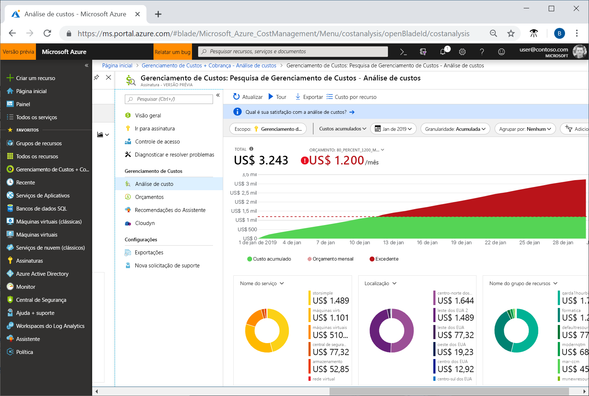
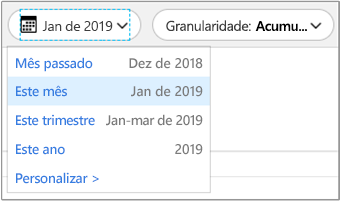
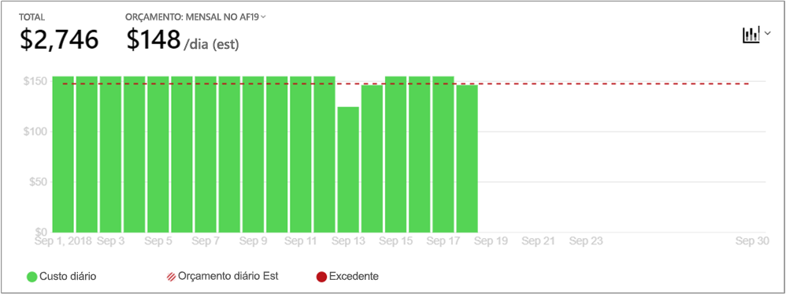
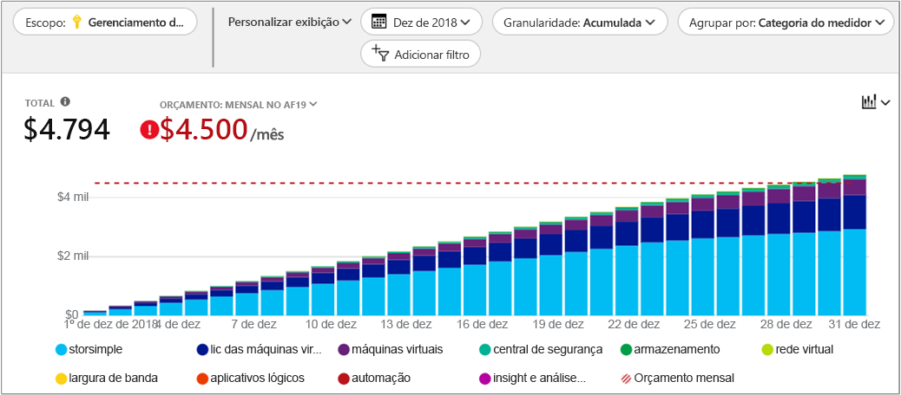
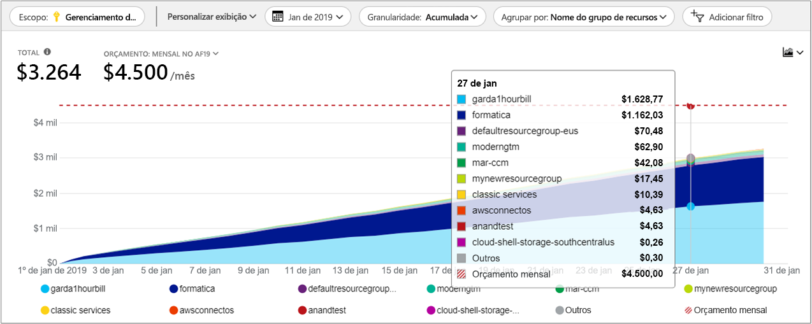

# Início Rápido: Explorar e analisar os custos com análise de custo

Antes de poder controlar e otimizar adequadamente seus custos do Azure, você precisa entender onde os custos se originaram em sua organização. Também é útil saber quanto dinheiro seus serviços custam e em apoio a quais ambientes e sistemas. A visibilidade em todo o espectro de custos é fundamental para entender com precisão os padrões de gastos da organização. Os padrões de gastos podem ser usados para impor mecanismos de controle de custos, como orçamentos.

Neste início rápido, você usa a análise de custo para explorar e analisar seus custos organizacionais. Você pode visualizar os custos agregados por organização para entender onde os custos ocorrem ao longo do tempo e identificar tendências de gastos. Você pode visualizar os custos acumulados ao longo do tempo para estimar as tendências de custo mensais, trimestrais ou mesmo anuais em comparação a um orçamento. Um orçamento ajuda a fornecer aderência às restrições financeiras. E um orçamento é usado para visualizar os custos diários ou mensais para isolar as irregularidades de gastos. E, então, você pode baixar dados do relatório atual para análise posterior ou para usar em um sistema externo.

Neste guia de início rápido, você aprende a:

- Examine os custos de análise de custo
- Personalizar as exibições de custo
- Baixar dados de análise de custo

## Pré-requisitos

A análise de custo está disponível para todos os clientes do [EA (Contrato Enterprise)](https://azure.microsoft.com/pricing/enterprise-agreement/). Você precisa ter acesso de leitura a pelo menos um ou mais dos seguintes escopos para exibir os dados de custo. Para saber mais sobre como atribuir acesso aos dados de Gerenciamento de Custos, consulte [Atribuir acesso aos dados](assign-access-acm-data.md).

- Conta de cobrança
- department
- Conta de registro
- Grupo de gerenciamento
- Assinatura
- Grupo de recursos

## Entrar no Azure

- Entre no Portal do Azure em https://portal.azure.com.

## Examine os custos de análise de custo

Para examinar os custos com análise de custo, no portal do Azure, navegue até **Gerenciamento de Custos + Cobrança** &gt; **Gerenciamento de Custos** &gt; **Alterar escopo**, escolha um escopo e, em seguida, clique em **Selecionar**.

O escopo que você seleciona é usado em todo o Gerenciamento de Custos para fornecer a consolidação de dados e para controlar o acesso a informações de custo. Ao usar escopos, você não faz multisseleção. Você seleciona um escopo mais amplo com o acúmulo de outros e, em seguida, filtra o que deseja. Isso é importante para entender porque algumas pessoas não devem ter acesso a um escopo pai acumulado por escopos filho.

Clique em **Abrir análise de custo**.

A visão inicial da análise de custos inclui as seguintes áreas:

**Total** - Mostra o custo total do mês atual.

**Orçamento** - Mostra o limite de gastos planejados para o escopo selecionado, se disponível.

**Custo acumulado**: mostra o total de gastos diários acumulados, a partir do início do mês. Depois que você [criar um orçamento](tutorial-acm-create-budgets.md) para sua conta de faturamento ou assinatura, poderá ver rapidamente sua tendência de gastos em relação ao orçamento. Passe o mouse sobre uma data para visualizar o custo acumulado desse dia.

**Gráficos dinâmicos (donut)** - Fornecem dinâmicos pivots, dividindo o custo total por um conjunto comum de propriedades padrão. Eles mostram o menor custo acumulado para o mês atual. Você pode alterar gráficos dinâmicos a qualquer momento selecionando um pivô diferente. Os custos são categorizados por: serviço (categoria do medidor), localização (região) e escopo filho por padrão. Por exemplo, contas de inscrição em contas de faturamento, grupos de recursos em assinaturas e recursos em grupos de recursos.

## Personalizar as exibições de custo

A visualização padrão fornece respostas rápidas para perguntas comuns, como:

- Quanto eu gasta?
- Será permanecer dentro do meu orçamento?

No entanto, existem muitos casos em que você precisa de uma análise mais profunda. A personalização começa no topo da página, com a seleção da data.

Análise de custo mostra os dados para o mês atual por padrão. Use o seletor de data para alternar rapidamente para: o último mês, este mês, este trimestre do calendário, neste ano do calendário ou um intervalo de datas personalizado de sua escolha. A seleção do último mês é a maneira mais rápida de analisar sua última fatura do Azure e reconciliar as cobranças com facilidade. As opções atuais de trimestre e ano ajudam a acompanhar os custos em relação aos orçamentos de longo prazo. Você também pode selecionar um intervalo de datas diferentes. Por exemplo, você pode selecionar um único dia, os últimos sete dias ou qualquer coisa até um ano antes do mês atual.

A análise de custo mostra **custos acumulados** por padrão. Os custos acumulados incluem todos os custos para cada dia mais os dias anteriores, para uma visão em constante crescimento de seus custos diários acumulados. Essa visualização é otimizada para mostrar como você está tendendo contra um orçamento para o período selecionado.

Há também a visualização **diária** mostrando os custos para cada dia. O modo de exibição de diário não mostra uma tendência de crescimento. A exibição é projetada para mostrar irregularidades como picos de custos ou quedas diárias. Se você tiver selecionado um orçamento, a visualização diária também mostrará uma estimativa do orçamento diário. Quando seus custos diários estão consistentemente acima do orçamento diário estimado, você pode esperar que ultrapasse seu orçamento mensal. O orçamento diário estimado é simplesmente um meio de ajudar você a visualizar seu orçamento em um nível inferior. Quando você tem flutuações nos custos diários, a comparação do orçamento diário estimado com o orçamento mensal é menos precisa.

Em geral, você pode esperar ver dados ou notificações para os recursos consumidos dentro de oito horas.

Você pode **Agrupar por** para selecionar uma categoria de grupo para alterar os dados exibidos no gráfico da área total superior. Agrupamentos permitem que você veja rapidamente como seus gastos estão categorizados por propriedades comuns de uso e recursos, como grupo de recursos ou marcas de recurso. Para agrupar por marcas, selecione a chave da marca que será a base do agrupamento e você verá os custos divididos por cada valor dessa marca, com um segmento extra para recursos que não contam com essa marca aplicada. Observe que o Gerenciamento de Custos só dá suporte a marcas de recurso a partir da data em que as marcas são aplicadas diretamente ao recurso. Atualmente, não há suporte para marcas do grupo de recursos. Aqui está uma exibição dos custos de serviço do Azure para uma exibição do último mês.

Gráficos dinâmicos sob os gráficos principais exibem diferentes agrupamentos para dar uma visão mais ampla dos custos gerais para o período de tempo e filtros selecionados. Selecione uma propriedade ou uma marca para exibir os custos agregados em qualquer dimensão. O conjunto completo de dados para exibição total está na parte inferior da tela, expandindo a gaveta de **Dados** ou selecionando **Exportar > Baixar CSV** na parte superior da tela. Eis um exemplo da gaveta de dados para grupos de recursos.

A imagem anterior mostra nomes de grupos de recursos. Embora você possa agrupar por marca para exibir os custos totais por marca, a exibição de todas as marcas por recurso ou grupo de recursos não está disponível nenhum dos modos de exibição de análise de custo.

Ao agrupar os custos segundo um atributo específico, os dez principais colaboradores de custo são mostrados, do mais alto para o mais baixo. Se houver mais de dez grupos, os nove principais colaboradores de custo serão mostrados, bem como um grupo **Outros**, que abrange todos os grupos restantes juntos. Ao agrupar por marcas, você também poderá ver um grupo **Sem marca** para os custos que não têm a chave de marca aplicada. Os custos **Sem marca** aparecem sempre por último, mesmo que haja mais custos sem marca que com marca. Se houver 10 ou mais valores de marca, os custos sem marca farão parte da categoria **Outros**.

Máquinas virtuais *clássicas* (Gerenciamento de Serviços do Azure ou ASM), redes e recursos de armazenamento não compartilham dados detalhados de cobrança. Eles são mesclados como **Serviços clássicos** ao agrupar os custos.

## Baixar dados de análise de custo

Você pode **Fazer o download** de informações da análise de custo para gerar um arquivo CSV para todos os dados mostrados atualmente no portal do Azure. Quaisquer filtros ou agrupamentos aplicados são incluídos no arquivo. Dados subjacentes para o topo O gráfico total que não é exibido ativamente está incluído no arquivo CSV.

## Próximas etapas

Avance para o primeiro tutorial para aprender como criar e gerenciar orçamentos.

> [!div class="nextstepaction"]
> [Crie e gerencie orçamentos](tutorial-acm-create-budgets.md)
