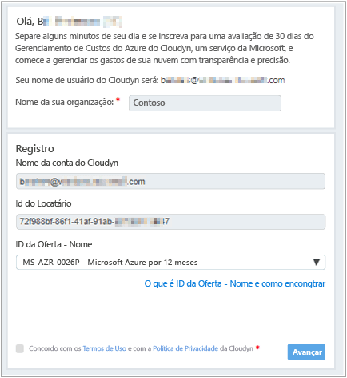
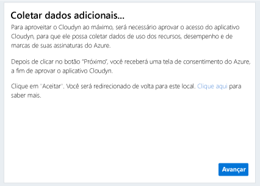
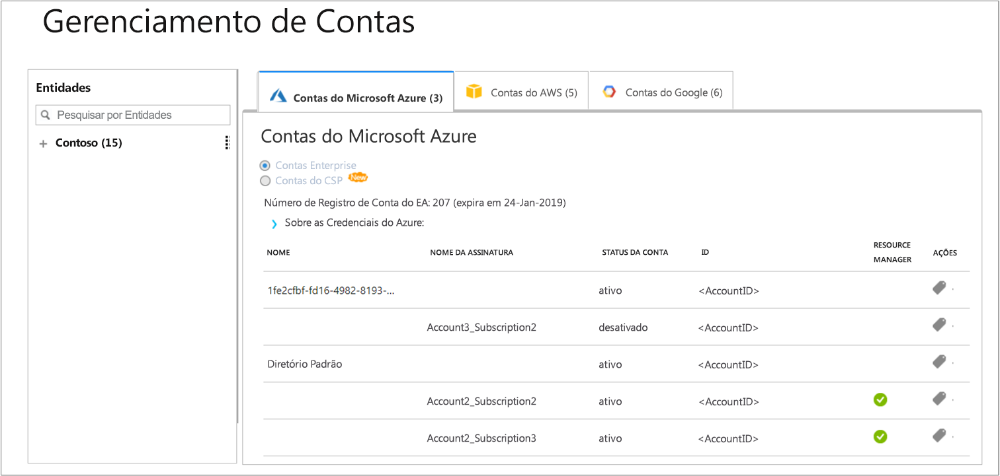

# Registrar uma assinatura individual do Azure e exibir dados de custo

Use sua assinatura do Azure para se registrar no Gerenciamento de Custo do Azure pelo Cloudyn. O registro fornece acesso ao portal do Cloudyn. Este guia de início rápido fornece detalhes do processo de registro necessários para criar uma assinatura de avaliação do Cloudyn e entrar no portal do Cloudyn. Também mostra como começar a exibir dados de custo imediatamente.

## Fazer logon no Azure

- Faça logon no Portal do Azure em http://portal.azure.com.

## Criar um registro de avaliação

1. No portal do Azure, clique em **Gerenciamento de Custo + Cobrança** na lista de serviços.
2. Em **Visão Geral**, clique em **Gerenciamento de Custo**  
    
3. Na página **Gerenciamento de Custo**, clique em **Ir para Gerenciamento de Custo** para abrir a página de registro do Cloudyn em uma nova janela.
4. Na página de registro de avaliação do portal do Cloudyn, digite o nome de sua empresa e, em seguida, selecione **Proprietário da Assinatura Individual do Azure** e, em seguida, clique em **Avançar**. O nome da conta e a ID de Locatário são automaticamente adicionados ao formulário.  
    
5. Selecione a **ID da Oferta – Nome** associada à sua assinatura. Caso não tenha certeza de qual é sua ID de Taxa da assinatura, exiba sua fatura do Azure e procure **ID da Oferta**.
6. Concorde com os Termos de Uso e valide as informações e, em seguida, clique em **Avançar**.
7. Na página **Coletar dados adicionais**, clique em **Avançar** para autorizar o Cloudyn a coletar dados do recurso do Azure. Os dados coletados incluem dados de uso, desempenho, cobrança e marcação de suas assinaturas.  
    
9. O navegador levará você à página de entrada do Cloudyn. Entre com suas credenciais de assinatura do Azure.
9. Clique em **Ir para o Cloudyn** para abrir o portal de Cloudyn e, em seguida, na página **Gerenciamento de Contas**, você deverá ver as informações de sua conta de assinatura do Azure.  
    

[!INCLUDE [cost-management-create-account-view-data](../../includes/cost-management-create-account-view-data.md)]

## Próximas etapas

Neste guia de início rápido, você usou as informações de assinatura do Azure para se registrar no Gerenciamento de Custo. Você também entrou no portal do Cloudyn e começou a exibir os dados de custo. Para saber mais sobre o Gerenciamento de Custo do Azure pelo Cloudyn, continue com o tutorial sobre o Gerenciamento de Custo.

> [!div class="nextstepaction"]
> [Exibir dados de custo](./tutorial-review-usage.md)

