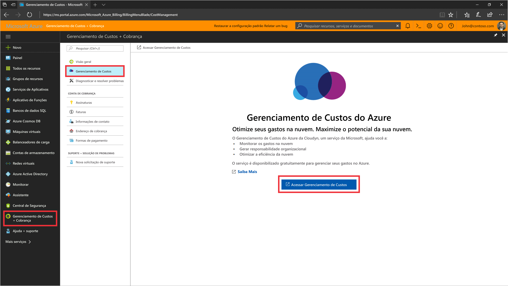
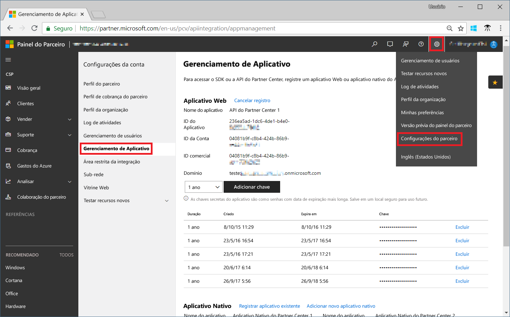
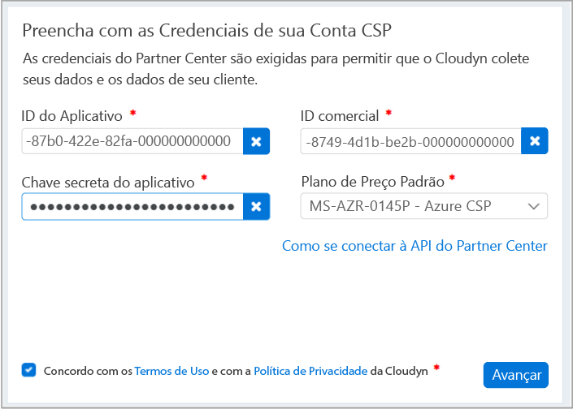

# Registrar-se mo programa de Parceiro CSP e exibir dados de custo

Como parceiro CSP, você pode se registrar no Gerenciamento de Custo do Azure pelo Cloudyn. O registro fornece acesso ao portal do Cloudyn. Este guia de início rápido fornece detalhes do processo de registro necessários para criar uma assinatura de avaliação do Cloudyn e entrar no portal do Cloudyn. Também mostra como começar a exibir dados de custo imediatamente.

Para concluir o registro, você deve ser um administrador do programa de parceria com acesso à API do Partner Center. A configuração da API do Partner Center é necessária para autenticação e acesso a dados. Para obter mais informações, consulte Conectar-se à API do Partner Center.

## Fazer logon no Azure

- Faça logon no Portal do Azure em http://portal.azure.com.

## Criar um registro de avaliação

1. No portal do Azure, clique em **Gerenciamento de Custo + Cobrança** na lista de serviços.
2. Em **Visão Geral**, clique em **Gerenciamento de Custo**  
    
3. Na página **Gerenciamento de Custo**, clique em **Ir para Gerenciamento de Custo** para abrir a página de registro do Cloudyn em uma nova janela.
4. Na página de registro de avaliação do portal do Cloudyn, digite o nome de sua empresa, selecione **Administrador do Microsoft CSP Partner Program** e, em seguida, clique em **Avançar**.  
5. Insira uma **ID do Aplicativo**, **ID de Comércio**, **Chave secreta do aplicativo** e selecione o **Plano de Preços Padrão**. Caso não tenha as informações em mãos, entre no portal do Partner Center em [https://partnercenter.microsoft.com](https://partnercenter.microsoft.com) com sua conta principal de administrador e execute as seguintes etapas:
  1. Acesse **Painel** > **Configurações de Conta** > **Gerenciamento de Aplicativo**.
  2. Caso tenha criado anteriormente um Aplicativo Web, ignore esta etapa. Caso contrário, clique em **Adicionar novo aplicativo Web** na seção **Aplicativo Web**.
  3. Copie o GUID da **ID do Aplicativo** do aplicativo Web.
  4. Copie o GUID da **ID do comércio** do aplicativo Web.
  5. Selecione a duração da validade da chave como um ou dois anos, conforme necessário. Selecione **Adicionar chave** e, em seguida, copie e salve o valor da chave secreta.  
    
  6. Volte para a página de registro e cole as informações.  
      
6. Concorde com os Termos de Uso e, em seguida, valide as informações. Clique em **Avançar** para autorizar o Cloudyn a coletar dados do recurso do Azure. Os dados coletados incluem dados de uso, desempenho, cobrança e marcação de suas assinaturas.  
7. Em **Convidar outros stakeholders**, adicione usuários digitando seus endereços de email. Quando concluir, clique em **Avançar**. Leva cerca de duas horas para que todos os seus dados de cobrança sejam adicionados ao Cloudyn.
8. Clique em **Ir para o Cloudyn** para abrir o portal de Cloudyn e, em seguida, na página **Gerenciamento de Contas de Nuvem**, você deverá ver as informações de sua conta do CSP registrada.

[!INCLUDE [cost-management-create-account-view-data](../../includes/cost-management-create-account-view-data.md)]

## Próximas etapas

Neste guia de início rápido, você usou as informações do CSP para se registrar no Gerenciamento de Custo. Você também entrou no portal do Cloudyn e começou a exibir os dados de custo. Para saber mais sobre o Gerenciamento de Custo do Azure pelo Cloudyn, continue com o tutorial sobre o Gerenciamento de Custo.

> [!div class="nextstepaction"]
> [Exibir dados de custo](./tutorial-review-usage.md)
