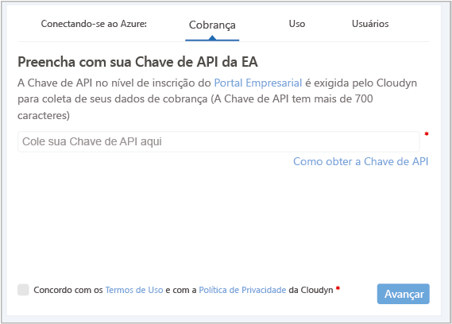
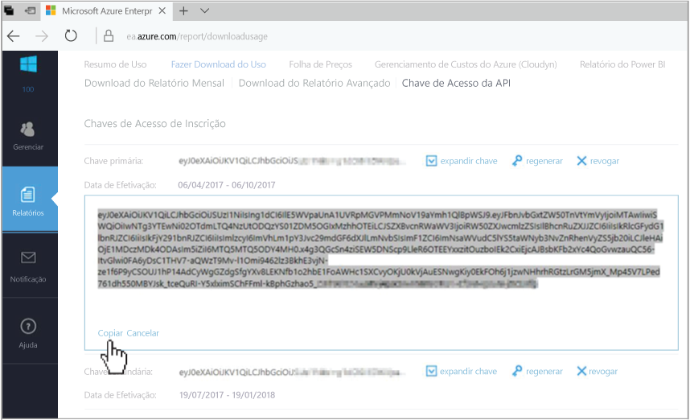
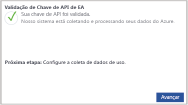

# Registrar um Contrato Enterprise do Azure e exibir dados de custo

Use seu Contrato Enterprise do Azure para se registrar no Gerenciamento de Custo do Azure pelo Cloudyn. O registro fornece acesso ao portal do Cloudyn. Este guia de início rápido fornece detalhes do processo de registro necessários para criar uma assinatura de avaliação do Cloudyn e entrar no portal do Cloudyn. Também mostra como começar a exibir dados de custo imediatamente.

## Fazer logon no Azure

- Faça logon no Portal do Azure em http://portal.azure.com.

## Criar um registro de avaliação

1. No portal do Azure, clique em **Gerenciamento de Custo + Cobrança** na lista de serviços.
2. Em **Visão Geral**, clique em **Gerenciamento de Custo**  
    
3. Na página **Gerenciamento de Custo**, clique em **Ir para Gerenciamento de Custo** para abrir a página de registro do Cloudyn em uma nova janela.
4. Na página de registro de avaliação do portal do Cloudyn, digite o nome de sua empresa e, em seguida, selecione **Administrador de Registro do Azure Enterprise**.  
    
5. Insira sua chave de API de registro do Enterprise Portal. Caso não tenha a chave em mãos, clique no link do [Enterprise Portal](https://ea.azure.com) e siga as seguintes etapas:
  1. Entre no site do Azure Enterprise e clique em **Relatórios**, clique em **Chave de Acesso da API** e, em seguida, copie a chave primária.  
    
  3. Volte para a página de registro e cole-a em sua chave de API.
6. Concorde com os Termos de Uso e valide a chave. Clique em **Avançar** para autorizar o Cloudyn a coletar dados do recurso do Azure. Os dados coletados incluem dados de uso, desempenho, cobrança e marcação de suas assinaturas.  
    
7. Em **Convidar outros stakeholders**, adicione usuários digitando seus endereços de email. Quando concluir, clique em **Avançar**. Leva cerca de duas horas para que todos os seus dados de cobrança sejam adicionados ao Cloudyn.
8. Clique em **Ir para o Cloudyn** para abrir o portal de Cloudyn e, em seguida, na página **Gerenciamento de Contas de Nuvem**, você deverá ver as informações de sua conta do EA registrada.

[!INCLUDE [cost-management-create-account-view-data](../../includes/cost-management-create-account-view-data.md)]

## Próximas etapas

Neste guia de início rápido, você usou as informações do Contrato Enterprise do Azure para se registrar no Gerenciamento de Custo. Você também entrou no portal do Cloudyn e começou a exibir os dados de custo. Para saber mais sobre o Gerenciamento de Custo do Azure pelo Cloudyn, continue com o tutorial sobre o Gerenciamento de Custo.

> [!div class="nextstepaction"]
> [Exibir dados de custo](./tutorial-review-usage.md)
