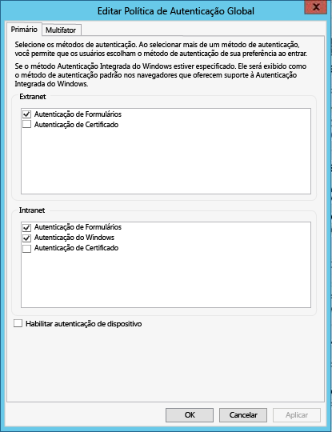

# Introdução ao Catálogo de Dados do Azure
O Catálogo de Dados do Azure é um serviço de nuvem totalmente gerenciado que atua como um sistema de registro e sistema de descoberta em ativos de dados da empresa. Para obter uma visão detalhada, confira [O que é o Catálogo de Dados do Azure](data-catalog-what-is-data-catalog.md).

Este tutorial ajudará você a começar a usar o Catálogo de Dados do Azure. Neste tutorial, você realizará os seguintes procedimentos:

| Procedimento | Descrição |
|:--- |:--- |
| [Provisionar catálogo de dados](#provision-data-catalog) |Neste procedimento, você provisiona ou configura o Catálogo de Dados do Azure. Siga esta etapa somente se o catálogo não tiver sido configurado anteriormente. Você só pode ter um catálogo de dados por organização (domínio do Microsoft Azure Active Directory), mesmo que haja várias assinaturas associadas à sua conta do Azure. |
| [Registrar ativos de dados](#register-data-assets) |Neste procedimento, você registra os ativos de dados do banco de dados de amostra do AdventureWorks2014 com o catálogo de dados. O registro é o processo de extração de metadados estruturais chave, como nomes, tipos e locais, da fonte de dados, copiando os metadados para o catálogo. As fontes de dados e seus dados permanecem onde estão, porém os metadados são usados pelo catálogo para torná-los mais facilmente identificáveis e compreensíveis. |
| [Descobrir ativos de dados](#discover-data-assets) |Neste procedimento, você usa o portal do Catálogo de Dados do Azure para descobrir os ativos de dados que foram registrados na etapa anterior. Depois que uma fonte de dados é registrada com o Catálogo de Dados do Azure, seus metadados são indexados pelo serviço para que os usuários possam pesquisar facilmente e procurar os dados de que precisam. |
| [Anotar ativos de dados](#annotate-data-assets) |Neste procedimento, você fornece anotações (informações como descrições, marcas, documentação ou especialistas) para os ativos de dados. Essas informações suplementam os metadados extraídos da fonte de dados e tornam a fonte de dados mais compreensível para mais pessoas. |
| [Conectar aos ativos de dados](#connect-to-data-assets) |Neste procedimento, você abre os ativos de dados em ferramentas de cliente integradas, como Excel e ferramentas de dados do SQL Server, e em ferramentas não integradas (SQL Server Management Studio). |
| [Gerenciar ativos de dados](#manage-data-assets) |Neste procedimento, você define a segurança de seus ativos de dados. O Catálogo de Dados não dá aos usuários acesso aos dados em si. O proprietário da fonte de dados controla o acesso aos dados.    Com o Catálogo de Dados, você pode descobrir fontes de dados e exibir os **metadados** relacionados às fontes registradas no catálogo. Porém, pode haver situações em que as fontes de dados só devam estar visíveis para usuários específicos ou membros de grupos. Nesses cenários, você pode usar o Catálogo de Dados para se apropriar de ativos de dados registrados no catálogo e controlar a visibilidade dos ativos que pertencem a você. |
| [Remover ativos de dados](#remove-data-assets) |Neste procedimento, você aprende a remover ativos de dados do catálogo de dados. |

## Pré-requisitos do tutorial
### Assinatura do Azure
Para configurar o Catálogo de Dados do Azure, é necessário ser proprietário ou coproprietário de uma assinatura do Azure.

As assinaturas do Azure ajudam a organizar o acesso aos recursos de serviço de nuvem como o Catálogo de Dados do Azure. Eles também ajudam a controlar como o uso de recursos é reportado, cobrado e pago. Cada assinatura pode ter uma configuração diferente de cobrança e pagamento, assim você pode ter diferentes assinaturas e planos diferentes por departamento, projeto, escritório regional, etc. Cada serviço de nuvem pertence a uma assinatura, e você precisa ter uma assinatura antes de configurar o Catálogo de Dados do Azure. Para saber mais, confira [Gerenciar contas, assinaturas e funções administrativas](../active-directory/active-directory-how-subscriptions-associated-directory.md).

Se você não tiver uma assinatura, poderá criar uma conta de avaliação gratuita em apenas alguns minutos. Confira [Avaliação Gratuita](https://azure.microsoft.com/pricing/free-trial/) para obter detalhes.

### Azure Active Directory
Para configurar o Catálogo de Dados do Azure, você deve entrar com uma conta de usuário do Azure AD (Azure Active Directory). Você deve ser o proprietário ou coproprietário de uma assinatura do Azure.  

O Azure Active Directory (Azure AD) fornece uma maneira fácil para a sua empresa gerenciar identidades e acesso, tanto na nuvem quanto local. Você pode usar uma única conta corporativa ou de estudante para entrar em qualquer nuvem e aplicativo Web local. O Catálogo de Dados do Azure usa o Azure AD para autenticar o logon. Para saber mais, confira [O que é o Azure Active Directory](../active-directory/active-directory-whatis.md).

### Configuração de política do Azure Active Directory
Pode haver uma situação em que você pode entrar no portal do Catálogo de Dados do Azure, mas ao tentar entrar na ferramenta de registro de fonte de dados, poderá receber uma mensagem de erro impedindo a entrada. Este erro pode ocorrer quando você está na rede da empresa ou quando está se conectando de fora da rede empresarial.

A ferramenta de registro usa a *Autenticação de Formulários* para validar logons de usuário no Azure Active Directory. Para entrar com êxito, um administrador do Azure Active Directory deve habilitar a autenticação de formulários na *política de autenticação global*.

Com a política de autenticação global, você pode habilitar a autenticação separadamente para conexões de intranet e extranet, conforme mostrado na imagem a seguir. Erros de entrada poderão ocorrer se a autenticação de formulários não estiver habilitada para a rede por meio da qual você está se conectando.

 

Para saber mais, confira [Configurando políticas de autenticação](https://technet.microsoft.com/library/dn486781.aspx).

## Provisionar catálogo de dados
Você somente pode provisionar um catálogo de dados por organização (domínio do Azure Active Directory). Portanto, se o proprietário ou coproprietário de uma assinatura do Azure que pertence a esse domínio do Azure Active Directory já tiver criado um catálogo, você não poderá criar um catálogo novamente, mesmo se tiver várias assinaturas do Azure. Para testar se um catálogo de dados foi criado por um usuário no domínio do Azure Active Directory, navegue até a [home page do Catálogo de Dados do Azure](http://azuredatacatalog.com) e verifique se você vê o catálogo. Se o catálogo já foi criado para você, ignore o procedimento a seguir e vá para a próxima seção.    

1. Vá para a [página de serviço do Catálogo de Dados](https://azure.microsoft.com/services/data-catalog) e clique em **Introdução**.
   
    
2. Entre com uma conta de usuário que seja proprietário ou coproprietário de uma assinatura do Azure. Você verá a página a seguir depois de entrar.
   
    
3. Especifique um **nome** para o catálogo de dados, a **assinatura** que você deseja usar e o **local** do catálogo.
4. Expanda **Preço** e selecione uma **edição** (Gratuita ou Standard) do Catálogo de Dados do Azure.
    
5. Expanda **Usuários do Catálogo** e clique em **Adicionar** para adicionar usuários ao catálogo de dados. Você é adicionado automaticamente a esse grupo.
    
6. Expanda **Administradores do Catálogo** e clique em **Adicionar** para adicionar outros administradores ao catálogo de dados. Você é adicionado automaticamente a esse grupo.
    
7. Clique em **Criar Catálogo** para criar o catálogo de dados da sua organização. Você verá a página inicial para o catálogo de dados depois que ele for criado.
        

### Encontrar um catálogo de dados no portal do Azure
1. Em uma guia separada no navegador da Web ou em uma janela de navegador da Web separada, vá para o [portal do Azure](https://portal.azure.com) e entre com a mesma conta que você usou para criar o catálogo de dados na etapa anterior.
2. Selecione **Procurar** e clique em **Catálogo de Dados**.
   
     Você verá o catálogo de dados que criou.
   
    
3. Clique no catálogo que você criou. Você vê a folha **Catálogo de dados** no portal.
   
   
4. Você pode exibir as propriedades do catálogo de dados e atualizá-las. Por exemplo, clique em **Tipo de preço** e altere a edição.
   
    

### Banco de dados de exemplo do Adventure Works
Neste tutorial, você registra os ativos de dados (tabelas) do banco de dados de exemplo do AdventureWorks2014 para o mecanismo de banco de dados do SQL Server, mas pode usar qualquer fonte de dados com suporte se preferir trabalhar com os dados que são familiares e relevantes para a sua função. Para obter uma lista das fontes de dados com suporte, confira [Fontes de dados com suporte](data-catalog-dsr.md).

### Instalar o banco de dados do Adventure Works 2014 OLTP
O banco de dados do Adventure Works dá suporte a cenários de processamento de transações online padrão para um fabricante de bicicletas fictício (Adventure Works Cycles) que inclui Produtos, Vendas e Compras. Neste tutorial, você registra informações sobre produtos no Catálogo de Dados do Azure.

Para instalar o banco de dados de amostra do Adventure Works:

1. Baixe [Adventure Works 2014 Full Database backup.zip](https://msftdbprodsamples.codeplex.com/downloads/get/880661) do CodePlex.
2. Para restaurar o banco de dados em seu computador, siga as instruções em [Restaurar um Backup de Banco de Dados usando o SQL Server Management Studio](http://msdn.microsoft.com/library/ms177429.aspx)ou siga estas etapas:
   1. Abra o SQL Server Management Studio e conecte-se ao Mecanismo de Banco de Dados do SQL Server.
   2. Clique com botão direito do mouse em **Bancos de Dados** e clique em **Restaurar Banco de Dados**.
   3. Em **Restaurar Banco de Dados**, clique na opção **Dispositivo** para **Origem** e clique em **Procurar**.
   4. Em **Selecionar dispositivos de backup**, clique em **Adicionar**.
   5. Vá para a pasta em que está o arquivo **AdventureWorks2014.bak**, selecione o arquivo e clique em **OK** para fechar a caixa de diálogo **Localizar Arquivo de Backup**.
   6. Clique em **OK** para fechar a caixa de diálogo **Selecionar Dispositivos de Backup**.    
   7. Clique em **OK** para fechar a caixa de diálogo **Restaurar Banco de Dados**.

Agora você pode registrar os ativos de dados do banco de dados de exemplo do Adventure Works usando o Catálogo de Dados do Azure.

## Registrar ativos de dados
Neste exercício, você usará a ferramenta de registro para registrar os ativos de dados do banco de dados do Adventure Works no catálogo. O registro é o processo de extração de metadados estruturais chave, como nomes, tipos e locais, da fonte de dados e dos ativos que ela contém, copiando os metadados para o catálogo. As fontes de dados e seus dados permanecem onde estão, porém os metadados são usados pelo catálogo para torná-los mais facilmente identificáveis e compreensíveis.

### Registrar uma fonte de dados
1. Vá para a [home page do Catálogo de Dados do Azure](https://azuredatacatalog.com) e clique em **Publicar Dados**.
   
   
2. Clique em **Iniciar Aplicativo** para baixar, instalar e executar a ferramenta de registro em seu computador.
   
   
3. Na página de **Boas-vindas**, clique em **Entrar** e insira suas credenciais.     
   
    
4. Na página do **Catálogo de Dados do Microsoft Azure**, clique em **SQL Server** e em **Avançar**.
   
    
5. Insira as propriedades de conexão do SQL Server para o **AdventureWorks2014** (veja o exemplo a seguir) e clique em **CONECTAR**.
   
   
6. Registre os metadados do seu ativo de dados. Nesse exemplo, você registra os objetos **Produção/Produto** do namespace de produção do AdventureWorks:
   
   1. Na árvore **Hierarquia de Servidor**, expanda **AdventureWorks2014** e clique em **Produção**.
   2. Selecione **Product**, **ProductCategory**, **ProductDescription** e **ProductPhoto** usando Ctrl+clique.
   3. Clique na **seta de movimentação selecionada** (**>**). Esta ação move todos os objetos selecionados para a lista **Objetos para registrar** .
      
      
   4. Selecione **Incluir uma Visualização** para incluir uma visualização dos dados como instantâneo. O instantâneo inclui até 20 registros de cada tabela e é copiado no catálogo.
   5. Selecione **Incluir Perfil de Dados** para incluir um instantâneo das estatísticas de objeto no perfil de dados (por exemplo, valores mínimo, máximo e médio de uma coluna, número de linhas).
   6. No campo **Adicionar marcas**, insira **adventure works, ciclos**. Essa ação adiciona marcas de pesquisa para esses ativos de dados. Marcas são uma ótima maneira de ajudar os usuários a localizar uma fonte de dados registrada.
   7. Especifique o nome de um **especialista** nesses dados (opcional).
      
      
   8. Clique em **REGISTRAR**. O Catálogo de Dados do Azure registra os objetos selecionados. Neste exercício, os objetos selecionados do Adventure Works são registrados. A ferramenta de registro extrai metadados de ativo de dados e copia esses dados no serviço Catálogo de Dados do Azure. Os dados permanecem onde atualmente residem e permanecem sob o controle dos administradores e políticas do sistema atual.
      
      
   9. Para ver seus objetos de fonte de dados registrados, clique em **Exibir Portal**. No portal Catálogo de Dados do Azure, confirme se você vê todas as quatro tabelas e o banco de dados no modo de exibição de grade.
      
      

Neste exercício, você registrou objetos do banco de dados de exemplo do Adventure Works para que eles possam ser facilmente descobertos por usuários na sua organização. No próximo exercício, você aprenderá como descobrir ativos de dados registrados.

## Descobrir ativos de dados
A descoberta no Catálogo de Dados do Azure usa dois mecanismos principais: pesquisa e filtragem.

A pesquisa foi projetada para ser intuitiva e eficiente. Por padrão, os termos de pesquisa são correspondidos com alguma propriedade no catálogo, incluindo anotações fornecidas pelo usuário.

A filtragem foi desenvolvida para complementar a pesquisa. Você pode selecionar características específicas como especialistas, tipo de fonte de dados, tipo de objeto e marcas, para exibir ativos de dados correspondentes e para restringir os resultados da pesquisa a ativos correspondentes.

Usando uma combinação de pesquisa e filtragem, você pode navegar rapidamente pelas fontes de dados que foram registradas com o Catálogo de Dados do Azure para descobrir os ativos de dados de que precisa.

Neste exercício, você usará o portal do Catálogo de Dados do Azure para descobrir os ativos de dados registrados no exercício anterior. Confira [Referência de sintaxe de pesquisa do catálogo de dados](https://msdn.microsoft.com/library/azure/mt267594.aspx) para obter detalhes sobre a sintaxe de pesquisa.

Eis alguns exemplos para descobrir ativos de dados no catálogo.  

### Descobrir ativos de dados com a pesquisa básica
A pesquisa básica ajuda você a procurar um catálogo usando um ou mais termos de pesquisa. Os resultados são quaisquer ativos que correspondam a qualquer propriedade com um ou mais dos termos especificados.

1. Clique em **Início** no portal do Catálogo de Dados do Azure. Se você fechou o navegador da Web, vá até a [home page do Catálogo de Dados do Azure](https://www.azuredatacatalog.com).
2. Na caixa de pesquisa, insira `cycles` e pressione **ENTER**.
   
    
3. Confirme se você vê todas as quatro tabelas e o banco de dados (AdventureWorks2014) nos resultados. Você pode alternar entre **exibição de grade** e **exibição de lista** clicando nos botões na barra de ferramentas como mostrado na imagem a seguir. Observe que a palavra-chave de pesquisa fica realçada nos resultados da pesquisa, já que a opção **Realçar** está **ATIVADA**. Você também pode especificar o número de **resultados por página** nos resultados da pesquisa.
   
    
   
    O painel **Pesquisas** fica à esquerda e o painel **Propriedades**, à direita. No painel **Pesquisas** , você pode alterar os critérios de pesquisa e filtrar os resultados. O painel **Propriedades** exibe as propriedades de um objeto selecionado na grade ou lista.
4. Clique em **Produto** nos resultados da pesquisa. Clique nas guias **Visualização**, **Colunas**, **Perfil de Dados** e **Documentação** ou clique na seta para expandir o painel inferior.  
   
    
   
    Na guia **Visualização**, você vê a visualização dos dados na tabela **Product**.  
5. Clique na guia **Colunas** para encontrar detalhes sobre as colunas (como **nome** e **tipo de dados**) no ativo de dados.
6. Clique na guia **Perfil de Dados** para ver a criação de perfil de dados (por exemplo, número de linhas, tamanho dos dados ou valor mínimo em uma coluna) no ativo de dados.
7. Filtrar os resultados usando **Filtros** à esquerda. Por exemplo, clique em **Tabela** para o **Tipo de Objeto** para ver somente as quatro tabelas, não o banco de dados.
   
    

### Descobrir ativos de dados com escopo de propriedade
O escopo de propriedade ajuda você a descobrir os ativos de dados onde o termo de pesquisa corresponde à propriedade especificada.

1. Limpe o filtro **Tabela** em **Tipo de Objeto**, em **Filtros**.  
2. Na caixa de pesquisa, insira `tags:cycles` e pressione **ENTER**. Confira [Referência de sintaxe de pesquisa do Catálogo de Dados](https://msdn.microsoft.com/library/azure/mt267594.aspx) para ver todas as propriedades que você pode usar para pesquisar o catálogo de dados.
3. Confirme se você vê todas as quatro tabelas e o banco de dados (AdventureWorks2014) nos resultados.  
   
    

### Salvar a pesquisa
1. No painel **Pesquisas**, na seção **Pesquisa Atual**, digite um nome para a pesquisa e clique em **Salvar**.
   
    
2. Confirme se a pesquisa salva aparece em **Pesquisas Salvas**.
   
    
3. Selecione uma das ações que você pode realizar na pesquisa salva (**Renomear**, **Excluir**, **Salvar como Padrão**).
   
    

### Operadores boolianos
Você pode ampliar ou restringir sua pesquisa com operadores boolianos.

1. Na caixa de pesquisa, insira `tags:cycles AND objectType:table`e pressione **ENTER**.
2. Verifique se você vê somente tabelas, e não o banco de dados, nos resultados.  
   
    

### Agrupando com parênteses
Ao usar parênteses, você pode agrupar partes da consulta para obter o isolamento lógico, principalmente junto com operadores boolianos.

1. Na caixa de pesquisa, insira `name:product AND (tags:cycles AND objectType:table)` e pressione **ENTER**.
2. Verifique se você vê apenas a tabela **Product** nos resultados da pesquisa.
   
       

### Operadores de comparação
Com operadores de comparação, você pode usar comparações que não sejam de igualdade para propriedades que tenham tipos de dados numéricos e de data.

1. Na caixa de pesquisa, insira `lastRegisteredTime:>"06/09/2016"`.
2. Limpe o filtro **Tabela** em **Tipo de Objeto**.
3. Pressione **ENTER**.
4. Confirme que vê as tabelas **Product**, **ProductCategory**, **ProductDescription** e **ProductPhoto** e o banco de dados do AdventureWorks2014 que você registrou nos resultados da pesquisa.
   
    

Confira [Como descobrir ativos de dados](data-catalog-how-to-discover.md) para obter informações detalhadas sobre a descoberta de ativos de dados e [Referência de sintaxe de pesquisa do Catálogo de Dados](https://msdn.microsoft.com/library/azure/mt267594.aspx) para obter a sintaxe de pesquisa.

## Anotar ativos de dados
Neste exercício, você deve usar o portal do Catálogo de Dados do Azure para anotar (adicionar informações como descrições, marcas, especialistas) em ativos de dados que você registrou anteriormente no catálogo. As anotações complementarão e aprimorarão os metadados estruturais extraídos da fonte de dados durante o registro, tornando muito mais fácil descobrir e entender os ativos de dados.

Neste exercício, você anota um ativo de dados único (ProductPhoto). Você adiciona um nome amigável e uma descrição ao ativo de dados ProductPhoto.  

1. Vá para a [home page do Catálogo de Dados do Azure](https://www.azuredatacatalog.com) e pesquise com `tags:cycles` para encontrar os ativos de dados que você registrou.  
2. Clique em **ProductPhoto** nos resultados da pesquisa.  
3. Insira **Imagens do produto** como **Nome Amigável** e **Fotos de produto para materiais de marketing** na **Descrição**.
   
    
   
    A **Descrição** ajuda outros usuários a descobrir e a entender por que e como usar o ativo de dados selecionado. Você também pode adicionar mais marcas e exibir colunas. Agora você pode tentar pesquisar e filtrar para descobrir os ativos de dados usando os metadados descritivos que você adicionou ao catálogo.

Você também pode fazer o seguinte nesta página:

* Adicione especialistas para o ativo de dados. Clique em **Adicionar** in the **Especialistas** .
* Adicione marcas no nível do conjunto de dados. Clique em **Adicionar** in the **Marcas** . Uma marca pode ser uma marca de usuário ou de glossário. A edição Standard do catálogo de dados inclui um glossário de negócios que ajuda os administradores de catálogo a definir uma taxonomia de negócios central. Os usuários do catálogo podem anotar os ativos de dados com os termos do glossário. Para saber mais, confira [Como configurar o glossário de negócios para Marcação Governada](data-catalog-how-to-business-glossary.md)
* Adicione marcas no nível da coluna. Clique em **Adicionar** under **Marcas** , na coluna que você deseja anotar.
* Adicione uma descrição no nível da coluna. Digite a **Descrição** para uma coluna. Você também pode exibir os metadados de descrição extraídos da fonte de dados.
* Adicione informações de **Solicitar acesso** que mostram aos usuários como solicitar acesso ao ativo de dados.
  
    
* Escolha a guia **Documentação** e forneça a documentação para o ativo de dados. Com a documentação do Catálogo de Dados do Azure, você pode usar seu Catálogo de Dados como um repositório de conteúdo para criar uma narrativa completa de seus ativos de dados.
  
    

Você também pode adicionar uma anotação a vários ativos de dados. Por exemplo, você pode selecionar todos os ativos de dados que registrou e especificar um especialista para eles.

O Catálogo de Dados do Azure dá suporte a uma abordagem de crowdsourcing para anotações. Todos os usuários do Catálogo de Dados do Azure podem adicionar marcas (usuário ou glossário), descrições e outros metadados, para que qualquer usuário com conhecimento sobre um ativo de dados e seu uso possa capturá-lo e disponibilizá-lo para os demais usuários.

Confira [Como anotar os ativos de dados](data-catalog-how-to-annotate.md) para obter informações detalhadas sobre como anotar ativos de dados.

## Conectar aos ativos de dados
Neste exercício, você abre os ativos de dados em uma ferramenta de cliente integrada (Excel) e em uma ferramenta não integrada (SQL Server Management Studio) usando informações de conexão.

> [!NOTE]
> É importante lembrar que o Catálogo de Dados do Azure não concede a você acesso à fonte de dados real; ele simplesmente facilita sua descoberta e compreensão. Quando você se conectar a uma fonte de dados, o aplicativo cliente escolhido usará as credenciais do Windows ou solicitará as credenciais conforme necessário. Se você não tiver recebido acesso à fonte de dados previamente, precisará receber esse acesso para poder se conectar.
> 
> 

### Conectar-se a um ativo de dados do Excel
1. Selecione **Produto** nos resultados da pesquisa. Clique em **Abrir no** na barra de ferramentas e clique em **Excel**.
   
    
2. Clique em **Abrir** na janela pop-up de download. Essa experiência pode variar dependendo do navegador.
   
    
3. Na janela **Aviso de Segurança do Microsoft Excel**, clique em **Habilitar**.
   
    
4. Mantenha os padrões na caixa de diálogo **Importar Dados** e clique em **OK**.
   
    
5. Exiba a fonte de dados no Excel.
   
    

Neste exercício, você se conectou aos ativos de dados descobertos usando o Catálogo de Dados do Azure. Com o portal do Catálogo de Dados do Azure, você pode se conectar diretamente usando os aplicativos clientes integrados ao menu **Abrir no** . Você também pode se conectar a qualquer aplicativo escolhido usando as informações de conexão local incluídas nos metadados do ativo. Por exemplo: você pode usar o SQL Server Management Studio para se conectar ao banco de dados do AdventureWorks2014 e acessar os dados nos ativos de dados registrados neste tutorial.

1. Abra o **SQL Server Management Studio**.
2. Na caixa de diálogo **Conectar ao Servidor**, digite o nome do servidor no painel **Propriedades** no portal do Catálogo de Dados do Azure.
3. Use credenciais e autenticação apropriadas para acessar o ativo de dados. Se você não tem acesso, use as informações no campo **Solicitar Acesso** para obtê-lo.
   
    

Clique em **Exibir Cadeias de Conexão** para exibir e copiar as cadeias de conexão OLEDB, ODBC e ADF.NET na área de transferência para usar em seu aplicativo.

## Gerenciar ativos de dados
Nesta etapa, você vê como configurar a segurança para seus ativos de dados. O Catálogo de Dados não dá aos usuários acesso aos dados em si. O proprietário da fonte de dados controla o acesso aos dados.

Você pode usar o Catálogo de Dados para descobrir fontes de dados e exibir os metadados relacionados às fontes registradas no catálogo. Porém, pode haver situações em que as fontes de dados só devam estar visíveis para usuários específicos ou membros de grupos. Nesses cenários, você pode usar o Catálogo de Dados para se apropriar de ativos de dados registrados no catálogo e controlar a visibilidade dos ativos que pertencem a você.

> [!NOTE]
> Os recursos de gerenciamento descritos neste exercício estão disponíveis apenas na Edição Standard do Catálogo de Dados do Azure, e não na Edição Gratuita.
> No Catálogo de Dados do Azure, você pode apropriar-se dos ativos de dados, adicionar coproprietários e definir a visibilidade dos ativos de dados.
> 
> 

### Apropriar-se dos ativos de dados e restringir a visibilidade
1. Vá para a [home page do catálogo de dados do Azure](https://www.azuredatacatalog.com). Na caixa de texto **Pesquisar**, insira `tags:cycles` e pressione **ENTER**.
2. Clique em um item na lista de resultados e clique em **Apropriar-se** na barra de ferramentas.
3. Na seção **Gerenciamento** do painel **Propriedades**, clique em **Apropriar-se**.
   
    
4. Para restringir a visibilidade, escolha **Proprietários e Esses Usuários** na seção **Visibilidade** e clique em **Adicionar**. Insira os endereços de email do usuário na caixa de texto e pressione **ENTER**.
   
    

## Remover ativos de dados
Neste exercício, você usa o portal do Catálogo de Dados do Azure para remover dados de visualização de ativos de dados registrados e excluir ativos de dados do catálogo.

No Catálogo de Dados do Azure, você pode eliminar um ativo individual ou excluir vários ativos.

1. Vá para a [home page do catálogo de dados do Azure](https://www.azuredatacatalog.com).
2. Na caixa de texto **Pesquisa**, insira `tags:cycles` e clique em **ENTER**.
3. Selecione um item na lista de resultados e clique em **Excluir** na barra de ferramentas, conforme mostrado na imagem a seguir:
   
    
   
    Se você estiver usando o modo de exibição de lista, a caixa de seleção estará à esquerda do item, conforme mostrado na imagem a seguir:
   
    
   
    Você também pode selecionar vários ativos de dados e excluí-los, conforme mostrado na imagem abaixo:
   
    

> [!NOTE]
> O comportamento padrão do catálogo é permitir que qualquer usuário registre qualquer fonte de dados, bem como permitir que qualquer usuário exclua qualquer ativo de dados que foi registrado. Os recursos de gerenciamento incluídos na Edição Standard do Catálogo de Dados do Azure fornecem opções adicionais para a apropriação dos ativos, a restrição de quem pode descobri-los e a restrição de quem pode excluí-los.
> 
> 

## Resumo
Neste tutorial, você explorou recursos essenciais do Catálogo de Dados do Azure, incluindo o registro, a anotação, a descoberta e o gerenciamento de ativos de dados corporativos. Agora que você concluiu o tutorial, é hora de começar. Você pode começar hoje mesmo registrando as fontes de dados que você e sua equipe precisam e convidando colegas para usar o catálogo.

## Referências
* [Como registrar ativos de dados](data-catalog-how-to-register.md)
* [Como descobrir ativos de dados](data-catalog-how-to-discover.md)
* [Como anotar ativos de dados](data-catalog-how-to-annotate.md)
* [Como documentar ativos de dados](data-catalog-how-to-documentation.md)
* [Como se conectar a ativos de dados](data-catalog-how-to-connect.md)
* [Como gerenciar ativos de dados](data-catalog-how-to-manage.md)

<!--HONumber=Dec16_HO2-->

