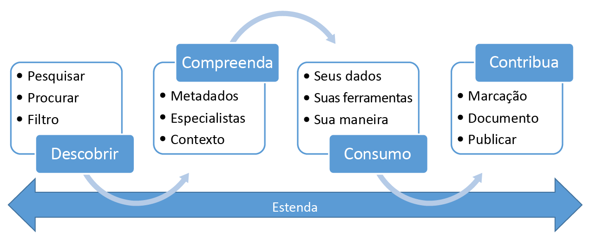

# O que é o Catálogo de Dados do Azure?
O Catálogo de Dados do Azure é um serviço de nuvem totalmente gerenciado que permite aos usuários descobrir as fontes de dados de que precisam e entender as fontes de dados que encontram e também ajuda as empresas a obter mais valor de seus investimentos existentes. O Catálogo de Dados fornece recursos que permitem a qualquer usuário, desde analistas a cientistas de dados e desenvolvedores, descobrir, entender e consumir fontes de dados. O Catálogo de Dados inclui um modelo de crowdsourcing dos metadados e das anotações e permite que todos os usuários contribuam com seus conhecimentos para criar uma comunidade e uma cultura de dados.

## Desafios de descoberta para consumidores de dados
Tradicionalmente, a descoberta de fontes de dados da empresa tem sido um processo orgânico com base no conhecimento tribal. Isso apresenta vários desafios para as empresas que desejam obter o valor máximo de seus ativos de informações.

* Os usuários não estão cientes de que as fontes de dados existem, a menos que entrem em contato com elas como parte de outro processo; não há um local central onde as fontes de dados são registradas.
* A menos que um usuário saiba o local de uma fonte de dados, ele não pode se conectar aos dados usando um aplicativo cliente; experiências de consumo de dados exigem que os usuários conheçam a cadeia de conexão ou o caminho.
* A menos que um usuário saiba a localização da documentação da fonte de dados, ele não entenderá o uso pretendido dos dados; documentação e fontes de dados residem em locais diferentes e são consumidas por meio de experiências diferentes.
* Se um usuário tiver dúvidas sobre um ativo de informações, ele deve localizar o especialista ou a equipe responsável pelos dados e envolver os especialistas offline; não há nenhuma conexão explícita entre os dados e aqueles com perspectivas de especialistas sobre seu uso.
* A menos que um usuário compreenda o processo de solicitação de acesso à fonte de dados, a descoberta da fonte de dados e de sua documentação ainda não permitirá que ele acesse os dados necessários.

## Desafios de descoberta para produtores de dados
Embora os consumidores de dados enfrentem esses desafios, os usuários responsáveis por produzir e manter informações também têm seus próprios obstáculos.

* A anotação de fontes de dados com metadados descritivos costuma ser um esforço perdido; aplicativos clientes geralmente ignoram descrições armazenadas na fonte de dados.
* Criar documentação para fontes de dados geralmente é um esforço perdido; manter a documentação em sincronia com a fonte de dados é uma responsabilidade contínua e os usuários não têm confiança na documentação, uma vez que ela é geralmente percebida como desatualizada.
* Restringir o acesso à fonte de dados e garantir que os consumidores de dados saibam como solicitar o acesso são um desafio contínuo.

Criar e manter documentação para uma fonte de dados é um processo complexo e demorado. O desafio de tornar essa documentação prontamente disponível para qualquer pessoa que usa a fonte de dados geralmente é ainda mais.

Quando combinados, esses desafios apresentam uma barreira significativa para as empresas que desejam encorajar e promover o uso e a compreensão dos dados da empresa.

## O Catálogo de Dados do Azure pode ajudar
O Catálogo de Dados foi projetado para resolver esses problemas e permitir que as empresas aproveitem ao máximo seus ativos de informações existentes. O Catálogo de Dados ajuda facilitando a descoberta das fontes de dados e sua compreensão pelos usuários que precisam dos dados que gerenciam.

O Catálogo de Dados fornece um serviço baseado em nuvem no qual a fonte de dados pode ser registrada. Os dados permanecem no local existente, mas uma cópia dos metadados é adicionada ao Catálogo de Dados, juntamente com uma referência ao local da fonte de dados. Esses metadados também são indexados para tornar cada fonte de dados fácil de descobrir por meio de pesquisa e compreensível para os usuários que os descobrirem.

Depois que uma fonte de dados é registrada, seus metadados podem ser aprimorados pelo usuário que executou o registro ou por outros usuários na empresa. Qualquer usuário pode anotar uma fonte de dados, fornecendo descrições, marcas ou outros metadados, como documentação, e processos para a solicitação de acesso à fonte de dados. Esses metadados descritivos complementam os metadados estruturais (como nomes de colunas e tipos de dados) registrados da fonte de dados.

Descobrir e entender fontes de dados e seu uso é o principal objetivo de registrar as fontes. Quando usuários corporativos precisam de dados para seus esforços (que podem ser de business intelligence, desenvolvimento de aplicativos, ciência de dados ou qualquer outra tarefa em que os dados certos são necessários), eles podem usar a experiência de descoberta do Catálogo de Dados para localizar rapidamente dados que correspondam às suas necessidades, compreendê-los para avaliar a adequação à finalidade e consumir dados abrindo a fonte de dados na ferramenta de sua preferência. Ao mesmo tempo, o Catálogo de Dados permite que os usuários contribuam com o catálogo, marcando, documentando e anotando as fontes de dados que já foram registradas, e registrando novas fontes de dados que podem ser descobertas, compreendidas e consumidas pela comunidade de usuários do catálogo.

## Introdução ao Catálogo de Dados
Para começar a usar o Catálogo de Dados hoje, visite [www.azuredatacatalog.com](https://www.azuredatacatalog.com).

Um Guia de introdução está disponível [aqui](data-catalog-get-started.md).

## Saiba mais sobre o Catálogo de Dados
Para saber mais sobre os recursos do Catálogo de Dados, confira:

* [Como registrar fontes de dados](data-catalog-how-to-register.md)
* [Como descobrir fontes de dados](data-catalog-how-to-discover.md)
* [Como anotar fontes de dados](data-catalog-how-to-annotate.md)
* [Como documentar fontes de dados](data-catalog-how-to-documentation.md)
* [Como se conectar a fontes de dados](data-catalog-how-to-connect.md)
* [Como trabalhar com Big Data](data-catalog-how-to-big-data.md)
* [Como gerenciar ativos de dados](data-catalog-how-to-manage.md)
* [Como configurar o Glossário de Negócios](data-catalog-how-to-business-glossary.md)
* [Perguntas frequentes](data-catalog-frequently-asked-questions.md)

<!--HONumber=Jan17_HO4-->

